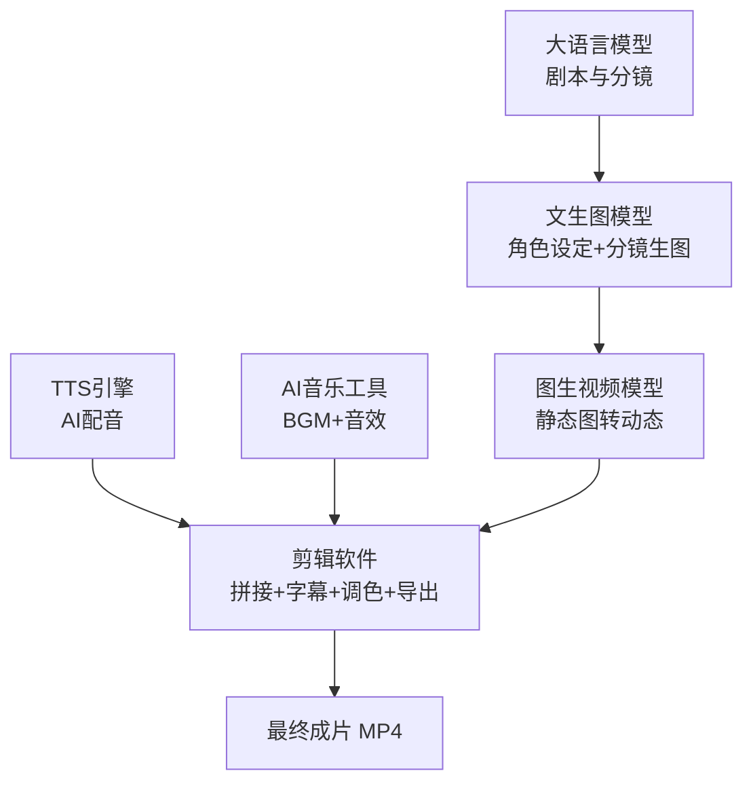

# 第2章 工具矩阵总览

十款 AI 工具摆在面前，不知道选哪个？怕浪猫帮你把 6 步流水线的工具全部摊开，一张表看懂新手零成本怎么组合、进阶付费怎么选型。

我是怕浪猫，上期讲了 AI 漫剧的 6 步流水线全景图，这期我们进入实操：每一步用什么工具、怎么选、花多少钱。看完这一章，你就能确定自己的工具组合方案。

> 工具选对了，流水线就通了一半。选错了，每一步都是阻力。

## 2.1 全流程工具地图：6 步流水线与工具角色

AI 漫剧的 6 步流水线，每一步都对应一个或多个工具角色。在深入每个工具之前，我们先看一张全景图，理解工具之间的关系和数据流向。



从图中可以看到，工具之间的数据流是线性的：大语言模型产出文本（剧本和分镜脚本），文生图模型消费文本产出图片（角色设定图和分镜图），图生视频模型消费图片产出视频片段，TTS 引擎和音乐工具产出音频，最后所有素材汇入剪辑软件合成成品。

但这里有一个容易被忽略的细节：文生图模型在流水线中出现了两次。第一次是在第二步，用来生成角色三视图和场景设定图，产出的是"资产"（长期复用）。第二次是在第三步，用来按分镜批量生成漫画分镜图，产出的是"内容"（每集不同）。虽然用的是同一类工具，但用法和目标不同。

| 流水线步骤 | 工具角色 | 输入类型 | 产出类型 | 产出性质 |
|-----------|---------|---------|---------|---------|
| 第一步 剧本与分镜 | 大语言模型 LLM | 文本（故事创意） | 文本（结构化分镜脚本） | 每集新生成 |
| 第二步 角色与场景设定 | 文生图模型 T2I | 文本（角色描述） | 图片（三视图、场景图） | 一次建好，长期复用 |
| 第三步 分镜生图 | 文生图模型 T2I | 文本（分镜描述+角色卡） | 图片（分镜静态图） | 每集新生成 |
| 第四步 图生视频 | 图生视频模型 I2V | 图片+文本（运镜指令） | 视频（MP4 片段） | 每集新生成 |
| 第五步 配音配乐 | TTS引擎+音乐工具 | 文本（台词） | 音频（人声+BGM+音效） | 每集新生成 |
| 第六步 剪辑合成 | 剪辑软件 | 视频+音频+字幕 | 视频（最终成片） | 每集新生成 |

理解了工具角色和数据流，接下来我们逐一展开每个环节的工具清单。

## 2.2 各环节工具清单：剧本、生图、视频、配音、音乐、剪辑

这一节是全书最常被翻阅的"工具字典"。每个环节我会列出主流工具、定位特点和适用场景。你不需要记住所有工具，只需要根据自己阶段选 1-2 款深入使用。

### 剧本与分镜环节：大语言模型

剧本与分镜环节的核心工具是大语言模型（Large Language Model，LLM）。它的任务是接收你的故事创意，输出结构化的分镜脚本，包含镜头号、景别、画面描述、台词、情绪和运镜等要素。

| 工具名称 | 开发方 | 免费额度 | 核心优势 | 适用场景 |
|---------|--------|---------|---------|---------|
| ChatGPT | OpenAI | 有（GPT-4o mini） | 综合能力强，中文理解好 | 通用剧本写作 |
| Claude | Anthropic | 有（有限额度） | 长文本处理强，逻辑严密 | 复杂剧情结构化拆解 |
| Kimi | 月之暗面 | 有（充足） | 中文语境理解优秀，免费额度大 | 中文短剧剧本 |
| 豆包 | 字节跳动 | 有（充足） | 中文表达自然，免费额度大 | 中文短剧剧本 |
| DeepSeek | 深度求索 | 有（充足） | 逻辑推理强，免费额度大 | 悬疑推理类剧本 |

选择大语言模型时，核心考虑两个因素：中文表达能力和结构化输出能力。中文表达能力决定了台词和画面描述的质量。结构化输出能力决定了模型能否按你要求的格式（如 JSON）稳定输出分镜脚本。建议同时使用 2-3 个模型，用不同模型生成不同集的剧本，选择效果最好的。

### 角色设定与分镜生图环节：文生图模型

文生图模型（Text-to-Image Model，T2I）是 AI 漫剧使用频率最高的工具类型。它同时服务于第二步（角色设定）和第三步（分镜生图）。

| 工具名称 | 类型 | 免费额度 | 核心优势 | 适用场景 |
|---------|------|---------|---------|---------|
| Midjourney | 在线服务 | 无（需订阅） | 画质顶级，审美强 | 高质量角色设定图 |
| Stable Diffusion | 本地部署 | 完全免费 | 可训练 LoRA，控制力最强 | 角色一致性要求高的场景 |
| 即梦 AI（Dreamina） | 在线服务 | 有（充足） | 中文友好，生图+图生视频一站式 | 新手入门首选 |
| 通义万相 | 在线服务 | 有（有限） | 阿里出品，中文理解好 | 通用生图 |
| LiblibAI（哩布哩布） | 在线服务 | 有（有限） | 国内 SD 模型社区，LoRA 资源丰富 | SD 用户云端使用 |
| 吐司（Tusi） | 在线服务 | 有（有限） | 在线训练 LoRA，无需本地部署 | 角色一致性训练 |

Midjourney（MJ）的画质和审美在所有文生图工具中名列前茅，但它是付费的，且对角色一致性的控制不如 SD 灵活。Stable Diffusion 是开源模型，可以本地部署，最大的优势是可以训练 LoRA（Low-Rank Adaptation，低秩适配）模型来锁定角色外观，实现极高的一致性。但 SD 的学习曲线陡峭，对硬件有要求（需要独立显卡）。

即梦 AI 是字节跳动推出的 AI 创作平台，中文友好，免费额度充足，而且同时支持文生图和图生视频，对新手非常友好。如果你是零基础入门，即梦 AI 是最好的起点。

### 图生视频环节：图生视频模型

图生视频模型（Image-to-Video Model，I2V）是 AI 漫剧流水线中技术含量最高的一环。它接收一张静态图片和运镜指令，输出一段动态视频。

| 工具名称 | 开发方 | 免费额度 | 单段时长上限 | 动态控制 | 核心优势 |
|---------|--------|---------|------------|---------|---------|
| 可灵 Kling | 快手 | 有（每日） | 10 秒 | 强（运镜+动作） | 画质优秀，中文友好 |
| 即梦 AI | 字节跳动 | 有（充足） | 10 秒 | 中等 | 一站式，新手友好 |
| Runway | Runway | 有（有限） | 10 秒 | 强（Gen-3） | 运镜控制精细 |
| Vidu | 生数科技 | 有（有限） | 8 秒 | 中等 | 角色一致性功能 |
| 海螺 AI | MiniMax | 有（有限） | 10 秒 | 中等 | 操作简单 |
| Luma | Luma Labs | 有（有限） | 5-10 秒 | 中等 | 免费额度可用 |
| Pika | Pika Labs | 有（有限） | 5-10 秒 | 中等 | 动作生成自然 |

图生视频工具的选择标准有三个：画质、动态控制能力和免费额度。画质决定了成片的视觉品质。动态控制能力决定了你能否实现"镜头推拉"和"人物微动"等效果。免费额度决定了你的试错成本。

目前国内创作者最常用的是可灵和即梦 AI。可灵的画质和动态控制能力在国产工具中领先，但免费额度有限。即梦 AI 的优势是一站式（生图+图生视频+配音都能在一个平台完成），适合新手。

### AI 配音环节：TTS 工具

文本转语音（Text-to-Speech，TTS）工具负责把台词文本转化为角色配音。

| 工具名称 | 类型 | 免费额度 | 核心优势 | 适用场景 |
|---------|------|---------|---------|---------|
| 剪映配音 | 内置功能 | 完全免费 | 操作简单，音色多，与剪辑无缝衔接 | 新手首选 |
| 魔音工坊 | 在线服务 | 有（有限） | 音色丰富，情感表达好 | 中级创作者 |
| ElevenLabs | 在线服务 | 有（有限） | 音色克隆质量最高，多语言支持 | 进阶专业配音 |
| Fish Audio | 在线服务 | 有（有限） | 开源语音模型，可本地部署 | 技术型创作者 |
| GPT-SoVITS | 开源工具 | 完全免费 | 本地部署，音色克隆免费 | 技术型创作者 |

剪映配音是大多数新手的首选。它内置在剪映（CapCut）中，不需要额外安装，操作简单，有大量预设音色，而且完全免费。缺点是音色的情感表达不如专业工具丰富。

ElevenLabs 是目前音色克隆质量最高的工具之一，但价格较高。GPT-SoVITS 是开源的音色克隆方案，可以本地部署，完全免费，但需要一定的技术能力来安装和配置。

### BGM 与音效环节

背景音乐（Background Music，BGM）和音效是提升漫剧沉浸感的重要元素。

| 工具名称 | 类型 | 免费额度 | 核心优势 | 适用场景 |
|---------|------|---------|---------|---------|
| Suno AI | 在线服务 | 有（每日） | AI 生成原创音乐，可定制风格和情绪 | 定制 BGM |
| 剪映素材库 | 内置功能 | 完全免费 | 海量 BGM 和音效，分类清晰 | 通用 BGM 和音效 |
| 网易云素材库 | 在线服务 | 部分免费 | 正版授权音乐素材 | 商用 BGM |
| Udio | 在线服务 | 有（有限） | AI 生成音乐，质量高 | 定制 BGM |

Suno AI 可以根据你的描述生成原创音乐，比如"一段悬疑风格的钢琴 BGM，节奏渐快"。这比在素材库里翻找更高效，而且生成的音乐不会撞曲。剪映素材库则是最便捷的选择，直接在剪辑软件里搜索、试听、拖入时间轴，一步到位。

### 剪辑合成环节

剪辑软件是流水线的终点站，所有素材在这里汇合成最终成片。

| 工具名称 | 类型 | 免费额度 | 核心优势 | 适用场景 |
|---------|------|---------|---------|---------|
| 剪映（CapCut） | 桌面/移动 | 基础功能免费 | 操作简单，自带配音和素材库，中文友好 | 新手首选 |
| Premiere Pro | Adobe | 无（需订阅） | 专业级剪辑，功能全面 | 专业剪辑师 |
| DaVinci Resolve | Blackmagic | 有（基础版免费） | 调色能力顶级，基础版免费 | 调色需求高的场景 |

剪映是绝大多数 AI 漫剧创作者的首选剪辑工具。原因很简单：它集成了配音、素材库、字幕识别、调色滤镜等全链路功能，在一个软件里就能完成第五步和第六步的大部分工作。而且操作门槛低，新手半天就能上手。Premiere Pro（PR）和 DaVinci Resolve 更适合有专业剪辑需求的用户，但对大多数 AI 漫剧创作者来说，剪映已经足够。

## 2.3 工具选型建议：新手零成本组合与进阶专业组合

面对这么多工具，新手最容易犯的错误是"什么都想试"。正确的做法是：先确定一套组合，跑通完整流程，然后再根据瓶颈环节逐步升级。

这里给出两套经过实战验证的工具组合。

### 新手入门组合（零成本起手）

这套组合的核心原则是：全部使用免费工具，先把全流程跑通，不追求极致画质。

| 步骤 | 工具选择 | 理由 |
|------|---------|------|
| 剧本与分镜 | 豆包 或 Kimi | 中文表达好，免费额度大 |
| 角色设定与分镜生图 | 即梦 AI | 免费额度充足，中文友好，支持参考图功能 |
| 图生视频 | 即梦 AI | 一站式平台，生图+图生视频无缝衔接 |
| AI 配音 | 剪映配音 | 免费，音色多，与剪辑无缝衔接 |
| BGM 与音效 | 剪映素材库 | 免费，分类清晰，一键拖入 |
| 剪辑合成 | 剪映 | 基础功能免费，全链路覆盖 |

这套组合的总成本是零。你不需要花一分钱就能做出一集完整的 AI 漫剧。质量上，新手组合的成片质量在"可接受"到"还不错"之间，足够用来验证流程和发布到平台测试数据。

新手组合的局限性在于：即梦 AI 的角色一致性控制不如 SD+LoRA，画质不如 Midjourney，图生视频的动态控制不如可灵 Pro。但这些局限性在你"跑通流程"的阶段不是关键问题。先跑通，再优化。

### 进阶专业组合

这套组合适用于已经跑通流程、想提升成片质量的创作者。

| 步骤 | 工具选择 | 理由 |
|------|---------|------|
| 剧本与分镜 | Claude 或 ChatGPT | 逻辑严密，结构化输出更稳定 |
| 角色设定与分镜生图 | Stable Diffusion + LoRA | 角色一致性最强，画质可控 |
| 图生视频 | 可灵 Pro 或 Runway | 画质优秀，运镜控制精细 |
| AI 配音 | ElevenLabs 或 GPT-SoVITS | 音色克隆，全剧音色稳定 |
| BGM 与音效 | Suno AI + 剪映素材库 | 定制 BGM + 通用音效 |
| 剪辑合成 | 剪映 或 Premiere Pro | 剪映够用，PR 更灵活 |

进阶组合的月成本参考：Claude 订阅约 20 美元/月，SD 本地部署需要独立显卡（一次性硬件投入），可灵 Pro 约几十到几百元/月，ElevenLabs 约 5-22 美元/月。综合下来，月成本在几百到一千元人民币之间。

| 对比维度 | 新手入门组合 | 进阶专业组合 |
|---------|------------|------------|
| 月成本 | 0 元 | 200-1000 元 |
| 角色一致性 | 中等（参考图约束） | 高（LoRA 锁定） |
| 画质 | 中上 | 优秀 |
| 图生视频动态控制 | 基础运镜 | 精细运镜+微动控制 |
| 配音质量 | 通用音色，情感一般 | 音色克隆，情感丰富 |
| 学习曲线 | 低（1-2 周上手） | 高（1-2 月熟练） |
| 适合人群 | 零基础入门 | 有基础、想专业产出 |
| 硬件要求 | 普通电脑即可 | SD 需要独立显卡 |

> 不存在"最好的工具组合"，只存在"最适合你当前阶段的工具组合"。

一个常见的错误是：新手一上来就用进阶组合。结果花了很多钱订阅工具，但因为学习曲线陡峭，迟迟跑不通流程，反而浪费了时间和金钱。正确的升级路径是：新手组合跑通 3-5 集 -> 发现瓶颈环节 -> 针对瓶颈环节升级对应工具 -> 逐步过渡到进阶组合。

## 2.4 成本预算模型：免费路线与付费路线

理解了工具组合，我们来看更具体的成本预算。成本分为两部分：工具订阅成本和创作时间成本。

工具订阅成本是"显性成本"，你每个月付给工具厂商的费用。时间成本是"隐性成本"，你花在制作上的时间。对于个人创作者来说，时间成本往往比工具成本更重要。

### 工具订阅成本明细

| 环节 | 免费方案 | 参考月成本 | 付费方案 | 参考月成本 |
|------|---------|-----------|---------|-----------|
| 剧本 | 豆包/Kimi/DeepSeek 免费额度 | 0 元 | Claude Pro | 约 150 元 |
| 生图 | 即梦 AI 免费额度 | 0 元 | Midjourney 标准版 | 约 100 元 |
| 生图（进阶） | SD 本地部署 | 0 元（需硬件） | SD 云端 GPU 租用 | 50-200 元 |
| 图生视频 | 即梦 AI 免费额度 | 0 元 | 可灵 Pro | 50-300 元 |
| 配音 | 剪映配音 | 0 元 | ElevenLabs Starter | 约 35 元 |
| 音乐 | 剪映素材库 | 0 元 | Suno AI Pro | 约 70 元 |
| 剪辑 | 剪映免费版 | 0 元 | 剪映会员 | 约 20 元/月 |
| **月合计** | | **0 元** | | **425-875 元** |

单集成本的计算方式是：月总成本 除以 月产量。如果你月成本 500 元，每月做 10 集，单集成本就是 50 元。如果用免费方案，单集成本就是 0 元。

> 工具成本是线性的，但时间成本是非线性的。越熟练，单位时间产出越多。

### 时间成本估算

时间成本取决于你的熟练程度和工具组合的效率。以下是新手和熟练创作者在各个环节的时间对比。

| 环节 | 新手耗时 | 熟练耗时 | 瓶颈点 |
|------|---------|---------|--------|
| 剧本与分镜 | 2-3 小时 | 30 分钟 | 故事创意和分镜结构化 |
| 角色设定 | 2-4 小时（首次） | 0 分钟（复用） | 三视图一致性调试 |
| 分镜生图 | 3-6 小时 | 1-2 小时 | 角色漂移、重出率 |
| 图生视频 | 2-4 小时 | 1 小时 | 翻车重生成 |
| 配音配乐 | 1-2 小时 | 30 分钟 | 音色匹配调试 |
| 剪辑合成 | 2-4 小时 | 1 小时 | 节奏调整 |
| **合计** | **12-23 小时/集** | **5-7 小时/集** | |

从新手到熟练的过渡期大约是 5-10 集。前 3 集最慢，因为你还在熟悉工具操作和流程。第 5 集开始明显提速，因为角色资产库建好了、提示词模板积累了。第 10 集以后基本稳定在熟练速度。

降低时间成本的关键策略有三个。

第一个策略是建立资产库。角色卡、画风词、场景设定图、音色配置、BGM 素材，这些都是可复用的资产。首次制作时多花时间打磨，后续每集都能省时间。

第二个策略是标准化提示词。把生图提示词、图生视频提示词、剧本分镜提示词都做成模板，每次只需要填变量，不用从头写。这能节省大量"想提示词"的时间。

第三个策略是批量操作。生图环节不要一张一张生成，而是按批次一次性生成多个镜头的备选图。图生视频也一样，把所有片段排队生成，不用守在电脑前等。

## 2.5 工具链数据流：从剧本到成片的文件流转与交接规范

工具选好了，接下来要解决的是"工具之间怎么交接"的问题。每一步的产出是下一步的输入，如果文件命名混乱、格式不统一、存储位置散乱，整个流水线的效率会大幅下降。

这一节给出一个推荐的文件流转规范，你可以直接照用或根据自己的习惯调整。

### 目录结构

```
漫剧项目/
├── 01_剧本/
│   ├── 第01集_剧本.md
│   ├── 第01集_分镜脚本.json
│   └── 第02集_剧本.md
├── 02_角色资产/
│   ├── 角色01_女主/
│   │   ├── 角色卡.md
│   │   ├── 三视图_正面.png
│   │   ├── 三视图_侧面.png
│   │   └── 三视图_背面.png
│   ├── 角色02_男主/
│   └── 场景设定/
│       ├── 场景01_雨夜街头.png
│       └── 场景02_咖啡厅.png
├── 03_分镜图/
│   ├── 第01集/
│   │   ├── 镜头01.png
│   │   ├── 镜头02.png
│   └── 第02集/
├── 04_视频片段/
│   ├── 第01集/
│   │   ├── 镜头01.mp4
│   │   ├── 镜头02.mp4
├── 05_音频/
│   ├── 第01集/
│   │   ├── 配音.wav
│   │   ├── BGM.mp3
│   │   └── 音效/
├── 06_剪辑工程/
│   ├── 第01集_剪映草稿.draft
│   └── 第01集_成片.mp4
└── 00_模板/
    ├── 剧本提示词模板.md
    ├── 生图提示词模板.md
    ├── 图生视频提示词模板.md
    └── 导出参数预设.json
```

这个目录结构按流水线步骤编号（01-06），加上一个 00 模板目录存放可复用的提示词和参数。每一集的素材按集号归类，不会混淆。

### 文件命名规范

| 文件类型 | 命名格式 | 示例 |
|---------|---------|------|
| 剧本文件 | 第{集号}集_剧本.md | 第01集_剧本.md |
| 分镜脚本 | 第{集号}集_分镜脚本.json | 第01集_分镜脚本.json |
| 角色三视图 | 三视图_{角度}.png | 三视图_正面.png |
| 分镜图 | 镜头{镜头号}.png | 镜头01.png |
| 视频片段 | 镜头{镜头号}.mp4 | 镜头01.mp4 |
| 配音文件 | 配音_{角色名}.wav | 配音_女主.wav |
| 成片 | 第{集号}集_成片.mp4 | 第01集_成片.mp4 |

命名规范的核心原则是：只看文件名就知道这是什么集、什么镜头、什么类型的文件。避免用"最终版""最终版2""真的最终版"这种命名，它会让你的项目在一周后变得不可维护。

### 文件格式规范

| 环节 | 推荐格式 | 备选格式 | 说明 |
|------|---------|---------|------|
| 剧本 | Markdown（.md） | 纯文本（.txt） | 便于阅读和版本管理 |
| 分镜脚本 | JSON（.json） | CSV | 结构化，便于程序化处理 |
| 角色设定图 | PNG | JPG | PNG 无损，适合参考图 |
| 分镜图 | PNG | JPG | 画质优先 |
| 视频片段 | MP4（H.264） | MOV | 全平台兼容 |
| 配音 | WAV | MP3 | WAV 无损，剪辑时音质更好 |
| BGM | MP3 | WAV | MP3 文件小，足够用 |
| 成片 | MP4（H.264） | MOV | 平台上传标准格式 |

> 文件管理不是"锦上添花"，而是"流水线的地基"。地基不稳，越往后越乱。

### 交接检查清单

每一步完成后，向下一步交接素材时，对照以下检查清单确认。

| 交接节点 | 检查项 | 通过标准 |
|---------|--------|--------|
| 剧本 → 生图 | 分镜脚本完整性 | 每个镜头包含四要素（画面描述+台词+情绪+运镜） |
| 角色设定 → 分镜生图 | 三视图一致性 | 正/侧/背的发型、服装、五官一致 |
| 分镜生图 → 图生视频 | 图片质量和分辨率 | 2K 以上分辨率，角色无畸形，画风统一 |
| 图生视频 → 剪辑 | 视频片段完整性 | 每段 10-15 秒，无畸变，无闪烁 |
| 配音配乐 → 剪辑 | 音频质量 | 台词清晰，无噪音，BGM 电平低于人声 15-20dB |

这个检查清单和第 1 章讲的"每步验收"机制是配套的。每次交接前花 2-3 分钟检查，能避免后面几个小时的返工。

## 工具链总结

这一章我们把 6 步流水线的所有工具都过了一遍。回顾一下核心要点。

新手用零成本组合（豆包/Kimi + 即梦 AI + 剪映）跑通全流程，进阶用专业组合（Claude + SD+LoRA + 可灵 + ElevenLabs）提升质量。升级路径是"针对瓶颈环节逐步替换"，不是一次性全部换掉。

文件管理用编号目录结构和统一命名规范，每步交接对照检查清单验收。

> 工具是手段，流程是灵魂。工具可以换，流程不能乱。

觉得有用？收藏起来，下次选工具的时候直接照着这张表对比。你在用哪些 AI 工具？评论区分享一下你的工具组合。

关注怕浪猫，下期我们正式进入流水线第一步：剧本与分镜。我会教你用大模型把一个故事拆成"镜头+画面描述+台词+情绪"的结构化脚本，包括完整的 JSON 模板和可以直接套用的提示词。

系列进度 2/10，下篇：第3章 第一步：剧本与分镜
