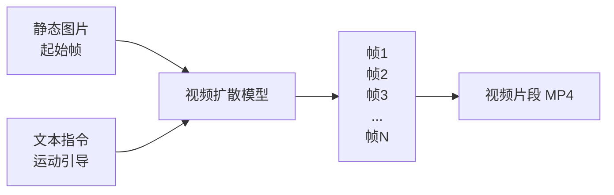

# 第6章 第四步：图生视频

静态漫画图变成了动态视频片段，AI 漫剧才算真正"动"起来。但图生视频也是整个流水线中翻车率最高的环节。

我是怕浪猫，上期讲了分镜生图，这期进入流水线第四步：图生视频（Image-to-Video，I2V）。这一步的技术含量最高，不可控因素也最多。我会讲清楚 I2V 的原理、工具选择、运镜控制和翻车补救方案。

> 图生视频是流水线的"险桥"。前面三步都是陆地行走，这一步开始走钢丝。

## 6.1 图生视频的原理：视频扩散模型

要理解图生视频为什么难，得先理解它的工作原理。

图生视频模型（Image-to-Video Model）的核心技术是视频扩散模型（Video Diffusion Model）。它和文生图模型一样基于扩散原理，但有一个关键区别：它不是生成单张图片，而是生成一系列连续的帧（Frame），这些帧按顺序播放就构成了视频。

视频扩散模型的工作过程可以简化为三步。

第一步，模型接收一张静态图片作为"起始帧"（First Frame），并接收一段文本指令作为运动引导（Motion Guidance）。

第二步，模型基于起始帧和运动引导，预测后续帧的内容。这个预测过程本身就是扩散去噪过程，从噪声开始，逐步去噪还原出每一帧。

第三步，模型生成的所有帧按顺序组合，加上时间维度，输出为视频文件。



这个过程的难点在于"时间一致性"（Temporal Consistency）。模型不仅要保证每一帧的画面质量，还要保证相邻帧之间的变化是连贯的。如果帧与帧之间的角色外观、场景布局发生跳变，视频就会出现"闪烁"（Flickering）。

理解了原理，你就明白图生视频为什么会出现以下常见问题了。

| 常见问题 | 原理层面的解释 |
|---------|-------------|
| 角色变形 | 不同帧中角色的五官和体型发生了不一致的变化 |
| 画面闪烁 | 相邻帧之间的画面元素跳变，如背景物体位置突变 |
| 运动不自然 | 模型对物理运动的理解不够准确，如重力、惯性表现错误 |
| 细节消失 | 随着帧数增加，模型"忘记"了起始帧的细节，如饰品消失、纹理模糊 |
| 幻觉内容 | 模型"脑补"了原图中不存在的元素，如多出一个人影 |

> 图生视频的本质是"让模型猜图片下一秒会变成什么样"。猜得准就是好视频，猜不准就是翻车。

## 6.2 工具对比：可灵、即梦、Runway、Vidu

目前市面上有多个图生视频工具，选择合适的工具是这一步的关键决策。

### 工具能力矩阵

| 工具名称 | 画质 | 动态控制 | 免费额度 | 单段时长 | 中文友好 | 推荐指数 |
|---------|------|---------|---------|---------|---------|---------|
| 可灵 Kling | 优秀 | 强 | 每日免费额度 | 最长 10 秒 | 是 | ★★★★★ |
| 即梦 AI | 良好 | 中 | 充足 | 最长 10 秒 | 是 | ★★★★ |
| Runway Gen-3 | 优秀 | 强 | 有限 | 最长 10 秒 | 否 | ★★★★ |
| Vidu | 良好 | 中 | 有限 | 最长 8 秒 | 是 | ★★★☆ |
| 海螺 AI | 良好 | 中 | 有限 | 最长 10 秒 | 是 | ★★★☆ |
| Luma | 中上 | 中 | 有限 | 5-10 秒 | 否 | ★★★ |
| Pika | 中上 | 中 | 有限 | 5-10 秒 | 否 | ★★★ |

### 各工具特点详解

**可灵（Kling）** 是快手推出的视频生成模型，目前在国产图生视频工具中画质领先。可灵的优势是动态控制能力强，支持运镜指令（如推、拉、摇、移）和动作描述。免费额度每日刷新，付费版可解锁更长时长和更高画质。可灵的弱点是有时候人物动作幅度过大，容易出现变形。

**即梦 AI** 是字节跳动的产品，优势是一站式（生图+图生视频+配音都能在即梦完成），对新手非常友好。即梦的图生视频画质中上，动态控制中等，但免费额度充足，适合新手入门和快速验证。弱点是运镜控制不如可灵精细。

**Runway Gen-3** 是国际上技术领先的图生视频工具之一。Gen-3 的运镜控制非常精细，画质优秀，特别是对物体运动和镜头运动的理解比较准确。弱点是免费额度有限，需要科学上网，对中文用户不够友好。

**Vidu** 是生数科技推出的工具，有一个特色功能是角色一致性（Character Reference），可以在不同视频中保持角色外观一致。画质和动态控制中等，适合需要跨集角色一致性的场景。

### 工具选择建议

| 用户类型 | 推荐工具 | 理由 |
|---------|---------|------|
| 新手入门 | 即梦 AI | 一站式，免费额度大，操作简单 |
| 进阶创作者 | 可灵 + 即梦 | 可灵做关键镜头，即梦做普通镜头 |
| 专业创作者 | 可灵 Pro + Runway | 画质和控制力最优组合 |
| 预算有限 | 即梦 + 海螺 + Luma | 多个免费工具交替使用 |

> 不要只用一个工具。不同工具在不同场景下各有优势，组合使用效果最佳。

## 6.3 运镜与微动：让静态图动起来

图生视频的核心技能是"运镜控制"和"微动设计"。运镜控制镜头怎么动，微动控制画面里的元素怎么动。

### 运镜指令

运镜指令告诉模型"镜头怎么运动"。不同工具对运镜指令的支持方式不同，但核心概念是通用的。

| 运镜类型 | 英文指令 | 效果 | 适用场景 |
|---------|---------|------|---------|
| 推镜头 | Zoom In / Push In | 镜头逐渐靠近主体 | 强调情绪、突出细节 |
| 拉镜头 | Zoom Out / Pull Out | 镜头逐渐远离主体 | 展示环境、建立全景 |
| 左摇 | Pan Left | 镜头向左转 | 展示环境、跟随运动 |
| 右摇 | Pan Right | 镜头向右转 | 展示环境、跟随运动 |
| 上摇 | Tilt Up | 镜头向上转 | 展示高大物体、仰望感 |
| 下摇 | Tilt Down | 镜头向下转 | 展示地面、俯视感 |
| 左移 | Track Left | 镜头向左平移 | 侧面跟随角色 |
| 右移 | Track Right | 镜头向右平移 | 侧面跟随角色 |
| 环绕 | Orbit / Arc | 镜头绕主体旋转 | 展示角色全貌 |
| 固定 | Static / Fixed | 镜头不动 | 稳定叙事 |

在提示词中使用运镜指令时，建议用英文描述。例如：`camera slowly zooms in on the character's face`（镜头缓慢推近角色面部）或 `camera pans right to reveal the street`（镜头右摇展示街道）。

### 微动设计

微动（Micro Motion）是指画面中细微的动态效果。它不是大幅度的动作，而是让画面"活起来"的小细节。

| 微动类型 | 提示词示例 | 效果 |
|---------|-----------|------|
| 头发飘动 | hair gently swaying in the wind | 增加动感 |
| 衣服飘动 | clothes slightly moving | 增加真实感 |
| 眨眼 | character blinks slowly | 增加生命感 |
| 呼吸 | subtle breathing movement | 增加真实感 |
| 雨滴下落 | rain falling, water splashing | 环境动态 |
| 灯光闪烁 | lights flickering slightly | 氛围动态 |
| 烟雾飘散 | smoke drifting slowly | 氛围动态 |
| 水面波纹 | water rippling gently | 环境动态 |

微动设计的原则是"克制"。一个镜头中只需要 1-2 种微动效果，不要贪多。如果你在提示词中同时要求头发飘动、衣服飘动、眨眼、呼吸、雨滴下落、灯光闪烁，模型会试图同时生成所有这些动态，结果往往是什么都动不好，反而出现变形和闪烁。

> 运镜定"镜头怎么动"，微动定"画面里什么动"。两者配合，静态图就活了。

### 运镜指令编写原则

编写运镜指令时，有几个原则能显著提升生成质量。

**原则一：一次只用一种运镜**。不要在一段 5 秒的视频中同时要求推和摇，模型很难同时处理两种镜头运动。如果一个镜头需要从推变为摇，把它拆成两段分别生成，在剪辑时拼接。

**原则二：运镜速度要明确**。不要只写 zoom in，要写 slowly zoom in 或 fast zoom in。速度不同，观感完全不同。一般推荐 slow 和 gently 等修饰词，因为快速运镜更容易出现画面不稳定。

**原则三：运镜方向要与画面构图匹配**。如果角色在画面左侧，镜头向左摇会摇出画面。运镜方向要考虑角色在画面中的位置和面朝方向。

**原则四：参考分镜脚本中的运镜字段**。在剧本分镜阶段已经定义了每个镜头的运镜方式，在图生视频时直接参考，保持一致性。

| 运镜指令 | 正确写法 | 错误写法 | 问题 |
|---------|---------|---------|------|
| 缓推 | camera slowly zooms in on character's face | zoom in | 缺少速度描述 |
| 右摇 | camera gently pans right to reveal the street | pan and zoom | 混合运镜 |
| 固定 | static camera, no movement | hold | 描述不明确 |
| 环绕 | camera slowly orbits around the character | rotate around | 用词不标准 |

### 角色动作的生成策略

除了运镜，图生视频还需要定义"角色在做什么"。角色动作的生成策略直接影响视频质量。

**微动优先策略**。对于对话类镜头，角色不需要大幅度动作。只做微动（眨眼、嘴部开合对应台词、轻微头部转动）效果最好。大幅度动作（走路、跑步、打斗）的翻车率远高于微动。

**动作分解策略**。如果一个镜头需要角色做一个复合动作（如"起身走向门口"），把它分解为多个简单动作，分别生成视频片段，在剪辑时拼接。"起身"和"走向门口"分别生成，效果比一次生成好得多。

**动作幅度控制策略**。在提示词中使用修饰词控制动作幅度。如 slightly turns head（轻微转头）比 turns head（转头）更可控。gentle movement（轻柔动作）比 fast movement（快速动作）更稳定。

| 动作类型 | 翻车率 | 推荐策略 | 替代方案 |
|---------|--------|---------|----------|
| 微动（眨眼/呼吸） | 低 | 直接生成 | 无 |
| 嘴部动作（说话） | 低 | 直接生成 | 后期对口型 |
| 头部转动 | 中 | 用 slight/gently 修饰 | 分解为多段 |
| 身体微转 | 中 | 用 slight 修饰 | 用运镜替代 |
| 起身/坐下 | 高 | 分解动作 | 用转场跳过 |
| 行走 | 高 | 用移镜头跟随 | 用多镜头拼接 |
| 跑步/打斗 | 极高 | 不推荐直接生成 | 用特效/转场替代 |

> 动作越简单，视频越稳定。宁可多用几个简单镜头拼接，也不要赌一个复杂镜头一次成功。

### 提示词编写实例

以下是一个完整的图生视频提示词编写实例，展示从分镜信息到 I2V 提示词的转换过程。

分镜信息：
- 景别：中景
- 运镜：缓慢推
- 画面描述：女主坐在咖啡厅窗边，右手搅动咖啡，表情焦虑
- 情绪：焦虑
- 台词：（无）

I2V 提示词：
```
camera slowly zooms in on the character, medium shot,
a young woman with long straight black hair, wearing beige trench coat,
sitting by the window in a Japanese-style cafe,
right hand gently stirring coffee with a spoon,
anxious expression, slightly frowning, eyes looking out the window,
hair slightly swaying, subtle breathing movement,
rain drops falling outside the window, warm yellow lighting,
smooth motion, stable background
```

这个提示词的结构是：运镜（前）+ 景别 + 角色描述 + 场景描述 + 角色动作 + 表情 + 微动 + 环境动态 + 稳定性词。每个部分都简洁明确，不堆砌关键词。

## 6.4 单段时长与节奏：10-15 秒的设计逻辑

一集 60-90 秒的漫剧，通常由 6-9 个视频片段组成。每个片段多长？怎么排列？这涉及到节奏设计。

### 单段时长的选择

目前主流图生视频工具的单段时长上限是 10 秒（部分工具 5-8 秒）。实际制作中，建议每段控制在 5-10 秒，原因有三个。

第一，时长越短，模型越容易保持质量。视频扩散模型在帧数较多时更容易出现质量下降（变形、闪烁、细节消失）。5-8 秒的片段质量通常比 10 秒的片段更稳定。

第二，短视频的节奏更快。在短视频平台上，快节奏剪辑的完播率通常高于慢节奏。每 5-8 秒切换一次镜头，能保持观众的注意力。

第三，短片段更容易补救。如果一个 5 秒的片段翻车了，重新生成只需要几分钟。如果一个 10 秒的片段在第 8 秒翻车，你可能需要重新生成整个片段。

| 单段时长 | 画质稳定性 | 节奏感 | 翻车成本 | 推荐度 |
|---------|-----------|--------|---------|--------|
| 3-5 秒 | 高 | 快 | 低 | 新手推荐 |
| 5-8 秒 | 中高 | 中快 | 中 | 标准推荐 |
| 8-10 秒 | 中 | 中 | 中高 | 进阶使用 |
| 10 秒以上 | 低 | 慢 | 高 | 不推荐 |

### 节奏排列

一集漫剧的节奏不是匀速的。好的节奏有快有慢，形成"张力曲线"（Tension Curve）。

一个推荐的节奏排列模式是：快（钩子）→ 慢（铺垫）→ 快（冲突升级）→ 慢（情绪点）→ 快（高潮）→ 悬念（结尾）。

| 位置 | 节奏 | 时长 | 作用 |
|------|------|------|------|
| 开头钩子 | 快 | 5-6 秒 | 抓住注意力 |
| 铺垫 | 慢 | 8-10 秒 | 建立情境 |
| 冲突升级 | 快 | 5-6 秒 | 推高紧张感 |
| 情绪点 | 慢 | 8-10 秒 | 深化情感 |
| 高潮 | 快 | 5-6 秒 | 冲突爆发 |
| 悬念结尾 | 中 | 6-8 秒 | 留住观众 |

这个节奏模式不是固定公式，你可以根据故事内容调整。但核心原则是：不要全程快，也不要全程慢。快慢交替才能形成节奏感。

> 节奏不是"每个镜头多长"的技术问题，而是"观众情绪怎么流动"的艺术问题。

## 6.5 翻车排查与补救方案

图生视频是翻车率最高的环节。以下分类整理常见翻车问题和补救方案。

### 翻车一：角色变形

**表现**：角色的五官、体型在视频中发生变化。眼睛变大或变小、脸型变化、身体比例失调。

**原因**：视频扩散模型在生成多帧时，角色的一致性会随帧数增加而下降。

**补救方案**。方案 A：缩短时长。如果 10 秒的片段在第 6 秒开始变形，把它截成两个 5 秒的片段，分别生成。方案 B：降低动态幅度。减少提示词中的动作描述，让角色只做微动（如眨眼、呼吸），不做大幅度动作。方案 C：换工具。不同工具的角色保持能力不同，可灵和 Runway 在角色保持方面相对较好。

### 翻车二：画面闪烁

**表现**：视频画面出现明暗交替的闪烁，或背景元素位置跳变。

**原因**：相邻帧之间的画面元素不一致，模型在帧间预测不稳定。

**补救方案**。方案 A：在提示词中加入稳定性关键词，如 `smooth motion, stable background, consistent lighting`。方案 B：减少运镜幅度，用固定镜头或缓慢推拉替代快速移动。方案 C：如果使用 SD 系工具，调高运动一致性参数。

### 翻车三：幻觉内容

**表现**：视频中出现原图中不存在的元素。多出一个人影、多出一个物体、背景出现不该有的东西。

**原因**：模型在生成过程中"脑补"了不存在的元素，这是扩散模型的固有缺陷。

**补救方案**。方案 A：在提示词中明确排除，如 `no extra characters, no additional objects`。方案 B：换一个种子重新生成。方案 C：如果幻觉内容固定出现在某个位置，可以在剪辑阶段用裁剪或遮挡处理。

### 翻车四：运动不自然

**表现**：角色或物体的运动不符合物理规律。人走路像滑步、物体下落太慢或太快、头发飘动方向不对。

**原因**：视频扩散模型对物理规律的理解有限，它学的是"画面怎么变"，不是"物理怎么运作"。

**补救方案**。方案 A：简化运动。不要让角色做复杂的全身运动，改为微动（表情变化、头部微转）。方案 B：用运镜替代角色运动。与其让角色走动（容易不自然），不如用镜头移动来制造动感。方案 C：在剪辑阶段用转场效果遮盖不自然的部分。

| 翻车类型 | 严重程度 | 发生频率 | 最佳补救 | 预防措施 |
|---------|---------|---------|---------|---------|
| 角色变形 | 高 | 高 | 缩短时长 | 减少大幅度动作 |
| 画面闪烁 | 中高 | 中 | 稳定性关键词 | 减少运镜幅度 |
| 幻觉内容 | 中 | 中 | 换种子 | 明确排除描述 |
| 运动不自然 | 中 | 高 | 简化运动 | 用运镜替代角色运动 |
| 细节消失 | 低 | 高 | 缩短时长 | 接受或后期修复 |

> 图生视频的翻车不是"会不会"的问题，是"翻几次"的问题。把翻车当作流程的一部分，提前规划补救时间。

### 不同工具的提示词差异

不同图生视频工具对提示词的响应方式不同，同一个提示词在不同工具上效果差异很大。了解这些差异能帮助你更高效地使用工具。

**可灵**。可灵对中文提示词的理解较好，你可以直接用中文描述运镜和动作。可灵支持结构化描述，如分"运镜"和"动作"两部分填写。建议在可灵中用简洁的中文描述，避免过长的复合句。

**即梦 AI**。即梦的提示词也支持中文，但建议运镜指令用英文（因为底层模型对英文运镜词的响应更准确）。即梦的操作界面提供了运镜选项按钮，可以直接选择"推/拉/摇/移"，不需要在提示词中重复描述。

**Runway Gen-3**。Runway 的提示词必须是英文，且对描述性语言的理解较好。建议用完整的英文句子描述，而不是关键词堆叠。如 `The camera slowly pushes in on the woman's face as she looks out the window with an anxious expression`。

| 工具 | 提示词语言 | 推荐写法 | 运镜设置方式 |
|------|-----------|---------|------------|
| 可灵 | 中文/英文 | 简洁中文+英文运镜词 | 文本描述或选项按钮 |
| 即梦 | 中文/英文 | 中文动作+英文运镜词 | 界面选项按钮 |
| Runway | 仅英文 | 完整英文句子 | 文本描述 |
| Vidu | 中文/英文 | 简洁描述 | 文本描述 |

### 视频片段的文件管理

图生视频产出的文件比图片大得多，管理不当容易混乱。

建议每个镜头生成后立即按规范命名：`镜头{镜头号}_v{版本号}.mp4`。比如第一版生成的镜头 3 命名为 `镜头03_v1.mp4`，重做后命名为 `镜头03_v2.mp4`。最终选用的版本复制一份为 `镜头03.mp4`（去掉版本号），用于后续剪辑。

视频文件建议存放在专用的视频目录中，不要和图片混在一起。按照第 2 章定义的目录结构，存放在 `04_视频片段/第{集号}集/` 下。

### 翻车补救的时间预算

在计划一集的制作时间时，图生视频环节要预留 30-50% 的翻车重试时间。比如 8 个镜头，每个镜头平均重试 1.5 次，你需要准备 12 次生成的额度。这也是为什么前面强调要选择免费额度充足或价格合理的工具。

### 视频片段验收清单

所有视频片段生成后，进入下一步前做一次验收。

| 验收项 | 标准 | 检查方法 |
|--------|------|---------|
| 角色一致性 | 角色在视频中外观稳定 | 完整观看每段视频 |
| 画面稳定性 | 无明显闪烁和跳变 | 关注背景和边缘区域 |
| 运镜流畅性 | 运镜自然不突兀 | 对照运镜指令检查 |
| 时长合规 | 每段 5-10 秒 | 查看视频属性 |
| 分辨率 | 1080P 以上 | 查看视频属性 |
| 无幻觉内容 | 无多余人物和物体 | 仔细观看画面 |
| 情绪匹配 | 动态效果与情绪标注一致 | 对照分镜脚本 |

觉得有用？收藏起来，下次做图生视频的时候直接照着翻车清单排查。你在图生视频时最常遇到什么问题？评论区聊聊。

关注怕浪猫，下期我们讲第五步：配音配乐。AI 配音怎么匹配角色音色？BGM 音量怎么调？怎么让声音和画面完美对位？下期讲清楚。

系列进度 6/10，下篇：第7章 第五步：配音配乐
