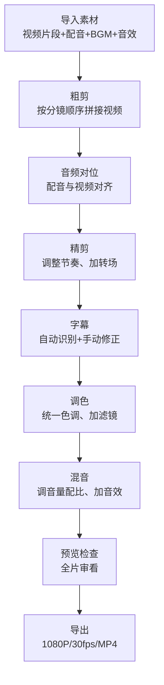

# 第8章 第六步：剪辑合成

所有素材准备完毕，现在把它们组装成最终成片。剪辑是流水线的终点站，也是决定成片"完成度"的最后一步。

我是怕浪猫，上期讲了配音配乐，这期进入流水线最后一步：剪辑合成。六个环节的素材在这里汇聚，经过拼接、转场、字幕、调色和导出，一集 AI 漫剧就正式诞生了。

> 剪辑不是简单的"拼接"。它是用节奏、转场和色彩把六个环节的素材"焊接"成一部作品。

## 8.1 剪辑工作流全景

AI 漫剧的剪辑工作流和传统视频剪辑有相似之处，但因为素材都是 AI 生成的，有一些特殊的工作要点。

整个剪辑工作流分为 8 个阶段。每个阶段有明确的目标和产出，不要跳过或合并阶段，否则容易遗漏问题。

| 阶段 | 目标 | 预计耗时（新手） | 预计耗时（熟练） |
|------|------|----------------|----------------|
| 导入素材 | 所有素材入轨 | 10 分钟 | 3 分钟 |
| 粗剪 | 视频按序拼接 | 20 分钟 | 5 分钟 |
| 音频对位 | 配音与视频同步 | 30 分钟 | 10 分钟 |
| 精剪 | 节奏调整+转场 | 40 分钟 | 15 分钟 |
| 字幕 | 识别+修正 | 20 分钟 | 10 分钟 |
| 调色 | 统一色调 | 15 分钟 | 5 分钟 |
| 混音 | 音量平衡+音效 | 20 分钟 | 10 分钟 |
| 预览检查 | 全片审看 | 15 分钟 | 5 分钟 |
| 导出 | 输出成片 | 10 分钟 | 5 分钟 |
| 合计 | | 约 3 小时 | 约 1 小时 |

> 剪辑的效率核心是"按顺序来"。不要一边拼视频一边调色，不要一边对音频一边加字幕。每个阶段做自己的事。

### 剪映 vs Premiere Pro：AI 漫剧该用哪个

很多创作者会纠结该用剪映还是 PR。对于 AI 漫剧来说，答案很明确：新手用剪映，专业用户也优先用剪映。

原因有三。第一，剪映内置了 AI 配音、BGM 素材库、音效库、字幕识别等功能，这些都是 AI 漫剧流水线第五步和第六步需要的。用 PR 的话，配音要单独做，素材要单独找，字幕要用第三方工具识别。第二，剪映的操作门槛低，新手半天就能上手。PR 的学习曲线至少需要一周。第三，剪映免费，PR 需要订阅（每月约 200 元）。

PR 的优势在于更精细的控制和更强大的调色能力。但对于 AI 漫剧这种每集 60-90 秒的短视频，PR 的精细控制能力用不上，剪映已经够用。

| 对比维度 | 剪映 | Premiere Pro |
|---------|------|-------------|
| 价格 | 基础免费 | 每月约 200 元 |
| 学习曲线 | 低（半天上手） | 高（一周起步） |
| 内置配音 | 有 | 无 |
| 素材库 | 有（BGM+音效） | 无 |
| 字幕识别 | 有（AI 识别） | 需第三方插件 |
| 调色能力 | 中上 | 顶级 |
| 适合人群 | 所有 AI 漫剧创作者 | 有 PR 基础的专业用户 |
| 推荐度 | ★★★★★ | ★★★ |

> 对于 AI 漫剧，工具的"够用"比"强大"更重要。把省下来的时间花在内容质量上。

## 8.2 粗剪与精剪：从素材排列到节奏打磨

剪辑分为粗剪和精剪两个阶段。粗剪是"把素材按顺序拼起来"，精剪是"让拼接有节奏感"。

### 粗剪

粗剪的目标很简单：把所有视频片段按分镜脚本的顺序拖入时间轴，形成一个完整的视频骨架。

粗剪的操作步骤。

**第一步：创建项目**。在剪映中新建项目，设置项目比例为 9:16（竖屏）或 16:9（横屏）。短视频平台通常用竖屏，B 站和 YouTube 用横屏。根据你的目标平台选择。

**第二步：导入视频片段**。把 04_视频片段 目录下的所有 MP4 文件导入剪映，按镜头编号顺序拖入主轨道。

**第三步：检查完整性**。通看一遍时间轴，确认所有镜头都在，顺序正确，没有遗漏。

**第四步：初步修剪**。如果某个视频片段的开头或结尾有不理想的画面（如第一帧有闪烁），用剪映的分割工具切掉不需要的部分。

粗剪阶段不需要做转场、不需要调色、不需要加字幕。只做最基本的排列和修剪。粗剪完成后，你应该能从头到尾看完一集的"骨架版"。

| 粗剪操作 | 说明 | 注意事项 |
|---------|------|---------|
| 创建项目 | 选择正确的比例 | 9:16 竖屏或 16:9 横屏 |
| 导入视频 | 按镜头顺序拖入主轨道 | 确认镜头编号连续 |
| 检查完整性 | 通看一遍 | 确认无遗漏 |
| 初步修剪 | 切掉不理想的头尾 | 不要切太多，保留余量 |

### 精剪

精剪是剪辑的核心工作。精剪的目标是"让视频有节奏感"，通过调整每个镜头的时长、添加转场、处理画面衔接来提升观感。

**节奏调整**。粗剪后，通看一遍视频，感受节奏。如果某个镜头太长导致节奏拖沓，适当缩短。如果某个镜头太短导致看不清画面，适当延长。节奏调整的标准是：每个镜头都应该"刚好够"传达信息，不多不少。

一个实用的节奏检查方法是"闭眼测试"。闭上眼睛听视频的声音节奏，如果感觉某个地方"停顿太久"或"切换太快"，说明节奏需要调整。

**转场处理**。镜头之间的切换方式称为转场（Transition）。AI 漫剧常用的转场有以下几种。

| 转场类型 | 效果 | 适用场景 | 剪映操作 |
|---------|------|---------|---------|
| 硬切（Cut） | 直接切换 | 大多数镜头切换 | 不加任何转场效果 |
| 淡入淡出（Fade） | 画面渐变 | 时间跳转、情绪转换 | 基础转场-淡入淡出 |
| 叠化（Dissolve） | 两个画面重叠过渡 | 回忆、幻想 | 基础转场-叠化 |
| 闪白（Flash） | 白光闪烁 | 揭露、震惊 | 效果转场-闪白 |
| 推拉（Push） | 画面推入或拉出 | 场景转换 | 效果转场-推拉 |

AI 漫剧的转场原则是"少用花哨转场，多用硬切"。硬切是最自然的转场方式，不会打断观众的注意力。花哨的转场效果（如旋转、翻页、马赛克）在 AI 漫剧中容易显得廉价。只在需要明确表示"时间跳转"或"情绪转换"时使用淡入淡出或叠化。

> 转场是"标点符号"，不是"装饰品"。一个句号就够的地方，不要用感叹号加问号再加省略号。

**画面衔接处理**。有时候两个相邻镜头的画面衔接不自然。比如镜头 A 的结尾是女主在画面左侧，镜头 B 的开头是女主在画面右侧，观众会觉得角色"瞬移"了。

处理方法是"调整画面位置"或"插入过渡镜头"。在剪映中可以用画中画功能微调画面位置。或者在这两个镜头之间插入一个环境镜头（如咖啡厅的全景）作为过渡。

### 卡点剪辑

卡点剪辑（Beat Sync）是指让镜头切换的时刻对准 BGM 的节拍。这种剪辑方式能让视频的节奏感大幅提升。

卡点剪辑的操作方法。

**第一步：选择 BGM**。先选好 BGM，把它拖入音频轨道。

**第二步：标记节拍**。听 BGM，在节拍明显的位置（如鼓点、重音）打标记。剪映中可以用"音频踩点"功能自动识别节拍。

**第三步：对齐切点**。调整视频片段的切分点，让镜头切换的时刻对准 BGM 节拍标记。不是每个节拍都要切，只在"需要节奏变化"的节拍上切换。

**第四步：试听调整**。播放全片，听画面切换是否和音乐节拍吻合。如果不吻合，微调切点位置。

| 卡点原则 | 说明 |
|---------|------|
| 不是每个节拍都切 | 只在需要节奏变化的节拍上切换 |
| 开头和结尾必须卡 | 开头钩子和结尾悬念的切换要对准节拍 |
| 高潮段落加密 | 冲突高潮段落的切换频率可以高于铺垫段落 |
| 留呼吸空间 | 不要全程卡点，需要有"不卡点"的段落形成对比 |

## 8.3 字幕处理

字幕是 AI 漫剧不可或缺的元素。很多用户在手机上静音刷视频，字幕是她们获取台词信息的唯一渠道。

### 字幕的类型

| 字幕类型 | 内容 | 位置 | 用途 |
|---------|------|------|------|
| 台词字幕 | 角色说的话 | 画面底部居中 | 所有对话 |
| 旁白字幕 | 旁白内容 | 画面底部居中 | 内心独白 |
| 标注字幕 | 场景或时间说明 | 画面顶部或左上角 | "三天后"、"某咖啡厅" |
| 情绪字幕 | 情绪或音效描述 | 画面侧边 | "沉默"、"门关上" |
| 标题字幕 | 集数和标题 | 画面中间 | 开头标题卡 |

### 剪映字幕操作

**自动识别**。剪映有"智能字幕"功能，可以自动识别音频中的台词并生成字幕。识别准确率约 80-90%，需要手动修正。

**手动修正**。自动识别后，逐句检查字幕文本，修正识别错误。特别注意标点符号和专有名词。

**样式设置**。AI 漫剧推荐的字幕样式：白色文字，黑色描边（2-3px），底部居中，字号适中（不要太小看不清，也不要太大遮画面）。如果有多个角色对话，可以用不同颜色的字幕区分角色。

| 字幕参数 | 推荐设置 | 说明 |
|---------|---------|------|
| 字体 | 思源黑体或苹方 | 清晰易读 |
| 字号 | 适中（约占画面宽度 1/15） | 手机上清晰可见 |
| 颜色 | 白色 | 通用 |
| 描边 | 黑色 2-3px | 保证可读性 |
| 位置 | 底部居中，距底部 10-15% | 不遮挡画面主体 |
| 停留时间 | 比台词时长多 0.3-0.5 秒 | 让观众看完 |

> 字幕的底线是"静音也能看懂"。如果你的漫剧静音状态下完全不知道在说什么，字幕没做好。

## 8.4 调色原理与实操

调色（Color Grading）是剪辑中提升画面统一感的最后一步。AI 生成的不同镜头之间可能存在色温、亮度和饱和度的差异，调色可以消除这些差异，让全片视觉统一。

### 调色的基本概念

**色温（Color Temperature）**。色温决定画面的"冷暖感"。色温高（偏蓝）给人冷感，色温低（偏黄）给人暖感。同一场景的不同镜头如果色温不一致，会让人感觉"不是同一个地方"。

**饱和度（Saturation）**。饱和度决定颜色的"浓淡"。饱和度高颜色鲜艳，饱和度低颜色灰暗。AI 生图有时会出现某些镜头饱和度过高（颜色太"艳"）的情况，需要在调色中降低。

**对比度（Contrast）**。对比度决定画面的"明暗反差"。对比度高画面更有"冲击力"，对比度低画面更"柔和"。

**亮度（Brightness）**。亮度决定画面的整体明暗。不同镜头的亮度可能不一致，需要统一。

| 调色参数 | 作用 | 调整方向 |
|---------|------|---------|
| 色温 | 冷暖感 | 统一所有镜头的色温 |
| 饱和度 | 颜色浓淡 | 降低过艳镜头，统一饱和度 |
| 对比度 | 明暗反差 | 略微提高增加冲击力 |
| 亮度 | 整体明暗 | 统一亮度，避免忽明忽暗 |

### 剪映调色实操

**第一步：选基准镜头**。选一个画面效果最满意的镜头作为调色基准。这个镜头的色温、饱和度、亮度就是你希望全片达到的标准。

**第二步：逐镜头匹配**。逐个镜头和基准镜头对比，调整色温、饱和度、对比度和亮度，让每个镜头的视觉效果接近基准镜头。剪映的"调色"面板提供了这些参数的滑块。

**第三步：加滤镜**。如果想要特定的视觉风格，可以在所有镜头上统一加一个滤镜。AI 漫剧推荐使用"电影感"或"动漫"类滤镜，浓度调到 30-50%（不要太高，否则画面失真）。

**第四步：预览检查**。全片预览，检查不同镜头之间的色调是否统一。特别注意同一场景的多个镜头，色温必须一致。

| 调色步骤 | 操作 | 耗时 |
|---------|------|------|
| 选基准 | 挑选最满意的镜头 | 2 分钟 |
| 逐镜头匹配 | 调整参数接近基准 | 10-15 分钟 |
| 加滤镜 | 统一风格化 | 2 分钟 |
| 预览检查 | 全片检查统一性 | 5 分钟 |

> 调色的目标是"看不出调过色"。如果观众注意到色调不统一，说明调色没做好。如果观众完全没注意到色调，说明调色做对了。

## 8.5 导出参数与发布检查

剪辑完成，最后一步是导出成片。导出参数直接影响成片的画质和文件大小。

### 导出参数标准

AI 漫剧的推荐导出参数如下。

| 参数 | 推荐值 | 说明 |
|------|--------|------|
| 分辨率 | 1080P（1920x1080 或 1080x1920） | 主流平台标准 |
| 帧率 | 30fps | 流畅且文件适中 |
| 编码格式 | H.264 | 全平台兼容 |
| 文件格式 | MP4 | 标准格式 |
| 码率 | 8-15 Mbps | 画质与文件大小平衡 |
| 音频编码 | AAC | 标准音频编码 |
| 音频码率 | 128-192 kbps | 音质清晰 |

为什么是 1080P 而不是 4K？两个原因。第一，AI 生成的素材本身分辨率通常在 2K 左右，放大到 4K 不会提升画质，反而可能暴露 AI 生图的瑕疵。第二，4K 文件太大，上传和处理都慢。1080P 对于手机观看完全够用。

为什么是 30fps 而不是 60fps？AI 漫剧的画面节奏不需要 60fps 的流畅度（又不是游戏）。30fps 足够流畅，且文件大小只有 60fps 的一半。

### 剪映导出操作

在剪映中，点击右上角的"导出"按钮，选择以下设置。

分辨率：1080P。帧率：30fps。码率：推荐或高。格式：MP4（默认）。

导出时间取决于视频长度和电脑性能。一集 75 秒的漫剧，1080P/30fps 导出通常需要 1-3 分钟。

### 发布前检查清单

导出后，发布前做最后一轮检查。这个检查清单能帮你避免低级错误。

| 检查项 | 标准 | 检查方法 |
|--------|------|---------|
| 画面完整 | 无黑屏、无闪烁 | 全片观看 |
| 声画同步 | 音频和视频对齐 | 重点检查对话段落 |
| 字幕完整 | 所有台词有字幕 | 静音观看 |
| 字幕准确 | 无错别字 | 逐句核对 |
| 音量适中 | 不刺耳、不太小 | 戴耳机听一遍 |
| 色调统一 | 无明显色差 | 快速浏览全片 |
| 时长合规 | 60-90 秒 | 查看时长 |
| 无水印 | 画面无多余标识 | 检查画面四角 |
| 文件大小 | 10-50MB | 查看文件属性 |

> 发布前检查就像考试前的"验算"。花 5 分钟检查，避免发布后尴尬。

### 多平台适配

如果你要把同一集漫剧发布到多个平台，可能需要不同的版本。

| 平台 | 比例 | 时长要求 | 特别注意 |
|------|------|---------|---------|
| 抖音/快手 | 9:16 竖屏 | 15-90 秒 | 开头 3 秒定生死 |
| 小红书 | 9:16 或 3:4 | 60 秒以内 | 封面图很重要 |
| B 站 | 16:9 横屏 | 无限制 | 标题和封面很重要 |
| 视频号 | 9:16 竖屏 | 60 秒以内 | 社交传播属性强 |
| YouTube Shorts | 9:16 竖屏 | 60 秒以内 | 国际平台 |

如果你同时做横屏和竖屏版本，建议在剪辑时做两版时间轴，而不是简单裁剪。竖屏版本可能需要调整某些镜头的构图（因为画面变窄了，两侧的内容可能被裁掉）。

## 8.6 剪辑工程文件管理

剪辑完成后，不要删除工程文件。工程文件是你后续修改的基础。

### 工程文件保存

| 文件类型 | 保存位置 | 用途 |
|---------|---------|------|
| 剪映草稿文件（.draft） | 06_剪辑工程/ | 后续修改 |
| 成片 MP4 | 06_剪辑工程/ | 发布用 |
| 导出参数截图 | 06_剪辑工程/ | 复现导出设置 |

建议在工程文件名中标注集号和版本。如 `第01集_v1.draft`、`第01集_v2.draft`。每次修改后保存为新版本，保留历史记录。

### 版本管理

| 版本 | 修改内容 | 日期 |
|------|---------|------|
| v1 | 初版 | 2026-08-10 |
| v2 | 修改镜头3节奏，加字幕 | 2026-08-11 |
| v3 | 调色统一，混音优化 | 2026-08-12 |
| 成片 | 最终发布版 | 2026-08-12 |

> 工程文件是"后悔药"。发布后发现错了，有工程文件就能改。没有，就得从头来过。

### 剪辑效率提升技巧

剪辑是流水线最后一步，也是最容易被拖延的一步。以下技巧能帮你提升剪辑效率。

**快捷键习惯**。学几个常用的剪映快捷键能大幅提升操作速度。空格键播放/暂停，C 键分割，V 键选择，Delete 键删除。不用多，这几个就够你比纯鼠标操作快一倍。

| 快捷键 | 功能 | 使用频率 |
|--------|------|----------|
| 空格 | 播放/暂停 | 极高 |
| C | 分割工具 | 高 |
| V | 选择工具 | 高 |
| Delete | 删除 | 高 |
| Ctrl+Z | 撤销 | 高 |
| Ctrl+S | 保存 | 中 |
| 左右方向键 | 逐帧移动 | 中 |

**模板复用**。如果你做的是一个系列，每集的结构相似。可以把第一集的剪辑工程保存为模板，后续每集基于模板开始剪辑，只需要替换素材和调整细节。

**批量导出**。如果你一天做了多集，可以利用剪映的批量导出功能，排队导出多集视频，不需要守在电脑前一集一集导。

**预设保存**。调色参数、字幕样式、导出设置都可以保存为预设。第一集调好后保存预设，后续每集一键应用，省去重复调参数的时间。

| 效率技巧 | 节省时间 | 适用场景 |
|---------|---------|----------|
| 快捷键 | 每集省 20-30 分钟 | 所有操作 |
| 模板复用 | 每集省 15-20 分钟 | 系列漫剧 |
| 批量导出 | 省去等待时间 | 多集制作 |
| 预设保存 | 每集省 10 分钟 | 调色和字幕 |

### 常见剪辑问题与解决

AI 漫剧剪辑中有一些高频出现的问题，以下是分类解决方案。

**问题一：视频片段之间有黑帧**。两个片段拼接处出现一帧黑屏。原因通常是片段头尾有不完整的帧。解法：用分割工具精确切掉片段头尾的半帧。

**问题二：音视频不同步**。配音和画面嘴唇动作不匹配。原因可能是音频延迟或视频帧率问题。解法：在剪映中微调音频轨道的位置，向前或向后移动几帧直到同步。

**问题三：画面有黑边**。视频片段的比例和项目比例不一致，出现黑边。原因通常是 AI 生图的比例和导出比例不匹配。解法：在剪映中用"缩放"功能调整画面大小，铺满整个画面。或者在生图阶段就统一使用目标比例。

**问题四：导出后画质下降**。成片比预览时模糊。原因可能是导出码率太低。解法：在导出设置中把码率调高到"推荐"或"高"。

| 问题 | 原因 | 解法 | 预防 |
|------|------|------|------|
| 黑帧 | 片段头尾不完整 | 切掉半帧 | 生成时预留余量 |
| 音视频不同步 | 延迟或帧率问题 | 微调音频位置 | 按镜头分句配音 |
| 黑边 | 比例不匹配 | 缩放铺满 | 生图统一比例 |
| 画质下降 | 码率太低 | 调高导出码率 | 预设高码率 |

> 剪辑问题不可怕，可怕的是不知道问题出在哪。有了这张排查表，定位问题只需要 30 秒。

觉得有用？收藏起来，下次剪辑的时候直接照着这个流程做。你在剪辑 AI 漫剧时有什么心得？评论区聊聊。

关注怕浪猫，下期我们用一个完整案例把全流程串起来。从一句话故事创意到最终成片，手把手走一遍 6 步流水线。

系列进度 8/10，下篇：第9章 全流程实战
