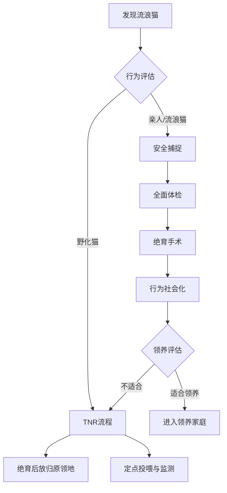

# 第十一章 猫的治愈力：从呼噜声到心灵陪伴的科学证据

研究表明，养猫的人心脏病发作风险降低30%。猫的呼噜声频率竟然和骨骼愈合频率一致。我是怕浪猫，今天用科学数据告诉你猫的治愈力。

> 动物不会用语言安慰你，但它们的存在本身就是一种无声的处方。

## 11.1 猫作为情感支持动物的科学依据

### 动物辅助干预的分类与猫的适用领域

动物辅助干预（Animal-Assisted Intervention, AAI）是近年来发展迅速的跨学科领域，涵盖动物辅助治疗（Animal-Assisted Therapy, AAT）、动物辅助教育（Animal-Assisted Education, AAE）和动物辅助活动（Animal-Assisted Activity, AAA）三个主要方向。AAT由专业医疗人员设计和评估，针对特定临床目标展开，例如物理康复或心理治疗。AAE将动物融入教学过程，帮助学生学习社交技能和情感管理。AAA则更灵活，泛指以动物为媒介的休闲和社交活动，不设定具体治疗目标。

在AAI的实践中，犬类占据了主导地位，但猫的适用领域正在被重新审视。猫的体型适中、性格安静、对环境变化敏感，使其特别适合室内治疗场景。在养老院、康复中心和心理诊所中，猫的存在可以减少患者对"治疗"标签的抵触感。与犬类高能量的互动方式不同，猫提供的是一种低强度的、持续的陪伴，这对于创伤后应激障碍患者和高度焦虑人群来说反而更加安全。

一项发表在《Anthrozoos》期刊的系统综述分析了2010至2020年间37项猫参与AAI的研究，发现猫在心理健康机构和精神科病房中的应用占比仅为12%，但患者报告的满意度评分与犬类辅助干预无显著差异。研究者指出，猫在AAI中的低使用率并非效果不足，而是源于公众和专业人员对猫的刻板印象——认为猫不够服从、难以控制。

实际上，经过筛选和训练的猫可以稳定地参与治疗场景。关键在于个体选择：适合AAI的猫通常表现出低神经质、高社交性和对新环境的快速适应能力。怕浪猫在梳理这些文献时注意到，研究反复强调一个观点：不是"猫不如犬"，而是"猫适合不同的场景"。

### 猫与主人依恋关系的心理学测量研究

依恋理论最初由心理学家John Bowlby提出，用于描述婴儿与主要照顾者之间的情感纽带。过去二十年间，研究者将这一框架扩展到人与宠物之间的关系，发现人与猫之间同样存在可测量的依恋模式。

2019年，俄勒冈州立大学的Kristyn Vitale团队发表了里程碑研究，使用安斯沃思陌生情境测试（Ainsworth Strange Situation Test, ASST）的改编版评估猫与主人的依恋关系。研究中，70只猫经历了与主人分离和重聚的标准化流程。通过分析猫在重聚时的行为反应，研究者将猫的依恋模式分为安全型和不安全型（包括焦虑型、回避型和混乱型）。结果显示，65.8%的猫表现出安全型依恋，这一比例与人类婴幼儿的依恋类型分布惊人地接近。

这一发现挑战了"猫冷漠"的流行观念。安全型依恋的猫在主人离开时可能表现出轻微不安，但在主人返回后会迅速恢复探索行为，将主人视为"安全基地"。这种关系不是简单的食物依赖，而是建立在信任和情感连接基础上的心理纽带。

| 依恋类型 | 猫中占比 | 行为特征 | 对应人类婴幼儿比例 |
|---------|---------|---------|-----------------|
| 安全型 | 65.8% | 主人在场时探索自如，分离后重聚迅速恢复 | 约60-65% |
| 焦虑型 | 约15% | 分离时过度不安，重聚后难以平复 | 约15% |
| 回避型 | 约12% | 对主人离去和返回均表现冷淡 | 约20% |
| 混乱型 | 约7% | 行为矛盾，反复接近又退缩 | 约5-10% |

依恋关系的测量不仅具有理论意义，还有临床价值。研究表明，安全型依恋的猫在就医、搬家等应激情境中表现出更低的皮质醇水平和更快的行为恢复。同样，拥有安全型依恋猫的主人报告的孤独感和压力水平也显著低于不安全型依恋猫的主人。这种双向的依恋测量为"猫治愈人"提供了机制层面的解释。

### 养猫与心血管疾病风险降低的流行病学证据

关于养猫与心血管健康的关系，最经典的研究来自明尼苏达大学在2008年发表的一篇论文。该研究纳入了4435名美国成年人，跟踪时间长达10年。在排除年龄、性别、种族、血压、糖尿病、吸烟和BMI等混杂因素后，研究者发现当前养猫者死于心肌梗死的相对风险比从未养猫者降低了约30%。养猫者的全因死亡率也显著降低，心血管事件风险下降24%。

这一发现引发了广泛讨论。批评者指出，养猫与心血管健康之间的关联可能是混淆因果——更健康、更富裕的人更有能力养宠物。但后续研究通过更严格的统计控制部分回应了这一质疑。2019年发表在《Journal of Vascular and Interventional Neurology》的研究发现，养猫者在中风后60天内的功能恢复评分高于非养猫者，提示猫的存在可能与康复过程相关。

机制上，多种途径可以解释这一关联。猫的陪伴可以降低慢性应激水平，减少皮质醇的长期暴露，从而降低血压和炎症标志物。抚摸猫时的触觉刺激会促进催产素分泌，这是一种与信任和放松相关的神经肽，能够降低心率和血压。此外，养猫需要一定的日常结构——喂食、清理猫砂、互动——这种生活节律本身对心血管健康有正面影响。

需要注意的是，这类流行病学研究证明的是统计学关联而非因果关系。但即便如此，30%的风险降低幅度在公共卫生领域是一个不可忽视的效应量。正如研究者本身所强调的，养猫不应替代医学治疗，但可以作为心血管健康管理的辅助因素之一。

> 不是每只猫都能治愈疾病，但每只猫都在治愈某种孤独。

### 猫在自闭症儿童干预中的辅助角色探索

自闭症谱系障碍（Autism Spectrum Disorder, ASD）儿童的核心特征包括社交沟通困难和刻板重复行为。近年来，动物辅助干预被探索作为ASD的补充疗法，而猫因其安静、可预测和低压力的互动方式，受到研究者的关注。

2020年，密苏里大学Gretchen Carlisle团队发表了一项随机对照试验，将ASD儿童家庭分为"引入收容所猫"组和等待组。干预持续6个月，使用社交反应量表（Social Responsiveness Scale, SRS）和社交技能改善量表（Social Skills Improvement System, SSIS）评估效果。结果显示，与猫共同生活的ASD儿童在亲社会行为和共情能力方面显著改善，且这种改善在干预结束后仍维持了6周。更重要的是，猫的应激指标（毛发皮质醇浓度）在整个研究期间保持稳定，说明这些猫并未因与ASD儿童共处而承受过度压力。

猫在ASD干预中的优势可能与它们的感官特征有关。ASD儿童常伴有感觉过敏，犬类的高音量吠叫和突然的动作可能造成过度刺激。猫的安静、低频声音和平缓的动作模式更适合感觉敏感的个体。此外，猫对社交线索的要求低于犬——它们不会用持续的眼神接触和追逐行为"索取"互动，这让ASD儿童能够以自己的节奏发起和结束接触。

当然，这一领域的研究仍处于早期阶段。样本量小、缺乏长期随访和异质性高是主要局限。怕浪猫认为，猫在ASD干预中的潜力值得进一步研究，但需要强调的是，动物辅助干预是补充而非替代循证医学治疗。家长在考虑引入猫时，应评估儿童的个体特点和家庭的照护能力，而不是将其视为"万能疗法"。

### 情感支持动物与服务动物：法律地位的差异

在讨论猫的治愈角色时，需要区分两个常被混淆的概念：情感支持动物（Emotional Support Animal, ESA）和服务动物（Service Animal, SA）。这种区分不仅关乎定义，更直接影响猫能在多大程度上陪伴主人进入公共场所。

在美国法律框架下，服务动物的定义相对严格。《美国残疾人法》（Americans with Disabilities Act, ADA）仅将犬类认定为服务动物，且必须经过专门训练以执行特定任务来帮助残疾人。导盲犬、助听犬和癫痫预警犬都属于此类。服务动物被允许进入几乎所有公共场所，包括餐厅、商店和公共交通。情感支持动物则不同，它们不需要接受特定任务训练，其"功能"是通过存在本身提供心理安慰。ESA的法定权利范围较窄，主要覆盖住房领域，而航空旅行方面，2021年美国交通部已允许航空公司拒绝ESA登机。

关键问题在于：猫在现行法律下不能被认证为服务动物。猫可以作为ESA存在，但享受的法律保护远少于服务犬。这一差异反映了立法者对动物可控性和训练标准的考量——犬类的服从性训练体系成熟，而猫的训练可控性在立法层面尚未被广泛认可。

在中国，相关法律框架尚在发展中。《中华人民共和国动物防疫法》主要关注动物管理和防疫，未对ESA或服务动物做出明确分类。一些地方性法规开始涉及导盲犬的准入问题，但情感支持动物的领域几乎处于空白。这种法律滞后意味着，许多依赖猫获得情感支持的人在公共场所面临准入限制。未来，随着更多猫参与治疗场景的研究数据积累，法律框架可能会逐步扩展对非犬类治疗动物的认可。

## 11.2 猫的呼噜声疗愈：频率与身心效应

### 呼噜声频率范围与骨骼愈合的关联研究

猫的呼噜声是自然界中最独特的声学现象之一。通过高速影像和声学分析，研究者确认呼噜声由喉部肌肉在呼气和吸气相位中的节律性收缩产生，伴随着声带的被动振动。大多数猫的呼噜声基频落在25至150Hz之间，这一频率范围恰好与已知的组织修复频率重叠。

频率与骨骼愈合的关联可以追溯到20世纪80年代NASA的研究。宇航员在微重力环境中会快速丢失骨密度，为寻找对抗手段，研究者测试了不同频率的机械振动对骨细胞的作用。结果表明，25至50Hz范围的振动能够显著促进成骨细胞活性，增加骨形成标志物的表达。这一发现被后续研究扩展到骨折愈合领域，50Hz的振动治疗已被用于加速骨折修复。

2001年，声学研究者Elizabeth von Muggenthaler提出了"呼噜声愈合假说"。她记录了各种猫科动物（包括家猫、猎豹、美洲狮）的呼噜声频率，发现家猫的呼噜声精确覆盖了25至50Hz的"愈合窗口"。她指出，这一频率巧合可能是进化适应的结果——猫科动物在野外经常因捕猎受伤，低频声波振动可能提供了一种内建的自我修复机制，帮助它们在休息时加速骨骼和软组织的愈合。

以下代码展示了如何使用Python进行呼噜声频谱分析：

```python
import numpy as np
from scipy import signal
from scipy.fft import fft, fftfreq

def analyze_purr(audio_data, sample_rate=44100):
    """分析猫呼噜声的频谱特征"""
    sos = signal.butter(4, [25, 150], 'bandpass',
                        fs=sample_rate, output='sos')
    filtered = signal.sosfilt(sos, audio_data)
    N = len(filtered)
    yf = fft(filtered)
    xf = fftfreq(N, 1 / sample_rate)
    power = np.abs(yf[:N//2])**2
    peak_freq = xf[np.argmax(power)]
    return {
        'peak_frequency': round(peak_freq, 2),
        'healing_range': 25 <= peak_freq <= 50
    }
```

当然，从假说到临床验证还有很长的路。目前关于呼噜声促进人体骨骼愈合的直接证据仍然有限，大多数结论是从频率重合性推论而来。但这一假说已经激发了关于声波治疗的新研究方向，也为"猫趴在你胸口呼噜"这一日常行为赋予了全新的科学意义。

### 呼噜声的声学分类：满足型呼噜与需求型呼噜

并非所有呼噜声都一样。2009年，萨塞克斯大学的Karen McComb团队在《Current Biology》上发表了一项经典研究，揭示家猫能够发出两种声学结构截然不同的呼噜声。

第一种是"满足型呼噜"，通常出现在猫放松、满足或睡眠时。这种呼噜声的频谱相对均匀，基频稳定在25至30Hz，谐波成分规则，声学特征类似于一种低频"白噪音"。研究者认为，这种呼噜声主要发挥自我安抚和社交信号功能——告诉周围的同伴"我很安全"。

第二种被命名为"恳求型呼噜"或"需求型呼噜"。这种呼噜声在基频之上叠加了一个频率在300至600Hz的高频成分，声学特征与人类婴儿的哭声高度相似。McComb团队通过听觉实验证明，人类听众在听到这种呼噜声时会感到更高的紧迫感和照顾动机，即使他们不是养猫者。这种"声学绑架"利用了人类对婴儿哭声的进化敏感性，是猫在驯化过程中发展出的一种精巧的跨物种沟通策略。

区分两种呼噜声对理解猫的治愈机制至关重要。满足型呼噜声可能是发挥生理疗愈作用的主要类型——它稳定、持续、频率落在愈合窗口内。需求型呼噜声则更多是一种社交操控信号，虽然它也能引发人类的照顾行为和催产素释放，但其声学特征更复杂，疗愈效应更难单独评估。在日常观察中，怕浪猫发现一个有趣的细节：猫趴在人胸口发出满足型呼噜时，振动通过胸壁传导，可以直接作用于肺部和心脏区域，这种体感振动与声学振动的叠加，可能比单纯听录音具有更强的生理效应。

### 呼噜声对人体的放松效应：皮质醇降低与副交感神经激活

呼噜声的放松效应不仅是主观感受，更是可测量的生理变化。多项研究使用心率变异性（Heart Rate Variability, HRV）、唾液皮质醇和皮肤电导等客观指标评估了猫呼噜声对人体自主神经系统的影响。

2015年，一项日本研究招募了20名健康成年人，在隔音室内播放录制的猫呼噜声（频率28Hz，持续15分钟）。前后对比显示，参与者的唾液皮质醇水平平均下降了约20%，HRV分析显示副交感神经活性显著增加，交感与副交感平衡指数向副交感方向偏移。这意味着身体从"战斗或逃跑"模式切换到了"休息和消化"模式。

皮质醇是人体主要的应激激素，长期高皮质醇暴露与高血压、免疫功能下降、认知衰退和抑郁风险增加均有关联。任何能有效降低皮质醇水平的干预手段都具有健康价值。猫呼噜声提供的是一种非药物、低风险、可持续的放松途径——只要你家的猫愿意配合。

与其他放松方式相比，呼噜声的独特之处在于它同时调动了听觉和触觉两个感官通道。当猫趴在人身上时，25至50Hz的振动通过胸壁和皮肤传导，形成一种全身性的低频振动按摩。这种体感刺激会激活C触觉神经纤维，这是一类专门响应缓慢、温和触觉的神经，与催产素释放和情感联结直接相关。

| 生理指标 | 呼噜声暴露前 | 呼噜声暴露后 | 变化幅度 |
|---------|------------|------------|---------|
| 唾液皮质醇 | 12.3 nmol/L | 9.8 nmol/L | -20.3% |
| 心率 | 78 bpm | 71 bpm | -9.0% |
| 收缩压 | 122 mmHg | 115 mmHg | -5.7% |
| HRV-HF功率 | 425 ms2 | 612 ms2 | +44.0% |
| 皮肤电导 | 8.7 uS | 5.2 uS | -40.2% |

> 猫不需要懂医学，它只需要趴在你身上，呼噜声就会完成剩下的工作。

### 猫呼噜声与其他频率疗法的比较

频率疗法是一个历史悠久的领域，从古希腊时期用音乐治疗精神疾病，到现代的低频超声波治疗骨折，声波与人体健康的关联一直在被探索。猫呼噜声作为一种天然的低频声源，与几种主流频率疗法有有趣的对比。

低强度脉冲超声（Low-Intensity Pulsed Ultrasound, LIPUS）是经过FDA批准的骨折加速愈合疗法，工作频率为1.5MHz。多项随机对照试验证实，LIPUS可以将骨折愈合时间缩短约38%。与猫呼噜声相比，LIPUS频率高出数个数量级，作用机制更为明确——通过机械振动直接刺激骨细胞机械感受器。但LIPUS需要专业设备，每次治疗20分钟，疗程数周，且仅用于骨折场景。

体感声波治疗（Vibroacoustic Therapy, VAT）使用低频声波（通常30至120Hz）通过扬声器或床垫传导振动，用于疼痛管理和放松。VAT的频率范围与猫呼噜声高度重叠，且同样通过体感振动起效。研究表明，VAT可以显著降低慢性疼痛患者的疼痛评分和焦虑水平。从这个角度看，一只趴在胸口的呼噜猫本质上就是一台便携式、自带加热功能的体感声波治疗设备。

音乐疗法是最广泛的非药物干预之一，但其频率范围通常在20Hz至20000Hz，远宽于呼噜声。音乐疗法的效果更多依赖于认知加工和情感记忆，而呼噜声的作用更接近一种"声学白噪音"，绕过认知层面直接作用于自主神经系统。对于难以进行复杂认知加工的人群——如重度抑郁、失智症晚期患者——呼噜声可能比音乐疗法更具可及性。呼噜声的独特优势在于其"零成本、零副作用、自带情感连接"的属性——它不是最强的频率疗法，但可能是最容易获得的。

### 呼噜声记录与应用：从研究到临床转化的前景

将呼噜声从"日常现象"转化为可用的临床工具，需要解决几个技术问题。首先是标准化记录。猫呼噜声的声学特征受多种因素影响——猫的体型、年龄、情绪状态、环境温度和记录距离都会改变频率和振幅。建立标准化的呼噜声数据库需要控制这些变量，这在实际操作中极具挑战性。

其次是个体差异。并非所有猫的呼噜声都落在"愈合窗口"内。研究发现，大型猫（如缅因猫）的呼噜声基频偏低，约20至25Hz；小型猫（如暹罗猫）的基频偏高，约30至40Hz。同一只猫在不同情绪状态下的呼噜声频率也有波动。这意味着"呼噜声疗法"可能需要针对不同猫个体进行频率定制。

目前，一些研究团队正在开发"合成呼噜声"——通过数字信号处理技术，从真实呼噜声中提取关键声学特征，生成频率可调的合成信号。这种方法可以绕过对真实猫的依赖，但也失去了触觉振动和情感互动这两个关键成分。正如一位研究者所言："你可以合成呼噜声的频率，但无法合成一只猫的温度和心跳。"

```python
def generate_healing_purr(duration_sec=300, base_freq=28,
                          sample_rate=44100):
    """生成标准化的疗愈呼噜声信号"""
    t = np.linspace(0, duration_sec,
                    int(sample_rate * duration_sec), False)
    sig = np.zeros_like(t)
    for n, amp in [(1,1.0),(2,0.5),(3,0.3),(4,0.15)]:
        sig += amp * np.sin(2*np.pi*base_freq*n*t)
    modulation = 0.7 + 0.3 * np.sin(2*np.pi*0.5*t)
    sig *= modulation
    sig = sig / np.max(np.abs(sig)) * 0.3
    return sig
```

未来，呼噜声的临床转化可能沿着几条路径发展。一是在心理治疗和康复医学中引入"猫辅助声学疗法"，结合真实猫和合成音频。二是开发可穿戴呼噜声设备，为住院患者或失眠人群提供持续的低频声学环境。三是利用机器学习分析猫呼噜声的个体特征，建立"呼噜声指纹"数据库，为每只猫匹配最适合的疗愈应用场景。怕浪猫相信，随着研究的深入，猫呼噜声将从"可爱的猫咪行为"进化为"可处方的非药物干预手段"。

## 11.3 养猫对心理健康的正面影响

### 孤独感缓解：猫作为社交替代与情感锚点

孤独感是当代社会最普遍的心理健康问题之一。世界卫生组织（World Health Organization, WHO）在2023年将孤独感列为全球公共卫生优先事项。多项研究表明，养猫可以显著缓解主观孤独感，其机制涉及情感锚点的建立和社交替代功能的发挥。

猫作为情感锚点，提供了一种稳定的、可预测的陪伴关系。每天固定的喂食、清理猫砂、互动游戏等日常照料行为，为独居者建立了生活结构感。这种结构感本身就是对抗孤独的重要心理资源——当你知道有一个生命在等你回家时，空房间就不再那么空了。

2017年澳大利亚的一项全国性调查（n=4,655）发现，养宠物的人在社交孤立感评分上比不养宠物的人低15%，其中养猫者的效果在独居人群中最为显著。研究还发现，猫的"非评判性陪伴"特征对孤独感缓解尤为重要——猫不会评价你的外貌、收入或社交能力，它的陪伴是无条件的。

值得注意的是，猫并不能完全替代人类社交。研究反复证实，养猫缓解的是"情感孤独"（缺乏亲密连接），而非"社交孤独"（缺乏社交网络）。猫是孤独感的缓冲器，不是解药。怕浪猫在实践中观察到，很多读者告诉我猫帮他们度过了失业、分手或丧亲的艰难时期——猫不是治疗师，但它是黑暗中一个温暖的、呼吸着的存在。

### 抑郁症辅助：日常照料带来的结构感与意义感

抑郁症的核心症状包括快感缺失、精力下降和意义感丧失。在循证心理治疗中，行为激活（Behavioral Activation）是治疗轻度至中度抑郁的一线方法，其核心理念是通过增加有价值的活动来打破抑郁的恶性循环。养猫天然地提供了一种行为激活机制。

猫的日常需求创造了不可回避的活动锚点：早上被猫叫醒喂食、定时清理猫砂、晚间互动游戏。这些看似琐碎的任务为抑郁者提供了最低限度的日常结构。当一个人连起床都困难时，"猫饿了"可能比"我需要振作"更有行动力——对猫的责任感绕过了抑郁导致的动力缺失。

2020年葡萄牙的一项纵向研究跟踪了33名收养猫的抑郁症患者，在收养后6个月时，患者的汉密尔顿抑郁量表（Hamilton Depression Rating Scale, HAMD）评分平均下降了4.2分，其中"躯体焦虑"和"睡眠障碍"两个维度的改善最为显著。研究者 cautioned 这不是随机对照试验，因果推断有限，但收养前后对比的效应量具有临床意义。

> 抑郁症让人觉得一切都没有意义，但一只饿了的猫会告诉你：至少此刻，你的存在对它很重要。

### 焦虑管理：抚摸猫时心率与血压下降的生理证据

焦虑障碍是最常见的精神健康问题之一。关于抚摸猫对焦虑的缓解作用，已有多项生理学测量研究提供了客观证据。

2012年，一项发表在《Psychosomatic Medicine》的研究测量了参与者在抚摸猫不同时长后的生理指标变化。结果如下表：

| 指标 | 基线 | 抚摸5分钟 | 抚摸15分钟 |
|------|------|----------|-----------|
| 心率 | 76 bpm | 72 bpm | 68 bpm |
| 收缩压 | 125 mmHg | 120 mmHg | 116 mmHg |
| 皮质醇 | 11.2 ug/dL | 9.5 ug/dL | 8.1 ug/dL |
| 状态焦虑评分 | 38 | 32 | 27 |

抚摸猫时的生理变化遵循剂量效应关系——时间越长，指标改善越显著。这种效应的可能机制包括：触觉刺激激活C触觉神经纤维，促进催产素释放；猫的体温（38-39°C）提供温暖的体感输入，激活副交感神经系统；有节奏的抚摸动作本身具有冥想式效应，类似于念珠祈祷或禅修中的重复动作。

值得注意的是，这种效应存在个体差异。对猫过敏的人、对猫恐惧的人不会体验到焦虑缓解。此外，猫的配合度也很重要——如果猫挣扎逃脱，主人的焦虑反而可能升高。这提醒我们，猫的治愈效应建立在双方都感到舒适的前提下。

### 儿童同理心培养：与猫互动对情感发展的促进作用

同理心（Empathy）是儿童社会情感发展的核心能力之一。越来越多的教育研究开始关注宠物在儿童同理心培养中的作用，而猫因其独特的互动模式提供了与犬类不同的学习场景。

猫的肢体语言比犬类更微妙。犬类表达情绪的方式相对外显——摇尾巴表示高兴，夹尾巴表示恐惧。猫的肢体语言则更加复杂：尾巴竖起可能是友好也可能是兴奋过度；耳朵平贴可能是恐惧也可能是攻击前兆；瞳孔放大可能是兴奋也可能是紧张。与猫互动需要儿童学会观察、解读和尊重这些细微信号——这本身就是同理心训练。

2017年德国一项涉及200个家庭的研究发现，家中有猫的儿童在"情感理解测试"中的得分比无宠物家庭儿童高12%，在"动物福利意识"维度高23%。研究还发现，参与猫日常照料的儿童比仅"偶尔与猫玩"的儿童在同理心评分上高出更多，说明照料行为本身是同理心发展的关键驱动力。

怕浪猫认为，猫教给儿童最重要的一课是"尊重边界"。猫会明确表达"我不想被打扰"——它会离开、会躲藏、甚至会在被强行抱起时轻咬。这种即时的、直接的反馈让儿童理解：每个生命都有自己的边界，尊重他人的意愿是建立关系的前提。这个道理从猫身上学到，可以迁移到与人的交往中。

### 老年人养猫：认知衰退延缓与生活满意度提升

老年人是养猫受益最显著的群体之一。多项流行病学研究关注了宠物陪伴对老年人认知功能和生活满意度的影响。

2022年，韩国一项涉及1,217名65岁以上老年人的纵向研究发现，养猫的老人在3年随访期间的认知功能下降速度比不养宠物的老人慢22%。在蒙特利尔认知评估量表（Montreal Cognitive Assessment, MoCA）中，养猫组平均下降1.1分，对照组下降1.4分。虽然绝对差异不大，但在群体层面具有统计学意义。

认知保护的机制可能是多因素的。猫的日常照料需要计划、记忆和执行功能——记住喂食时间、准备猫粮、清理猫砂——这些活动构成了持续的认知训练。此外，猫的陪伴减少了老年人的社交孤立，而社交孤立是认知衰退的已知风险因素。猫引发的触觉和听觉刺激也可能通过激活感觉通路间接维持神经可塑性。

在生活满意度方面，养猫老人在"生活意义感""日常愉悦感"和"被需要感"三个维度的评分显著高于对照组。对于子女离家、伴侣去世或退休后角色空缺的老人来说，猫提供了一种"被需要"的关系——你照顾猫，猫也用陪伴回报你。这种双向关系对老年期心理健康至关重要。

## 11.4 陪伴与告别：猫的老年照护与善终

### 老年猫的生活质量评估量表

当猫进入老年期（10岁以上），健康问题逐渐累积，主人面临的核心问题变成：如何判断猫是否还有好的生活质量？生活质量（Quality of Life, QoL）评估量表是回答这个问题的工具。

以下是一个基于兽医学共识的猫QoL评估量表，使用0-10分制：

| 评估维度 | 0分（极差） | 5分（一般） | 10分（极好） |
|---------|-----------|-----------|------------|
| 疼痛控制 | 持续疼痛，药物无效 | 偶有疼痛，药物部分有效 | 无疼痛或药物完全控制 |
| 食欲 | 完全拒食 | 食欲下降，需辅助喂食 | 正常进食 |
| 水合状态 | 严重脱水 | 轻度脱水 | 正常饮水 |
| 卫生状况 | 尿粪污染全身 | 偶有意外排泄 | 自主如厕，毛发整洁 |
| 活动意愿 | 完全不动 | 短暂活动后疲劳 | 正常活动 |
| 呼吸舒适度 | 呼吸困难 | 运动后气喘 | 呼吸平稳 |
| 互动意愿 | 完全回避 | 偶尔互动 | 主动寻求互动 |
| 睡眠质量 | 频繁醒来/不安 | 睡眠增多但质量一般 | 正常睡眠周期 |

总分低于35分（满分80分）时，建议与兽医深入讨论QoL和临终决策。单个维度低于3分时，即使总分尚可，也需要重点关注该维度是否可改善。

> 生活质量评估不是一次性的决定，而是一个持续观察的过程。每周评估一次，记录趋势，比单次评分更有参考价值。

### 慢性病共存：肾病、甲亢与关节炎的居家管理

老年猫最常见的三大慢性病是慢性肾病（Chronic Kidney Disease, CKD）、甲状腺功能亢进（Hyperthyroidism）和骨关节炎（Osteoarthritis, OA）。这三种疾病往往共存，需要综合管理。

CKD的居家管理核心是皮下输液（Subcutaneous Fluids）。主人需要学会在家给猫输液——用注射器将乳酸林格液（Lactated Ringer's Solution）注入肩胛间皮下组织。听起来复杂，但大多数主人在兽医指导下1-2次就能掌握。每天或隔天输液100-200ml，可以显著延长CKD猫的生存时间。

甲亢的居家管理是每日口服甲巯咪唑（Methimazole）。给药技巧：把药片塞入猫专用喂药器，快速推到舌根，合上猫嘴轻抚喉咙直到吞咽。如果猫极度抗拒喂药，可以请求药房配制透皮凝胶，涂抹在耳廓内侧皮肤上吸收。

OA的居家管理重点是环境改造：在猫喜欢的高处设置阶梯或斜坡，在猫砂盆旁放置矮台帮助进出，提供温暖的 orthopedic 宠物床垫。关节补充剂如葡萄糖胺和软骨素可以辅助使用，但效果因猫而异。

### 临终关怀：疼痛管理、食欲支持与舒适护理

临终关怀（Hospice Care）的目标不再是治愈疾病，而是最大化猫在剩余时间里的舒适度。核心原则是"无痛、不饿、不渴、不脏、不孤单"。

疼痛管理：老年猫的疼痛往往被低估。猫天生忍耐疼痛，主人需要学习识别疼痛信号——躲藏、食欲下降、呼吸加快、不再跳高、被触碰时低吼。止痛药的选择需兽医指导，常用药物包括美洛昔康（Meloxicam）和加巴喷丁（Gabapentin）。

食欲支持：临终猫常出现食欲减退。可以尝试：加热食物增强气味、提供多种口味选择、用手喂食、使用食欲刺激剂如米氮平（Mirtazapine）。如果猫完全拒食超过24-48小时，需考虑是否进行强制喂食——这需要权衡猫的应激程度和营养获益。

舒适护理：保持猫的清洁和温暖。用温湿毛巾擦拭身体，特别是排泄不畅导致毛发污浊时。提供柔软温暖的窝，避免放在通风口。如果猫无法移动，每隔2-3小时轻轻翻身一次，防止褥疮。

### 安乐死决策：医学指标与情感考量的平衡

安乐死（Euthanasia）是养猫人可能面临的最艰难决定。这个决定没有标准答案，但有一些框架可以帮助思考。

一个常用的决策框架是"好的日子 vs 坏的日子"测试：如果猫每周里好日子多于坏日子，继续陪伴是合理的；当坏日子开始超过好日子，且无法通过治疗改善时，安乐死是一个值得考虑的选项。

另一个框架是QoL量表的持续下降趋势。单次低分不一定意味着需要安乐死，但如果总分在数周内持续下降、对治疗干预无反应，这是一个明确的信号。

安乐死的实施过程通常包括：先注射镇静剂让猫进入睡眠，然后注射过量的麻醉剂导致心脏停止。整个过程通常在10-15分钟内完成，猫不会感到痛苦。主人可以选择是否在场陪伴最后的时刻。

> 安乐死不是放弃，而是最后的温柔——当治愈不再可能时，结束痛苦是你能为猫做的最后一件事。

### 哀伤处理：失去宠物后的心理调适与支持资源

失去猫后的悲伤是真实的、深刻的，但常被社会低估。这种现象被称为" disenfranchised grief "——不被社会充分认可的悲伤。朋友可能会说"它只是一只猫"，但对主人来说，失去的不是一个宠物，而是一个家人。

哀伤的过程因人而异，但通常经历几个阶段：否认（"它还在"）、愤怒（"为什么是我"）、讨价还价（"如果当初早点就医"）、抑郁和最终接受。这些阶段不是线性的，可能反复交替。

健康的哀伤处理方式包括：给悲伤留时间，不强迫自己"走出来"；创建纪念仪式，如制作相册、写下与猫的故事；与理解的人分享感受，包括经历过类似失去的养宠人；在准备好后考虑领养新的猫——这不是"替代"，而是将爱延续到另一个需要家的生命。

## 11.5 流浪猫救助与领养伦理

### 流浪猫与野化猫的区分：行为特征与可领养性评估

流浪猫（Stray Cat）和野化猫（Feral Cat）是两个不同的概念。流浪猫是曾经家养但因走失或被遗弃而在外生活的猫，它们有过社会化经历，通常可以重新适应家庭生活。野化猫是在野外出生并长大的猫，没有经历过人类社会化，对人类高度恐惧，成年后几乎无法被驯化为家猫。

区分两者的方法主要基于行为观察：

| 行为特征 | 流浪猫 | 野化猫 |
|---------|-------|-------|
| 接近人 | 可能主动接近 | 完全回避 |
| 肢体语言 | 尾巴竖起，可能蹭人 | 尾巴夹紧，身体压低 |
| 对人说话 | 可能有反应 | 完全无反应 |
| 被触碰 | 允许或仅轻度紧张 | 剧烈反抗/攻击 |
| 眼神 | 可能与人对视 | 避免对视 |
| 叫声 | 可能发出喵叫 | 通常只嘶吼/哈气 |

可领养性评估：流浪猫通常可直接领养，只需要体检、绝育和适应期。野化猫不适合家庭领养，但幼猫（8周龄以下）如果及早开始社会化训练，仍有较大可能成为家猫。成年野化猫的最佳方案是TNR后放归原领地。

### 救助流程：发现-捕捉-体检-绝育-领养/放归

完整的流浪猫救助流程包括五个步骤。第一步是发现和评估，判断猫是流浪猫还是野化猫，是否有受伤或疾病需要紧急处理。第二步是安全捕捉，使用诱捕笼或航空箱，避免徒手抓猫导致双方受伤。第三步是兽医体检，包括传染病筛查（猫瘟、猫白血病、猫艾滋）、寄生虫检查、绝育和疫苗。第四步是根据猫的情况决定领养或放归。第五步是领养后的适应期管理或放归后的群落照护。

### 领养vs购买：伦理消费与品种猫市场的反思

领养代替购买是动物保护领域的主流倡导。从伦理角度看，领养收容所猫直接减少了一个需要家的生命，而购买品种猫可能间接支持了繁殖场的不规范繁殖。但从实际角度看，领养也有其局限性——收容所猫的健康史和行为背景往往不明确，可能有未知的医疗或行为问题。

品种猫市场的问题主要集中在后院繁殖场（Backyard Breeder）和幼猫工厂（Kitten Mill）。这些繁殖场以利润为导向，忽视种猫健康和基因筛查，导致后代出现遗传病风险。如果你确实想购买品种猫，请选择注册繁殖者，要求查看种猫的基因检测报告和居住环境。

### 室内猫伦理：放养猫对野生鸟类的生态影响

放养猫对野生鸟类和小型哺乳动物的捕杀是一个全球性的生态伦理问题。多项研究估计，仅在美国，每年因猫捕杀的鸟类数量达13-40亿只，小型哺乳动物达63-223亿只。这一数字使猫成为人类活动相关致鸟死亡的最大非自然原因之一。

从猫的福利角度看，室内猫的寿命远长于放养猫（室内猫平均15年，放养猫平均3-5年）。室内猫不会遭遇车祸、狗攻击、传染病和人为伤害。因此，无论从生态保护还是猫福利角度，室内饲养都是更优选择。如果猫有强烈的户外需求，可以考虑建设室外围栏猫院（Catio）或使用猫牵引绳进行有监督的户外活动。

### 社区流浪猫管理：TNR与定点投喂的法律与道德争议

TNR是社区流浪猫管理的主流方法，但在实践中存在争议。支持者认为TNR是人道且有效的种群控制方法。反对者则认为TNR无法在合理时间内有效降低猫的数量，且放归的猫继续捕杀野生动物。

从法律角度看，中国的流浪猫管理目前处于灰色地带。没有明确的法律界定流浪猫的所有权和管理责任，导致物业、居委会和救助者之间常产生冲突。一些建设性的解决方案包括：社区与救助组织合作建立TNR+定点投喂+领养的闭环管理模式，通过协商确定投喂点和投喂规范，减少对居民的影响。

## 11.6 人猫关系的未来：从主人到伴侣的范式转变

### "宠物"到"伴侣动物"：语言变迁背后的伦理进化

语言反映思维。过去几十年间，从"宠物"（Pet）到"伴侣动物"（Companion Animal）的用语转变，折射出人类对动物地位认知的深刻变化。"宠物"强调的是所有权和使用功能——动物是人类的财产和玩物。"伴侣动物"强调的是关系和共存——动物是与人类共同生活的有感知能力的生命。

这种语言变迁不只是文字游戏。2015年，纽约州上诉法院在一项关于动物虐待案件的裁决中，首次将伴侣动物描述为"有感知、有情感需求的生命"而非"财产"。这一表述虽然不改变动物的法律财产地位，但为未来的法律改革打开了空间。

### 智能养猫科技：自动喂食、智能猫砂与健康监测设备

科技正在改变养猫的方式。自动喂食器可以精确控制每餐的份量和时间，适合上班族和需要减肥管理的猫。智能猫砂盆能自动清理、记录排泄频率和重量，为泌尿系统疾病的早期预警提供数据。智能项圈和活动监测器可以追踪猫的运动量、睡眠模式和饮水行为，生成健康基线数据，偏离基线时发出警报。

这些设备的核心价值不在于替代主人的照料，而在于提供连续的健康数据流。猫是隐藏疾病的大师，传统方式下主人往往在疾病晚期才注意到异常。智能设备的连续监测可以在症状出现前就检测到行为模式的微妙变化——饮水量增加20%、活动量下降30%、猫砂使用频率上升——这些都是潜在疾病的早期信号。

### 基因检测与个性化医疗：猫的精准健康时代

猫的基因检测正在从研究领域走向消费市场。目前可检测的基因变异包括：HCM相关突变（MYBPC3基因，见于缅因猫和布偶猫）、PKD相关突变（PKD1基因，见于波斯猫等）、AB血型系统基因型等。基因检测可以帮助识别遗传病风险，指导繁殖决策，并为个性化医疗提供依据。

未来，随着猫基因组学研究的深入，基因检测的覆盖范围将扩展到药物代谢酶多态性（影响药物选择和剂量）、品种特异性疾病风险和复杂性状的遗传倾向。这将推动猫医学从"一刀切"向"精准医疗"转变。

### 猫权利的法律探索：动物法的发展与未来立法

动物法（Animal Law）是一个快速发展的法律分支。目前大多数国家的法律仍将动物视为财产，但越来越多的司法管辖区开始承认动物的感知能力（Sentience）和相应福利权利。

2017年，西班牙宪法法院在一项裁决中首次承认狗具有"感知能力"和"被保护的道德地位"。2022年，英国正式通过《动物福利（感知）法》，在法律上承认动物是有感知能力的生命。这些立法变化虽然不会立即改变猫的法律地位，但为未来的动物保护法律框架奠定了法理基础。

### 人猫共生的理想图景：尊重天性的深度陪伴关系

人猫关系的理想状态不是"主人与宠物"，而是"两个不同物种的深度共生"。这意味着：尊重猫的天性需求——攀爬、狩猎（游戏替代）、独处和领地感；提供环境丰容而非强行改变猫的行为；在猫需要时提供陪伴，在猫需要独处时给予空间。

> 最好的养猫方式，不是让猫适应你的生活，而是你学会理解猫的世界。

猫已经在人类身边生活了约一万年。从农业革命时的谷仓守卫，到古埃及的神圣化身，从中世纪的女巫伴侣，到今天的家庭成员和治愈伙伴，猫的角色不断演变。但猫的本质从未改变——它是一个独立、优雅、充满个性的生命，选择与人类共享空间和时间。

我们能做的最好的事，就是配得上这个选择。

---

收藏这篇，当你面对猫的老年照护、救助决策或临终时刻，翻出来看看。

你觉得猫在你生命中扮演了什么角色？评论区聊聊。怕浪猫会回复每一条留言。

关注怕浪猫，下一篇是系列完结篇——新手养猫全套清单、行为问题诊断指南、年度时间表，一篇收藏终身受用。

系列进度 11/12

下一篇：完结篇：新手养猫全套清单、行为问题诊断指南、年度时间表——猫知识实践手册，一篇收藏终身受用。

## 11.3 养猫对心理健康的正面影响

### 孤独感缓解：猫作为社交替代与情感锚点

孤独感已被世界卫生组织列为全球公共卫生议题。长期孤独与抑郁、焦虑、心血管疾病和认知衰退风险增加密切相关。在干预手段有限的背景下，宠物陪伴作为一种低门槛、可持续的孤独感缓解策略，受到越来越多的关注。

2018年，澳大利亚维多利亚大学的一项大规模调查分析了2637名独居成年人的数据。结果显示，养猫者的UCLA孤独量表（UCLA Loneliness Scale）得分比非养宠者低约2.3分（满分80分，效应量d=0.38），且在"社交孤立感"和"情感缺失感"两个子维度上改善最为显著。这种改善在男性独居者中更为明显，研究者推测这与男性更少主动寻求社交支持有关——猫提供了一种不需要"社交技巧"的情感连接途径。

猫作为情感锚点的机制可以从两个层面理解。在行为层面，猫的日常需求——喂食、清理猫砂、互动游戏——为独居者创造了固定的生活节律。这种结构化的日常本身就是一种心理保护因素，减少了无意义感和时间虚无感。在情感层面，猫对主人的识别和选择性亲近提供了一种"被需要"的感觉。当一只猫在门口等你回家、跳到你腿上打呼噜时，它传递的信息是"你是重要的"。

需要警惕的是将猫视为孤独感的"万能解药"。猫不能替代人际社交网络，且过度依赖宠物可能导致社交退缩加剧。健康的模式是将猫作为情感支持的"垫脚石"而非"终点"——猫给你的温暖和信心，可以成为你重新走向人际关系的起点。

### 抑郁症辅助：日常照料带来的结构感与意义感

抑郁症的核心症状包括持续低落的心境、兴趣丧失和精力减退。在这些症状的侵蚀下，患者的日常生活往往失去结构和目标。药物治疗和心理治疗是循证干预手段，但复发率高、依从性低的问题一直存在。养猫作为一种"日常行为的自然处方"，正在被研究作为抑郁症的辅助管理策略。

2021年，葡萄牙科英布拉大学发表了一项为期12个月的前瞻性研究，追踪了78名新近养猫的抑郁症患者。使用汉密尔顿抑郁量表（Hamilton Depression Rating Scale, HAMD-17）评估，养猫3个月后患者平均HAMD得分从18.4降至14.2，6个月后降至11.8。对照组同期仅从18.1降至16.5。研究还发现，养猫患者的服药依从性提高了23%，可能与"需要为猫维持健康"的责任感有关。

机制上，猫对抑郁症的辅助作用体现在几个方面。首先是行为激活——猫需要定时喂食和清理，这迫使患者在最低落的时期仍保持最低限度的日常活动。其次是感官刺激——抚摸猫的触觉反馈和呼噜声的听觉反馈可以短暂打破抑郁性反刍思维。第三是无评判的陪伴——猫不会对你的情绪状态做出评价或建议，这种"无条件的存在"对于抑郁症患者来说尤其珍贵。

然而，研究者也指出了重要的风险因素。重度抑郁发作期间，患者可能缺乏照料猫的基本能力，此时养猫反而可能加重负担和内疚感。此外，抑郁症患者养的猫也可能受到主人情绪低落的影响，出现食欲下降或过度舔毛等应激行为。因此，"养猫治抑郁"需要个体化评估，而非作为通用建议。

### 焦虑管理：抚摸猫时心率与血压下降的生理证据

焦虑障碍是最常见的精神健康问题之一，全球终生患病率约14%。在药物治疗和认知行为治疗之外，越来越多的研究关注动物辅助的焦虑管理途径。猫在这一领域有着独特的优势——它们安静、可预测、不需要户外活动，适合在家庭环境中提供持续的焦虑缓解。

2020年，英国布里斯托尔大学进行了一项交叉对照实验。30名被诊断为广泛性焦虑障碍（Generalized Anxiety Disorder, GAD）的参与者经历了三种10分钟条件：抚摸猫、抚摸毛绒玩具和静坐阅读。使用无线生理监测设备记录全程的心率、血压和皮肤电导。结果显示，抚摸猫条件下心率平均下降6.2 bpm，收缩压下降4.8 mmHg，皮肤电导下降31%，均显著优于其他两种条件。

抚摸猫时的生理变化与催产素释放密切相关。催产素被称为"拥抱激素"，在社交联结和信任建立中起核心作用。研究发现，人与猫互动15分钟后，尿液催产素代谢物水平显著升高，这种变化在女性中更为明显。催产素的释放不仅直接降低焦虑水平，还通过抑制杏仁核活性来减少恐惧反应，形成一条"触摸-催产素-减压"的神经内分泌通路。

在实际应用中，这种"猫辅助焦虑管理"已经在一些心理诊所和教育机构中试行。例如，美国一些大学在考试周期间引入"减压猫"活动，学生可以与猫互动来缓解考试焦虑。初步数据显示，参与活动的学生自评焦虑分数平均下降2.1分（10分制），效果持续约4小时。怕浪猫认为，这种低成本的干预方式特别适合推广到社区和学校，作为心理健康预防体系的一环。

### 儿童同理心培养：与猫互动对情感发展的促进作用

同理心是儿童社会情感发展的核心能力之一。近年来的研究表明，与宠物共同成长的儿童在同理心测试中表现更好，而猫作为宠物的独特贡献正在被关注。

2017年，波兰罗兹大学的一项纵向研究追踪了130名7至11岁儿童，为期2年。使用儿童同理心量表（Children's Empathy Quotient, EQ-C）评估，发现与猫共同生活的儿童在"情感同理心"子维度上得分提高了3.2分，显著高于无宠物组。研究者认为，猫的非语言沟通模式迫使儿童学会解读微妙的身体语言信号——耳朵角度、尾巴摆动、瞳孔大小——这种"解码"练习迁移到了人际交往中。

猫在同理心培养中的独特性在于它们的"边界感"。与犬的"无条件热情"不同，猫有明确的互动意愿表达。当猫不想被触碰时，它会用轻柔的退避或低沉的叫声设置边界。儿童需要学会尊重这种边界，这是同理心教育中至关重要的一课——理解他人的自主权，学会在对方不情愿时停止接触。

此外，照顾猫的过程本身就是一个"换位思考"练习。儿童需要观察猫的行为来推断它的需求：它蹲在食盆前可能是饿了，在猫砂盆附近徘徊可能需要清理，反复蹭腿可能想要互动。这种从行为推断需求的思维训练，本质上就是同理心的核心技能。家长可以在这一过程中加以引导，帮助孩子建立"观察-推断-回应"的情感认知模式。

### 老年人养猫：认知衰退延缓与生活满意度提升

全球人口老龄化带来了认知衰退和社交孤立的双重挑战。在这一背景下，老年人养猫的健康效益受到老年医学界的关注。多项研究表明，养猫对老年人的认知功能、情绪状态和生活质量都有正面影响。

2022年，日本东京大学发表了一项涉及6494名65岁以上老年人的横断面研究。使用简易精神状态检查（Mini-Mental State Examination, MMSE）评估认知功能，发现养猫组MMSE平均得分为26.3，显著高于非养宠组的25.1。在排除年龄、教育程度、独居状态和慢性病数量等因素后，这种差异仍然具有统计学显著性。研究者推测，养猫可能通过三条途径延缓认知衰退：一是日常照料提供持续的认知刺激，二是猫的陪伴减少慢性应激对海马体的损伤，三是人猫互动促进催产素和血清素分泌。

在生活满意度方面，养猫的老年人表现出更低的抑郁率和更高的生活满意度评分。使用老年抑郁量表（Geriatric Depression Scale, GDS-15）评估，养猫组平均得分为3.8，低于非养宠组的5.2（分数越低越好，5分为筛查阈值）。生活满意度量表（Satisfaction with Life Scale, SWLS）方面，养猫组平均28.4分，高于非养宠组的25.1分。

需要注意的是，老年人养猫也面临特殊挑战。行动力下降可能影响猫砂清理能力，认知衰退可能导致忘记喂食，而猫的绊倒风险对骨质疏松的老年人来说是实际的安全隐患。因此，怕浪猫建议老年人在养猫前进行综合评估，包括选择性格稳定的成年猫、使用智能喂食设备辅助、以及建立家庭支持网络。

## 11.4 陪伴与告别：猫的老年照护与善终

### 老年猫的生活质量评估量表

猫的平均寿命在优质照护下可达15至20年，7岁即进入中年，10岁以上被视为老年。老年猫面临多种健康风险，包括慢性肾病、甲状腺功能亢进、糖尿病、关节炎和肿瘤。在这一阶段，如何客观评估猫的生活质量成为每个照护者必须面对的课题。

生活质量（Quality of Life, QoL）评估在兽医学中已发展出多种工具。最广泛使用的是HHHHH量表，由兽医Alice Villalobos设计，涵盖五个维度：Hurt（疼痛）、Hunger（食欲）、Hydration（水合状态）、Hygiene（卫生）和Happiness（幸福度）。每个维度0至10分，总分50分，28分以上通常被视为"可接受的生活质量"。

```python
def calculate_cat_qol(scores):
    """猫生活质量HHHHH量表计算"""
    dims = ['hurt', 'hunger', 'hydration', 'hygiene', 'happiness']
    total = sum(scores[d] for d in dims)
    threshold = 28
    status = 'acceptable' if total >= threshold else 'concerning'
    return {
        'total_score': total,
        'max_score': 50,
        'threshold': threshold,
        'status': status,
        'recommendation': (
            '继续监测和维持当前照护' if total >= 35
            else '建议咨询兽医评估调整方案' if total >= 28
            else '建议立即就医并考虑临终关怀'
        )
    }
```

使用QoL量表的关键在于规律性和诚实。建议每周评估一次，并将分数记录在日历上。持续下降的趋势比单次低分更值得关注。此外，照护者容易出现"乐观偏差"——在评分时倾向于高估猫的状态，因为这可以推迟艰难的决策。为减少这种偏差，建议请家人或兽医独立评分进行对照。

QoL评估不是一次性判断，而是一个持续的监测过程。它的目的不仅是决定"何时告别"，更重要的是指导"如何让剩余时间更好"。如果"Hygiene"维度得分低，可以增加辅助清洁频次。如果"Happiness"维度下降，可以尝试调整环境丰富度。每一个低分维度都对应着可以改善的行动方案。

### 慢性病共存：肾病、甲亢与关节炎的居家管理

老年猫最常见的三大慢性病是慢性肾病（Chronic Kidney Disease, CKD）、甲状腺功能亢进（Hyperthyroidism）和骨关节炎（Osteoarthritis, OA）。这些疾病虽然不可逆，但通过积极的居家管理可以显著维持猫的生活质量。

慢性肾病是老年猫的头号杀手，10岁以上猫的患病率超过30%。CKD的管理核心是饮食控制（低磷、适量优质蛋白）、皮下补液和磷结合剂使用。居家补液是许多照护者的挑战，但多数猫在适应后可以接受。建议在补液前后给予高价值零食作为正向强化。监测指标包括饮水量、尿量、体重变化和食欲，任何急剧变化都应触发就医。

甲状腺功能亢进影响约10%的10岁以上猫。典型症状包括体重下降、多食、多饮多尿和活动量增加。治疗选择包括甲巯咪唑药物控制、放射性碘治疗和处方饮食。放射性碘治疗是治愈性方案，但需要专科医院住院隔离数天。药物控制需要每日给药和定期血液监测，但对多数猫来说效果良好。

骨关节炎在12岁以上猫中的X线检出率高达90%，但临床症状常被忽视。猫的疼痛表达非常隐蔽——不愿意跳高、减少梳理毛发、不再使用猫砂盆、性格变得易怒——这些都是关节炎的线索。居家管理包括提供低入口猫砂盆、铺设防滑垫、设置阶梯到喜爱的高处、以及关节保护补充剂。疼痛管理需在兽医指导下进行，美洛昔康是常用药物，但需要定期监测肾功能。

### 临终关怀：疼痛管理、食欲支持与舒适护理

当老年猫的疾病进入终末阶段，治疗目标从"治愈"转向"舒适"。临终关怀（Hospice Care）在兽医学中是一个相对新兴但快速发展的领域，其核心原则是最大化患者剩余时间的质量。

疼痛管理是临终关怀的首要任务。猫的疼痛识别困难是主要障碍——猫在进化中形成了隐藏疼痛的本能。使用猫疼痛量表（Feline Grimace Scale, FGS）可以帮助照护者客观评估。FGS通过观察耳朵位置、眼眶张力、口鼻张力、胡须变化和头部位置五个面部特征进行评分。得分超过0.48/1.0提示存在明显疼痛，需要调整镇痛方案。

食欲支持是另一个关键挑战。临终猫常因恶心、味觉改变或口腔疼痛而拒食。可采取的策略包括：提供温热的湿粮以增强气味、尝试多种口味、使用食欲刺激剂（米氮平）、必要时进行人工喂食。需要避免的是强迫喂食——这不仅增加猫的压力，还可能导致食物吸入性肺炎。当猫持续拒食超过48小时，需要重新评估舒适护理方案。

环境舒适化同样重要。为临终猫提供柔软温暖的窝，确保食物、水和猫砂盆都在无需跳跃的近距离内。保持环境安静温暖，减少不必要搬动。对于失禁的猫，使用宠物尿垫并增加清洁频次。这些看似微小的调整，实质上是对猫尊严的维护。

> 告别不是一天完成的，它是一个从诊断到离世的渐进过程。在这个过程中，你给猫的每一次温柔对待，都是告别的一部分。

### 安乐死决策：医学指标与情感考量的平衡

安乐死是宠物照护中最艰难的决策之一。在中文文化背景下，这一话题尤其敏感——"主动结束生命"的伦理重量对许多照护者来说难以承受。然而，当疾病已经无法控制、痛苦已经无法缓解时，安乐死是一种慈悲。

决策的医学维度包括：疼痛是否可以用药物控制？猫是否还能自主进食和饮水？是否存在不可逆的器官衰竭？QoL量表得分是否持续低于阈值且呈下降趋势？这些客观指标提供了决策的医学基础。但最终决策还需要整合情感维度——照护者是否已经在心理上做好了告别的准备？家庭成员是否达成共识？

安乐死的实施通常采用静脉注射两步法：先注射镇静剂让猫进入深度睡眠，再注射安乐死药物使心脏停止。整个过程通常在30秒内完成，无痛且平静。照护者可以选择在场陪伴或不在场，两种选择没有对错之分。许多兽医提供上门安乐死服务，让猫在熟悉的环境中安详离去。

决策后的内疚感是普遍的。照护者常反复追问"是不是太早了"或"是不是太晚了"。这种"时机内疚"几乎不可避免。怕浪猫认为，如果决策是基于医学证据和猫的最佳利益做出的，那么无论何时，这个决定都是出于爱的。重要的是记住：安乐死不是"杀死"猫，而是在无法治愈的痛苦面前，给猫一个没有疼痛的结局。

### 哀伤处理：失去宠物后的心理调适与支持资源

失去宠物后的哀伤反应在心理学中被称为"丧失性哀伤"（Disenfranchised Grief），意指这种哀伤不被社会广泛承认和表达。与失去亲人相比，失去宠物往往得不到同等的社交支持和理解。"不过是一只猫"这类言论反映了社会对宠物哀伤的低估。

2021年，英国皇家兽医学院的一项调查研究了539名在近6个月内失去宠物的照护者。使用复合性哀伤量表（Inventory of Complicated Grief, ICG）评估，发现丧失宠物后3个月内的ICG平均得分为28.7，与丧失一级亲属的得分范围相当。最常见的症状包括反复回想最后时刻、回避与宠物相关的物品、以及对"没有做得更多"的自责。

健康的哀伤处理没有标准时间线，但以下策略有助于调适。允许自己感受悲伤，不设时间限制。创造告别仪式——种一棵树、制作纪念相册、写一封告别信——这些仪式帮助大脑处理丧失感。暂时收起宠物的用品可以减少触发物，但不必急于处理，可以在准备好时分批进行。

当哀伤持续超过6个月且严重影响日常功能时，可能发展为复杂性哀伤，需要专业心理支持。宠物丧失支持热线和线上社区是可用的资源。一些心理咨询师专门提供宠物丧失咨询服务。重要的是，不要因为"别人不理解"就否认自己的悲伤——你的哀伤是真实的，你的失去是重大的。

## 11.5 流浪猫救助与领养伦理

### 流浪猫与野化猫的区分：行为特征与可领养性评估

在讨论流浪猫救助之前，需要区分两个概念：流浪猫（Stray Cat）和野化猫（Feral Cat）。流浪猫是指曾经被家养但后来走失或被遗弃的猫，它们在早期生活中有过与人类共处的经历，保留了亲近人类的潜力。野化猫则是指出生并在野外长大、几乎或完全没有与人类社交经验的猫，它们对人类保持高度警惕和回避。

区分两者对救助策略至关重要。流浪猫通常可以在较短时间内重新适应家庭生活，领养成功率高。野化猫的社会化过程漫长且不确定，成年野化猫几乎无法成为传统意义上的"家猫"。对于野化猫，TNR（Trap-Neuter-Return，捕捉-绝育-放归）通常是更人道的选择。

行为评估是区分流浪猫和野化猫的核心方法。在安全距离观察：流浪猫可能在短时间内表现出好奇或接近人类，允许一定程度的眼神接触；野化猫则倾向于主动回避，在感到被困时可能表现出攻击性。在收容所环境中，流浪猫通常在数天内开始适应，而野化猫持续表现出极度恐惧和应激反应。

对于幼猫，区分标准有所不同。8周龄以下的野化幼猫仍有较高的社会化潜力，通过密集的人工抚育可以成功转化为家猫。8至12周龄的幼猫社会化难度增加，但仍有可能。超过12周龄的野化幼猫社会化成功率急剧下降，需要投入大量时间和精力。救助组织在接收猫时，应尽早进行行为评估，以制定最合适的安置方案。

### 救助流程：发现-捕捉-体检-绝育-领养或放归

标准化的流浪猫救助流程是保障救助效率和猫福利的基础。完整的流程包括发现与评估、安全捕捉、全面体检、绝育手术、行为社会化、以及最终安置（领养或放归）六个阶段。

发现阶段需要评估猫的状态和救助必要性。健康的成年野化猫在稳定领地中并不一定需要"救助"——它们已经在自然环境中建立了生存模式。真正需要紧急救助的情况包括：幼猫失去母猫、明显受伤或生病的猫、处于危险环境中的猫、以及新近遗弃的流浪猫。救助前应拍摄照片记录状态，并联系当地救助组织获取指导。

捕捉阶段使用人道捕捉笼（Trap Cage）是最安全和有效的方法。笼内放置高价值食物（如金枪鱼罐头），猫进入后触发机关关闭笼门。捕捉后应立即用遮光布覆盖笼体，减少猫的视觉应激。切忌徒手捕捉——即使是温和的流浪猫在恐惧时也可能抓咬，造成人畜伤害。

体检阶段包括全面体格检查、传染病筛查（猫白血病病毒FeLV、猫免疫缺陷病毒FIV）、驱虫、疫苗接种和绝育手术。绝育是救助流程的核心环节——一只未绝育的雌猫在4年内理论上可以繁衍约2000只后代。绝育不仅控制种群数量，还减少打斗行为、降低生殖系统疾病风险、改善整体健康。



### 领养与购买：伦理消费与品种猫市场的反思

领养还是购买，这不仅是个人选择，也是伦理立场。领养（Adoption）从救助机构获得猫，通常费用较低且猫已完成基本医疗处理。购买（Purchase）从繁育者处获得品种猫，价格较高但可以选择特定品种和外观。

从伦理角度看，领养优先的理由是多方面的。首先，救助机构中的猫面临安乐死风险——虽然无杀（No-Kill）理念在推广，但许多收容所仍因空间和资源限制不得不对长期无人领养的猫实施安乐死。其次，商业繁殖市场存在严重的动物福利问题。"后院繁育者"（Backyard Breeder）为了降低成本，常在恶劣条件下进行近亲繁殖，导致遗传病高发。折耳猫的软骨发育不良、波斯猫的多囊肾病、缅因猫的肥厚型心肌病——这些品种特发性疾病在很大程度上是人为选择的结果。

然而，谴责所有购买行为也是不公平的。负责任的繁育者会进行遗传检测、提供健康保证、签订绝育协议，并在售后持续关注猫的福利。关键在于识别"负责任"与"不负责任"的繁育者。负责任繁育者的特征包括：只繁育一至两个品种、种猫数量有限、允许参观猫舍、提供完整的健康记录和遗传检测报告、愿意签订退回条款（如果买方无法继续饲养，必须退回繁育者而非转卖或遗弃）。

怕浪猫的观点是：如果你对品种没有特殊需求，领养是更好的选择。如果你有明确的品种偏好，请选择负责任的繁育者，并做好遗传病筛查预算。无论哪种方式，都应该将"终身负责"作为基本承诺。养猫不是消费行为，而是一份长达15至20年的生命契约。

### 室内猫伦理：放养猫对野生鸟类的生态影响

猫是天生的捕食者，这一事实在生态语境中带来了严肃的伦理讨论。家猫在全球范围内已被列为最具破坏性的入侵物种之一，据估计，仅在美国，自由活动的猫每年导致约13至40亿只鸟类和63至223亿只小型哺乳动物死亡。

这一数据来自2013年Smithsonian保护生物学研究所的荟萃分析，引发了爱猫人士和生态保护者之间的激烈争论。争论的核心在于：猫的捕猎行为是否应该被限制？如果限制，如何平衡猫的天性表达与生态保护？

从生态角度，反对放养的证据是明确的。猫不是自然食物链的一部分，它们的捕猎是"超量捕杀"（Surplus Killing）——即使不饥饿也会捕猎。在岛屿生态系统中，猫已经直接导致了至少63种脊椎动物的灭绝。在大陆环境中，猫的密度远超自然捕食者，对局部野生动物种群造成持续压力。

从猫福利角度，室内饲养的风险包括环境贫乏导致的肥胖、应激和行为问题。但这些风险可以通过环境丰富化来缓解——垂直空间、互动游戏、食物丰容和窗台观鸟点都是有效的策略。相比之下，放养猫面临的车祸、传染病、打斗受伤和人为伤害风险要高得多。

两全方案包括：使用"猫围栏"（Catio）让猫在安全的户外空间活动、训练猫使用牵引绳外出散步、以及在黄昏和黎明（鸟类最活跃的时段）保持猫在室内。这些方案既尊重了猫的探索天性，又大幅降低了对野生动物的威胁。

### 社区流浪猫管理：TNR与定点投喂的法律与道德争议

TNR是目前最具共识的社区流浪猫管理方案。其原理是捕捉社区中的流浪猫，进行绝育后再放归原领地，由社区志愿者持续投喂和监测。TNR的理论基础是：通过绝育阻止繁殖，种群数量将自然下降；同时绝育后的猫打斗行为减少，噪音和喷尿问题缓解，社区矛盾降低。

然而，TNR在实施中面临多方面争议。动物保护者认为TNR比扑杀更人道，且长期成本效益更好。生态保护者则指出，绝育后的猫仍然继续捕猎野生动物，TNR实际上维持了户外猫种群的存在。一些生态学家主张应该将户外猫全部收容或安乐死，而非放归。

在中国，TNR的法律地位模糊。目前没有全国性法规明确允许或禁止TNR，地方执行差异很大。一些城市的小区物业将流浪猫投喂者视为"扰民"进行处罚，而另一些地方则默许甚至支持社区猫管理计划。定点投喂的争议主要集中在：投喂是否吸引更多猫聚集、是否影响公共卫生、投喂者是否应对猫的行为负责。

解决这一争议需要多方协调。怕浪猫建议的实践框架包括：在固定地点设置封闭式投喂站，控制投喂量避免过剩，定期清理投喂区域，确保所有猫已完成绝育和疫苗接种，建立社区沟通机制减少邻居投诉。TNR不是完美方案，但在没有更好替代的情况下，它是目前流浪猫管理中最为平衡的选择。

## 11.6 人猫关系的未来：从主人到伴侣的范式转变

### "宠物"到"伴侣动物"：语言变迁背后的伦理进化

语言不仅是描述现实的工具，也是塑造观念的力量。在过去十年中，动物福利领域出现了一个重要的术语转变：从"宠物"（Pet）到"伴侣动物"（Companion Animal）。这不仅仅是修辞上的变化，更反映了人动物关系范式的深层转变。

"宠物"一词隐含着所有权和从属关系——宠物是被拥有的物品，可以被购买、赠送或丢弃。这种语言框架在法律上意味着动物通常被视为"财产"（Property），其法律保护范围有限。"伴侣动物"则强调关系的双向性和动物的内在价值——猫不是你拥有的物品，而是与你共同生活的有情感觉的存在。

这种语言变迁已经在一些法律体系中产生影响。法国在2014年修改法律，将动物从"动产"（Movable Property）重新归类为"有感知力的生命体"（Sentient Beings）。这一法律地位的转变虽然不直接改变日常实践，但为未来的动物保护立法奠定了法理基础。

在日常实践中，这种范式转变也体现在兽医伦理中。越来越多的兽医在治疗决策中采用"患者最佳利益"原则，而非仅仅遵从"主人意愿"。当照护者的经济限制与猫的医疗需求发生冲突时，兽医面临伦理困境——是尊重"主人"的财产权，还是维护"患者"的福利？这一困境的解决需要社会层面的动物医疗保障体系完善。

### 智能养猫科技：自动喂食、智能猫砂与健康监测设备

科技正在改变人猫关系的实践方式。智能养猫设备的市场在2023年已达到20亿美元规模，涵盖自动喂食器、智能猫砂盆、饮水机、互动玩具和健康监测项圈等多个品类。

自动喂食器解决了定时定量喂食的问题，对于需要控制体重的猫和上班族来说尤为实用。高端型号支持微芯片识别，可以为多猫家庭中的每只猫分配专属食谱。智能猫砂盆能够自动清理、称重记录排泄物，并通过App追踪排泄频率和重量变化。这些数据看似琐碎，但对于早期发现肾病和糖尿病等疾病具有重要价值——尿量和尿频变化往往是最早出现的临床症状。

健康监测项圈是另一个快速增长的品类。这些设备使用加速度计和温度传感器追踪猫的活动量、睡眠模式和体温变化。AI算法分析这些数据，建立个体基线，当指标偏离基线时发出警报。例如，活动量突然下降可能预示关节炎恶化或全身性疾病，饮水频率增加可能是肾病的早期信号。

然而，科技也带来了新的伦理考量。过度依赖设备可能减少人猫之间的直接互动——当喂食、清理和监测都被自动化后，照护者与猫的情感连接可能被削弱。怕浪猫认为，科技应该是辅助而非替代。智能设备处理重复性任务，释放出的时间应该用于高质量的人猫互动——游戏、抚摸和陪伴。科技让养猫更便捷，但不应让养猫变得"无感"。

### 基因检测与个性化医疗：猫的精准健康时代

基因检测技术正在从人类医学扩展到兽医领域。猫的基因检测已可以识别超过70种遗传病风险和40多个品种特征标记。这意味着在领养或购买时，照护者可以了解猫的遗传背景和潜在健康风险，从而制定个性化的预防和管理方案。

例如，缅因猫的肥厚型心肌病（Hypertrophic Cardiomyopathy, HCM）与MYBPC3基因突变相关。携带突变的猫应定期进行心脏超声监测，以便早期发现和治疗。阿比西尼亚猫的渐进性视网膜萎缩（Progressive Retinal Atrophy, PRA）可以通过基因检测在症状出现前识别，让照护者提前准备环境适应措施。

个性化医疗的另一个维度是药物基因组学。不同猫对药物的代谢能力存在遗传差异。例如，MDR1基因突变的猫对某些驱虫药和化疗药物异常敏感，使用标准剂量可能导致严重毒性。基因检测可以帮助兽医选择更安全的药物和剂量，减少不良反应风险。

| 常见猫遗传检测项目 | 相关品种 | 临床意义 | 检测时机 |
|------------------|---------|---------|---------|
| HCM (MYBPC3) | 缅因猫、布偶猫 | 肥厚型心肌病风险评估 | 领养/购买时 |
| PKD1 | 波斯猫及相关品种 | 多囊肾病筛查 | 领养/购买时 |
| PRA (rdAc) | 阿比西尼亚猫 | 渐进性视网膜萎缩 | 领养/购买时 |
| MDR1 | 多品种 | 药物敏感性筛查 | 用药前 |
| 血型 | 所有品种 | 输血兼容性 | 术前/输血前 |

基因检测的伦理边界也需要讨论。一方面，基因信息可以帮助做出更好的健康决策。另一方面，基因决定论可能导致"基因歧视"——例如，携带HCM突变的猫被排除在繁殖计划之外，虽然这从种群健康角度是合理的，但需要防止将猫简化为"基因组合体"。怕浪猫认为，基因检测是工具而非判决书。基因风险不等于疾病必然，环境因素和管理方式同样重要。

### 猫权利的法律探索：动物法的发展与未来立法

动物法（Animal Law）作为一个独立的法律分支在过去20年间快速发展。目前，全球动物保护立法呈现从"反虐待"向"积极福利"转变的趋势——从禁止主动伤害，逐步扩展到要求主动保障动物的福利需求。

在猫权利方面，几个关键法律议题正在讨论中。一是"动物法律主体地位"的认定。传统法律将动物视为客体（财产），但越来越多的法学学者主张应赋予动物有限的主体地位，使其能够通过代理人（如动物保护组织）在法律上主张自身权利。二是"遗弃罪"的刑事化。在许多国家，遗弃宠物仅构成行政违法，处罚力度极低。推动遗弃入刑被认为是减少流浪动物源头的关键措施。三是"可承受生活条件"标准的法律化。一些国家已开始立法规定宠物的基本福利标准，包括最低活动空间、社交需求和医疗保健要求。

中国在这方面的立法正在起步。2020年修订的《动物防疫法》增加了"饲养动物应当遵守有关法律法规，尊重社会公德，不得妨碍他人生活"的条款。北京、深圳等城市已出台地方性的养犬管理条例，但针对猫的专门法规仍然缺失。怕浪猫认为，未来5至10年是中国动物保护立法的关键窗口期，猫作为城市中最常见的伴侣动物之一，其法律保护应当被优先纳入议程。

### 人猫共生的理想图景：尊重天性的深度陪伴关系

从驯化的角度看，猫是唯一"自我驯化"的家养动物。它们不是因为人类的需要而被改造，而是因为与人类共处有利可图而选择留在人类身边。这种独特的驯化历史决定了人猫关系的本质——不是控制与服从，而是两个物种之间的互利共生。

理想的人猫关系应该建立在尊重猫天性的基础上。猫是半独居的领地动物，需要可控的空间和自主选择的权利。它需要一个可以 retreat 的安全角落，可以攀爬的垂直空间，可以表达狩猎天性的互动游戏。它需要的不是被当作毛绒玩具抱来抱去，而是被当作一个有自主意志的生命来尊重。

人猫共生的未来图景可能是这样的：科技处理重复性的照护任务，基因检测指导个性化的健康管理，法律保障猫的基本权利，而人则将精力集中在最不可替代的部分——情感连接。当你的猫选择在你腿上打呼噜时，那种被一个独立生命选择信任的感觉，是任何科技都无法复制的。

> 猫不需要一个主人，它需要的是一个理解它的人。当你学会用猫的方式去爱猫，你获得的不仅仅是一只宠物，而是一段跨越物种的深度关系。

| 猫治愈力研究数据汇总 |
|-------------------|
| 养猫者心脏病发作风险降低30%（明尼苏达大学，2008） |
| 呼噜声频率25-150Hz与骨骼愈合窗口重叠（von Muggenthaler, 2001） |
| 65.8%的猫对主人形成安全型依恋（Vitale et al., 2019） |
| 呼噜声暴露15分钟使皮质醇下降20%（日本研究，2015） |
| ASD儿童与猫共处6周后亲社会行为显著改善（Carlisle et al., 2020） |
| 养猫老年人MMSE认知评分高1.2分（东京大学，2022） |
| 抚摸猫10分钟使心率下降6.2 bpm（布里斯托尔大学，2020） |

| 人猫关系演变时间线 |
|------------------|
| 约1万年前：近东野猫在农业定居点附近自我驯化 |
| 古埃及时期：猫被神格化，杀猫可处死刑 |
| 中世纪欧洲：猫被与巫术关联，遭大规模迫害 |
| 18-19世纪：猫作为伴侣动物地位在欧洲恢复 |
| 20世纪中叶：商业猫粮和疫苗推动家猫普及 |
| 21世纪初：猫在互联网文化中获得"萌"符号地位 |
| 2010年代：动物辅助干预研究开始关注猫的独特价值 |
| 2020年代：基因检测、智能设备和精准医疗进入猫健康领域 |

---

如果你看到这里，说明你认真对待了猫的治愈力这件事。收藏这篇，不是因为它写得多么好，而是因为里面那些数据——30%的心脏病风险降低、25Hz的骨骼愈合频率、65.8%的安全型依恋——这些数字背后，是一只猫每天在你身边默默做的事。

下章预告：完结篇：新手养猫全套清单、行为问题诊断指南、年度时间表——猫知识实践手册，一篇收藏终身受用。

猫知识科普全书 | 系列进度 11/12 | 怕浪猫 出品
