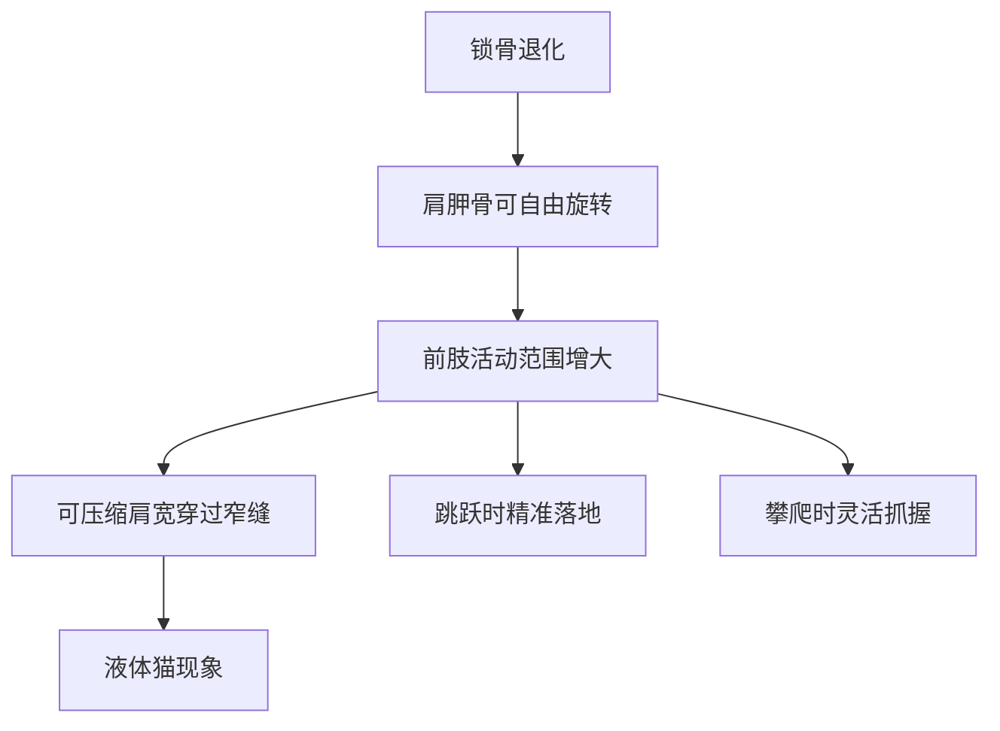
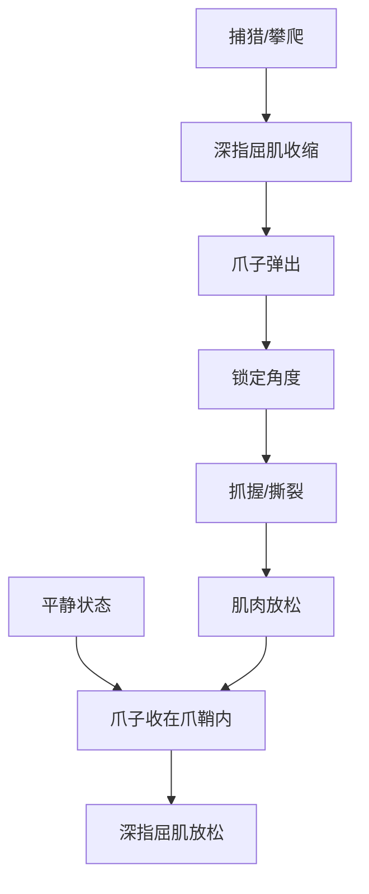
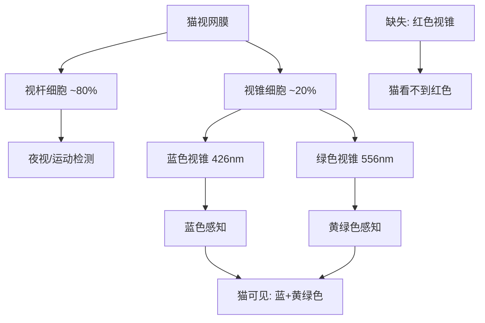
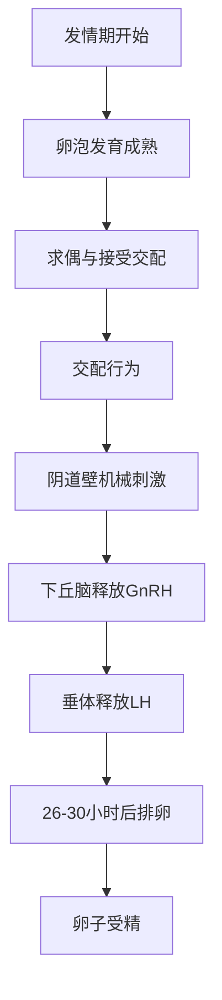

# 猫的生理结构密码：为什么猫是"液体"的

你以为猫是液体？其实它的秘密藏在退化的锁骨和53节脊椎骨里。我是怕浪猫，今天把猫的生理结构一次讲透。上一篇我们从5000万年进化史讲到猫的自我驯化，这篇我们拆解猫的身体——从骨骼到感官，从消化到泌尿，看看这个完美的微型掠食者到底是怎么运转的。

系列进度 2/12

## 2.1 骨骼与肌肉系统：柔韧之谜

### 椎骨数量与弹性脊椎的构造原理

猫的脊椎由53节椎骨组成，比人类（33节）多了20节。更关键的是，猫的椎骨之间有弹性极高的椎间盘（Intervertebral Disc），连接处的关节面也比大多数哺乳动物更松散。

这种构造带来的直接效果是：猫的脊椎弯曲角度可以达到狗的3倍以上。当猫需要穿过狭窄空间时，脊椎可以像弹簧一样压缩和扭转。

猫的椎骨分布：

| 部位 | 椎骨数量 | 人类对比 | 功能特点 |
|------|---------|---------|---------|
| 颈椎 | 7 | 7（相同） | 大幅旋转头部 |
| 胸椎 | 13 | 12 | 配合呼吸与弯曲 |
| 腰椎 | 7 | 5 | 极高弹性，奔跑主力 |
| 荐椎 | 3（融合） | 5（融合） | 后肢力量传导 |
| 尾椎 | 18-23 | 4（融合） | 平衡与表达 |

猫的腰椎特别长且灵活，这是猫能做出"弓背"动作的解剖学基础。弓背不仅用于恐吓敌人，在跳跃时也是蓄力姿势——腰椎的弹性在此时转化为爆发力。

> 猫的脊椎像一根弹力绳，而非一根棍子。这就是为什么猫能"流动"——不是真的变成了液体，而是每一节椎骨都在贡献微小的弯折角度，叠加起来就是惊人的柔韧性。

### 锁骨退化：猫能"液态"穿过狭窄空间的秘密

猫的锁骨（Clavicle）高度退化，只剩下一小片骨头埋在肌肉中，不与肩胛骨和胸骨形成关节连接。这在哺乳动物中非常罕见。

锁骨退化的意义：



猫能穿过任何头部能通过的洞口。原因就是：猫的头骨是身体最宽的部分，一旦头部通过，退化的锁骨允许肩胛骨向内收拢，身体就像被"挤"了过去。

以下代码模拟了猫穿过窄缝时的肩宽压缩计算：

```python
# 猫穿过窄缝的肩宽压缩模型
def can_cat_pass_through(head_width, gap_width, shoulder_compression_ratio=0.6):
    """
    判断猫是否能通过某个缝隙
    head_width: 头部宽度(mm)
    gap_width: 缝隙宽度(mm)
    shoulder_compression_ratio: 肩宽压缩比（退化的锁骨允许肩宽压缩到原来的60%）
    """
    shoulder_width = head_width * 1.3  # 猫肩宽约为头宽的1.3倍
    compressed_shoulder = shoulder_width * shoulder_compression_ratio
    
    if head_width <= gap_width:
        if compressed_shoulder <= gap_width:
            return True, "轻松通过"
        else:
            return True, "挤一下能过"
    else:
        return False, "头部无法通过，放弃"

# 测试：普通家猫头宽约65mm
result = can_cat_pass_through(65, 80)
print(result)  # (True, '轻松通过')

result = can_cat_pass_through(65, 70)
print(result)  # (True, '挤一下能过')

result = can_cat_pass_through(65, 60)
print(result)  # (False, '头部无法通过，放弃')
```

### 后肢爆发力与跳跃高度的生物力学分析

猫的后肢肌肉占总体重的30%以上，远超前肢。后肢的股四头肌（Quadriceps Femoris）和腓肠肌（Gastrocnemius）是跳跃的主要动力源。

猫的跳跃能力数据：

| 猫的体型 | 静止站立高度 | 垂直跳跃高度 | 倍率 |
|---------|------------|------------|------|
| 小型猫(3kg) | 25cm | 1.5m | 6倍体高 |
| 中型猫(4.5kg) | 30cm | 1.8m | 6倍体高 |
| 大型猫(6kg) | 35cm | 2.0m | 5.7倍体高 |
| 缅因猫(8kg) | 40cm | 1.8m | 4.5倍体高 |

作为对比，人类垂直跳跃高度约为体高的1.2倍。猫的跳跃倍率是人类的5倍。

后肢的另一个特点是跟腱（Achilles Tendon）极长且弹性好。它在落地时储存弹性势能，在起跳时释放——相当于自带了一对弹簧。

### 前肢内旋机制与猫的精准抓握

猫的前肢可以进行显著的内旋（Pronation）和外旋（Supination），这得益于桡骨和尺骨之间的关节面。这种旋转能力让猫能够：

- 精准抓取猎物并调整角度
- 攀爬时爪子嵌入树皮
- 落地时前肢吸收冲击并调整姿势
- 用爪子"洗脸"时灵活翻转

相比之下，狗的前肢旋转范围极为有限，基本只能前后摆动。这是猫和狗在运动模式上的根本差异——狗是追击型，猫是伏击+攀爬型。

猫的爪子结构也专为伏击设计。猫的爪子是可伸缩的（Retractable Claws），平时收在爪鞘中，只有在需要时才弹出。这保持了爪子的锋利度——猫不需要用爪子走路，所以爪子不会磨损。

可伸缩爪的机制如下：



> 猫的爪子像折叠刀，平时收起来不影响走路，需要时按一下就弹出来。狗的爪子像固定刀，永远在外面所以一直在磨损。

### 肌肉纤维类型：快缩肌与慢缩肌的比例

猫的肌肉纤维类型分布有其独特性：

| 纤维类型 | 英文名称 | 特点 | 猫体内比例 | 人体内比例 |
|---------|---------|------|-----------|-----------|
| I型 | Slow Oxidative | 耐力型，慢收缩 | ~20% | ~50% |
| IIa型 | Fast Oxidative | 中间型 | ~35% | ~35% |
| IIb型 | Fast Glycolytic | 爆发型，快收缩 | ~45% | ~15% |

猫的快缩肌（II型）比例高达80%，远超人类的50%。这解释了猫的运动特征：爆发力极强但不持久。猫的典型狩猎模式是潜伏-冲刺（3-5秒），而非长时间追逐。

猫的肌肉还有一个独特特征：肌肉中的肌红蛋白（Myoglobin）含量极高。肌红蛋白是储氧蛋白，含量越高肌肉颜色越深。猫的肌肉呈深红色，比狗的肌肉颜色深得多，这表明猫的肌肉储氧能力强，能在短暂爆发中提供充分的氧气。

> 猫是百米冲刺选手，不是马拉松选手。别指望猫像狗一样陪你跑步——它的肌肉结构就不是为耐力设计的。每天15分钟的高强度互动游戏，比1小时的散步更符合猫的运动需求。

## 2.2 感官世界：视觉、听觉、嗅觉与胡须的第六感

### 猫眼结构：竖瞳、照膜与夜视能力

猫的眼睛是哺乳动物中最为特化的视觉器官之一。它的视觉系统有三个核心特征：

**竖瞳（Vertical Slit Pupil）**

猫的瞳孔可以收缩成一条垂直的细缝，也可以放大到占据几乎整个虹膜面积。竖瞳的优势在于：

| 瞳孔类型 | 动物 | 景深控制 | 光量调节 | 典型生态位 |
|---------|------|---------|---------|-----------|
| 竖瞳 | 猫、蛇 | 极佳 | 极佳 | 伏击型猎手 |
| 圆瞳 | 人、狗 | 中等 | 中等 | 日间活动 |
| 横瞳 | 羊、马 | 全景 | 中等 | 被捕食者 |

2015年发表在《Science Advances》上的研究发现：竖瞳与伏击型猎食模式高度相关。竖瞳能让猫在不同光线下保持精准的景深判断，这对伏击时计算距离至关重要。

**照膜（Tapetum Lucidum）**

猫眼视网膜后方有一层反光层——照膜。光线穿过视网膜后，未被吸收的光子会被照膜反射回去，再次通过视网膜。这相当于给感光细胞"第二次机会"。

照膜的效果：

| 指标 | 猫 | 人类 |
|------|-----|------|
| 最低感光阈值 | 0.5 lux | 5 lux |
| 夜视能力 | 人眼6倍 | 基准 |
| 照膜反光率 | ~90% | 无照膜 |
| 视杆细胞密度 | 极高 | 中等 |

猫眼在夜晚"发光"就是照膜反射环境光的结果。颜色通常为绿色或黄色，因猫的品种和年龄而异。

**视锥细胞与色觉**

猫的视网膜以视杆细胞（Rod Cell）为主，视锥细胞（Cone Cell）数量只有人类的约1/5。猫的视锥细胞主要有两种类型：



猫是二色觉（Dichromatic）动物，类似于人类的红绿色盲。猫眼中的世界以蓝色和黄色为主，红色和绿色对它们来说是灰色调。

### 色觉争议：猫能看到哪些颜色

关于猫的色觉，长期存在争议。早期研究认为猫完全是色盲的，只能看到黑白灰。但现代行为实验推翻了这一观点。

关键实验证据：

| 实验方法 | 年份 | 结论 |
|---------|------|------|
| 训练区分颜色 | 1940s | 猫能区分红绿（存疑） |
| ERG视网膜电图 | 1980s | 确认两种视锥细胞 |
| 行为+ERG综合 | 2010s | 确认二色觉 |
| 基因检测 | 2014 | 确认缺失红色视锥基因 |

猫能区分蓝色和黄色，但红色和绿色对它们来说看起来像不同灰度的黄褐色。所以你给猫买的红色玩具，在猫眼里可能并不显眼——蓝色玩具才是最好的选择。

> 你以为猫对你的红玩具不感兴趣是因为挑食？在猫眼里那个红玩具和背景地板差不多颜色。

### 耳朵构造：32块肌肉带来的独立旋转与超声听觉

猫的耳朵由32块肌肉控制（人类只有6块），这使得猫的耳朵可以独立旋转180度，精准定位声源。

猫的听觉参数：

| 参数 | 猫 | 人类 | 狗 |
|------|-----|------|-----|
| 频率范围 | 48-85000 Hz | 20-20000 Hz | 40-60000 Hz |
| 最敏感频率 | 8000 Hz | 2000-4000 Hz | 8000 Hz |
| 声源定位精度 | 5度 | 1度 | 8度 |
| 耳肌数量 | 32块 | 6块 | 18块 |
| 独立旋转 | 可达180度 | 有限 | 可达90度 |

猫的高频听力（可达85kHz）远超人类和狗。这种超声听力是为了定位小型啮齿动物的叫声——小鼠的叫声频率通常在40-80kHz范围，正好落在猫的最佳听觉区间。

### 嗅觉系统：犁鼻器与猫的"裂唇嗅"行为

猫的嗅觉系统比人类灵敏约14倍。但猫嗅觉最特别的部分不是主嗅觉系统，而是副嗅觉系统——犁鼻器（Vomeronasal Organ, VNO）。

犁鼻器位于口腔上颚前方，通过两条细管与口腔相通。它能检测到信息素（Pheromone）——一种同类个体释放的化学信号。

当猫检测到信息素时，会表现出"裂唇嗅"（Flehmen Response）：

1. 猫闻到含有信息素的气味
2. 上唇翻起，露出上颚门牙
3. 张口让气味分子进入犁鼻器导管
4. 舌头将气味推送至犁鼻器
5. 犁鼻器神经将信号传至大脑

裂唇嗅通常持续数秒到十几秒，表情看起来像"微笑"或"做鬼脸"。公猫在闻到母猫尿液时特别容易出现这个行为。

> 猫的"嫌弃脸"不是嫌弃你的味道，而是在用犁鼻器仔细分析信息素——它正在"品尝"你的气味。

### 胡须：导航、测距与气流感知的多功能器官

猫的胡须（Vibrissae）不是普通的毛发，而是高度特化的触觉器官。每根胡须的根部深入皮肤约3倍于普通毛发的深度，与丰富的感觉神经末梢相连。胡须的灵敏度极高——研究显示猫能通过胡须感知0.2微米的位移。

猫的胡须分布和功能：

| 位置 | 数量 | 主要功能 |
|------|------|---------|
| 上唇两侧 | 12-12（共24根） | 空间测距、猎物定位 |
| 眼睛上方 | 每侧3-4根 | 防护触觉（异物接近时闭眼） |
| 下颌 | 每侧数根 | 底部触觉感知 |
| 前爪腕部 | 每爪数根 | 落地感知、猎物确认 |

上唇胡须的最重要功能是空间测距。猫在接近狭窄通道时，会用胡须触碰通道两侧。如果胡须能贴合通过，说明身体也能通过——因为如前所述，猫的肩宽约为胡须展开宽度的1.3倍。

胡须还能感知气流变化。在完全黑暗的环境中，猫通过胡须感知空气流动的方向和强度，推断周围物体的位置。这类似于盲人用手杖探路，但猫的"手杖"是全方位的。

胡须的脱落与再生是正常的生理周期。单根胡须的寿命约为3-4个月，脱落后的新胡须会在数周内长成。但如果你发现猫的胡须大量断裂而非自然脱落，可能是皮肤疾病或营养问题的信号。

> 永远不要剪猫的胡须。剪掉胡须的猫会迷失方向、无法判断空间距离，就像蒙住了人的眼睛。

## 2.3 消化系统与肉食本性

### 专性肉食动物的生理定义

猫是专性肉食动物（Obligate Carnivore），也叫严格肉食动物。这意味着猫在生理上必须从动物组织中获取某些营养素，无法通过植物性食物维持健康。

专性肉食的生理标志：

| 特征 | 猫 | 杂食动物（人/狗） | 植食动物（牛/马） |
|------|-----|------------------|-----------------|
| 消化道长度 | 体长的2-3倍 | 体长的5-7倍 | 体长的10-30倍 |
| 淀粉酶活性 | 极低 | 中等 | 高 |
| 牛磺酸合成 | 无法合成 | 可合成 | 可合成 |
| 维生素A转化 | 无法转化β-胡萝卜素 | 可转化 | 可转化 |
| 花生四烯酸合成 | 无法合成 | 可合成 | 可合成 |

> 狗能在一定程度上吃素存活，猫吃素会死。这不是选择，是生理决定的。

### 短消化道与快速通过时间

猫的小肠长度约为体长的2-3倍，食物通过整个消化道的时间约12-24小时。作为对比，人类消化道通过时间为24-72小时。

短消化道的设计逻辑是：肉食的消化效率高，不需要长消化道。同时，肉类在肠道中腐败速度快，快速通过可以减少有害菌繁殖。

### 牛磺酸缺乏症：为什么猫必须吃肉

牛磺酸（Taurine, 2-Aminoethanesulfonic Acid）是猫最重要的必需营养素之一。大多数哺乳动物能从半胱氨酸和蛋氨酸合成牛磺酸，但猫的合成酶活性极低，必须从食物中获取。

牛磺酸缺乏导致的疾病：

| 缺乏后果 | 发生时间 | 可逆性 |
|---------|---------|--------|
| 视网膜变性 | 数月 | 不可逆（导致失明） |
| 扩张型心肌病 | 数月-1年 | 早期可逆 |
| 生殖障碍 | 数月 | 部分可逆 |
| 生长迟缓 | 幼猫期 | 部分可逆 |
| 免疫功能下降 | 持续性 | 可逆 |

牛磺酸主要存在于动物心肌、肝脏和骨骼肌中。植物性食物几乎不含牛磺酸。这就是猫不能吃素的根本原因之一。

### 肝脏代谢特点：维生素A转化与葡萄糖代谢局限

猫的肝脏有两大代谢局限：

**一、无法将β-胡萝卜素转化为维生素A**

大多数动物能将植物中的β-胡萝卜素转化为维生素A。但猫缺乏β-胡萝卜素双加氧酶（Beta-Carotene Dioxygenase），必须直接摄入预制的维生素A（视黄醇）。维生素A存在于动物肝脏、鱼肝油和蛋黄中。

**二、葡萄糖代谢依赖糖异生**

猫的肝脏葡萄糖代谢与杂食动物不同。杂食动物在摄入碳水化合物后，通过糖酵解（Glycolysis）获取能量。但猫的己糖激酶（Hexokinase）活性低，难以高效利用大量碳水化合物。

猫的能量主要来自蛋白质的糖异生（Gluconeogenesis）——将氨基酸转化为葡萄糖。即使猫不吃碳水化合物，肝脏也会持续进行糖异生来维持血糖。这意味着猫的蛋白质需求远高于狗和人。

### 猫的味觉系统：甜味受体的缺失与鲜味偏好

猫的味蕾数量约470个（人类约9000个，狗约1700个）。虽然味蕾少，但猫的味觉系统有一个关键特征：甜味受体基因（Tas1r2）发生了假基因化（Pseudogenization），即基因突变导致功能丧失。

这意味着猫完全无法感知甜味。猫不会"喜欢吃甜食"——如果你看到猫对蛋糕感兴趣，它可能只是对脂肪和氨基酸的味道有反应。

猫的味觉偏好：

| 味觉 | 感知能力 | 偏好 |
|------|---------|------|
| 甜味 | 无（基因缺失） | 无偏好 |
| 酸味 | 有 | 避免高酸 |
| 苦味 | 有 | 避免（毒素预警） |
| 咸味 | 有 | 中等偏好 |
| 鲜味 | 极敏感 | 强烈偏好 |
| 三磷酸腺苷(ATP) | 极敏感 | 强烈偏好 |

猫对ATP和鲜味（由肌苷酸和鸟苷酸产生）的极度敏感，是为了识别新鲜肉类。腐败肉的ATP含量下降，猫能通过味觉判断食物是否新鲜。这也是为什么猫会拒绝放置太久的湿粮——ATP降解后味道变了。

猫还有一个独特的味觉特征：它们能感知特定氨基酸的强度。2015年的一项研究发现，猫的舌头上存在对L-半胱氨酸（L-Cysteine）和L-组氨酸（L-Histidine）特别敏感的受体。这些氨基酸在动物肌肉中含量丰富，猫对它们的偏好程度甚至超过了对鲜味的偏好。

这解释了为什么猫对某些特定的肉类（如鸡肉和金枪鱼）表现出强烈的偏好——这些肉类的氨基酸谱恰好最能激活猫的味觉受体。

这解释了为什么猫对某些特定的肉类（如鸡肉和金枪鱼）表现出强烈的偏好——这些肉类的氨基酸谱恰好最能激活猫的味觉受体。

> 猫不是"挑食"，猫是在用5000万年进化出来的味觉系统精筛选食物。在猫看来，不合口味的食物不是"不好吃"，而是"可能不安全"。

## 2.4 泌尿系统与猫的饮水困境

### 高浓度尿液：沙漠祖先的水分保存机制

猫的祖先非洲野猫生活在半干旱环境中。为了适应缺水环境，猫的肾脏演化出了极强的尿液浓缩能力。

猫的肾脏结构和功能：

| 参数 | 猫 | 人类 | 狗 |
|------|-----|------|-----|
| 肾单位数量 | ~20万 | ~100万 | ~40万 |
| 最大尿浓缩 | 3000 mOsm/L | 1200 mOsm/L | 2400 mOsm/L |
| 每日尿量 | 20-30 ml/kg | 20-30 ml/kg | 20-40 ml/kg |
| 尿液比重 | 1.020-1.040 | 1.005-1.030 | 1.015-1.045 |

猫的肾脏虽然只有人类肾单位数量的1/5，但单个肾单位的浓缩能力远超人类。这种超高效的水分保存机制是沙漠祖先的遗产。

### 低渴驱力：猫天生不爱喝水的生理原因

大多数动物在体内水分不足时，下丘脑的渗透压感受器会触发强烈的渴感。但猫的渴驱力阈值异常高——只有当脱水达到较严重程度时，猫才会主动饮水。

这是因为在自然环境中，猫的猎物（小鼠、小鸟）含水量约70-80%。猫通过吃猎物就能获取大部分所需水分，不需要额外饮水。

但在现代室内养猫环境中，猫的主要食物是干粮（含水量仅6-10%），这就造成了系统性的慢性脱水。

干粮喂养vs湿粮喂养的水分摄入对比：

```python
# 猫每日水分需求计算
def calculate_water_intake(weight_kg, food_type, food_amount_g=None):
    """
    计算猫的每日水分摄入
    weight_kg: 体重(kg)
    food_type: 'dry' 或 'wet'
    food_amount_g: 食物量(g)，默认按体重计算
    """
    daily_water_need = weight_kg * 50  # 50ml/kg/天
    
    if food_type == 'dry':
        food_amount = food_amount_g or weight_kg * 20  # 20g/kg干粮
        water_from_food = food_amount * 0.08  # 干粮含水量8%
        additional_water = daily_water_need - water_from_food
        return {
            'daily_need_ml': daily_water_need,
            'from_food_ml': round(water_from_food, 1),
            'must_drink_ml': round(additional_water, 1),
            'deficit_risk': 'high' if additional_water > 100 else 'medium'
        }
    elif food_type == 'wet':
        food_amount = food_amount_g or weight_kg * 40  # 40g/kg湿粮
        water_from_food = food_amount * 0.75  # 湿粮含水量75%
        additional_water = daily_water_need - water_from_food
        return {
            'daily_need_ml': daily_water_need,
            'from_food_ml': round(water_from_food, 1),
            'must_drink_ml': round(max(additional_water, 0), 1),
            'deficit_risk': 'low'
        }

# 4kg猫的对比
print("干粮喂养:", calculate_water_intake(4, 'dry'))
# 输出: must_drink_ml: 136.0, deficit_risk: 'high'
# 4kg猫吃干粮需要额外饮水136ml，但猫天生不爱喝水！

print("湿粮喂养:", calculate_water_intake(4, 'wet'))
# 输出: must_drink_ml: 0.0, deficit_risk: 'low'
# 4kg猫吃湿粮几乎不需要额外饮水
```

### 肾脏结构特点与浓缩尿液的能力

猫肾脏的亨利环（Loop of Henle）特别长，这是尿液浓缩能力的关键结构。亨利环越长，逆流倍增系统的效率越高，尿液浓缩能力越强。

猫的肾脏虽然能高效保存水分，但代价是肾脏长期处于高负荷状态。这可能是猫慢性肾病（Chronic Kidney Disease, CKD）高发的一个解剖学原因——猫的肾脏"太努力了"。

### 尿液pH值与结石形成的关系

猫的正常尿液pH值为6.0-6.5（偏酸）。当pH值偏离正常范围时，不同类型的结石容易形成：

| 尿液pH | 环境 | 易形成结石 | 预防策略 |
|--------|------|-----------|---------|
| <6.0 | 过酸 | 草酸钙结石 | 减少酸化食物 |
| 6.0-6.5 | 正常 | 不易形成 | 维持现状 |
| >6.5 | 过碱 | 鸟粪石结石 | 酸化尿液 |

干粮喂养的猫尿液pH更容易偏碱（因为植物性原料代谢后呈碱性），这也是干粮喂养增加鸟粪石结石风险的原因之一。

### 流动水偏好：野生本能对饮水行为的影响

猫明显偏好流动水而非静止水。这一行为的生态学解释是：在自然环境中，静止水更容易滋生细菌和寄生虫，流动水更安全。

利用这一本能，现代养猫有多种促进饮水的工具：

| 工具 | 原理 | 效果 | 价格区间 |
|------|------|------|---------|
| 电动饮水机 | 循环过滤流动水 | 显著增加饮水量 | 100-500元 |
| 玻璃水碗 | 材质不留味道 | 中等 | 30-100元 |
| 多点水碗 | 分散放置 | 增加偶然饮水 | 30-50元/个 |
| 瓶滴水法 | 滴落到碗中 | 吸引注意力 | DIY免费 |

> 猫不是"不爱喝水"，是"不爱喝静止的水"。换一个饮水机，可能比任何泌尿处方粮都管用。饮水量是猫泌尿系统健康的第一道防线，在第8章讲常见疾病时我们会详细展开。

饮水量的具体参考值：一只4kg的成年猫每日需要约200ml水分。如果吃干粮，需要额外饮用约136ml水；如果吃湿粮，从食物中就能获取大部分水分。监控猫的饮水量最简单的方法是使用带刻度的水碗或智能饮水机。

## 2.5 生殖系统与繁殖周期

### 诱导性排卵：交配刺激才排卵的特殊机制

猫的排卵机制在哺乳动物中比较罕见——猫是诱导性排卵动物（Induced Ovulator）。这意味着母猫不会自动周期性排卵，只有在受到交配刺激后才会排卵。

交配触发排卵的生理流程：



这意味着猫的繁殖效率极高——几乎每次交配都有受孕可能。这也是为什么流浪猫种群增长如此迅速的原因。

### 发情周期：季节性多次发情的规律

猫是季节性多次发情动物（Seasonally Polyestrous）。在北半球，发情季节通常从1月持续到9月，光照时间缩短后停止。

发情周期各阶段：

| 阶段 | 持续时间 | 行为特征 | 是否接受交配 |
|------|---------|---------|------------|
| 发情前期 | 1-2天 | 烦躁、蹭物 | 否 |
| 发情期 | 3-10天 | 嚎叫、抬臀 | 是 |
| 发情间期 | 2-3周 | 恢复正常 | 否 |
| 休情期 | 秋冬季 | 无发情行为 | 否 |

如果未受孕，猫会在2-3周后再次进入发情期。整个繁殖季节可能经历多次循环。

室内猫由于人工照明的影响，可能全年发情。这是因为光照时间超过12小时会抑制褪黑素（Melatonin）分泌，从而解除对发情周期的抑制。

### 怀孕期与胎儿发育阶段

猫的怀孕期（Gestation Period）为63-65天，比狗（58-68天）略短。

胎儿发育时间线：

| 天数 | 发育阶段 | 可检测方法 |
|------|---------|-----------|
| 1-15天 | 受精与着床 | 无法检测 |
| 16-25天 | 胚胎发育 | 超声可见孕囊 |
| 26-35天 | 器官形成 | 超声可见胎心 |
| 36-45天 | 骨骼钙化 | X光可见骨骼 |
| 46-55天 | 胎儿快速生长 | 腹围明显增大 |
| 56-63天 | 准备分娩 | 乳腺发育、找窝 |

### 假孕现象及其生理机制

假孕（Pseudopregnancy）在猫中不如狗常见，但仍会发生。假孕的生理机制是：排卵后黄体（Corpus Luteum）持续分泌孕酮（Progesterone），即使没有受孕也会维持类似怀孕的激素水平。

假孕的表现包括乳腺发育、筑巢行为和腹部膨大。通常在4-6周后自行消退。

### 公猫的生殖特点与领地标记行为

公猫的性成熟时间为5-8月龄。未绝育的公猫有以下行为特征：

- 喷尿标记（Urine Spraying）：尾巴颤抖，将尿液喷向垂直面
- 领地巡游：活动范围可达3公里以上
- 打架竞争：与其他公猫的严重打斗
- 夜间嚎叫：发情母猫的叫声吸引公猫聚集

喷尿标记与正常排尿的姿势不同。正常排尿是蹲姿，喷尿标记是站立、尾巴竖直颤抖。

## 2.6 猫的寿命与衰老过程

### 猫龄换算：1岁等于人几岁的科学算法

传统的"1猫岁=7人岁"说法是不准确的。猫在生命前期的发育速度远快于后期。

更科学的猫龄换算表：

| 猫龄 | 相当于人龄 | 生命阶段 |
|------|-----------|---------|
| 1岁 | 15岁 | 青少年 |
| 2岁 | 24岁 | 青年 |
| 3岁 | 28岁 | 青年 |
| 4岁 | 32岁 | 壮年 |
| 5岁 | 36岁 | 壮年 |
| 7岁 | 44岁 | 中年 |
| 10岁 | 56岁 | 初老 |
| 12岁 | 64岁 | 老年 |
| 15岁 | 76岁 | 高龄 |
| 18岁 | 88岁 | 高龄 |
| 20岁 | 96岁 | 极高龄 |

猫在1岁时就达到了人类的15岁，这是因为猫的性成熟和体型成熟都在1岁前完成。

### 老年猫的生理退化标志

猫7岁以后开始进入中年，10岁以后正式进入老年。老年猫的退化是渐进但可观察的：

| 系统 | 退化表现 | 出现年龄 |
|------|---------|---------|
| 肾脏 | 浓缩能力下降，多饮多尿 | 10岁+ |
| 甲状腺 | 甲亢发生率上升 | 8岁+ |
| 关节 | 骨关节炎，跳跃力下降 | 10岁+ |
| 牙齿 | 牙结石、牙吸收 | 5岁+ |
| 眼睛 | 晶状体混浊、瞳孔对光迟缓 | 10岁+ |
| 耳朵 | 听力下降 | 12岁+ |
| 皮肤 | 弹性下降、毛色变灰 | 10岁+ |
| 消化 | 消化酶减少、食欲波动 | 12岁+ |

### 衰老相关的器官功能下降：肾、甲状腺与关节

**慢性肾病（CKD）**

猫慢性肾病是老年猫排名第一的死因。10岁以上猫中约30-40%患有不同程度的CKD。早期征兆包括多饮多尿、体重下降和食欲减退。

**甲状腺功能亢进**

甲亢是老年猫第二常见的内分泌疾病。8岁以上猫中约10%患病。典型症状是食欲大增但体重持续下降，活动量异常增加。

**骨关节炎**

以前认为猫不容易得关节炎，但X线筛查显示10岁以上猫中约60%有关节退化迹象。猫的关节炎比狗更难发现，因为猫会隐藏疼痛。

### 感官退化：老年聋与白内障

老年聋（Presbycusis）通常从高频听力损失开始。主人往往直到猫对低频声音（如拍手）也不反应时才发现。

白内障（Cataract）在猫中不如狗常见，但老年猫常见核硬化（Nuclear Sclerosis）——晶状体核纤维老化导致的混浊。外观类似白内障但不完全遮挡视力。

### 长寿基因研究：为什么有些猫能活到20岁以上

猫的平均寿命为12-15年（室内猫），但有些猫能活到20岁以上。目前关于猫长寿的科学研究还比较有限，但几个方向值得关注：

| 研究方向 | 发现 | 意义 |
|---------|------|------|
| 体型与寿命 | 小体型猫平均寿命更长 | 代谢率与衰老速率相关 |
| 绝育与寿命 | 绝育猫平均多活3-5年 | 生殖系统疾病风险降低 |
| 基因多样性 | 田园猫比纯种猫更长寿 | 杂交优势减少遗传病 |
| 体重与寿命 | 偏瘦猫比肥胖猫更长寿 | 限制热量摄入延缓衰老 |
| 环境与寿命 | 室内猫比室外猫多活5-8年 | 外伤和传染病风险低 |

2019年的一项联合研究分析了猫的基因组，发现了几个与长寿相关的候选基因区域：

- **IGF-1（胰岛素样生长因子1）**：小型犬中IGF-1基因变异与长寿相关，猫中也有类似发现。体型较小的猫IGF-1水平较低，衰老速率可能更慢。
- **TEL（端粒长度）**：猫的端粒缩短速率比人类慢，这可能是猫相对于体型而言寿命较长的原因之一。
- **p53基因**：猫的p53抑癌基因序列与人类高度保守，且猫的自发性肿瘤发生率低于狗和人类。

以下是一个简单的猫长寿风险评估模型：

```python
def longevity_risk_score(age, weight, neutered, indoor, breed_type, dental_health):
    """
    猫长寿风险评分（分数越高风险越高）
    """
    score = 0
    
    # 年龄风险
    if age > 10: score += 2
    elif age > 7: score += 1
    
    # 体重风险
    if weight > 6: score += 2
    elif weight > 4.5: score += 1
    
    # 绝育保护
    if not neutered: score += 1
    
    # 环境风险
    if not indoor: score += 2
    
    # 品种风险
    if breed_type == 'pedigree': score += 1
    
    # 牙齿健康
    if not dental_health: score += 1
    
    risk = 'low' if score <= 2 else 'medium' if score <= 4 else 'high'
    return {'score': score, 'risk': risk}

# 测试：4kg绝育室内田园猫，3岁，牙齿健康
print(longevity_risk_score(3, 4, True, True, 'mixed', True))
# 输出: {'score': 0, 'risk': 'low'}

# 测试：7kg未绝育室外纯种猫，10岁，牙齿差
print(longevity_risk_score(10, 7, False, False, 'pedigree', False))
# 输出: {'score': 9, 'risk': 'high'}
```

> 想让猫长寿？保持室内、控制体重、定期体检、适龄绝育。这四条比任何保健品都有效。

## 本章总结

| 系统 | 核心特征 | 驯化/进化的意义 |
|------|---------|---------------|
| 骨骼肌肉 | 53节椎骨+退化锁骨 | 伏击型猎手的柔韧与爆发 |
| 视觉 | 竖瞳+照膜+二色觉 | 夜间伏击的视觉适配 |
| 听觉 | 32块耳肌+85kHz | 定位高频啮齿动物叫声 |
| 嗅觉 | 犁鼻器+裂唇嗅 | 信息素通讯与社交 |
| 消化 | 专性肉食+短消化道 | 纯肉食的高效消化设计 |
| 泌尿 | 超浓缩尿液+低渴驱力 | 沙漠祖先的水分保存 |
| 生殖 | 诱导性排卵 | 高繁殖效率 |
| 衰老 | 肾脏高负荷+甲亢高发 | 长寿但器官退化不可避免 |

猫的每一个生理特征都是5000万年进化的结果。当你理解了这些设计逻辑，你就不再用人的标准去要求猫——不强迫猫喝水、不喂猫吃素、不期望猫像狗一样跑步。猫不是小型狗，猫是一台经过5000万年优化的小型狩猎机器。

理解猫的生理结构，是科学养猫的第一步。下一篇我们讲品种图鉴时，你会看到不同品种的猫是如何在这些基本生理框架上产生变异的——有的变异是美丽的，有的变异却是痛苦的。

关注怕浪猫，下期我们讲全球猫品种图鉴，带你一次看遍250多种猫。

系列进度 2/12

下一篇：全球250多种猫，你的猫到底属于哪个血统？带你逛遍世界猫品种图鉴。
