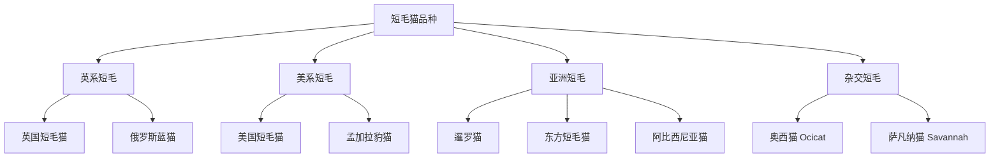
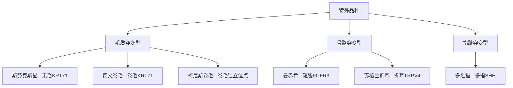

# 第3章 从波斯到狸花：全球猫品种全景图鉴

全球被认定的猫品种超过250种，但90%的人只认识不到10种。我是怕浪猫，这一章带你走完从血统认证到基因密码的完整品种图谱，看完你就是猫展评审的半内行。

## 3.1 猫品种的分类体系与认定标准

### 国际主流猫协CFA/TICA/FIFe/GCCF的体系差异

全球猫品种的认定并非由单一机构垄断，而是由四大主流猫协各自运作。爱猫者协会（Cat Fanciers' Association, CFA）成立于1906年，总部在美国，是历史最悠久、标准最严格的认证机构之一，目前认定45个品种。国际猫协（The International Cat Association, TICA）相对开放，认定73个品种，允许更多新兴品种和杂交品种进入。国际猫科联合会（Fédération Internationale Féline, FIFe）总部在欧洲，认定48个品种，标准偏向欧洲传统审美。英国猫协（Governing Council of the Cat Fancy, GCCF）是英国本土机构，认定约40个品种，对英系品种有独特话语权。

四大猫协的核心差异不止于数量。CFA对品种标准描述极为细致，要求参赛猫必须严格符合外观标准，对杂交品种接受度低。TICA则设有"初步认定"阶段，允许新品种在完全认定前参加展览。FIFe将品种分为四个类别（Category 1-4），按毛发长度和体型分组。GCCF的认定流程更为保守，通常需要数十年才能完成一个新品种的完整认定。

| 对比维度 | CFA | TICA | FIFe | GCCF |
|---------|-----|------|------|------|
| 成立时间 | 1906 | 1979 | 1949 | 1910 |
| 认定品种数 | 45 | 73 | 48 | ~40 |
| 总部 | 美国 | 美国 | 欧洲 | 英国 |
| 杂交品种 | 限制严格 | 接受度高 | 中等 | 保守 |
| 新品种流程 | 周期长 | 分阶段认定 | 按类别递进 | 极保守 |

一个品种在不同猫协可能拥有不同身份。比如萨凡纳猫（Savannah Cat）在TICA已获完整认定，但CFA至今不承认。孟加拉豹猫（Bengal）在TICA和FIFe均已认定，CFA则直到2016年才给予临时认定。这种分歧源于各协会对"家猫"定义的边界不同：CFA坚持纯种血统，TICA愿意接纳野生杂交后代。

### 品种认定标准：头型、体型、毛色与眼睛颜色的评分体系

猫展评审并非主观审美比赛，而是基于标准化评分体系的严格比对。以CFA为例，评审标准总分100分，各部位按权重分配。头部通常占25-35分，包括头型、耳朵、眼睛形状和颜色。体型占20-30分，评估骨骼结构、肌肉发展和整体比例。毛色和花纹占20-30分，要求色泽纯正、图案清晰。被毛质地占10-20分，评估长度、密度和触感。

不同品种的评分权重差异巨大。波斯猫在CFA标准中头部占40分，因为其扁平面部结构是品种核心特征。缅因猫则体型占35分，强调大型骨骼和矩形身躯。暹罗猫的眼睛颜色占15分，深蓝色是刚性要求，任何偏色都会大幅扣分。

> 品种标准不是审美偏好，而是一份写在基因里的契约。每一分扣减都对应着一个偏离理想形态的性状表达。

TICA的评分体系略有不同，采用"品种特征"（Breed Traits）和"毛色/花纹"（Color/Pattern）分离评分的方式。评审先对猫的整体结构打分（满分100），再对毛色单独评分，最后综合排名。这种体系让毛色稍逊但结构出色的猫也有获奖机会。

### 血统证书与谱系注册的意义

血统证书是品种猫的"身份证"，记录至少三代以上的祖先信息。CFA的血统证书包含品种名、毛色代码、出生日期、繁育者、注册号和完整谱系树。TICA的注册文件还包含基因检测信息（如适用）和冠军头衔记录。FIFe的谱系文件采用统一的EMS编码系统（Easy Mind System），用字母和数字组合描述品种和毛色。

血统证书的核心价值不在于"纯正"标签，而在于可追溯性。负责任的繁育者通过谱系分析计算近交系数（Inbreeding Coefficient, IC），避免高近交导致的健康问题。一般建议五代以内的近交系数控制在6.25%以下，即相当于堂表亲交配的水平。

谱系注册还有一个常被忽视的功能：追踪遗传病。如果一只冠军猫的后代出现遗传病，注册机构可以在谱系中标注，帮助后续繁育者规避风险基因。CFA和TICA都建立了遗传病追踪数据库，但数据共享仍是行业痛点——许多繁育者不愿公开健康问题，担心影响猫的商业价值。

### 自然品种vs人工培育品种的区分

猫品种按起源可分为两大类：自然品种和人工培育品种。自然品种指在特定地理环境中经自然选择形成的品种，如挪威森林猫适应斯堪的纳维亚的严寒，土耳其梵猫适应安纳托利亚高原的气候。这些品种的基因库由自然环境塑造，人类选择干预较少。

人工培育品种则是通过有目的的杂交和选育创造的。布偶猫是典型的人工品种，1960年代由Ann Baker在加利福尼亚通过多代选育固定特征。孟加拉豹猫更是直接由亚洲豹猫（Prionailurus bengalensis）与家猫杂交而来。斯芬克斯猫的起源虽然源于自然突变，但经过数十年人工选育才形成稳定品种。

两类品种在基因多样性上存在显著差异。自然品种通常拥有较高的遗传多样性，因为它们在形成过程中经历了自然选择的筛选。人工培育品种往往存在"奠基者效应"（Founder Effect），即整个品种由少数个体繁衍而来，基因池较窄。这也是为什么某些人工品种遗传病发病率偏高的根本原因。

| 对比维度 | 自然品种 | 人工培育品种 |
|---------|---------|------------|
| 起源 | 地理环境选择 | 人工杂交选育 |
| 基因多样性 | 较高 | 较低 |
| 遗传病风险 | 相对低 | 相对高 |
| 代表品种 | 挪威森林猫、狸花猫 | 布偶猫、孟加拉豹猫 |
| 品种稳定性 | 漫长 | 可在数十年内固定 |

### 品种标准的演变历史与争议

品种标准并非一成不变。波斯猫的"扁脸"标准经历了从轻微短鼻到极端扁平的演变过程。1950年代的波斯猫面部结构远比今天温和，鼻梁仍有明显突起。随后的数十年中，极端扁脸（即"peke-face"型）在猫展中频频获奖，标准逐步向更扁平的方向偏移。这一审美趋势直接导致了波斯猫呼吸道问题的急剧恶化。

苏格兰折耳猫的标准争议更为激烈。折耳基因（Fd）是显性突变，导致耳软骨无法正常发育。纯合子（Fd/Fd）个体必然出现骨骼畸形， heterozygotes（Fd/fd）也有一定比例出现尾部和四肢关节病变。2018年，英国兽医协会公开呼吁禁止折耳猫的繁殖，GCCF自1970年代起就拒绝注册折耳猫。但该品种在亚洲市场极受欢迎，尤其是中国和日本。

> 当审美标准与动物福利冲突时，品种标准本身就成为需要被审视的对象。

另一个争议焦点是品种分类的合并与拆分。CFA曾将所有长毛猫归为"波斯猫"一个品种，后来才分离出喜马拉雅猫等独立品种。TICA将某些品种按毛色拆分为不同" divisão"（组别），而FIFe可能将同一品种归入不同Category。这种分类差异不仅影响猫展参赛资格，也影响品种的注册统计和健康追踪。

## 3.2 长毛猫品种谱：波斯猫、缅因猫、布偶猫等

### 波斯猫：扁脸结构的美学与呼吸道隐患

波斯猫是世界上最古老的有记录猫品种之一，起源可追溯至17世纪的波斯（今伊朗）。最早的波斯猫由意大利商人Pietro Della Valle从波斯带到欧洲，当时它们拥有正常的面部结构和中等长度的被毛。现代波斯猫的极端扁脸特征是19世纪末至20世纪定向选育的结果。

CFA将波斯猫的面部标准定义为"brachycephalic"（短头型），要求鼻子短而宽，鼻断（nose break）位于两眼之间。TICA的标准相对温和，允许略微突出的鼻梁。这种差异直接影响了不同地区的波斯猫外貌——美系波斯猫面部更扁，欧系波斯猫面部相对温和。

扁脸结构带来一系列健康问题。短鼻腔导致呼吸阻力增加，严重者出现上呼吸道阻塞综合征（Upper Airway Obstruction Syndrome）。泪腺结构异常导致慢性泪溢（Epiphora），眼周毛发长期湿润。牙齿排列不齐（Malocclusion）发生率显著高于正常面部品种。波斯猫的平均寿命为12-14年，低于家猫平均寿命的15年。

波斯猫的被毛护理同样不容小觑。其双层被毛长度可达15厘米，每天需要至少15分钟的梳理来防止毛球和打结。不梳理的波斯猫被毛会在两周内形成致密毛结，需要全身麻醉后剃除。这也是为什么许多宠物级波斯猫主人选择"狮型剪毛"（Lion Cut）的原因。

### 缅因猫：北美最大体型家猫的特征与性格

缅因猫（Maine Coon）是北美洲最古老的自然品种之一，起源于美国缅因州。关于其起源流传着诸多传说，包括"浣熊杂交"的伪科学说法（生物学上不可能）。实际上，缅因猫是18世纪由欧洲殖民者带来的长毛猫与北美本土短毛猫自然杂交后，经新英格兰严酷气候筛选形成的品种。

缅因猫的体型在所有家猫品种中首屈一指。成年公猫体重可达8-12公斤，体长（鼻尖到尾根）可达1米，加上尾巴总长可达1.2米。CFA标准要求缅因猫具有"矩形"体型——身躯长而结实，胸部宽阔，肌肉发达。尾巴应至少与躯干等长，基部粗壮，末端尖锐，毛量丰沛。

性格方面，缅因猫被称为"温柔的巨人"（Gentle Giant）。它们性格温顺但不过分依赖主人，具有较强的独立性。与其他猫相比，缅因猫对水的接受度异常高，有些个体会主动玩水甚至游泳。它们还保留了较强的狩猎本能，适合有院子的家庭。

缅因猫的遗传病风险需要重点关注。肥厚型心肌病（Hypertrophic Cardiomyomyopathy, HCM）在缅因猫中的发病率约为30%，由MYBPC3基因突变A31P引起。脊髓性肌萎缩症（Spinal Muscular Atrophy, SMA）也是缅因猫特有遗传病，由LIX1基因突变导致。负责任的繁育者会提供父母的基因检测报告。

### 布偶猫：蓝色眼睛与"瘫软"性格的基因基础

布偶猫（Ragdoll）由Ann Baker于1960年代在美国加利福尼亚州培育。她用一只名叫Josephine的白色长毛母猫与多只未知品种的公猫交配，后代表现出独特的"瘫软"特性和蓝色眼睛。Ann Baker一度声称布偶猫的温顺性格源于Josephine曾被车撞后接受的基因改造实验，这一说法毫无科学依据。

布偶猫的蓝色眼睛与重点色基因（Colorpoint Gene, c^s）密切相关。该基因是白化系列等位基因之一，导致温度较高的躯干部位色素合成受抑，而温度较低的四肢、面部和耳朵色素正常沉积。所有纯种布偶猫都必须拥有蓝色眼睛，任何其他颜色都是失格。

布偶猫的"瘫软"特性（floppiness）是品种命名的由来——被抱起时全身放松，如同布偶。这一特性的遗传机制尚未完全阐明，可能涉及肌张力相关的多基因调控。需要注意的是，过度瘫软可能提示肌张力低下（Hypotonia），并非所有"软"都是健康的。

布偶猫同样面临HCM风险。与缅因猫不同，布偶猫的HCM与MYBPC3基因的R820W突变相关，这是一种独立于缅因猫A31P突变的致病位点。这意味着两只不同品种的HCM基因筛查不能互相替代。以下是简化的基因检测逻辑：

```python
def check_hcm_risk(breed, genotype):
    """布偶猫/缅因猫HCM基因风险检测"""
    mutations = {
        "Ragdoll": {"gene": "MYBPC3", "variant": "R820W"},
        "Maine Coon": {"gene": "MYBPC3", "variant": "A31P"}
    }
    if breed not in mutations:
        return "该品种无已知HCM突变检测"
    
    mutation = mutations[breed]
    if genotype == "N/N":
        return f"{breed}: 正常，不携带{mutation['variant']}突变"
    elif genotype == "N/M":
        return f"{breed}: 杂合子，携带1个{mutation['variant']}拷贝，建议绝育"
    elif genotype == "M/M":
        return f"{breed}: 纯合子，{mutation['variant']}突变纯合，高发病风险"
```

### 挪威森林猫与西伯利亚猫：寒冷气候的适应进化

挪威森林猫（Norwegian Forest Cat）和西伯利亚猫（Siberian Cat）常被混淆，但它们是两个独立品种，分别来自斯堪的纳维亚和俄罗斯。两者的相似性是趋同进化的典型案例——不同地理环境中的猫为适应严寒，独立发展出类似的特征。

挪威森林猫拥有双层被毛系统：外层防水长毛和内层绒毛。脚掌间有密集毛簇，像天然的雪地靴。耳朵大而直立，内侧有防风毛。体型大但骨架比缅因猫轻盈，后腿略长于前腿，便于在雪地中跳跃。CFA于1993年正式认定该品种。

西伯利亚猫的体型比挪威森林猫更紧凑，头部更圆，被毛质地更厚密。西伯利亚猫因产生较少Fel d1过敏原而闻名，约50%的猫过敏患者可以耐受西伯利亚猫。但需要注意，"低过敏"不等于" hypoallergenic"——个体间Fel d1产量差异很大，并非每只西伯利亚猫都适合过敏人群。

> 自然选择是最严苛的繁育者——它不关心审美，只关心生存。

两个品种在性格上也有差异。挪威森林猫偏向沉稳独立，喜欢高处观察。西伯利亚猫更社交化，对人类依赖度较高，适合家庭饲养。两者的运动能力都极强，需要垂直空间和攀爬设施。

### 其他长毛品种：土耳其梵猫、伯曼猫与索马里猫

土耳其梵猫（Turkish Van）以其独特的"梵色"花纹闻名——仅在头部和尾部有色斑，躯干纯白。这种花纹由白斑基因（White Spotting Gene, S）的高表达导致。土耳其梵猫原产土耳其凡湖地区，是国家级保护品种，土耳其政府曾立法限制出口。该品种对水的喜爱在猫中极为罕见，被称为"游泳猫"。

伯曼猫（Birman）与布偶猫外观相似但起源完全不同。伯曼猫源自缅甸，传说中是寺庙圣猫。其标志特征是四只"白手套"——四肢末端纯白，由白斑基因的低表达形成。伯曼猫的体型比布偶猫小，性格更为安静。CFA标准要求伯曼猫必须有完整的蓝色眼睛和对称的白色手套。

索马里猫（Somali）是阿比西尼亚猫的长毛变种。其被毛呈现独特的"ticking"（渐变色）——每根毛发上有3-4段交替的深浅色带。这种渐变效果由刺鼠基因（Agouti Gene, A）控制。索马里猫性格活泼好动，好奇心极强，不适合长期独处。

| 品种 | 体重范围(kg) | 毛长(cm) | 寿命(年) | 性格特点 |
|------|-------------|---------|---------|---------|
| 波斯猫 | 3.5-7 | 10-15 | 12-14 | 安静温和 |
| 缅因猫 | 5-12 | 8-15 | 10-13 | 温柔独立 |
| 布偶猫 | 4.5-9 | 8-13 | 12-15 | 温顺粘人 |
| 挪威森林猫 | 4-8 | 8-15 | 14-16 | 沉稳机警 |
| 西伯利亚猫 | 4.5-9 | 8-12 | 11-15 | 社交活泼 |
| 土耳其梵猫 | 3.5-7 | 6-12 | 12-14 | 精力旺盛 |
| 伯曼猫 | 3.5-6.5 | 7-12 | 13-15 | 安静亲人 |
| 索马里猫 | 2.5-5 | 5-8 | 11-14 | 活泼好奇 |

## 3.3 短毛猫品种谱：英短、美短、暹罗猫等

### 英国短毛猫：圆脸与厚实体型的标准特征

英国短毛猫（British Shorthair, BSH）是英伦三岛最古老的品种之一，其祖先可追溯至罗马时期带入英国的家猫。一战后，该品种几乎灭绝，繁育者通过混入波斯猫血统才得以恢复，这也解释了英短标志性的圆脸和厚实被毛。

CFA标准对英短的描述是"四分之一圆"——头圆、眼圆、脸颊圆、胸圆。被毛描述为"plush"（毛绒），短而密，触感似天鹅绒。最经典的毛色是"英国蓝"（British Blue），即纯蓝灰色，但CFA和TICA共认可超过30种毛色。成年公猫体重4-8公斤，体型比母猫大得多，脸颊更饱满。

英短的性格与外表形成有趣反差。它们看起来敦实慵懒，实际上保留了较强的狩猎本能。英短不太喜欢被抱，更喜欢在主人旁边安静地待着。它们的社交需求较低，适合工作繁忙的主人。但要注意英短容易肥胖，需要严格控制饮食。

英短的遗传病风险主要在多囊肾病（Polycystic Kidney Disease, PKD）。由于历史上引入波斯猫血统，约2-3%的英短携带PKD1基因突变。负责任的繁育者会通过基因检测筛查并淘汰携带者。

### 美国短毛猫：银虎斑的经典花色与活泼性格

美国短毛猫（American Shorthair, ASH）的祖先是17世纪随欧洲移民抵达北美的"工作猫"，主要职责是控制船上的鼠患。这些猫在北美大陆自由繁衍数百年后，形成了健壮、适应性强的自然品种。1966年，该品种正式从" Domestic Shorthair"更名为"American Shorthair"以区别于普通短毛家猫。

银虎斑（Silver Tabby）是美国短毛猫最具标志性的花色。银色底毛上叠加黑色虎斑条纹，形成强烈的视觉对比。虎斑图案由刺鼠基因（A）和虎斑基因（Tabby Gene, Ta/Tm/Tb）共同决定。ASH标准认可三种虎斑图案：经典虎斑（Classic Tabby，漩涡状）、鲭鱼虎斑（Mackerel Tabby，条纹状）和补丁虎斑（Patched Tabby，斑块状）。

ASH与英短常被混淆，但两者在体型和性格上有明显差异。ASH体型更修长，腿部更长，整体外观更"运动型"。英短则更紧凑，被毛更厚密。性格上，ASH比英短更活泼好动，社交需求也更高。ASH对儿童和其他宠物的容忍度在短毛品种中名列前茅。

> 品种的差异不在优劣，而在匹配。一只活跃的美短和一只安静的英短，适应的是完全不同的家庭。

### 暹罗猫：重点色基因与"话痨"性格的独特性

暹罗猫（Siamese Cat）源自暹罗王国（今泰国），是世界上最受认可的猫品种之一。14世纪的泰国手稿《Tamra Maew》（猫之书）中已有暹罗猫的图文记载，使其成为有最早文字记录的品种猫。

暹罗猫的标志特征是重点色（Colorpoint）。这一特征由酪氨酸酶温度敏感突变（Tyrosinase Temperature-Sensitive Mutation, c^s）导致。该突变使酪氨酸酶在体温37度以上失活，只有温度较低的末梢部位（面部、耳朵、四肢、尾巴）才能正常合成色素。以下是重点色遗传的简化逻辑：

```python
def predict_colorpoint(parent1_geno, parent2_geno):
    """
    重点色基因(c^s)遗传预测
    C = 全色显性, c^s = 重点色隐性
    """
    from itertools import product
    outcomes = {}
    for g1, g2 in product(parent1_geno, parent2_geno):
        genotype = tuple(sorted([g1, g2], reverse=True))
        if genotype == ('C', 'C'):
            pheno = "全色（不携带重点色基因）"
        elif genotype == ('C', 'c_s'):
            pheno = "全色携带者（外观全色，携带重点色）"
        else:
            pheno = "重点色（面部四肢有色斑）"
        outcomes[genotype] = outcomes.get(genotype, 0) + 1
    return outcomes
# 示例：两只携带者交配 C/c_s × C/c_s
# 结果：25% C/C, 50% C/c_s, 25% c_s/c_s
```

暹罗猫的"话痨"特性几乎成了品种标签。它们发声频率高、音色低沉，听起来像婴儿哭。研究认为这与暹罗猫的社交需求高度相关——它们用声音与人类持续沟通。暹罗猫极度粘人，不适合长期独处，否则会出现焦虑和行为问题。

现代暹罗猫分为"传统型"（Traditional/Applehead）和"现代型"（Modern/Wedgehead）。现代型经过极端选育，头部呈楔形，身体修长，耳朵巨大。传统型保留了1950年代以前的温和外观。两种类型在性格上差异不大，但现代型的牙齿和呼吸道问题更为多发。

### 孟加拉豹猫：野性外表与家猫性格的杂交育种

孟加拉豹猫（Bengal Cat）是家猫与亚洲豹猫（Prionailurus bengalensis, ALC）杂交的产物。第一代杂交（F1）血统为50% ALC，F2为25%，F3为12.5%。TICA要求至少F4代（6.25% ALC血统）才能作为展览猫参赛。这一规定确保了 Bengals 的 temperament 充分家猫化。

Bengal的标志外观是"豹斑"（Rosette）——中空的花瓣状斑点，类似野生豹的图案。这与普通虎斑的实心斑点不同，由特定的花斑修饰基因控制。Marbled Bengal则呈现大理石花纹，由大理石基因（Tb）替代条纹基因（Ta）形成。

Bengal的能量水平在所有家猫品种中名列前茅。它们需要大量的运动和互动，单纯的家养环境很难满足。许多Bengal主人会设置猫轮（Cat Wheel）和复杂的垂直攀爬空间。Bengal对水的兴趣也高于平均水平，有些个体会跳进浴缸或水池。

Bengal的遗传病风险包括进行性视网膜萎缩（Progressive Retinal Atrophy, PRA-b）和肥厚型心肌病。PRA-b导致感光细胞逐渐退化，最终失明。TICA要求注册Bengal的繁育者提供PRA-b基因检测阴性报告。

### 其他短毛品种：阿比西尼亚猫、俄罗斯蓝猫与东方短毛猫

阿比西尼亚猫（Abyssinian）以其独特的"ticking"被毛闻名。每根毛发上有3-4段交替的深浅色带，形成柔和的渐变效果，外观类似野兔毛。阿比西尼亚猫被认为是最接近古埃及神圣猫形象的现代品种，但基因研究显示其祖先可能来自印度洋沿岸。该品种极度活跃，几乎不会安静待超过5分钟。

俄罗斯蓝猫（Russian Blue）以其银蓝色被毛和翠绿色眼睛的组合独树一帜。被毛为双层结构，外层蓝色毛尖在光线下泛银光。俄罗斯蓝猫性格内向敏感，对陌生人警惕，但与主人建立深厚感情。该品种的遗传病风险较低，是相对健康的品种，平均寿命15-18年。

东方短毛猫（Oriental Shorthair）是暹罗猫的"彩色版本"。它们拥有与暹罗猫完全相同的体型特征——修长身躯、大耳朵、楔形头——但被毛颜色超过300种组合，且眼睛颜色不限于蓝色。东方短毛猫同样话多且粘人，社交需求与暹罗猫相当。



## 3.4 无毛猫与特殊品种：斯芬克斯、曼赤肯等

### 斯芬克斯猫：无毛基因突变与皮肤护理需求

斯芬克斯猫（Sphynx）的起源并非古埃及，而是1966年加拿大安大略省一只普通黑白花母猫产下的一窝无毛小猫。无毛性状由角蛋白基因（KRT71）的隐性突变导致，与德文卷毛猫的卷毛基因是同一基因座的不同等位基因。这意味着斯芬克斯猫并非完全无毛——它们全身覆盖着极细的绒毛，触感类似麂皮。

无毛并不意味着低维护。恰恰相反，斯芬克斯猫的皮肤护理需求高于大多数有毛品种。皮肤分泌的皮脂无法被被毛吸收，会在皮肤表面积聚，需要每周1-2次温水洗澡。不定期清洁会导致毛囊炎（Folliculitis）和皮肤色素沉着。耳道和爪间也需要特别清洁，因为缺乏毛发保护，分泌物容易堆积。

斯芬克斯猫的体温调节是一个持续的挑战。没有被毛的保温层，它们的代谢率高于普通猫，食欲也更大。冬季需要提供加热垫或衣物，夏季需要防晒——斯芬克斯猫的浅色个体容易晒伤。室内温度建议维持在22-26度。

斯芬克斯猫的性格极为社交化，被称为"猫中的狗"。它们会迎接主人回家、跟随主人走动、与其他宠物友好相处。这种高社交需求意味着斯芬克斯猫不适合长期独处。许多斯芬克斯猫主人会养两只以互相陪伴。

### 曼赤肯（短腿猫）：软骨发育不全基因的争议

曼赤肯猫（Munchkin）的短腿特征由软骨发育不全基因（Fibroblast Growth Factor Receptor 3, FGFR3）的显性突变导致。这一突变与人类软骨发育不全症（Achondroplasia）类似但不完全相同。短腿是显性性状，但纯合子（Mk/Mk）致死，胎儿在子宫内死亡。因此所有存活的曼赤肯猫都是杂合子（Mk/mk），两只曼赤肯交配每胎约有25%的胚胎无法存活。

曼赤肯猫的短腿并不影响其活动能力。它们能跑、跳、攀爬，只是跳跃高度不如普通猫。脊柱结构通常正常，这与折耳猫的骨骼问题不同。TICA于2003年正式认定曼赤肯为品种，但CFA和FIFe至今拒绝认定，理由是"将遗传畸形作为品种特征不符合动物福利"。

曼赤肯的争议核心在于"有意繁殖显性致畸基因"。支持者认为短腿猫健康且快乐，反对者认为人为制造活动能力受限的动物在伦理上站不住脚。目前没有确凿数据显示曼赤肯猫的生活质量低于普通猫，但长期脊柱负荷问题仍需更多追踪研究。

> 伦理争议不应被情绪绑架，但也不应被商业利益掩盖。每一个品种的认定，都是动物福利与人类偏好的博弈。

### 苏格兰折耳猫：折耳基因与骨骼畸形的伦理讨论

苏格兰折耳猫（Scottish Fold）的折耳特征由软骨发育不良基因（Osteochondrodysplasia, OCD）的显性突变导致。该基因（TRPV4）突变影响软骨组织的正常发育，使耳朵向前折叠。问题在于，这一基因不只影响耳朵——它影响全身所有软骨组织。

纯合子（Fd/Fd）个体的骨骼畸形不可避免，通常在出生后数月内出现。症状包括尾巴僵硬、四肢短粗变形、跛行和慢性疼痛。杂合子（Fd/fd）个体虽然症状较轻，但X光研究显示超过80%的杂合子在6岁前出现不同程度的骨骼异常。疼痛是不可逆的，只能通过镇痛管理。

2024年，英国苏格兰政府在动物福利法规修正案中明确禁止繁殖苏格兰折耳猫，苏格兰以外的英国地区也在推进类似禁令。GCCF自1970年代起就拒绝注册折耳猫，欧洲多国猫协也相继跟禁。然而在亚洲市场，折耳猫依然是最受欢迎的品种之一。

折耳猫的伦理困境在于：折耳是显性基因，要消除折耳特征只需让折耳猫与正常耳猫交配（后代50%折耳，50%正常）。完全停止繁殖折耳猫，一代之内就能消除该基因。但市场需求让这一简单解决方案难以执行。

### 卷毛猫品种：德文卷毛、柯尼斯卷毛的毛质差异

卷毛猫并非单一品种，而是由不同基因突变导致的独立品种群。德文卷毛猫（Devon Rex）的卷毛由KRT71基因的隐性突变导致，被毛呈波浪状，包括胡须也是弯曲的。柯尼斯卷毛猫（Cornish Rex）的卷毛由另一个独立的隐性基因突变导致，被毛更紧密，没有外层粗毛，只有底绒。

两者的触感差异明显。德文卷毛猫的被毛触感类似开司米羊绒，柔软但有一定的粗糙感。柯尼斯卷毛猫的被毛更丝滑，触感类似天鹅绒。德文卷毛猫的毛量通常比柯尼斯卷毛猫多，但两者都存在局部脱毛的可能。

卷毛猫的性格有一个共同特征：极度活跃和社交化。它们被形容为"猫中的猴"——擅长攀爬、跳跃，喜欢站在高处观察。德文卷毛猫尤其以"食物偷窃"闻名，能打开柜门和食物容器。两个品种都不适合长期独处。

### 多趾猫（海明威猫）：多指基因的遗传与影响

多趾猫（Polydactyl Cat）的额外脚趾由SHH基因（Sonic Hedgehog）调控区域的突变导致。正常猫前脚5趾、后脚4趾，多趾猫可以有多达7-8个脚趾。这一突变是显性的，后代有50%概率表现多趾。

多趾猫因美国作家海明威而闻名——海明威在基韦斯特岛的故居中养了大量多趾猫，至今该遗址仍有约40-50只多趾猫后代，被称为"海明威猫"（Hemingway Cats）。CFA和TICA都不将多趾作为品种特征认定，但TICA允许多趾猫以"非冠军组"身份参展。

多趾通常不影响猫的健康。额外脚趾有时需要额外的指甲修剪，否则可能向内生长。极少数情况下，多趾会导致脚掌结构不稳定，需要手术矫正。总体而言，多趾猫的预期寿命与普通猫无异。



## 3.5 中华田园猫：狸花、橘猫、三花与玳瑁

### 中国狸花猫：唯一获CFA认证的中国自然品种

中国狸花猫（Chinese Li Hua, CFA注册名Li Hua/Li Hua Mao）是唯一获得CFA认证的中国本土自然品种。2003年，中国猫迷俱乐部（CCAC）向CFA提交狸花猫认定申请，经过多年的资料收集和标准制定，2010年CFA正式收录狸花猫进入杂项登记册（Miscellaneous Class）。2018年，狸花猫未能升入临时品种（Provisional Class），至今仍停留在杂册阶段。

狸花猫的标准特征包括：圆头、杏眼、中等体型、短而硬的鲭鱼虎斑被毛。毛色以棕色虎斑为主，底色为暖棕色，条纹清晰。眼睛颜色为绿色、黄色或棕色，蓝色为失格。狸花猫的体格健壮，骨骼粗壮，肌肉发达，体现了中国本土猫经数千年自然选择的优良体质。

CFA认定进程缓慢的原因是多方面的。一方面，中国国内缺乏系统的谱系注册和血统追踪体系，难以提供CFA要求的五代血统文件。另一方面，狸花猫的品种标准在中国本土仍有争议——不同地区的狸花猫外观差异较大，标准统一需要大量调研。此外，CFA对新增品种的审核日趋严格。

### 橘猫毛色遗传：橘色基因与性别的关联（80%为公猫）

橘猫不是品种，而是毛色表现型。橘色毛由X染色体上的Orange基因（O）控制，这是一个性连锁基因。公猫只有一条X染色体，只需一个O基因即为橘色（O/Y）。母猫有两条X染色体，需要两个O基因（O/O）才是纯橘色，一个O一个o（O/o）则表现为玳瑁或三花。

这种遗传机制导致橘猫中公猫占比约80%。基因频率计算如下：假设群体中O基因频率为0.2，则橘公猫比例为20%，纯橘母猫比例为4%（0.2×0.2），符合实际观察的约80:20性别比。

橘猫"胖"的刻板印象有一定统计学基础。美国兽医协会的一项调查显示，橘猫的平均体重比非橘色家猫高0.5-1公斤。但这一差异更可能与行为特征有关——橘猫普遍食欲旺盛、活动量偏低，而非直接的基因效应。以下是橘色遗传的简化模型：

```python
def orange_gene_inheritance(father_x, mother_x1, mother_x2):
    """
    橘色基因(O)性连锁遗传预测
    father_x: 父亲X染色体(O或o)
    mother: 母亲两条X染色体(O或o)
    """
    outcomes = []
    # 父亲将X传给女儿，Y传给儿子
    # 母亲随机传一条X给后代
    for m_x in [mother_x1, mother_x2]:
        # 儿子: Y(父) + m_x(母)
        son = "Orange" if m_x == "O" else "Non-orange"
        # 女儿: father_x(父) + m_x(母)
        if father_x == "O" and m_x == "O":
            daughter = "Orange (O/O)"
        elif father_x == "O" or m_x == "O":
            daughter = "Tortoiseshell (O/o)"
        else:
            daughter = "Non-orange (o/o)"
        outcomes.append((son, daughter))
    return outcomes
# 橘公猫(O/Y) × 纯橘母猫(O/O) → 100%橘猫
# 橘公猫(O/Y) × 非橘母猫(o/o) → 儿子全非橘, 女儿全玳瑁
```

### 三花猫与玳瑁猫：X染色体失活与花色形成的原理

三花猫（Calico）和玳瑁猫（Tortoiseshell）是同一遗传机制的不同表现。当母猫的一条X染色体携带O基因，另一条携带o基因（O/o）时，就会表现出黑色和橘色交替的斑块。三花猫额外携带白斑基因（S），在黑橘交替的基础上叠加大面积白色，形成三色花斑。

这一现象的分子机制是X染色体失活（X-Chromosome Inactivation, XCI）。在雌性哺乳动物每个细胞中，两条X染色体中会随机失活一条。如果失活的是携带O基因的X染色体，该细胞表达黑色（o基因）；如果失活的是携带o基因的X染色体，该细胞表达橘色（O基因）。这种失活发生在胚胎发育早期，一旦确定，该细胞的所有后代都保持同样的失活模式，形成色块。

> 玳瑁猫的每一块色斑，都是X染色体失活留下的时间印记。这就是为什么世界上找不到两只花纹完全相同的三花猫。

由于X染色体失活的机制，几乎所有的三花猫和玳瑁猫都是母猫（XX）。极少数的三花公猫（约1/3000）通常是XXY染色体（克氏综合征，Klinefelter Syndrome），不育。更罕见的是XY/XXY嵌合体，可能有生育能力但概率极低。

三花猫和玳瑁猫在日本被奉为招财猫的原型。日本的"Maneki-neko"最经典的形象就是三花色，这与三花猫在日本文化中象征好运的传统密切相关。

### 玄猫（黑猫）与白猫：毛色基因与文化象征

黑猫的毛色由非刺鼠基因（Non-Agouti, a）的隐性纯合导致。当猫的基因型为a/a时，每根毛发全黑而非渐变色。黑猫的白化变异型还受到棕色基因（B/b/bl）的影响：B/B为纯黑，b/b为巧克力色，bl/bl为肉桂色。

白猫的成因有两种完全不同的机制。显性白基因（Dominant White, W）导致全身白色，同时伴随蓝色眼睛和较高概率的先天性耳聋（约40%的单侧耳聋，15-20%的双侧耳聋）。W基因作用于KIT基因，影响黑色素细胞的迁移。另一种是极端白斑基因（S^p/S^p），由白斑基因的高表达导致全身白色，但通常不伴随耳聋。

黑猫在不同文化中象征截然相反。中世纪欧洲将黑猫与巫术联系，视为不祥之兆。而在中国传统文化中，玄猫（黑猫）被认为能辟邪驱恶，《本草纲目》中有相关记载。白猫在日本能剧传统中象征纯洁，在西方则常与婚礼幸运相关联。

### 狸花猫的国际地位与国内保护现状

狸花猫在国际猫展中获得认可的过程并非一帆风顺。CFA在2010年将Li Hua收入杂册后，由于注册数量不足和国内繁育者参与度低，2018年CFA评估中狸花猫未能升级。目前狸花猫在CFA体系中处于"非活跃状态"，意味着理论上仍可注册，但实际上几乎无人参展。

国内狸花猫保护面临两难局面。一方面，狸花猫在中国农村广泛分布，种群数量庞大，不存在灭绝风险。另一方面，这些猫大多处于自由繁殖状态，缺乏系统选育和谱系管理。城市中的狸花猫多为流浪猫或收养猫，与"品种"概念相去甚远。

国内猫迷组织正在推动狸花猫的标准化工作。中国纯种猫俱乐部（CFCC）制定了狸花猫地方标准，并与TICA接洽申请品种认定。TICA对狸花猫的申请态度较为积极，但要求提供足够数量的注册猫只和五代血统文件。这一过程需要至少5-10年的持续工作。

| 田园猫类型 | 毛色基因 | 性别倾向 | 文化含义 | 备注 |
|-----------|---------|---------|---------|------|
| 狸花猫 | Agouti + Tabby | 无 | 驱邪镇宅 | CFA杂册 |
| 橘猫 | O基因(X连锁) | 80%公猫 | 招财 | 非独立品种 |
| 三花猫 | O/o + 白斑S | 几乎全母 | 招财猫原型 | 1/3000公猫不育 |
| 玳瑁猫 | O/o(无白斑) | 几乎全母 | 与三花同源 | 毛色独特无重复 |
| 玄猫 | a/a + B/B | 无 | 辟邪 | 中西文化差异大 |
| 白猫 | W基因或S^p/S^p | 无 | 纯洁 | 注意耳聋风险 |

## 3.6 品种与健康：遗传疾病的认知与预防

### 品种猫遗传病数据库：HCM、PKD、SMA的基因筛查

品种猫的遗传病问题是现代猫繁育中最核心的动物福利议题。由于品种猫的基因池有限，致病基因在近交过程中被富集，导致某些遗传病在特定品种中的发病率远高于普通家猫。目前研究最为透彻的三种遗传病是肥厚型心肌病（Hypertrophic Cardiomyopathy, HCM）、多囊肾病（Polycystic Kidney Disease, PKD）和脊髓性肌萎缩症（Spinal Muscular Atrophy, SMA）。

HCM是猫中最常见的心脏病，也是猝死的主要原因。缅因猫的A31P突变和布偶猫的R820W突变是已知致病变异，但HCM存在遗传异质性——其他品种的HCM可能由尚未鉴定的基因导致。基因检测可以识别已知突变携带者，但阴性结果不能完全排除HCM风险，建议结合心脏超声检查。

PKD主要影响波斯猫及其衍生的品种（包括英短、异短、喜马拉雅猫）。PKD1基因突变导致肾小管上皮细胞异常增殖，形成多个囊肿，最终导致肾功能衰竭。PKD是显性遗传，一个突变拷贝即可致病。超声检查在10月龄以上的猫中检测准确率超过95%。

SMA是缅因猫特有的隐性遗传病。LIX1基因突变导致脊髓运动神经元退化，出现后肢无力、肌肉萎缩。虽然是隐性遗传，但携带者不应用于繁殖。

> 基因检测不是标签，而是责任。知道一只猫携带致病基因，意味着你有机会阻断它在下一代的延续。

### 波斯猫多囊肾病（PKD）的遗传模式与检测

PKD在波斯猫中的历史发病率曾高达36-49%，是波斯猫最严重的遗传病。PKD1基因（Polycystin 1）突变以常染色体显性方式遗传，意味着只需一个突变拷贝即可发病。两只杂合子PKD猫交配，后代中75%将患病（50%杂合子，25%纯合子），25%正常。

PKD的临床表现通常在3-10岁间逐渐显现。囊肿在出生时即存在，随年龄增长逐渐增大。症状包括多饮多尿、食欲下降、体重减轻、呕吐和嗜睡。最终发展为终末期肾病（End-Stage Renal Disease, ESRD），需要皮下输液等支持治疗。PKD没有治愈方法，只能减缓进展。

基因检测是根除PKD的有效手段。2004年UC Davis兽医遗传实验室开发了PKD1基因检测方法，通过口腔拭子或血液样本即可完成检测。负责任的波斯猫繁育者会将PKD阳性个体从繁殖计划中移除。经过十多年的系统筛查，目前CFA注册波斯猫的PKD阳性率已降至3-5%。

### 缅因猫与布偶猫的肥厚型心肌病（HCM）筛查

HCM在缅因猫中的发病率约为30%。MYBPC3基因A31P突变以显性方式遗传，但外显率不完全——并非所有携带者都会发展为临床HCM。纯合子（A31P/A31P）几乎100%发病，杂合子（A31P/正常）的外显率约为60%。发病年龄通常在3-6岁。

布偶猫的HCM由MYBPC3基因R820W突变引起，遗传模式与缅因猫类似但外显率不同。R820W纯合子的发病率为100%，杂合子约为40%。布偶猫HCM的临床表现通常比缅因猫更严重，进展更快。

基因检测和心脏超声应结合使用。基因检测能识别已知突变，但无法预测发病时间和严重程度。心脏超声（Echocardiography）可以直接观察心肌厚度和心室功能，建议从1岁开始每年检查一次，直到8岁。以下是HCM筛查的决策逻辑：

```python
def hcm_screening_protocol(breed, age, genotype, echo_result):
    """
    HCM筛查与随访决策树
    breed: 品种, age: 年龄(岁), 
    genotype: 基因型, echo_result: 超声结果
    """
    risk = {"high": [], "moderate": [], "low": []}
    
    if genotype == "M/M":  # 纯合突变
        risk["high"].append("纯合致病突变")
        risk["high"].append(f"建议心脏超声每6个月一次")
        risk["high"].append("考虑HCM药物预防治疗")
    elif genotype == "N/M":  # 杂合突变
        risk["moderate"].append("杂合致病突变")
        risk["moderate"].append(f"建议心脏超声每年一次")
        if age > 4:
            risk["moderate"].append("4岁以上建议增加超声频率")
    else:  # 正常基因型
        risk["low"].append("不携带已知突变")
        risk["low"].append("建议2-3年一次心脏超声")
    
    if echo_result == "abnormal":
        risk["high"].append("超声异常，需心内科会诊")
    
    return risk
```

### 折耳猫软骨发育异常的不可逆性

苏格兰折耳猫的软骨发育不良（Osteochondrodysplasia, OCD）是不可逆的进行性疾病。TRPV4基因突变导致软骨组织无法正常发育和修复，影响全身所有含软骨的部位。耳朵折叠只是最显眼的表现，脊柱、四肢关节和肋骨软骨同样受累。

目前没有任何治疗方法可以逆转OCD的骨骼病变。非甾体抗炎药（NSAIDs）可以缓解疼痛，但长期使用有肝肾副作用。氨基葡萄糖等关节保健品的效果缺乏循证证据。放射治疗在某些病例中能减轻急性疼痛，但无法阻止疾病进展。

OCD的X线征象包括：尾椎融合和变短、跗关节增生变形、腕关节间隙变窄。这些变化在纯合子中通常4-6月龄即可观察到，杂合子在2-6岁间逐渐显现。任何折耳猫都应被视为潜在OCD患者，定期进行骨科检查和影像学评估。

> 不可逆不是绝望，而是警示——在基因层面预防，远比在临床层面治疗有效。

### 混血优势：田园猫的基因多样性与健康优势

中华田园猫和混血家猫（Domestic Shorthair/Longhair, DSH/DLH）在健康指标上普遍优于纯种猫。这不是偶然，而是基因多样性（Genetic Diversity）的直接结果。纯种猫的有效群体大小（Effective Population Size, Ne）通常在50-200之间，远低于维持遗传健康所需的Ne=500阈值。田园猫的Ne估计在1000以上，基因池远为丰富。

基因多样性带来的优势体现在多个层面。首先是遗传病发病率更低。HCM、PKD、SMA等品种特异性遗传病在田园猫中极为罕见，因为致病基因在自由交配群体中被稀释。其次是免疫系统多样性更高，主要组织相容性复合体（Major Histocompatibility Complex, MHC）的等位基因数量更多，对病原体的抵抗范围更广。

混血猫的另一个优势是"杂种优势"（Heterosis/Hybrid Vigor）。当两只基因差异较大的猫交配时，后代在多个性状上优于双亲的平均水平，包括繁殖力、抗病力和寿命。田园猫的平均寿命为15-18年，高于大多数纯种猫的10-15年。

这并不意味着纯种猫不值得养。纯种猫的可预测性——外观、体型、性格的大致范围——是田园猫无法提供的。但准主人在选择纯种猫时，应当了解该品种的遗传病风险，选择提供基因检测报告的繁育者，并做好长期健康管理的准备。

| 遗传病 | 主要受影响品种 | 遗传模式 | 基因 | 检测方法 | 预防策略 |
|-------|--------------|---------|------|---------|---------|
| HCM | 缅因猫、布偶猫 | 常染色体显性 | MYBPC3 | 基因检测+超声 | 淘汰携带者 |
| PKD | 波斯猫系、英短 | 常染色体显性 | PKD1 | 基因检测+超声 | 淘汰携带者 |
| SMA | 缅因猫 | 常染色体隐性 | LIX1 | 基因检测 | 淘汰携带者 |
| PRA-b | 孟加拉豹猫 | 常染色体隐性 | CRX | 基因检测 | 淘汰携带者 |
| OCD | 苏格兰折耳猫 | 常染色体显性 | TRPV4 | 基因检测+X线 | 停止繁殖 |
| PKDef | 阿比西尼亚猫 | 常染色体隐性 | PKLR | 基因检测 | 淘汰携带者 |

---

如果你看到这里，说明你是认真想搞懂猫品种的人。这篇文章的信息量不小，建议收藏，需要的时候翻回来对照。下一篇：猫为什么总在半夜跑酷？尾巴竖起来到底什么意思？我们拆解猫的行为密码。

系列进度：3/12

我是怕浪猫，下一章见。
