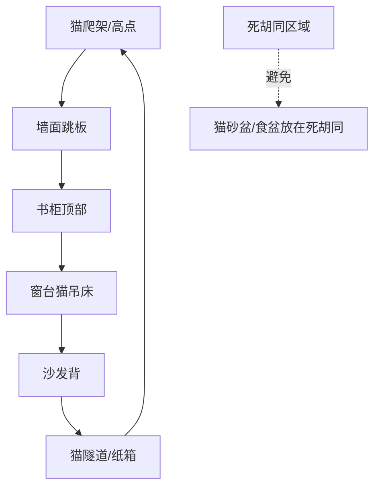
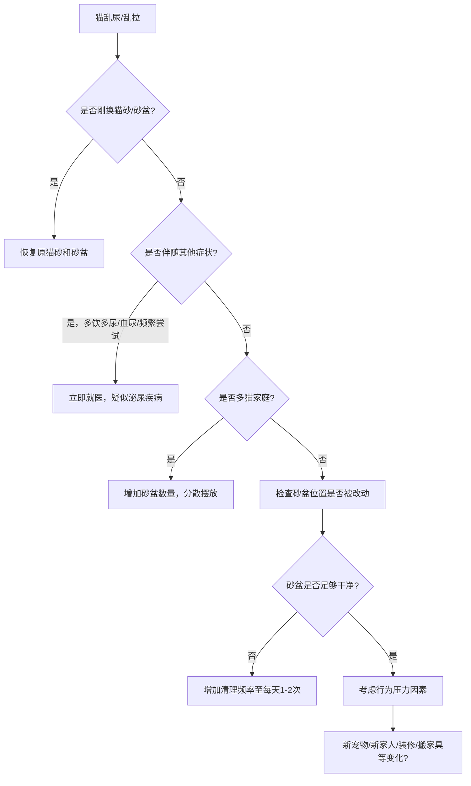
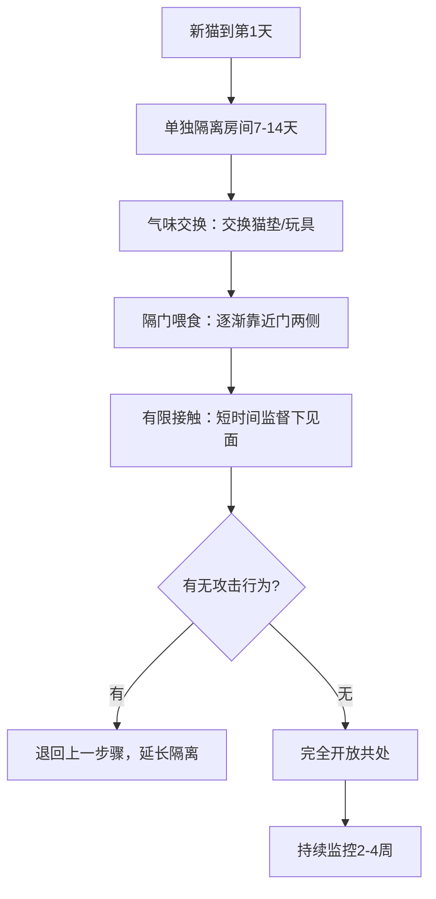

# 室内养猫环境设计：66条窍门把家装成猫乐园

猫乱尿、抓沙发、半夜叫——90%的行为问题都是环境没布置对。我是怕浪猫，今天把室内养猫的环境设计和66条实用窍门一次给你拆透。从空间规划到垂直利用，从猫砂盆选型到安全防护，这篇够你折腾大半年了。

系列进度 5/12

## 5.1 猫友好家居的空间规划原则

### "猫尺"概念：以猫的视角衡量空间

人类用"人尺"（Human Scale）设计家居：桌子高75cm、门高210cm、走廊宽90cm。但猫的体型和运动方式与人完全不同，用人的尺度衡量空间对猫不适用。

"猫尺"（Cat Scale）的核心是：以猫的体高（站立约25cm）、跳跃高度（1.5-2m）和嗅觉范围（约1-2m）为基准来评估空间。人类设计师不会考虑沙发底是否够猫钻进去，但猫会。

猫尺的关键参数：

| 参数 | 数值 | 设计含义 |
|------|------|---------|
| 站立体高 | 25cm | 床底/沙发底间隙需>25cm |
| 跳跃高度 | 150-200cm | 猫爬架高度建议>150cm |
| 胡须展开宽度 | 12-14cm | 猫洞/缝隙宽度需>14cm |
| 体温 | 38-39°C | 喜欢温暖避风处 |
| 嗅觉范围 | 1-2m | 食物与猫砂距离至少1m |

> 好的猫家居设计不是"给人住的房子里加几个猫用品"，而是"在人和猫共用的空间里建立双标尺系统"。你不需要改造整个家，只需要在关键位置加上"猫尺"维度。

### 动线设计：猫的巡游路径与"高速公路"

猫是天生的巡游者。野外猫每天巡逻领地约800-1500米。室内猫虽然没有这么大的领地，但巡游本能依然存在。如果猫的活动空间被阻断或只有单一路线，猫会感到焦虑并可能出现刻板行为。

猫的室内动线设计需要满足"环路原则"——猫喜欢环形巡游路线，而不是死胡同。如果一个房间只有一个入口，猫在里面会感到不安全，因为无法判断背后是否有威胁接近。

理想动线设计：



猫的"高速公路"（Cat Highway）是指在家中高处建立的连续巡游路径。理想的高速公路连接至少3个区域，让猫不必经过地面就能在房间之间移动。这不仅满足巡游需求，还能在多猫家庭中让胆小的猫避开地面上的强势猫。

### 资源分散原则：食、水、厕、睡四区分离

猫在自然环境中会将进食区、饮水点、排泄区和休息区分开。这是为了防止气味暴露和交叉污染——在野外，猎物气味吸引竞争者，排泄物气味暴露位置。室内养猫应遵循同样的原则。

| 资源区 | 最小间距 | 原因 |
|--------|---------|------|
| 食盆-水碗 | 50cm | 猫不喜欢食物旁边有水（野生本能：猎物尸体可能污染水源） |
| 食盆-猫砂盆 | 200cm | 排泄物气味影响食欲 |
| 水碗-猫砂盆 | 200cm | 同上 |
| 睡窝-猫砂盆 | 300cm | 安全区远离排泄区 |
| 多猫食盆间距 | 100cm | 减少进食竞争压力 |

很多新手猫主人把食盆、水碗和猫砂盆放在一起"方便管理"。这对人方便了，对猫来说是灾难——猫可能在食物旁边排泄的环境中减少进食，或者因为不愿在气味污染处排泄而乱尿。

### 躲藏点设置：安全感的空间来源

猫在感到压力时的第一反应不是逃跑，而是躲藏。室内环境需要提供充足的躲藏点。躲藏点是猫应对压力的"减压阀"——没有足够躲藏点的环境，猫的慢性应激水平显著升高。

有效躲藏点的标准：
- 空间刚好容纳猫身体（不过大，过大的空间缺乏包裹感）
- 有一个以上出入口（非死胡同，猫需要能观察两个方向）
- 位置安静、光线偏暗
- 温度适中（不靠暖气或空调直吹）

常见躲藏点：床底空间（确保高度>25cm）、沙发缝隙、猫隧道、纸箱、猫爬架的洞穴层。每只猫至少需要2个不同位置的躲藏点。

> 猫需要的不是大房子，而是"有选择权"的空间——可以选择靠近你，也可以选择躲起来。选择权本身就是安全感的来源。

### 家庭成员与猫的空间共存平衡

多成员家庭中，猫需要一个"只属于猫"的安全空间。这个空间应该满足：儿童无法进入（如高处或带门区域）、访客不会打扰、猫的必需资源（食水厕）在此区域内。

有小孩的家庭尤其需要注意：猫需要一个能逃离儿童的高处。小孩的奔跑和尖叫对猫来说是高压力源，如果没有避难空间，猫可能出现应激性攻击或排泄异常。

## 5.2 垂直空间利用：猫爬架、跳板与高处的意义

### 垂直领地：高处给猫的安全感与控制感

猫是半树栖动物。在野外，高处意味着安全（远离地面掠食者）和视野（观察猎物）。室内猫同样需要垂直空间来获得控制感。研究表明，提供充足垂直空间的室内猫，应激激素水平比缺乏垂直空间的猫低40%。

高度对猫心理的影响：

| 高度 | 心理效果 | 适用场景 |
|------|---------|---------|
| 0-50cm | 地面层，警觉性最高 | 进食、排泄 |
| 50-100cm | 中低层，普通活动 | 玩耍、路过 |
| 100-150cm | 中高层，观察层 | 休息、观察 |
| 150-200cm | 高层，安全感强 | 睡觉、躲藏 |
| 200cm+ | 顶层，领地控制 | 巡视、放松 |

### 猫爬架选择：高度、稳固性与材质的考量

猫爬架是室内猫最重要的垂直资源。选择猫爬架的三个核心指标：高度（>150cm满足猫的高处需求）、稳固性（底座>50x50cm且重量>5kg）、材质安全（剑麻绳+实木板，避免胶合板甲醛超标）。

以下代码展示了一个猫爬架选择决策逻辑：

```python
def recommend_cat_tree(cat_weight, cat_count, ceiling_height, budget):
    """
    猫爬架推荐决策器
    """
    # 高度决策
    if ceiling_height >= 240:
        rec_height = min(200, ceiling_height - 40)
    elif ceiling_height >= 200:
        rec_height = 150
    else:
        rec_height = 120
    
    # 重量承载决策
    if cat_weight > 6 or cat_count > 2:
        rec_base = 'extra_stable'
        rec_weight = 8
    else:
        rec_base = 'standard'
        rec_weight = 5
    
    # 多猫决策
    rec_platforms = max(cat_count * 2, 3)
    
    return {
        'min_height_cm': rec_height,
        'base_type': rec_base,
        'min_base_weight_kg': rec_weight,
        'min_platforms': rec_platforms,
        'budget_tier': 'premium' if budget > 500 else 'standard' if budget > 200 else 'budget'
    }

print(recommend_cat_tree(4.5, 1, 270, 300))
# {'min_height_cm': 200, 'base_type': 'standard', 'min_platforms': 3, 'budget_tier': 'standard'}
```

### 墙面跳板与猫步道：小户型的垂直方案

小户型没有地面空间放大型猫爬架，墙面垂直方案是最佳替代。墙面跳板的安装要点：间距30-45cm（成年猫正常跳跃距离）、承重>5kg/块（大型猫安全）、材质防滑（表面贴剑麻或地毯）、路线设计为环形（避免死胡同）。

墙面跳板的路线设计有一个常被忽略的细节：每条路线上至少要有一个"休息平台"——面积足够猫躺下（>35x35cm）的大跳板。如果整条路线都是小跳板，猫只能不停跳跃无法停留，体验感很差。

### 窗台猫吊床：观景与晒太阳的复合功能

窗台是猫最喜欢的位置之一——阳光、视野和"猫电视"（窗外的鸟和虫）三合一。窗台猫吊床的选择：吸盘式适合短期使用但需定期检查吸盘牢固度、螺丝固定式最安全承重好、窗框卡扣式不破坏墙面安装方便。

> 一个窗台猫吊床的价格不到50元，但给猫带来的幸福感和环境丰富度可能超过500元的猫爬架。性价比最高的猫用品没有之一。

### 多猫家庭的垂直资源分配策略

多猫家庭的垂直空间需要遵循"N+1"原则：N只猫提供N+1个垂直高点。这样即使有一只猫垄断了一个高点，其他猫仍有选择。

垂直资源分配策略：

| 猫的数量 | 推荐高点数量 | 空间分布 |
|---------|------------|---------|
| 1只 | 2个 | 不同房间各1个 |
| 2只 | 3个 | 不同高度、不同房间 |
| 3只 | 4个 | 分散在至少2个房间 |
| 4只+ | N+1个 | 多房间多点分布 |

多猫家庭的高点不仅要数量够，还要有"不同高度层次"。如果所有高点都在同一高度，猫之间容易产生直接竞争。错落分布的高点让不同性格的猫各得其所——胆大的猫占据最高点，胆小的猫在中等高度观察。

## 5.3 如厕区域设置与猫砂盆选择策略

### 猫砂类型比较：四种主流猫砂的全面对比

猫砂选择直接影响猫的排泄体验和主人的清理效率。市面上主流猫砂有四种类型，各有优劣。

| 猫砂类型 | 结团性 | 除臭力 | 粉尘 | 可冲厕所 | 价格 | 猫接受度 |
|---------|-------|-------|------|---------|------|---------|
| 膨润土砂 | 优秀 | 好 | 中高 | 不可 | 低 | 最高(90%) |
| 豆腐砂 | 好 | 中 | 低 | 可 | 中 | 高(75%) |
| 水晶砂 | 无结团 | 好 | 低 | 不可 | 中高 | 中(50%) |
| 松木砂 | 无结团 | 中 | 低 | 可 | 低 | 低(40%) |

猫砂选择的第一原则：猫的接受度优先于人的便利。猫不接受再好清理也没用。统计显示，猫砂更换是导致猫乱尿的第二大原因（第一是疾病）。

> 新猫到家第一件事：问前主人/救助人用的是什么猫砂，先保持一致，再慢慢过渡。直接换砂是新手最常犯的错误。

### 猫砂盆规格：N+1法则与尺寸选择标准

N+1法则：N只猫需要N+1个猫砂盆。这是多猫家庭的基本配置。N+1不是上限而是下限——有些猫甚至需要N+2。

猫砂盆尺寸标准：长度 > 猫体长（不含尾）的1.5倍、宽度 > 猫体长的1倍、高度 > 猫站立时的一半肩高。对于普通4kg家猫，推荐猫砂盆至少50x40cm。

很多市售猫砂盆标注"大号"但实际尺寸只有40x30cm，对成年猫来说太小。猫在砂盆里转身都困难时，它会选择不在砂盆里排泄。买砂盆前用卷尺量一下，别信商家标注的"大号"。

### 摆放位置：安静、通风且远离饮食区

猫砂盆摆放的五不原则：
1. 不放在饮食区附近（间距至少2m）
2. 不放在嘈杂区域（洗衣机旁、电视旁——突然的噪音会让猫产生"砂盆=危险"的联想）
3. 不放在完全封闭的小空间（如小衣柜内——通风差且可能是死胡同）
4. 不放在猫的"死胡同"位置（猫排泄时是脆弱状态，需要能观察环境）
5. 不放在高频人员走动区域（走廊中间、门口）

### 封闭式vs敞开式猫砂盆的利弊分析

| 特征 | 敞开式 | 封闭式 | 顶入式 |
|------|--------|--------|--------|
| 通风 | 好 | 差 | 中 |
| 气味控制 | 一般 | 较好（封闭） | 较好 |
| 猫砂飞溅 | 多 | 少 | 少 |
| 猫的接受度 | 高 | 中（需适应） | 中低 |
| 多猫适用性 | 好 | 一般 | 一般 |
| 清洁便利 | 好 | 一般 | 一般 |
| 大猫适用 | 好 | 需选大号 | 需选大号 |

> 封闭式猫砂盆是人觉得好看、猫不一定觉得好用。气味被封在里面对人好但对猫不好——猫的嗅觉比人灵敏14倍，封闭砂盆内的氨气浓度可能让猫却步。如果猫突然不用封闭式砂盆，先试试拆掉盖子。

### 猫砂盆问题的行为诊断：乱尿与排便异常

猫突然不在猫砂盆排泄时，按以下流程诊断。关键原则：先排除疾病，再考虑环境，最后考虑行为。



乱尿的紧急程度分类：如果猫在砂盆里蹲了很久但没尿出来、或频繁进出砂盆——这是泌尿道阻塞的征象，公猫尤其危险，需立即就医。4小时内不处理可能致命。

## 5.4 饮食区与饮水方案：鼓励猫咪多喝水

### 水碗材质选择：三种材质对比

| 材质 | 优点 | 缺点 | 推荐度 |
|------|------|------|--------|
| 陶瓷 | 沉稳不易翻、不留味道 | 易碎、需定期消毒 | 高 |
| 玻璃 | 不留味道、易清洁 | 易碎、较轻 | 中高 |
| 不锈钢 | 轻便、耐用、易消毒 | 较轻可能被翻 | 中 |
| 塑料 | 便宜、轻便 | 留味道、易刮花滋生细菌 | 低 |

> 塑料水碗是猫下巴粉刺（Feline Acne）的常见诱因之一。换成陶瓷或不锈钢碗后很多猫的下巴问题自然消失。如果你的猫下巴有黑点，先换碗试试。

### 流动水策略：电动饮水机的选购与清洁

电动饮水机利用猫对流动水的偏好来增加饮水量。选购要点：过滤系统（活性炭+海绵双重过滤）、材质（不锈钢或陶瓷优先于塑料）、清洁便利（可拆卸、无死角设计）、噪音（<40分贝，猫听觉敏感）。

清洁频率：滤芯每2-4周更换，整机每周清洗一次。特别要注意水泵转子的清洁——这里是生物膜（Biofilm）最容易积聚的地方，肉眼看不到但影响水质和猫的饮水意愿。

### 多点饮水：家中不同区域放置水碗的效果

研究表明，多点放置水碗可使猫的日均饮水量增加30-50%。推荐点位：猫常活动区域附近、猫爬架旁、卧室角落、远离猫砂盆和食盆的位置。

多点饮水的原理是"偶然饮水"——猫路过水碗时顺便喝几口。如果水碗只有一个且不在猫的日常动线上，猫需要"专程"去喝水，而猫的低渴驱力让它不会主动这么做。

### 食水分离原则

猫不喜欢食物和水放在一起。这个行为源于野生本能：猎物尸体可能污染附近水源。建议食盆和水碗间距至少50cm。有些猫会把水碗里的水扒到食盆里"测试"是否安全——这是食水分离需求的表现。

### 湿粮补水的定量策略

湿粮含水量约75%，干粮含水量约8%。一只4kg猫每日需水约200ml。

| 喂养方式 | 从食物获取水分 | 需额外饮水 | 脱水风险 |
|---------|-------------|-----------|---------|
| 纯干粮 | ~16ml | ~184ml | 高 |
| 干粮+1罐湿粮 | ~100ml | ~100ml | 中 |
| 纯湿粮 | ~200ml | ~0ml | 低 |

> 如果你的猫只吃干粮且不喝水，别指望靠"教育"让它喝水。直接加一罐湿粮，每天的饮水量问题自动解决。

## 5.5 安全防护：窗户、阳台与有毒植物清单

### 纱窗防护：金刚网与宠物专用网

高层养猫的第一安全要素是纱窗防护。普通防蚊纱窗猫一爪就能抓破。高层坠猫（High-Rise Syndrome）在春夏开窗季节高发，存活率约90%但常伴随严重骨折和内脏损伤。

纱窗类型对比：

| 类型 | 承重 | 猫爪穿透 | 价格 | 推荐度 |
|------|------|---------|------|--------|
| 普通尼龙纱窗 | <1kg | 易穿透 | 低 | 不推荐 |
| 金刚网纱窗 | >5kg | 无法穿透 | 中高 | 推荐 |
| 宠物专用钢丝网 | >10kg | 无法穿透 | 中 | 推荐 |
| 隐形防护网 | >3kg | 无法穿透 | 低 | 可选补充 |

### 阳台封闭方案

阳台是猫高空坠落的高发区域。封闭方案：全封闭玻璃阳台最安全但成本高、防护网+铝合金框架性价比高、隐形钢丝网美观但需定期检查张力。

阳台养猫的底线原则：没有任何一处缝隙大于猫的头宽（约6cm）。猫能钻过去的地方就一定能掉下去。

### 有毒植物大全：常见室内植物的危害等级

| 植物 | 毒性等级 | 症状 | 致死量 |
|------|---------|------|--------|
| 百合 | 极毒 | 急性肾衰竭 | 少量花粉即可 |
| 绿萝 | 中毒 | 口腔刺激、呕吐 | 中等量 |
| 芦荟 | 中毒 | 腹泻、呕吐 | 中等量 |
| 杜鹃花 | 高毒 | 心律失常、死亡 | 少量 |
| 水仙 | 高毒 | 呕吐、腹泻、抽搐 | 少量 |
| 风信子 | 中毒 | 呕吐、腹泻 | 中等量 |
| 常春藤 | 中毒 | 皮肤刺激、呕吐 | 中等量 |
| 郁金香 | 中毒 | 呕吐、腹泻 | 中等量 |
| 仙客来 | 高毒 | 心律失常、癫痫 | 少量 |
| 一品红 | 低毒 | 皮肤刺激、呕吐 | 大量 |

> 百合对猫是"零容忍"植物。即使猫只是蹭到百合花粉再舔毛，也可能导致急性肾衰竭。家里有猫，绝对不能有百合。这不是"放着猫够不到就行"——花粉会飘落。

### 安全植物推荐

猫安全且有益的植物：猫草（小麦草/燕麦草）帮助排毛球、提供纤维素；猫薄荷（Catnip, Nepeta Cataria）释放荆芥内酯，短暂兴奋作用持续5-15分钟；木天蓼（Silver Vine, Actinidia Polygama）效果比猫薄荷更强，对猫薄荷无反应的猫有70%对木天蓼有反应；猫穗草（Valerian, Valeriana Officinalis）有镇静效果。

种植猫草是最推荐的丰容方式之一。猫草成本低（一包种子几块钱）、种植简单（泡水后撒土上5天出苗），且猫可以安全食用。猫草帮助猫排出胃中的毛球，减少呕吐频率。有些猫会把猫草当成玩具拨弄，这也是正常的行为丰容。

### 家居安全隐患排查

室内养猫的安全隐患检查清单：电线用线槽包裹或藏于家具后、小物件（橡皮筋、回形针、塑料袋）收好、化学品（清洁剂、药物）锁入柜中、检查洗衣机/冰箱后方的窄缝、所有窗户安装防护网。

猫的好奇心会驱使它钻入任何能钻的缝隙。如果你觉得"猫不可能钻进去"的地方，猫大概率能钻进去——别低估猫的柔韧性（还记得第2章讲的退化锁骨吗）。特别要注意的是电线，猫喜欢咬电线，尤其是幼猫。咬断电线不仅损坏电器，还可能导致猫口腔烧伤或触电。建议用 PVC 线槽包裹所有猫能接触到的电线。

另一个容易被忽略的隐患是塑料袋。猫可能舔食塑料袋上的残留食物味道，但塑料袋碎片可能导致肠梗阻。塑料袋的提手还可能缠绕猫的脖子。到家后第一时间把塑料袋收好。

## 5.6 多猫家庭的环境布置与资源分配

### 引入新猫的环境隔离与气味交换流程

新猫到家后的标准引入流程是一个循序渐进的过程，急不得。跳过步骤是多猫冲突的最常见原因。



### 资源N+1原则在多猫家庭中的实际应用

N只猫需要N+1份以下资源：猫砂盆、食盆、水碗（建议N+2）、猫爬架/高点、躲藏点。资源不足是多猫冲突的第一大诱因。

### 多猫猫砂盆的布局策略

多猫砂盆不能集中放置在一起。如果所有砂盆放在一起，优势猫可以"堵门"阻止其他猫使用。砂盆应分散在不同房间和不同楼层。如果只能放在同一区域，间距至少1米，且面向不同方向。

砂盆布局还有一个常被忽略的细节：砂盆周围需要有逃生通道。如果砂盆放在角落或死胡同里，弱势猫在排泄时被强势猫堵住会非常恐慌。一旦发生这种负面体验，弱势猫可能永久拒绝使用该砂盆。

### 冲突监控：摄像头辅助观察猫的社交关系

多猫家庭建议安装家用摄像头，在上班时观察猫的互动模式。需要关注的信号：追逐频率和方向（单向追 vs 互相追）、资源垄断（某只猫长期霸占砂盆/食盆）、躲避行为（某只猫长期躲藏不出）、过度舔毛（压力导致的强迫行为）。

一个实用技巧：在多个房间放置摄像头，记录猫在不同区域的行为分布。如果某只猫长期待在高处不下来，或者某只猫总是在同一区域徘徊不躺下，这可能是社交压力的表现。

> 多猫家庭最大的误区是"它们会自己搞好关系"。不会的。没有合理的资源分配和引入流程，猫之间的关系只会越来越差。

## 5.7 实用小窍门合集：66条室内养猫智慧

### 清洁除味篇（1-15条）

1. 猫尿味去除：酶清洁剂（Enzyme Cleaner）是唯一能分解尿酸的产品，漂白水和小苏打无法彻底去味。猫尿中的尿酸晶体不溶于水，只有酶能将其分解为可挥发的物质
2. 猫砂区除味：在猫砂盆底部撒一层小苏打再倒猫砂，小苏打能中和氨气味
3. 沙发去毛：橡胶手套沾水后擦拭，毛发会成团。也可以用专门的宠物除毛刷（Rubber Brush）
4. 衣服去毛：烘干机加烘干纸（Dryer Sheet）10分钟，静电作用让毛发脱落
5. 地毯去毛：塑料刮板刮地毯表面，比吸尘器更有效。刮板与地毯呈45度角效果最佳
6. 猫砂盆除垢：白醋浸泡2小时后刷洗，水垢轻松脱落。不要用漂白水，与猫尿中的氨气反应会产生有毒气体
7. 呕吐物处理：先用纸巾吸干液体，再撒小苏打粉吸湿，最后用酶清洁剂处理。
8. 墙面猫蹭标记：湿布擦拭即可，费洛蒙标记不留可见痕迹。这是猫正常的领地行为，不需要阻止
9. 猫抓家具修复：木家具用核桃仁摩擦可掩盖浅划痕，深划痕需要木蜡笔补色
10. 空气净化：HEPA滤网空气净化器同时减少猫毛和过敏原。放在猫砂盆附近效果最好
11. 猫砂盆垫：用宠物尿垫或大号垃圾袋剪开做底垫，防止猫砂被带出
12. 防砂飞溅：猫砂盆前放一个猫砂垫（Litter Mat），选网格状设计的，猫走过时砂会掉落
13. 除螨：猫窝每周晒太阳2小时。紫外线是天然的杀菌除螨方式
14. 食盆清洁：每天用热水冲洗，每周用白醋消毒。陶瓷和不锈钢碗比塑料碗更容易保持清洁
15. 猫饮水机清洁：用棉签清理水泵转子处的毛垢，这里是最容易被忽略的清洁死角

### 饮食饮水篇（16-30条）

16. 骗猫喝水：在湿粮中加温水搅拌成"汤"，水量约1:1比例。猫在喝"汤"的同时摄入了食物和水分
17. 骗猫喝水：在水碗中放一个冰块，猫对融化的水感兴趣。夏天尤其有效
18. 骗猫喝水：多个房间各放一个水碗。多点饮水策略可使猫日均饮水量增加30-50%
19. 慢食碗：把干粮放在慢食碗（Slow Feeder）中防止进食过快呕吐。呕吐型进食是猫常见问题
20. 冻零食：把湿粮冻在冰格中，夏天当冰棍舔。既降温又补水还能消磨时间
21. 零食冻存：开封的猫条/罐头分装冻存，解冻后喂。避免开封后冷藏超过3天导致变质
22. 喂药神器：把药片塞入猫用喂药软糕（Pill Pocket）。如果猫不吃软糕，用奶酪片包裹药片也是经典技巧
23. 液体药：用注射器（去针头）从嘴角侧面注入，每次0.5ml避免呛咳
24. 挑食对策：新食物与旧食物混合，逐日增加新食物比例（7天过渡法）。突然换粮是导致猫拒食的常见原因
25. 体重控制：用厨房秤称每日食物量，而非用量杯估算（量杯误差可达20%）。精确称量是体重管理的基础
26. 多猫分食：使用微芯片识别食盆（Microchip Feeder）防止偷吃。对需要不同饮食的多猫家庭是刚需
27. 猫草种植：小麦种子泡水8小时后撒在湿土上，5-7天出苗。猫草帮助猫排出胃中毛球
28. 猫薄荷使用：每周1-2次，避免频繁使用导致耐受。约30%的猫对猫薄荷无反应
29. 饮水机位置：远离食盆和猫砂盆，放在猫常路过的区域。利用"偶然饮水"心理
30. 冬天温水：冬季用保温水碗，猫更愿意喝温水。冷水在冬季会降低猫的饮水意愿

### 环境丰容篇（31-45条）

31. 纸箱利用：猫最喜欢恰好能塞进去的纸箱。纸箱提供包裹感和安全感，是成本最低的猫用品
32. DIY猫隧道：用两个纸箱首尾相连，挖洞。猫隧道满足猫的"穿行"本能
33. 气味游戏：把猫薄荷/木天蓼装在旧袜子里打结。气味玩具能激发猫的狩猎和滚蹭行为
34. 寻食玩具（Puzzle Feeder）：把干粮装在可滚动的塑料瓶中（瓶身挖孔）。让猫"工作"获取食物，模拟野外觅食
35. 窗户"猫电视"：在窗台放猫吊床，让猫看窗外。视觉丰容对室内猫非常重要
36. 镜子游戏：在地面放一面小镜子，有些猫对镜像感兴趣。注意不要让猫推碎镜子
37. 激光灯的正确用法：每次最后用零食结束，避免"永远抓不到"的挫败感。激光笔单独使用会导致猫产生强迫行为
38. 逗猫棒技巧：模拟猎物行为——躲藏、突然窜出、逃跑，而非直接晃。猫对"逃跑"的猎物反应最强
39. 猫爬架定期换位置：给猫新鲜感。新位置会重新激发猫的探索和标记行为
40. 旧衣服放猫窝：带主人气味的衣服增加猫的安全感。特别适用于新猫到家的过渡期
41. 垂直纸袋：把纸袋开口朝侧放，猫喜欢钻进去。纸袋的沙沙声也能刺激猫的狩猎本能
42. 猫步道轮换：墙面跳板上偶尔放零食，鼓励猫使用。这叫"路径奖励"训练法
43. 录音陪伴：出门时放轻音乐或专门给猫听的"猫音乐"（Species-Specific Music）。研究发现猫对包含猫叫声频率的音乐反应最好
44. 冰块碗：碗中放水和几个玩具，冻成冰块后让猫舔化。夏天降温丰容两不误
45. 猫窝位置轮换：每周换一个位置，模拟环境变化。但不要频繁换猫砂盆位置，那是资源不是丰容

### 安全防护篇（46-55条）

46. 纱窗检查：每月检查金刚网是否有松动。猫会用爪子反复试探纱窗的薄弱点
47. 防逃门：进门时先看脚下，猫可能在门边等待。猫的逃逸高发期是发情季节和搬新家后
48. 门缝挡板：安装宠物门挡防止猫溜出。也可以用婴儿门栏分隔区域
49. 洗衣机检查：开门前先敲一下机身。猫喜欢钻入温暖封闭的空间，烘干机同理
50. 烤箱/微波炉检查：猫可能钻进去，使用前检查。特别是刚烤完食物尚有余温的烤箱对猫有吸引力
51. 窗锁：安装限位器，窗户只能开10cm。这是除了金刚网之外的第二道防线
52. 紧急包扎：准备宠物急救包（纱布、碘伏、止血粉、电子体温计）。急救包放在固定位置且家人都知道
53. 走失预案：准备猫的照片和芯片信息。室内猫走失后通常藏在附近50米范围内
54. 椅子检查：拉椅子前看猫是否在椅子下。猫喜欢躲在椅子下方尤其是有布帘的款式
55. 节日安全：圣诞树用铁丝固定，装饰品放高处。圣诞节期间宠物医院的急诊量显著增加

### 行为管理篇（56-66条）

56. 止叫：半夜叫时不要回应（回应会强化行为）。即使是"别叫了"也是关注，猫会理解为"叫了就有人来"
57. 止叫：睡前15分钟高强度互动消耗精力。模拟捕猎序列的游戏最有效，结束时给零食作为"捕获猎物"的奖励
58. 止抓家具：在家具旁放猫抓柱，替代而非惩罚。猫抓挠是标记行为不是破坏，惩罚无效
59. 防扑咬：被扑咬时立刻停止互动，离开房间30秒。猫会学到"咬人=互动结束"
60. 猫砂盆再训练：把猫限制在小房间内2-3天，砂盆是唯一排泄选项。这比任何惩罚都有效
61. 分区管理：用婴儿门栏创建猫区域，控制活动范围。新猫引入和乱尿矫正时特别有用
62. 安抚：费洛蒙扩散器（Feliway）减少焦虑。合成费洛蒙模拟猫面部费洛蒙，让猫误以为已经标记过领地
63. 安抚：ThunderShirt（压力背心）对部分猫有效。原理是持续轻度压迫感带来安全感，类似拥抱效果
64. 多猫喂食距离：食盆间距至少1米，背对背放置。减少进食时的护食压力
65. 引入新猫气味：用袜子蹭新猫后再给原住猫闻。气味交换是新猫引入的第一步，比视觉接触更重要
66. 夜间跑酷预防：傍晚17-19点进行15分钟高强度互动游戏。这是猫的自然活跃期，此时消耗精力效果最好

## 本章总结

| 环境要素 | 核心原则 | 关键数据 |
|---------|---------|---------|
| 空间规划 | 猫尺+环路动线 | 四区分离间距>2m |
| 垂直空间 | 高度>150cm | N+1个高点 |
| 猫砂盆 | N+1个、敞开优先 | 尺寸>50x40cm |
| 饮水 | 多点、流动、食水分离 | 每日200ml/4kg |
| 安全防护 | 纱窗+无毒植物 | 百合零容忍 |
| 多猫资源 | N+1全套资源 | 分散摆放 |
| 实用窍门 | 66条分5类 | 酶清洁剂必备 |

收藏这篇，装修和日常养猫时翻出来对照着做。66条窍门不需要一次全做完，每周改一条，半年后你家就是猫乐园。

你觉得你家环境最大的问题是什么？评论区告诉我，怕浪猫帮你出具体方案。

关注怕浪猫，下期我们讲猫的日常护理全套教程——梳毛、剪指甲、刷牙、洗澡，手把手教你每一步操作和注意事项。

系列进度 5/12

下一篇：梳毛、剪指甲、刷牙、洗澡——猫的日常护理全套教程，手把手教你每一步操作细节和常见误区。
