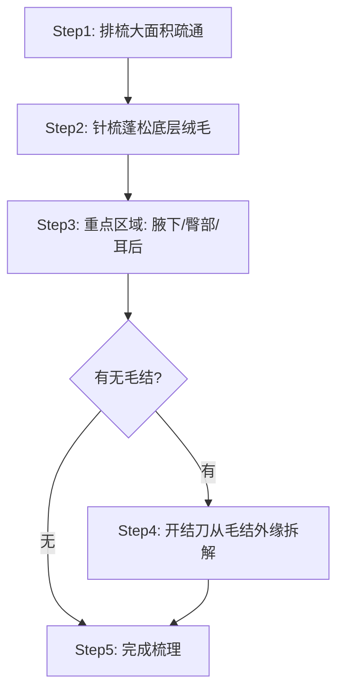
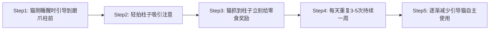
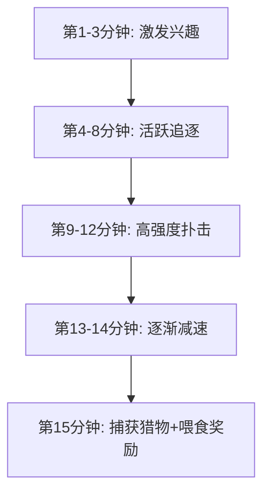

# 第6章 猫的日常护理全流程：从梳毛到体重管理的一站式指南

你以为养猫只要喂饱就行？其实猫需要7大护理模块，90%的新手漏了3个以上。

我是怕浪猫，今天教你做猫的全科护士。上一章我们讲了猫的健康监测，这一章进入更实操的领域——日常护理。很多人觉得猫是"自清洁动物"，不用怎么管。这个观念对了一半，猫确实会自己舔毛，但正因为它们天天舔毛，才更需要你帮忙梳理、排查皮肤问题、清理毛球。再加上指甲、牙齿、眼睛、耳朵、体重、季节性管理，一只猫的日常护理远比你想象的复杂。

这一章我会把7个护理模块拆开讲，每个模块都给你可执行的流程和判断标准。你可以把它当护理手册，遇到问题随时翻。

> 猫不需要你照顾它的尊严，它需要你照顾它的皮肤、牙齿、指甲和体重。

## 6.1 梳毛与皮肤护理：不同毛质的护理方案

梳毛是所有护理中最高频的一项。不是为了让猫好看，而是为了减少毛球症、排查皮肤异常、维持皮毛健康。不同毛质的猫，梳毛工具和频率完全不同。

### 短毛猫护理：橡胶手套与短齿梳的每周方案

短毛猫的代表品种有美短、英短、暹罗、中华田园猫等。它们的毛发长度通常在2-5厘米，底层绒毛较少，日常打理相对轻松。但"轻松"不等于"不用管"，短毛猫同样会掉毛、产生皮屑、吞入过多毛发。

短毛猫的标准梳毛频率是每周2-3次，每次5-10分钟。核心工具有两样：橡胶脱毛手套和短齿梳。橡胶手套适合大面积摩擦，利用静电和橡胶的摩擦力把浮毛带出来。短齿梳用于精修区域，比如脸颊后方、腋下和腹部，这些地方容易藏死毛。

操作流程很简单。先戴橡胶手套顺着毛发生长方向大面积抚摸1-2分钟，浮毛会粘在手套上。然后用短齿梳逆毛梳理一遍，再顺毛梳理一遍。重点检查腋下和耳后，这两个区域容易打结和积累皮屑。最后用微湿的手从头到尾抹一遍，吸附残留的细小浮毛。

短毛猫换毛季（春秋）需要增加到每天一次，其他季节每周2-3次足够。

### 长毛猫护理：排梳、针梳与开结的每日流程

长毛猫包括波斯猫、布偶猫、缅因猫、金吉拉等品种。毛发长度可达10-15厘米，底层绒毛丰富，不打理的话48小时内就可能形成毛结。长毛猫的梳毛不是"可选项目"，是"必须项目"。

长毛猫需要每天梳毛，每次10-15分钟。核心工具三件套：排梳（钢齿间距宽）、针梳（带圆头针）和开结刀（用于已经形成的毛结）。

每日梳毛流程如下：



排梳先上场，从背部开始，沿着毛发生长方向梳通。遇到阻力不要硬拉，停下来用手按住毛根，再轻轻梳开。针梳用于蓬松底层绒毛，把排梳梳不到的细密底毛挑起来。针梳使用时要保持30度角，避免直插皮肤。

最容易打结的三个区域要重点照顾：腋下（前腿内侧）、臀部（尾巴根部两侧）和耳后。这三个区域摩擦多、湿度大，毛结高发。

如果已经形成毛结，用开结刀从毛结外缘慢慢切入，把大结拆成小结，再用排梳梳开。不要用剪刀直接剪毛结——猫的皮肤非常薄，剪到皮肤的出血风险极高。如果毛结已经紧贴皮肤无法拆解，建议去宠物医院让专业人员用推子处理。

> 梳毛不是美容，是体检。每一次梳毛都是一次全身皮肤扫描。

### 无毛猫护理：皮肤油脂擦拭与防晒管理

无毛猫（以斯芬克斯猫为代表）的护理逻辑完全不同。它们没有毛发吸收皮肤分泌的油脂，所以皮肤表面会积累大量油脂和汗液。如果你养过无毛猫就知道，摸完之后手上会有一层油膜。

无毛猫需要每周用温水擦拭全身1-2次。用柔软的微纤维布蘸温水，轻轻擦拭全身皮肤。重点区域是褶皱处——脸部褶皱、腋下、腹部褶皱和脚趾间。这些地方容易积累油脂和污垢，不及时清理会引发皮肤炎症。

每2-4周需要洗一次澡，使用pH值5.5-6.5的猫专用沐浴液。洗澡后必须彻底擦干，褶皱处要用毛巾仔细吸干水分。残留水分在褶皱里是细菌和真菌的温床。

防晒是无毛猫的特殊课题。猫喜欢晒太阳，但无毛猫的皮肤没有毛发保护，长时间暴晒会导致晒伤甚至皮肤癌。如果猫有晒太阳的习惯，建议在窗户上贴防紫外线膜，或者限制单次晒太阳时间不超过30分钟。绝对不能给猫涂人用防晒霜——氧化锌和某些化学防晒成分对猫有毒。

### 换毛季的强化梳毛：减少毛球症的实操方法

春秋两季是猫的换毛高峰期。日照时间变化触发猫的换毛机制，旧毛脱落、新毛生长。室内猫因为人工照明（Artificial Lighting）的影响，换毛不如室外猫那么集中，但春秋两季仍然会有明显的掉毛量增加。

换毛季的梳毛频率要从平时的每周2-3次提升到每天1-2次。除了增加频率，还要增加深度——用底毛耙深入底层，把即将脱落的死毛提前拉出来。死毛留在身上，猫舔毛时就会吞进去，形成毛球。

毛球症（Hairball Syndrome）是换毛季最常见的健康问题。猫无法消化的毛发在胃里积聚成球，严重时会堵塞肠道。典型症状是干呕（尤其是饭后）、便秘、食欲下降。预防毛球症的核心策略有三条：

| 策略 | 具体操作 | 频率 |
|------|---------|------|
| 物理排出 | 每日梳毛加底毛耙深层清理 | 每天1次 |
| 润滑肠道 | 猫草促进肠道蠕动 | 每周3-4次 |
| 化毛膏辅助 | 含矿物油或麦芽膏的化毛产品 | 换毛季每周2-3次 |

猫草的作用机制是纤维素刺激肠道蠕动，帮助毛发随粪便排出。化毛膏的作用是润滑消化道，使毛发更容易通过。两者不冲突，可以配合使用。

> 你每多梳掉一把毛，猫的胃里就少一个毛球。

### 皮肤健康检查：皮屑、红疹与脱毛区域的日常排查

梳毛的第二个功能是皮肤检查。每次梳毛时，你都在做一次全身皮肤扫描。需要关注的异常信号有五类：

第一类是皮屑。少量皮屑可能是干燥引起，大量皮屑则可能是真菌感染（如猫癣）或营养不良。用梳子分开毛发，如果看到大面积白色鳞屑附着在皮肤上，需要进一步检查。

第二类是红疹和丘疹。皮肤上出现红色小疙瘩，可能是过敏（食物过敏或跳蚤过敏）、螨虫感染或细菌性皮炎。如果猫频繁抓挠同一区域，检查该区域是否有红疹。

第三类是脱毛区域。局部脱毛可能是猫癣、跳蚤过敏、应激性过度舔毛或内分泌问题。圆形脱毛高度怀疑猫癣，对称性脱毛可能是内分泌问题，条状脱毛可能是过度舔毛造成。

第四类是皮肤颜色变化。正常猫的皮肤是淡粉色。如果皮肤发黄可能提示肝胆问题，发蓝发紫可能是循环问题，局部发黑可能是慢性炎症后的色素沉着。

第五类是寄生虫。拨开毛发检查皮肤表面，看是否有跳蚤（黑色小虫或红褐色跳蚤粪便）或蜱虫（附着在皮肤上的灰褐色小突起）。

建议每次梳毛后花1-2分钟做这个检查，养成习惯后不会额外占用时间。

## 6.2 指甲修剪与磨爪引导

指甲修剪是很多新手猫主人最害怕的操作。怕剪出血、怕猫挣扎、怕被抓伤。但指甲不修剪，猫的指甲会弯曲生长刺入肉垫，造成感染。这一节教你安全、高效地完成指甲修剪。

### 修剪频率与工具：普通指甲剪 vs 猫专用剪

猫的指甲生长速度比狗快，通常每2-3周需要修剪一次。前爪指甲长得快，后爪指甲磨损多可以延长到4-6周修一次。如果你听到猫在地板上走路发出"嗒嗒"声，说明指甲已经太长了。

指甲修剪工具有三类：

| 工具类型 | 特点 | 适用场景 | 价格区间 |
|---------|------|---------|---------|
| 猫专用指甲剪（弹簧式） | 圆孔限位，弹簧助力，切口圆润 | 日常家用首选 | 30-80元 |
| 人用指甲剪 | 切口平直，容易劈裂猫指甲 | 不推荐 | 不适用 |
| 磨甲器（电动） | 打磨而非剪切，切口光滑 | 害怕剪指甲的猫或老年猫 | 80-200元 |

猫专用指甲剪的设计原理是利用圆孔限制指甲位置，弧形刀刃一次性剪断，避免指甲劈裂。人用指甲剪的平直刀刃会让猫的指甲从中间裂开，伤及甲床，不推荐使用。

选择指甲剪时注意尺寸。小型猫（如暹罗）用小号，大型猫（如缅因猫）用大号。太大或太小都会影响操作精度。

### 保定技巧：如何让猫安静配合剪指甲

"保定"是兽医专业术语，意思是安全地限制动物活动。剪指甲时的保定不是把猫按住不动，而是让猫处于放松状态，减少应激。

最有效的保定姿势是"毛巾包裹法"。用一条大毛巾把猫的身体裹住，只露出要剪的那只爪子。毛巾提供压力感，对猫有镇静作用（类似安抚背心的原理）。

操作时建议两个人配合。一个人负责保定和安抚，另一个人负责剪指甲。如果只有一个人，可以坐在地上把猫夹在两腿之间，用非惯用手握住前爪，惯用手操作指甲剪。

时机选择很关键。最佳剪指甲时机是猫刚吃完饭或玩累了之后，处于困倦状态时。不要在猫兴奋、饥饿或紧张时强行操作。

每次只剪几颗指甲也没关系。如果猫开始甩尾巴、耳朵压平、发出低吼，立刻停下来，改天再继续。强迫操作只会让猫对剪指甲产生长期恐惧。

> 猫的信任不是剪出来的，是不剪出血攒出来的。

### 快速（血线）的识别与意外出血处理

猫的指甲内部有一条粉红色的血管和神经，叫做"快速"（quick）或"血线"。剪到血线会出血和疼痛，是新手最怕的事。

识别血线的方法：轻轻按压猫的指甲，指甲会伸出。对着光看，指甲根部有一段粉红色区域，那就是血线。剪的位置要在血线前方2-3毫米处，只剪透明的弯曲尖端。

深色指甲的猫看不到粉红色血线，需要从指甲底部看。把指甲尖端朝向自己，能看到指甲中间有一个灰色三角形区域，那就是血线的远端。在灰色区域前方2毫米处剪断。

如果剪到血线出血了，不要慌。用止血粉（或玉米淀粉、面粉）按压出血点30秒即可止血。如果没有止血粉，用干净的纸巾按压3-5分钟也能止住。出血量通常不多，不会造成健康问题，但猫会疼，下次修剪时会更加抗拒。

预防出血的诀窍是"少量多次"。每次只剪一小截，看断面有没有出现粉红色圆点。如果断面出现粉红色，说明已经很接近血线了，不要再剪。

### 磨爪柱/板的材质选择：剑麻、瓦楞纸与木质

磨爪是猫的本能行为，不是"搞破坏"。猫磨爪有三个目的：脱落旧指甲壳、标记领地（爪子间有气味腺）、拉伸背部肌肉。提供合适的磨爪工具，猫就不会去磨你的沙发。

三种主流材质的对比：

**剑麻柱**：剑麻纤维质地粗糙，爪子勾住时有明显的阻力感，猫非常喜欢这种触感。剑麻柱耐用度高，适合大型猫。缺点是价格偏贵（80-200元），且需要定期更换缠绕的剑麻绳。

**瓦楞纸板**：瓦楞纸是最受欢迎的磨爪材料，因为价格便宜（15-50元）、猫接受度高。纸板的瓦楞纹理提供了猫需要的抓挠阻力。缺点是会产生纸屑，需要定期清理。

**木质**：天然原木表面纹理自然，部分猫很喜欢。木质磨爪柱耐用但选择面窄，且某些木材可能含有对猫有害的精油成分（如茶树木）。选择时确认木材种类安全。

建议家中至少放置2-3个不同材质的磨爪工具，让猫有选择。猫对磨爪工具有偏好，就像人对枕头有偏好一样。

### 引导磨爪行为：位置选择与正向强化训练

买了磨爪柱猫不用，是常见问题。原因通常是位置不对或没有引导。

磨爪柱的位置选择有三个原则。第一，放在猫经常活动区域附近，不要放在角落。第二，放在猫已经磨爪的地方（比如沙发旁边），用磨爪柱替代沙发。第三，入口和出口附近放一个——猫在领地边界磨爪的欲望最强。

磨爪柱的高度有讲究。立式磨爪柱的高度要超过猫完全站立伸展时的高度（通常60-90厘米）。猫磨爪时需要全身伸展，太矮的柱子猫不愿意用。

引导训练的步骤：



正向强化是核心。猫每次使用磨爪柱都给零食奖励，让它建立"磨爪柱等于好事"的关联。如果猫去磨沙发，不要大声呵斥（猫不理解惩罚），默默把猫抱到磨爪柱前即可。同时在沙发上贴双面胶或铝箔纸，让沙发变得"不好磨"。

## 6.3 口腔护理与牙齿健康

口腔护理是最容易被忽视的模块。很多猫主人从来没给猫刷过牙，直到猫口臭严重、不吃东西才去医院，结果满口牙结石、牙龈炎，需要全麻洗牙拔牙。其实猫的牙齿问题和人一样——预防的成本远低于治疗。

### 猫牙齿结构与换牙时间表

猫的牙齿结构和人有明显差异。成年猫有30颗恒牙，分为切齿（12颗）、犬齿（4颗）、前臼齿（10颗）和臼齿（4颗）。猫没有研磨用的臼齿，它们的臼齿是切割型的，这说明猫是纯肉食动物，牙齿设计用于撕裂和切割肉类。

小猫出生时有26颗乳牙，在3-4周龄开始长出，到6-7周龄长齐。换牙从11周龄开始，通常在6-7月龄完成。换牙期间猫可能会食欲下降、流口水增多，这是正常现象。

换牙期间可以提供适合啃咬的玩具帮助乳牙脱落。但不要让猫啃硬物（如骨头），幼猫的牙齿和颌骨还在发育，过硬的物品可能造成牙齿损伤或颌骨错位。

猫最常见的牙齿问题是犬齿和后方的臼齿。犬齿容易积累牙菌斑，臼齿因为位置靠后难以清洁，容易形成牙结石。

### 牙菌斑与牙结石的形成过程

牙菌斑是牙齿表面的细菌薄膜，形成速度极快——清洁后的牙齿6小时内就会有菌斑附着。菌斑初期是软的，可以用刷牙清除。但如果不在48小时内清除，菌斑会矿化变硬，形成牙结石。

牙结石形成后，刷牙就无法去除了，只能通过专业洗牙清除。牙结石表面粗糙，更容易附着新的菌斑，形成恶性循环。

牙结石刺激牙龈，导致牙龈炎。牙龈炎进一步发展为牙周炎（Periodontitis），牙周炎会破坏牙齿周围的支持组织，最终导致牙齿松动脱落。更严重的是，口腔细菌可能通过血液循环影响心脏、肾脏和肝脏。

以下是牙结石形成的阶段和对应表现：

| 阶段 | 表现 | 可逆性 | 处理方式 |
|------|------|--------|---------|
| Stage 0 牙菌斑 | 牙齿表面淡黄色薄膜 | 可逆 | 刷牙清除 |
| Stage 1 牙龈炎 | 牙龈红肿口臭 | 可逆 | 刷牙加洁齿产品 |
| Stage 2 早期牙结石 | 牙根处黄色沉积物 | 不可逆 | 专业洗牙 |
| Stage 3 中度牙结石 | 大量结石牙龈萎缩 | 不可逆 | 专业洗牙加牙龈治疗 |
| Stage 4 重度牙周炎 | 牙齿松动化脓 | 不可逆 | 拔牙加抗生素 |

> 你每天刷两次牙，你的猫从来不刷。它的牙齿出问题是早晚的事。

### 刷牙训练：从适应触摸到配合刷牙的分步方案

给猫刷牙不是不可能，关键是训练方法。不要上来就拿牙刷往猫嘴里塞，那只会让猫对刷牙产生恐惧。

刷牙训练分四个阶段，每个阶段持续3-7天，根据猫的接受度调整进度。

**阶段一：适应嘴部触摸。** 在猫放松时（比如吃完饭），用手指轻轻抚摸猫的脸颊和嘴角。如果猫不反抗，慢慢翻开嘴唇，触摸牙齿外侧。每次触摸后给零食奖励。目标：猫允许你触摸嘴部30秒以上。

**阶段二：适应纱布。** 用纱布包裹食指，蘸少量猫专用牙膏（注意：不能用人的牙膏，氟化物对猫有毒），轻轻摩擦猫的犬齿外侧。不需要刷内侧，猫的舌头会清洁内侧。目标：猫接受纱布摩擦牙齿10秒以上。

**阶段三：引入指套刷。** 用硅胶指套刷替代纱布，刷牙范围从犬齿扩展到前臼齿。动作是小幅度的圆周运动，每个位置刷3-5下。目标：猫接受指套刷刷牙30秒以上。

**阶段四：使用猫专用牙刷。** 从指套刷过渡到小头猫专用牙刷或婴儿软毛牙刷。刷牙角度45度对准牙龈线，每个区域刷5-10下。重点刷犬齿和后臼齿。

以下是刷牙训练的进度记录表模板：

```
刷牙训练日志
猫咪名字: _______
日期: _______
阶段: [ ] 1-触摸  [ ] 2-纱布  [ ] 3-指套  [ ] 4-牙刷
持续时间: _______ 秒
猫的反应: [ ] 放松  [ ] 一般  [ ] 抗拒  [ ] 攻击
奖励零食: _______
备注: _________________________
```

刷牙的理想频率是每天一次，如果做不到每天，至少隔天一次。刷牙时间不需要长，30-60秒覆盖所有外侧牙面就有效果。

### 牙科零食与洁齿水的辅助效果评估

如果你实在无法给猫刷牙，牙科零食和洁齿水是退而求其次的选择。但要明确：这些产品不能完全替代刷牙。

牙科零食的原理是通过特殊的质地和形状，在猫咀嚼时产生机械摩擦，减少牙菌斑。选择时认准 VOHC（Veterinary Oral Health Council，兽医口腔健康委员会）认证标志。VOHC认证意味着该产品经过临床验证，确实能减少牙菌斑或牙结石。

洁齿水是添加到饮用水中的液体产品，含有抑菌成分（如氯己定）或酶类（如葡萄糖氧化酶）。猫每次喝水时都会摄入少量，起到一定的抑菌作用。效果不如刷牙，但比完全不护理好。

需要警惕的是市面上很多"洁齿零食"没有经过临床验证，只是普通零食换了包装。购买时检查包装上是否有VOHC认证标志，没有认证的不建议作为牙科护理产品购买。

### 专业洗牙：全身麻醉下的口腔清洁与检查

当牙结石已经形成，刷牙和零食都无法解决，就需要专业洗牙。猫的专业洗牙必须在全身麻醉下进行——清醒的猫不可能配合口腔操作。

全身麻醉让很多主人担心风险。确实，麻醉有一定风险，但现代麻醉技术已经相当安全。术前需要做血液检查评估肝肾功能和凝血功能，排除麻醉禁忌症。对于老年猫，还建议做心电图和胸部X光。

专业洗牙的流程包括：超声波洁牙（去除牙结石）、抛光（光滑牙面减少菌斑附着）、牙周袋探诊（检查牙周组织损伤程度）和口腔X光（检查牙根和颌骨状况）。如果发现需要拔除的牙齿，会在同一次麻醉中完成。

洗牙频率因猫而异。认真刷牙的猫可能终身不需要专业洗牙，从不刷牙的猫可能2-3年就需要洗一次。定期口腔检查（每年1-2次）可以帮你判断何时需要洗牙。

## 6.4 眼耳清洁与日常检查

眼睛和耳朵是猫的"窗户"，也是容易藏问题的区域。定期检查可以早期发现感染、炎症和其他健康问题。

### 眼睛检查：分泌物颜色、第三眼睑与瞳孔对称性

猫的眼睛检查关注三个指标：分泌物颜色、第三眼睑状态和瞳孔对称性。

正常猫的眼睛可能有少量透明或浅褐色分泌物，尤其在早晨。这是正常的泪液干燥产物，用棉球蘸生理盐水擦拭即可。但如果分泌物颜色改变，就需要警惕了。

不同颜色分泌物的含义：

| 分泌物颜色 | 可能原因 | 紧急程度 |
|-----------|---------|---------|
| 透明 | 正常泪液或轻度过敏 | 低 |
| 黄绿色 | 细菌感染 | 中 |
| 浓黄脓性 | 严重细菌感染 | 高 |
| 红色血性 | 外伤或凝血问题 | 紧急 |

第三眼睑（Third Eyelid，也叫瞬膜）是猫眼内角的粉白色薄膜。正常情况下第三眼睑隐藏在眼眶内，看不到。如果猫醒着时第三眼睑明显可见，覆盖了部分眼球，这叫"第三眼睑脱出"，可能提示眼部感染、神经系统问题或全身性疾病。

瞳孔对称性检查在光线适中的环境下进行。正常情况下，猫的两眼瞳孔大小应该一致。如果一侧瞳孔大于另一侧（瞳孔不等大），可能提示眼部炎症、神经系统问题或青光眼。这种情况需要紧急就医。

### 眼部清洁：生理盐水棉球的正确擦拭方向

眼部清洁是最基本的护理操作，但很多人做错了方向。

正确的清洁方法：用棉球或无纺布蘸取生理盐水（0.9%氯化钠溶液），从眼内角（靠近鼻子的一侧）向眼外角轻轻擦拭。每次用一个新棉球，不要来回擦。这样做的目的是把分泌物从眼内带出，而不是把外面的细菌带进眼内。

擦拭力度要轻。猫的眼球和眼周皮肤都很脆弱，用力擦拭会造成角膜划伤或皮肤破损。如果分泌物干涸粘在毛发上，先用湿棉球敷30秒软化，再擦拭。

不能用自来水代替生理盐水。自来水含有氯和其他杂质，可能刺激眼部。也不能用人用眼药水给猫滴——很多成分对猫不安全。

清洁频率取决于猫的情况。健康猫每周1-2次足够，扁脸猫（如波斯猫、异短）因为泪管结构问题容易产生泪痕，需要每天清洁。

### 耳朵检查：耳垢颜色、气味与耳螨的识别

猫的耳朵是L形耳道，比人的耳道更深更弯。这个结构虽然保护了鼓膜，但也容易积累耳垢和藏匿寄生虫。

健康猫的耳道应该是淡粉色，有少量浅黄色耳垢，无明显气味。检查时轻轻翻折耳廓，用光照观察耳道内部。

异常耳垢的判断标准：

**黑色干燥耳垢（像咖啡渣）**：高度怀疑耳螨。耳螨（Otodectes cynotis）是猫最常见的耳道寄生虫，具有高度传染性。确诊需要在显微镜下观察螨虫，但咖啡渣样耳垢是典型的临床特征。

**深褐色湿润耳垢**：可能是马拉色菌（Malassezia）感染或细菌感染。通常伴有明显异味。

**黄色脓性分泌物**：细菌性耳道感染，需要兽医处方抗生素治疗。

**大量黑色耳垢且耳廓外面也有**：可能是耳螨严重感染，猫频繁甩头甩出耳垢。

猫频繁抓耳朵、甩头、耳朵歪斜，都是耳道不适的信号，需要及时检查。

### 耳道清洁：洗耳液的使用频率与手法

耳道清洁不是越频繁越好。过度清洁会破坏耳道正常菌群，反而增加感染风险。健康猫每月1次耳道清洁足够，有耳螨或感染的猫按兽医指导频率清洁。

正确的耳道清洁步骤：

第一步，选用猫专用洗耳液（pH值适配，不含酒精）。将洗耳液滴入耳道，直到液面接近耳道口。轻轻按摩耳根15-20秒，你会听到"咕叽咕叽"的声音，那是洗耳液在耳道内搅动耳垢的声音。

第二步，让猫甩头。猫会自然甩头把洗耳液和溶解的耳垢甩出来。不要阻止猫甩头。

第三步，用棉球（不是棉签！）擦拭耳廓可见部分的耳垢。棉签不能伸进耳道——猫的耳道是L形的，棉签直推会把耳垢推到耳道深处，甚至伤到鼓膜。

如果猫有耳螨，清洁后需要按兽医处方滴入杀螨耳药水。先用洗耳液清洁，等耳道干燥后再滴药，否则药水会被残余洗耳液稀释。

### 异常信号：眼泪过多、眼睛斜视与歪头的关联

有些异常信号单独看不明显，但组合在一起可能指向特定疾病。

眼泪过多（Epiphora）伴随鼻子打喷嚏，可能提示上呼吸道感染（URI，Upper Respiratory Infection）。猫疱疹病毒和杯状病毒是上呼吸道感染的常见病原，除了眼泪多，还会有打喷嚏、食欲下降等症状。

眼睛斜视加头部歪斜，可能提示中耳炎或内耳问题。中耳炎会影响平衡神经，导致猫歪头和眼球震颤（眼球不自主地左右或上下跳动）。这种情况需要尽快就医，中耳炎如果不治疗可能造成永久性听力损伤。

突然出现第三眼睑脱出且精神萎靡，可能是全身性疾病的信号。一些严重的系统性疾病（如猫传染性腹膜炎）早期可能表现为第三眼睑脱出。

记住一个原则：单个轻微症状可以先观察1-2天，多个症状同时出现或症状持续加重，必须就医。

## 6.5 洗澡频率与正确方式

关于猫洗澡，争论很多。有人说猫不需要洗澡，有人说必须定期洗。真相介于两者之间——大多数室内猫确实不需要频繁洗澡，但某些情况下洗澡是必要的。

### "猫需要洗澡吗"：室内猫的低频洗澡原则

猫每天花大量时间舔毛，自我清洁能力很强。对于健康的室内短毛猫，一年洗1-2次澡甚至不洗都完全可以。猫的皮肤表面有一层天然油脂层，频繁洗澡会破坏这层保护膜，导致皮肤干燥、皮屑增多甚至皮炎。

以下情况需要洗澡：

| 场景 | 洗澡必要性 | 建议频率 |
|------|-----------|---------|
| 健康室内短毛猫 | 低 | 每年0-2次 |
| 健康室内长毛猫 | 中 | 每年2-4次 |
| 无毛猫 | 高 | 每2-4周1次 |
| 皮肤疾病药浴 | 医嘱 | 按兽医指示 |
| 意外弄脏（油污/化学品） | 紧急 | 立即 |
| 准备参赛 | 中 | 赛前1-2天 |

除了无毛猫和药浴，其他情况的洗澡频率都不高。如果你的猫毛发看起来脏了，先试试用湿毛巾擦拭，不一定需要全身水洗。

### 洗澡前准备：指甲修剪、耳塞与防滑垫

洗澡前的准备工作比洗澡本身更重要。准备充分，洗澡过程才能顺利安全。

洗澡前必须做的事项清单：

**第一，修剪指甲。** 洗澡时猫很可能挣扎，提前剪好指甲可以保护你不被抓伤，也防止猫在挣扎中抓伤自己。

**第二，塞耳塞。** 用棉球轻轻塞住猫的耳道口（不要塞进去，只是堵住入口），防止水流入耳道。水进入耳道是洗澡后耳道感染的主要原因。

**第三，铺垫防滑。** 在洗澡台面或水盆底部铺一块橡胶防滑垫。猫在湿滑表面上会更加恐慌，防滑垫让猫站得稳，减少挣扎。

**第四，准备用品。** 洗澡前把所有用品放在伸手可及的地方：猫专用沐浴液、至少3条大毛巾、洗耳液。一旦开始洗澡，你不能离开猫去拿东西。

**第五，调节水温。** 水温控制在38-39度（猫的体温比人高，所以水温感觉应该比人体舒适温度略高）。用手肘或温度计测试水温。

### 水温与沐浴液：pH值适配的猫专用产品选择

猫的皮肤pH值在6.0-7.0之间，比人的皮肤（pH 5.5）偏中性。人用沐浴液和洗发水对猫来说酸性过强，会破坏猫皮肤的酸碱平衡。必须使用猫专用沐浴液。

选择沐浴液时注意几点：pH值标注在6.0-7.0之间，无人工香精，无染色剂。如果猫有皮肤问题，兽医可能推荐药用沐浴液（如含氯己定的抗菌沐浴液或含咪康唑的抗真菌沐浴液）。

洗澡时的水流应该从背部往下，避免直接冲头部。头部用湿毛巾擦拭即可。先从背部和颈部开始打湿，然后是四肢和腹部，最后用湿毛巾擦头部和脸部。

沐浴液涂抹后轻轻按摩2-3分钟，让泡沫覆盖全身。然后彻底冲洗干净——残留的沐浴液会引起皮肤瘙痒。冲洗时间应该是打泡时间的两倍。

> 洗澡不是让猫开心的事，是让猫健康的事。如果猫不喜欢，减少频率但不要不做。

### 吹干流程：低噪音吹风机与毛巾包裹法

洗完澡后必须彻底吹干。湿毛发贴在皮肤上会降低体温，潮湿的皮肤环境也容易滋生真菌。短毛猫至少要擦到8成干，长毛猫必须用吹风机吹到完全干。

吹干流程：

第一步，用大毛巾把猫整个裹住，按压吸水（不要搓揉，搓揉会打结毛发）。换第二条毛巾重复一次。这一步能吸掉50-60%的水分。

第二步，使用宠物专用低噪音吹风机（或家用吹风机的低档位）。吹风机离猫30厘米以上，温度调到低档（不烫手的程度）。先从背部开始吹，猫适应后再吹腹部和四肢。

第三步，用针梳边吹边梳，顺着毛发生长方向。这样吹干的毛发更蓬松，不容易打结。

如果猫极度害怕吹风机的声音，可以用宠物烘干箱。烘干箱温度设定在35-38度，时间20-30分钟。使用烘干箱时必须有人在场监控，防止温度过高。

绝对不能让湿猫自然风干。自然风干的过程中猫可能着凉感冒，尤其是幼猫和老年猫。

### 特殊情况洗澡：皮肤药浴、老年猫与无毛猫

皮肤药浴是治疗猫癣、细菌性皮炎等皮肤疾病的手段之一。药浴使用的沐浴液含有药物成分（如石硫合剂、咪康唑等），需要在皮肤上停留5-10分钟才能起效。药浴频率和疗程由兽医决定，通常每周1-2次，持续4-8周。

药浴时要注意：戴手套操作（药物对人皮肤也有刺激），避免药液接触猫的眼睛和嘴巴。药浴后彻底冲洗，防止猫舔毛时摄入药物残留。

老年猫洗澡需要特别谨慎。老年猫可能有关节炎、心脏病等问题，洗澡的应激和体温变化可能带来风险。能不洗就不洗，必须洗时用温水局部擦洗代替全身水洗。洗完后特别注意保暖，确保完全吹干。

无毛猫的洗澡前面已经提到，每2-4周一次。无毛猫洗澡后要特别注意褶皱处的干燥，可以用吹风机的冷风档吹干褶皱里的残留水分。

## 6.6 体重管理与运动需求

肥胖是宠物猫最常见的营养相关疾病。据调查，超过50%的室内猫存在超重或肥胖问题。体重管理不是"可选项目"，是必须的日常护理。

### 体况评分（Body Condition Score, BCS）：1-9分的目测与触诊标准

体况评分（Body Condition Score, BCS）是评估猫体脂状况的标准方法，采用1-9分制。BCS评分不需要称重，通过目测和触诊即可完成。

BCS评分标准：

| BCS分数 | 描述 | 侧面观察 | 俯视观察 | 触诊肋骨 |
|---------|------|---------|---------|---------|
| 1-2 极瘦 | 严重消瘦 | 腰腹极度凹陷 | 明显可见骨骼 | 肋骨极易触及，无脂肪覆盖 |
| 3 瘦 | 偏瘦 | 腰腹明显凹陷 | 腰部明显变窄 | 肋骨容易触及，少量脂肪 |
| 4 理想偏瘦 | 理想下限 | 腰线明显 | 腰部适度变窄 | 肋骨可触及，薄脂肪层 |
| 5 理想 | 标准体型 | 腰线可见 | 腰部平滑过渡 | 肋骨可触及，适度脂肪 |
| 6 理想偏胖 | 理想上限 | 腰线略可见 | 腰部略宽 | 肋骨可触及，稍厚脂肪 |
| 7 超重 | 偏胖 | 腰线不明显 | 腰部圆宽 | 肋骨难触及，厚脂肪层 |
| 8 肥胖 | 胖 | 腹部明显膨出 | 体型椭圆 | 肋骨很难触及 |
| 9 严重肥胖 | 极胖 | 腹部大量脂肪堆积 | 体型圆球 | 肋骨触及不到 |

理想BCS是4-5分。你可以用以下简单的判断逻辑进行评分：

```python
def bcs_score(ribs_visible, ribs_palpable, waist_visible, abdominal_fat):
    """简化版BCS评分逻辑"""
    score = 5  # 基准分
    
    if ribs_visible and not abdominal_fat:
        score -= 2  # 肋骨可见且无腹脂 -> 偏瘦
    if not ribs_palpable:
        score += 2  # 肋骨摸不到 -> 偏胖
    if not waist_visible:
        score += 1  # 看不到腰线 -> 超重
    if abdominal_fat == "大量":
        score += 1  # 腹部大量脂肪 -> 肥胖
    
    return max(1, min(9, score))
```

建议每月做一次BCS评分，记录在护理日历中。体重的变化是渐进的，肉眼很难察觉，定期评分能帮你及时发现问题。

### 猫肥胖的危害：糖尿病、关节炎与寿命缩短

肥胖不只是"不好看"，它是多种疾病的诱发因素。

糖尿病（Diabetes Mellitus）：肥胖猫患糖尿病的风险是正常体重猫的4倍。猫的糖尿病以2型（非胰岛素依赖型）为主，肥胖导致的胰岛素抵抗是核心机制。糖尿病猫需要终身注射胰岛素或口服降糖药，治疗费用高昂且管理复杂。

关节炎（Osteoarthritis）：多余的体重给关节带来额外负担，加速关节软骨磨损。肥胖猫的关节炎发病年龄比正常猫早2-4年。关节炎表现为跳跃困难、不爱活动、上厕所姿势改变（因为跨入猫砂盆会痛）。

寿命缩短：研究表明，BCS 8-9分的猫平均寿命比BCS 5分的猫短2-3年。肥胖还会增加麻醉风险、降低免疫力、加重心脏负担。

> 胖猫不是"福气"，是你正在缩短它的寿命。

### 减重方案：目标体重、热量计算与渐进式减重

如果你的猫BCS超过6分，就需要减重了。减重不能急——快速减重可能导致猫出现肝脂质沉积症（Hepatic Lipidosis），这是一种致命的肝脏疾病。

减重方案的设计步骤：

第一步，确定目标体重。目标体重的计算公式：目标体重 = 当前体重 x (1 - 超重比例)。例如，一只6kg的猫，BCS评分7分（超重约20%），目标体重约为6 x 0.8 = 4.8kg。

第二步，计算每日热量需求。减重期的热量需求约为维持能量的70-80%。维持能量的计算公式（静息能量需求，RER）：RER = 70 x (体重kg)^0.75。减重期喂食量 = RER x 0.8。

第三步，选择减重食物。减重专用猫粮的特点是高蛋白、低脂肪、高纤维。高蛋白可以减少肌肉流失，纤维增加饱腹感。不要用减少普通猫粮喂食量的方法减重——那样会导致营养不足。

第四步，渐进式减重。每周减重不超过体重的1-1.5%。也就是说，一只6kg的猫每周减重60-90克。每两周称一次体重，记录减重曲线。

第五步，调整方案。如果4周内体重没有变化，将热量摄入再减少10%。如果体重下降过快（超过每周1.5%），增加10%的热量摄入。

### 运动需求评估：不同年龄与品种的活动量差异

减重的另一个关键是增加运动量。但猫不是狗，你不能带猫出去遛。猫的运动需要通过游戏来实现。

不同年龄段猫的运动需求差异很大：

**幼猫（2-12月龄）**：精力旺盛，每天需要60分钟以上的分散式游戏。幼猫几乎什么玩具都感兴趣，这是建立运动习惯的最佳时期。

**青年猫（1-3岁）**：活动量仍然较高，每天需要30-45分钟的结构化游戏。这个阶段猫开始变得有选择性，需要找到它喜欢的玩具类型。

**成年猫（3-7岁）**：活动量开始下降，每天需要20-30分钟的游戏。成年猫容易发胖，保持运动量很重要。

**老年猫（7岁以上）**：活动量明显减少，每天需要15-20分钟的温和游戏。老年猫的关节可能不够灵活，避免高跳跃动作。

品种也有影响。东方型猫（如暹罗、阿比西尼亚）天生好动，运动需求高于短粗型猫（如英短、波斯）。缅因猫等大型猫虽然看起来需要很多运动，但实际上性格偏安静，中等运动量即可。

### 互动游戏设计：每天15分钟的结构化运动计划

每天15分钟的结构化运动，比偶尔玩1小时更有效。结构化运动的核心是"模拟狩猎"——让猫经历发现、追逐、捕获的完整过程。

一个标准的15分钟运动计划：



具体操作：前3分钟用逗猫棒在猫面前缓慢移动，激发兴趣但不让它抓到。第4-8分钟加快速度，模拟猎物逃跑，让猫追逐。第9-12分钟让猫做出扑击和跳跃动作。第13-14分钟减慢速度，模拟猎物疲惫。第15分钟让猫"捕获"玩具，然后立刻喂一小份食物，完成狩猎-进食的闭环。

玩具的选择要轮换。今天用逗猫棒，明天用激光笔（注意：激光笔游戏后一定要给猫一个可以实际抓住的玩具，否则持续无法捕获会导致挫败感），后天用球类。

以下是一个简单的护理日历生成逻辑：

```python
def generate_care_schedule(cat_name, age_months, coat_type, bcs):
    """生成猫的每日护理日历"""
    schedule = {"梳毛": "每天", "刷牙": "隔天", "剪指甲": "每2-3周"}
    
    if coat_type == "长毛":
        schedule["梳毛"] = "每天10-15分钟"
    elif coat_type == "短毛":
        schedule["梳毛"] = "每周2-3次"
    elif coat_type == "无毛":
        schedule["皮肤擦拭"] = "每周2次"
    
    if bcs >= 7:
        schedule["运动"] = "每天20分钟结构化运动"
        schedule["饮食"] = "减重处方粮, 控制热量"
    elif bcs <= 3:
        schedule["饮食"] = "增加营养, 排查寄生虫"
    else:
        schedule["运动"] = "每天15分钟互动游戏"
    
    return schedule
```

## 6.7 季节性护理：换毛季、夏季防暑与冬季保暖

猫的护理需求随季节变化。不同季节面临不同的健康风险，提前做好准备可以避免很多问题。

### 春秋换毛季：强化梳毛与毛球症预防

春季（3-5月）和秋季（9-11月）是猫的换毛高峰期。春季脱去冬毛长出夏毛，秋季脱去夏毛长出冬毛。换毛期间掉毛量可能是平时的3-5倍。

换毛季的强化措施：

梳毛频率翻倍。短毛猫从每周2-3次增加到每天1次，长毛猫从每天1次增加到每天2次。使用底毛耙深层清理，把即将脱落的死毛提前拉出来。

增加化毛产品。猫草供应量增加，每周提供4-5次。换毛季可以使用化毛膏每周2-3次辅助。

环境清洁加强。换毛季家中猫毛泛滥，建议每天用粘毛器清理猫窝和猫常待的区域。空气净化器可以帮助减少空气中的浮毛。

观察粪便。换毛季注意观察猫的粪便中是否有大量毛发。如果粪便中毛发过多或出现干呕、便秘，说明毛球排出不畅，需要增加化毛措施。

### 夏季防暑：适宜室温、中暑症状与降温方案

猫的正常体温是38-39度，比人高。猫的汗腺主要分布在爪垫，散热效率低。当环境温度超过30度时，猫就有中暑的风险。

夏季室内温度建议控制在24-28度。如果白天无人在家，至少保持通风。不要关空调省电——猫在密闭高温环境中可能中暑死亡。

中暑的症状按严重程度排列：过度喘气（张嘴呼吸） -> 流口水 -> 精神萎靡 -> 呕吐 -> 走路不稳 -> 虚脱昏迷。一旦出现走路不稳或虚脱，是紧急情况，需要立刻降温并送医。

猫中暑的紧急处理：

第一步，把猫转移到阴凉通风处。
第二步，用湿毛巾包裹猫的身体（不要用冰水，温差过大会导致血管收缩反而不利于散热）。
第三步，用风扇吹湿毛巾，利用蒸发降温。
第四步，在猫的爪垫和耳内侧涂抹凉水。
第五步，立刻送往宠物医院。

预防中暑的降温方案：提供多个饮水点，鼓励猫多喝水。在阴凉处放置冷却垫（凝胶冷却垫，猫可以趴在上面）。保持室内通风，必要时开空调。

### 冬季保暖：猫窝保温、暖气安全与老年猫护理

猫比人更怕冷。虽然猫有毛发保暖，但室内猫长期待在温暖环境中，毛发密度可能不如室外猫，对寒冷的耐受度较低。

冬季室内温度建议维持在18-22度。猫窝应该放在避风的位置，远离门缝和窗户缝隙。可以在猫窝里加一条毛毯或暖垫，增加保暖性。

暖气安全注意事项：

电暖器必须远离猫的活动范围。猫可能因为贪暖靠得太近，被烫伤或碰倒暖器引发火灾。电暖器周围至少保持50厘米的安全距离，最好选择有防倾倒断电功能的型号。

不要让猫直接趴在暖气片上。暖气片温度可能过高，长时间接触会造成低温烫伤。在暖气片前方放一个猫窝或垫子，让猫在安全距离内取暖。

老年猫冬季护理要特别关注关节问题。寒冷会加重关节炎症状，老年猫可能因为关节疼痛而不愿意活动。在老年猫常待的地方加厚垫子，提供温暖的休息环境。如果老年猫突然不愿意移动或走路姿势异常，可能是关节疼痛加重，需要就医评估。

### 梅雨季防潮：皮肤真菌与环境湿度控制

梅雨季（南方地区5-7月）的高湿度环境是皮肤真菌的温床。环境湿度超过70%时，真菌繁殖速度大幅加快。

梅雨季的防潮措施：

使用除湿机或空调除湿功能，将室内湿度控制在50-60%之间。这个湿度范围对猫和人都比较舒适，同时不利于真菌繁殖。

猫窝和垫子要定期清洗晾晒。梅雨季不容易晒干，可以使用烘干机或除湿机辅助干燥。潮湿的猫窝是真菌和细菌的温床。

观察猫的皮肤状况。梅雨季是猫癣高发期，如果发现猫出现圆形脱毛、皮屑增多、皮肤发红等症状，及时就医检查。猫癣（Ringworm，实际是真菌感染而非虫子）不仅传染给其他猫，还能传染给人。

长毛猫在梅雨季要特别注意保持毛发干燥。如果毛发被打湿（比如下雨天外出或不小心弄湿），必须彻底吹干。

### 节假日季节：烟花噪音恐惧与寄养准备

节假日（如春节、国庆）是猫主人需要特别关注的时期。烟花的噪音、家庭聚会的变化、出行寄养等问题都需要提前准备。

烟花噪音恐惧：猫对突然的巨大声响非常敏感。烟花爆炸的声音可能引起严重的应激反应，表现为躲藏、发抖、过度流口水、拒食。

应对措施：在烟花燃放的高峰时段（通常是除夕夜或特定节假日晚上），提前给猫准备一个安全的躲藏空间（如衣柜里放一个猫窝或床下的纸箱）。关闭门窗减少噪音。如果猫的噪音恐惧非常严重，可以提前咨询兽医，准备一些抗焦虑的药物或安抚用品（如猫面部信息素扩散器）。

寄养准备：节假日出行需要寄养猫的话，提前2-4周准备。选择正规寄养机构，确认寄养场所的疫苗接种要求（通常要求猫三联疫苗在有效期内）。提前带猫去寄养机构适应环境，第一次寄养建议先试寄1-2天。

寄养前准备的物品清单：猫粮（足够整个寄养期的量，突然换粮可能导致腹泻）、常用药品、猫的毛巾或玩具（带有家中气味，帮助猫减轻应激）、疫苗本和健康记录。

如果不想寄养，上门喂养是另一个选择。请朋友或专业上门喂养服务每天来1次，检查猫的饮食、饮水和猫砂盆情况。上门喂养的好处是猫不需要离开熟悉的环境，应激较小。

---

**收藏指南：猫的全年护理日历速查表**

| 月份 | 护理重点 | 关键操作 |
|------|---------|---------|
| 1月 | 冬季保暖 | 检查暖气安全, 老年猫关节护理 |
| 2月 | 春节准备 | 噪音应激防护, 寄养或上门喂养安排 |
| 3月 | 春季换毛开始 | 增加梳毛频率, 开始化毛膏辅助 |
| 4月 | 换毛高峰 | 每日梳毛, 检查皮肤, 预防毛球症 |
| 5月 | 梅雨季开始 | 除湿防潮, 预防猫癣 |
| 6月 | 夏季防暑 | 检查降温设备, 提供充足饮水 |
| 7月 | 高温防护 | 防中暑, 环境温度监控 |
| 8月 | 持续防暑 | 保持降温措施, 注意食物保鲜 |
| 9月 | 秋季换毛开始 | 增加梳毛频率, 化毛膏辅助 |
| 10月 | 换毛高峰 | 每日梳毛, 秋季体检安排 |
| 11月 | 初冬保暖 | 检查猫窝保暖性, 准备暖垫 |
| 12月 | 年终总结 | 全年体重趋势评估, 下年度护理计划 |

**BCS评分月度记录表**

| 月份 | BCS评分 | 体重(kg) | 肋骨触诊 | 腰线可见性 | 备注 |
|------|---------|---------|---------|-----------|------|
| 1月 | _____ | _____ | _____ | _____ | _____ |
| 2月 | _____ | _____ | _____ | _____ | _____ |
| 3月 | _____ | _____ | _____ | _____ | _____ |
| ... | ... | ... | ... | ... | ... |

**季节性护理清单速查**

| 季节 | 梳毛 | 饮食 | 环境 | 特殊关注 |
|------|------|------|------|---------|
| 春季 | 每日, 底毛耙 | 增加化毛产品 | 清理浮毛 | 皮肤检查 |
| 夏季 | 维持正常 | 增加饮水, 防食物变质 | 降温除湿 | 中暑预防 |
| 秋季 | 每日, 底毛耙 | 增加化毛产品 | 通风 | 年度体检 |
| 冬季 | 减少频率 | 适当增加热量 | 保暖防风 | 老年猫关节 |

---

以上就是猫的7大日常护理模块。护理不是一次性的事，是日复一日的习惯养成。每天花10分钟梳毛，每周花5分钟剪指甲，每月做一次BCS评分，每季度调整一次护理方案——这些小事累积起来，就是你的猫健康长寿的基础。

> 最好的护理不是最贵的，而是最坚持的。怕浪猫陪你一起，把每一天的护理做到位。

这一章到这里就结束了。如果你觉得有用，收藏这篇内容，把护理日历和BCS评分表打印出来贴在冰箱上，随时对照执行。

系列进度：6/12。

下一篇：猫到底该吃什么？干粮、湿粮、生骨肉哪个好？营养科学一篇讲透。
