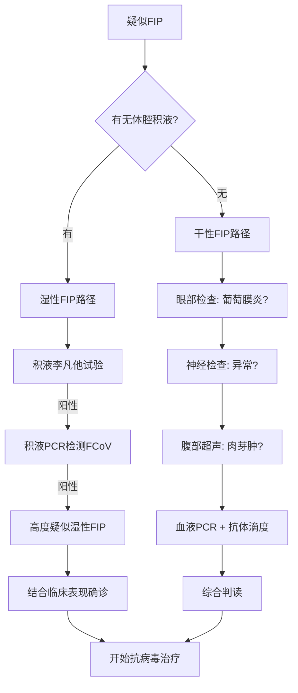
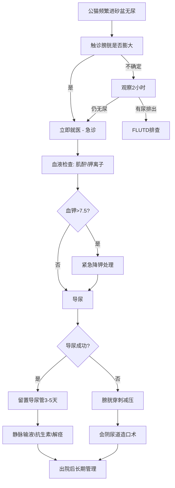
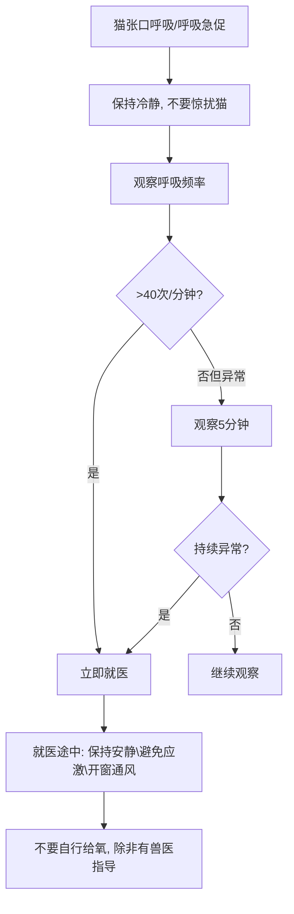
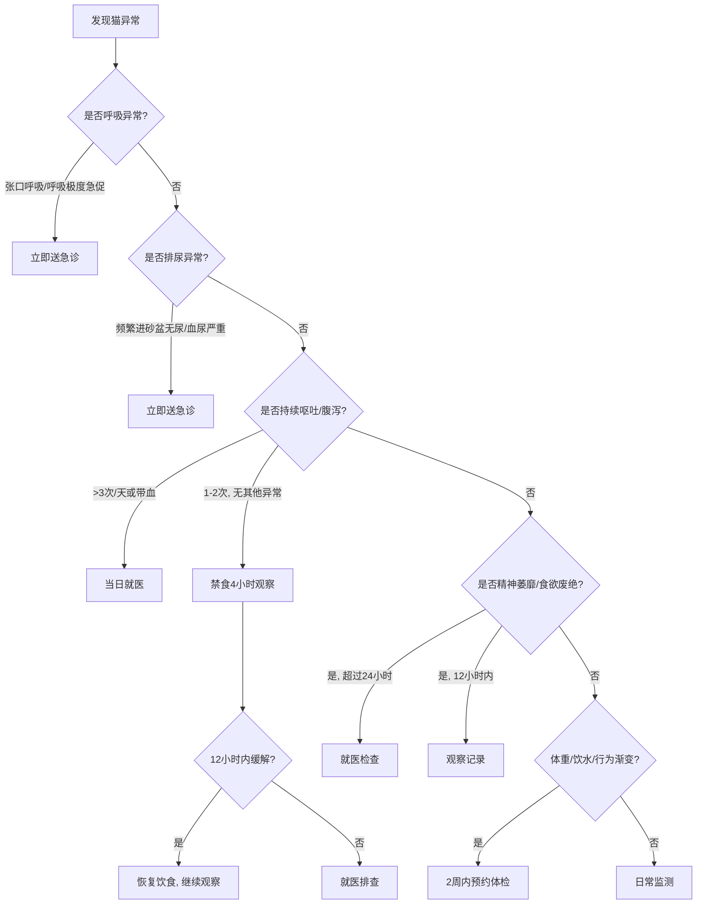

# 第八章 猫的常见疾病与家庭健康管理

猫是最能忍痛的动物，等你发现不对劲的时候，往往已经晚了。猫的祖先既是捕食者也是猎物，在野外显露虚弱意味着死亡。这种本能深深刻进了基因，即便躺在你家柔软的猫窝里，它依然会努力假装一切都好。作为铲屎官，你必须学会从细微处读出信号，才能在疾病真正夺走它之前按下暂停键。

我是怕浪猫，今天教你做猫的家庭医生。这一章我会把猫最常见的十类疾病从头到尾讲透，从病原体机制到家庭护理，从诊断流程到急救决策。你不需要成为兽医，但你需要知道什么时候该在家观察，什么时候该抓起猫包冲向医院。

> 猫不会告诉你哪里疼，但它的一举一动都在说话。学会阅读猫的身体语言，就是你能给它的最好的医疗保险。

## 8.1 猫瘟（猫泛白细胞减少症）：症状与预防

### 病原体：猫细小病毒的极强环境存活力

猫瘟的病原体是猫细小病毒（Feline Panleukopenia Virus, FPV），这是一种无包膜的单链DNA病毒。正因为没有脂质包膜，FPV在自然环境中极其顽固。它能在室温下存活长达一年，对普通酒精和季铵盐类消毒剂完全免疫。只有含氯消毒剂（如稀释的漂白水）或过硫酸钾类消毒剂才能有效灭活它。

FPV的靶细胞是所有快速分裂的细胞，尤其是骨髓中的造血干细胞、肠道隐窝上皮细胞和胎儿组织。这意味着感染后不仅白细胞急剧下降，肠道屏障也会全面崩溃。在未接种疫苗的幼猫群体中，猫瘟的死亡率可高达90%以上。

### 临床症状：高热、呕吐、腹泻与白细胞骤降

猫瘟的潜伏期通常为2至9天。发病初期，猫会出现突发高热，体温可达40至41摄氏度。随后迅速发展为严重的精神萎靡和食欲废绝。大多数猫会在发热后24至48小时内开始剧烈呕吐，呕吐物初期为食物残渣，后期转为黄色胆汁样液体。

腹泻通常在呕吐之后出现，粪便呈水样，常带有血丝和恶臭。此时血常规检查会显示白细胞计数骤降，严重病例的白细胞可低于1000个/微升（正常值为5500至19500个/微升）。白细胞的高低直接关系到预后，如果白细胞在3至5天内开始回升，存活概率显著增加。

### 传播途径：直接接触与环境间接传播

FPV的主要传播途径是通过感染猫的粪便、呕吐物和分泌物。在多猫环境（如收容所、猫舍）中，病原体可以通过食盆、水盆、猫砂铲甚至人的衣物和鞋子间接传播。这意味着即使你的猫从不出门，你也可能从外面把病毒带回家。

孕妇猫感染FPV尤为危险，病毒可以穿过胎盘感染胎儿，导致小脑发育不全。幸存的小猫会终身出现共济失调，行走时步态不稳。因此，未完成疫苗免疫的母猫绝对不应进行繁殖。

### 诊断方法：抗原检测与血常规

猫瘟的诊断主要依靠两个检查的组合。第一是粪便抗原快速检测（类似测孕棒原理），10至15分钟即可出结果。但需注意，接种弱毒疫苗后5至12天内的猫可能出现假阳性。第二是血常规，重点观察白细胞计数和红细胞计数的变化趋势。

| 检查项目 | 正常值 | 猫瘟典型表现 | 临床意义 |
|---------|--------|-------------|---------|
| 白细胞计数 | 5500-19500/μL | <3000/μL，重者<1000/μL | 骨髓抑制程度 |
| 中性粒细胞 | 2500-12500/μL | 显著下降 | 预后判断关键 |
| 红细胞比容 | 30%-45% | 可能下降（脱水纠正后） | 评估贫血 |
| 粪便抗原 | 阴性 | 阳性（疫苗干扰除外） | 确诊依据 |
| 血液PCR | 阴性 | 阳性 | 确诊与病毒载量 |

### 预防策略：核心疫苗的接种时间表与抗体滴度检测

猫瘟是可以通过疫苗有效预防的疾病，猫三联疫苗（FVRCP）中就包含猫瘟成分。以下是标准接种时间表：

| 年龄/阶段 | 疫苗种类 | 备注 |
|-----------|---------|------|
| 6-8周龄 | FVRCP第一针 | 母源抗体下降后开始 |
| 10-12周龄 | FVRCP第二针 | 间隔3-4周 |
| 14-16周龄 | FVRCP第三针 | 关键最后一针 |
| 1岁时 | FVRCP加强 | 完成基础免疫 |
| 此后每3年 | FVRCP加强 | 根据抗体滴度调整 |

对于成年猫，可以考虑做抗体滴度检测来决定是否需要加强免疫。如果抗体滴度足够，可以跳过本次加强针，减少不必要的疫苗反应风险。

> 花一百块打疫苗，还是花一万块治病？猫瘟给你的选择题从来只有这一个答案。

## 8.2 猫鼻支与猫杯状病毒感染

### 猫疱疹病毒：反复发作的上呼吸道感染

猫鼻支的病原体是猫疱疹病毒（Feline Herpesvirus-1, FHV-1），这是一种有包膜的DNA病毒。FHV-1最阴险的特征是终身潜伏感染。一旦猫感染，病毒会永久躲在三叉神经节中。每当猫受到应激（如搬家、新猫入门、住院），病毒就可能重新激活，导致症状再次出现。

典型症状包括频繁打喷嚏、浆液性转为脓性的鼻分泌物、结膜炎和眼分泌物。角膜可能发生树枝状溃疡，这是FHV-1感染的特征性病变。幼猫感染症状通常更重，可能继发细菌性肺炎。

### 猫杯状病毒：口腔溃疡与跛行综合征

猫杯状病毒（Feline Calicivirus, FCV）是另一种常见的上呼吸道病原体。与FHV-1不同，FCV的标志性症状是口腔溃疡，尤其是舌腹面和硬腭部位的溃疡。猫会表现出流口水、进食困难和口臭。

部分FCV毒株还会引起跛行综合征，表现为发热和一肢或多肢的短暂跛行，通常在数天内自行恢复。近年来还出现了高致病力FCV变异株（FCV-VSD），可引起全身性症状，包括皮肤水肿、溃疡和出血，死亡率较高。

### 鉴别诊断：两种病毒的症状重叠与确诊方法

FHV-1和FCV在临床上经常混合感染，症状存在重叠，但仍有特征性差异可帮助鉴别：

| 特征 | FHV-1（猫鼻支） | FCV（猫杯状） |
|------|----------------|--------------|
| 打喷嚏 | 频繁且剧烈 | 较轻 |
| 鼻分泌物 | 浓稠脓性 | 较少，浆液性 |
| 眼部症状 | 严重结膜炎、角膜溃疡 | 轻微或无 |
| 口腔溃疡 | 少见 | 标志性表现 |
| 流涎 | 少见 | 常见 |
| 跛行 | 无 | 可出现 |
| 潜伏带毒 | 三叉神经节终身潜伏 | 扁桃体持续排毒数月至数年 |

确诊方法包括PCR检测（眼/口/鼻拭子）和病毒分离培养。在临床上，经验丰富的兽医通常根据症状组合即可做出初步判断，但PCR能明确是否混合感染。

### 治疗方案：抗病毒药物、抗生素预防与支持疗法

FHV-1感染的治疗中，泛昔洛韦是目前最常用的口服抗病毒药物，剂量为每千克体重40至90毫克，每日两次，疗程至少2周。更昔洛韦眼膏可用于角膜溃疡的局部治疗。FCV目前没有特效抗病毒药物，治疗以支持疗法为主。

以下是猫上呼吸道感染的基本治疗决策逻辑：

```python
def urt_treatment_protocol(cat):
    """猫上呼吸道感染治疗决策"""
    if cat.fhv1_positive and cat.has_corneal_ulcer:
        cat.prescribe("famciclovir", 40-90, "mg/kg", "BID", 14)
        cat.prescribe_eye("ganciclovir_ointment", "TID")
    elif cat.fhv1_positive:
        cat.prescribe("famciclovir", 40-90, "mg/kg", "BID", 14)
    
    if cat.has_bacterial_discharge:  # 脓性分泌物
        cat.prescribe("doxycycline", 5, "mg/kg", "BID", 7-10)
    
    if cat.dehydrated:
        cat.subcutaneous_fluids()  # 皮下补液
    
    if cat.not_eating > 24:
        cat.appetite_stimulant()   # 食欲刺激剂
        cat.warm_food()            # 加热食物增强气味
    
    return cat.monitor(daily=True)
```

两种病毒感染都需要配合支持疗法，包括皮下补液、雾化治疗、清理眼鼻分泌物和保证营养摄入。猫因鼻塞闻不到食物气味时会拒绝进食，加热罐头至体温可以增强气味吸引力。

### 预防与潜伏带毒：终身排毒风险与多猫管理

FHV-1和FCV都通过飞沫和直接接触传播。FCV还能在环境中存活数天。疫苗接种（FVRCP）不能完全阻止感染，但能显著减轻症状严重程度和缩短排毒期。

对于已感染的猫，管理重点是减少应激诱发的复发。引入新猫前应隔离至少2周，多猫家庭应避免过度拥挤。潜伏带毒猫是隐蔽的传染源，在猫舍和收容所环境中尤其需要管理。

> 猫鼻支不是感冒，它不会自愈，也永远不会真正离开。你能做的，是帮猫把病毒按在潜伏期里别让它抬头。

## 8.3 猫传染性腹膜炎（Feline Infectious Peritonitis, FIP）

### 冠状病毒突变机制

FIP的根源是猫肠道冠状病毒（Feline Coronavirus, FCoV）。FCoV在猫群体中极为常见，尤其在多猫环境中，感染率可高达80%至90%。绝大多数感染猫只表现为轻微或无症状的肠道感染，会自行康复并排毒数周至数月。

FIP的发生关键在于病毒突变。FCoV分为I型和II型两个血清型，当病毒在肠道内大量复制时，少数病毒颗粒的S基因和3c基因会发生突变。这些突变改变了病毒的趋向性，使其从肠道上皮细胞转向巨噬细胞。能够在巨噬细胞中有效复制的突变体就是FIP病毒，它不再引起肠道症状，而是引发致命的全身性肉芽肿性血管炎。

据统计，感染FCoV的猫中只有大约5%至10%会发展成FIP。但一旦发病，在有效治疗出现之前，FIP几乎被认为是绝症。

### 湿性FIP：腹腔/胸腔积液的临床特征

FIP分为湿性和干性两种表现形式。湿性FIP约占全部病例的60%至70%，最显著的特征是体腔积液。腹腔积液导致腹部膨大，触诊有波动感。胸腔积液则引起呼吸困难和呼吸急促。

湿性FIP的积液具有特征性：黄色、黏稠、拉丝状，蛋白质含量高（通常大于35克/升）。李凡他试验（Rivalta Test）是一种简单有效的积液性质筛查方法。在装有蒸馏水和冰乙酸的试管中滴入一滴积液，如果积液下沉或形成絮状物则为阳性，提示渗出液，支持FIP诊断。

其他湿性FIP症状包括持续发热（抗生素治疗无效）、食欲不振、体重下降和精神萎靡。黄疸也较常见，因为肝脏常被累及。

### 干性FIP：肉芽肿病变的多器官表现

干性FIP不伴有明显体腔积液，诊断难度更大。病毒在全身各器官形成肉芽肿性炎症，症状取决于受累器官。常见的临床表现包括：

眼部病变是干性FIP的重要线索，包括前葡萄膜炎（虹膜颜色改变、房水闪辉）和视网膜血管炎。神经症状如后肢无力、共济失调、癫痫发作提示中枢神经系统受累。肾脏肉芽肿可触及肾脏肿大和不规则表面。皮肤上可能出现多发性结节状病变。



### 诊断难题：PCR、抗体滴度与李凡他试验的综合判读

FIP的诊断是临床兽医学中最具挑战性的难题之一，没有单一检查能确诊。需要综合多项指标进行判读。

血液抗体滴度检测的意义有限。高滴度抗体支持曾感染FCoV，但不能区分肠道型冠状病毒和FIP型突变体。阴性的抗体滴度在健康猫中可以排除FIP，但在极少数FIP病例中也可能出现血清转化阴性。

PCR检测可以区分FCoV的RNA存在，但同样无法100%区分突变株。积液PCR比血液PCR更有诊断价值。血液生化常见白蛋白降低、球蛋白升高、白球比（A/G ratio）低于0.4，这是FIP的重要提示指标。

| 检查指标 | FIP阳性常见表现 | 诊断权重 |
|---------|----------------|---------|
| 白球比 A/G | <0.4 | 中高 |
| 积液李凡他 | 阳性 | 高（湿性） |
| 积液PCR | 阳性 | 高（湿性） |
| 血液PCR | 阳性 | 中 |
| 抗体滴度 | 高滴度 | 低（不能确诊） |
| 血小板 | 降低 | 中 |
| 胆红素 | 升高 | 中 |
| 巨噬细胞内FCoV抗原 | 阳性 | 确诊级 |

### 治疗突破：GS-441524等核苷类似物的应用与疗效

2019年是FIP治疗的历史转折点。GS-441524，一种核苷类似物，通过抑制病毒RNA依赖性RNA聚合酶来阻止病毒复制。在临床试验中，GS-441524对湿性FIP的有效率超过80%，对干性FIP的有效率约60%至70%。

标准治疗方案为每千克体重2.0毫克，皮下注射，每日一次，疗程至少12周。对于神经型FIP，剂量需要提高到每千克体重4至6毫克甚至更高。治疗期间需要每周监测血常规和生化，重点关注淋巴细胞计数回升和白球比改善。

治疗有效的标志包括：体温在3至5天内恢复正常，食欲恢复，积液逐渐吸收，体重回升，白球比逐步上升至0.4以上。完成12周疗程后停药观察12周，如无复发即视为治愈。目前GS-441524的复发率约为8%至15%，复发后可再次治疗。

> FIP曾是一纸死亡判决。GS-441524的出现改写了这句话，但前提是你得能在第一时间认出它。

## 8.4 泌尿系统疾病：自发性膀胱炎与尿路结石

### 猫下泌尿道疾病的分类

猫下泌尿道疾病（Feline Lower Urinary Tract Disease, FLUTD）是一个总称，涵盖所有影响膀胱和尿道的疾病。FLUTD不是单一疾病，而是一组症状相似但病因各异的疾病群。

FLUTD的主要病因构成如下：猫自发性膀胱炎约占50%至60%，尿路结石约占20%至25%，尿道栓塞约占10%至20%，细菌性尿路感染在猫中相对少见（仅占1%至3%），其余为肿瘤和解剖异常等。猫出现排尿困难、血尿、频繁排尿或在猫砂盆外排尿时，都需要按FLUTD进行系统排查。

### 猫自发性膀胱炎：应激相关机制

猫自发性膀胱炎（Feline Idiopathic Cystitis, FIC）是FLUTD中最常见的诊断。FIC的确切发病机制尚未完全明确，但研究指向神经-内分泌-膀胱轴的失调。简单来说，应激激活了交感神经系统，导致膀胱壁的通透性增加，尿液中的有害物质渗入膀胱壁深层，引发神经源性炎症。

FIC的典型症状包括：频繁去猫砂盆但每次尿量很少、排尿时嚎叫、血尿、在猫砂盆外排尿（尤其在光滑表面如浴缸、瓷砖上）、过度舔舐腹部和生殖器区域。症状常在应激事件后1至3天内出现，如搬家、新宠物到家、主人出差、家中装修等。

FIC的一个重要特征是症状的自限性。大多数FIC发作会在5至7天内自行缓解，但如果不管理应激因素，复发率极高，可能在数周或数月内反复发作。

### 尿路结石类型：鸟粪石与草酸钙结石

猫的尿路结石主要有两种类型，它们的形成条件和饮食管理方向截然不同。

鸟粪石（磷酸铵镁结石）在年轻猫中更常见，尤其是2至7岁的猫。鸟粪石在碱性尿液中形成，因此酸化尿液是预防的关键。部分鸟粪石可以通过处方溶解饮食在4至6周内溶解，无需手术。草酸钙结石在老年猫中更常见，多见于8岁以上。草酸钙结石在酸性尿液中形成，且无法通过饮食溶解，必须手术取出。

| 特征 | 鸟粪石 | 草酸钙结石 |
|------|--------|-----------|
| 常见年龄 | 2-7岁 | 8岁以上 |
| 尿液pH | 碱性形成 | 酸性形成 |
| 可否溶解 | 可溶解 | 不可溶解 |
| X线显影 | 良好 | 良好 |
| 饮食方向 | 酸化尿液、低镁低磷 | 避免过度酸化、适度钙 |
| 治疗 | 处方溶解饮食4-6周 | 手术取出 |

### 尿闭紧急处理：公猫尿道阻塞的黄金抢救时间

公猫尿道阻塞是猫科急诊中最危急的情况之一。公猫的尿道又长又细，极易被结石、炎性产物或尿道栓子堵塞。完全尿闭后，膀胱内压力持续升高，毒素回吸收进入血液，48至72小时内可导致急性肾衰竭和高钾血症，心脏骤停风险极高。

以下是尿闭的紧急决策流程：



尿闭的典型信号包括：反复进出猫砂盆但无尿液排出、在砂盆中嚎叫、腹部触诊时猫抗拒或疼痛、精神迅速恶化、呕吐。一旦怀疑尿闭，必须立即就医，不要在家观察等待。

### 长期管理：饮食调控、环境丰容与饮水促进

FLUTD的长期管理需要多管齐下。饮食方面，增加湿粮比例是最有效的单一措施。研究显示，将干粮完全转为罐头食品可使FIC复发率降低近50%。对于结石倾向的猫，选择相应的处方饮食。

环境丰容对FIC猫至关重要。核心策略包括：提供足够的猫砂盆（数量为猫口数+1）、放置在不同楼层或区域、使用无香味细颗粒猫砂、保持每日清洁。增加垂直空间（猫爬架、墙面跳板）、提供每日15分钟的互动游戏、保持稳定的喂食时间表。环境改变应渐进进行，避免突变引发应激。

饮水促进方面，使用流动水源（猫饮水机）、在家中多处放置水碗、每日更换新鲜水、避免使用塑料水碗（可能引发下巴粉刺）。

> 猫不喝水不是它的错，是你的水不够吸引它。流动、新鲜、远离猫砂盆——做到这三点，饮水量立刻翻倍。

## 8.5 慢性肾病：老年猫的头号杀手

### IRIS分期：基于肌酐、SDMA与血压的分级体系

慢性肾病（Chronic Kidney Disease, CKD）是10岁以上老年猫最常见的疾病之一，据统计超过30%的15岁以上猫患有不同程度的CKD。国际肾脏权益协会（International Renal Interest Society, IRIS）制定了全球通用的CKD分期标准，是兽医临床管理的核心框架。

IRIS分期主要依据血肌酐（Creatinine）和对称性二甲基精氨酸（Symmetric Dimethylarginine, SDMA）进行初步分级，再根据血压和尿蛋白进行亚分级。

| IRIS分期 | 血肌酐 mg/dL | 血肌酐 μmol/L | SDMA μg/dL | 临床描述 |
|---------|-------------|---------------|-----------|---------|
| 1期 | <1.6 | <140 | <18 | 肾功能下降但无症状 |
| 2期 | 1.6-2.8 | 140-250 | 18-25 | 轻度症状，多饮多尿 |
| 3期 | 2.9-5.0 | 251-440 | 26-38 | 中度症状，食欲下降 |
| 4期 | >5.0 | >440 | >38 | 严重症状，尿毒症 |

以下是IRIS分期判定的代码逻辑：

```python
def iris_staging(creatinine_mgdl, sdma, bp_systolic, upc):
    """IRIS CKD分期判定"""
    # 第一步：根据肌酐确定基础分期
    if creatinine_mgdl < 1.6:
        stage = 1
    elif creatinine_mgdl <= 2.8:
        stage = 2
    elif creatinine_mgdl <= 5.0:
        stage = 3
    else:
        stage = 4
    
    # 第二步：SDMA辅助判断
    if sdma >= 18 and stage < 2:
        stage = 2  # SDMA升高提示早期肾病
    
    # 第三步：根据血压和UPC进行亚分期
    if bp_systolic < 160 and upc < 0.2:
        substage = "非蛋白尿/非高血压"
    elif bp_systolic >= 160 or upc >= 0.4:
        substage = "蛋白尿/高血压"
    else:
        substage = " borderline"
    
    return f"IRIS {stage}期 ({substage})"
```

### 早期信号：多饮多尿、体重下降与食欲减退

CKD的早期信号极其微妙，猫主人最容易注意到的第一个变化是饮水量增加和尿团变大。猫砂盆里的尿团从原来的大小明显变大，需要更频繁地更换猫砂。这些变化通常在血肌酐明显升高之前就已经出现。

体重下降是另一个关键信号，但往往被归因于"老了"。建议每周称量猫的体重并记录，连续4周下降超过5%就值得警惕。食欲减退最初表现为挑食或只吃以前一半的量，逐渐发展为对任何食物都兴趣缺缺。有些猫会出现口腔溃疡和口臭（尿毒症性口炎），导致进食时掉食物或流口水。

### 诊断指标：血液生化、尿液分析与UPC比值

CKD的完整诊断需要多项检查的组合。血液生化关注肌酐、SDMA、血磷、血钾和红细胞比容。SDMA比肌酐更早反映肾功能下降，当肾小球滤过率下降40%时SDMA即开始升高，而肌酐要到下降75%才显著异常。

尿液分析重点看尿比重（猫CKD通常低于1.030）、尿蛋白和尿沉渣。尿蛋白与肌酐比值（UPC）是量化蛋白尿的关键指标，UPC大于0.4在猫中提示显著的蛋白尿，与肾病进展速度正相关。血压测量是CKD评估中常被忽略但极其重要的一环，CKD猫中约20%至60%存在系统性高血压。

### 治疗策略：皮下输液、磷结合剂与促红素

CKD的治疗目标是延缓疾病进展、维持生活质量和管理并发症。不同IRIS分期的治疗重点不同：

2期：以饮食管理为主，使用肾脏处方粮，定期监测每3至6个月复查。3期：开始皮下输液治疗，通常每日100至200毫升乳酸林格液。使用磷结合剂（如碳酸镧）控制血磷。4期：增加输液量和频率，可能需要促红细胞生成素（Darbepoetin）治疗贫血，使用马洛皮坦控制恶心。

| 治疗措施 | 2期 | 3期 | 4期 |
|---------|-----|-----|-----|
| 肾脏处方粮 | 是 | 是 | 是（可能需鼻饲管） |
| 皮下输液 | 视情况 | 每日100-200mL | 每日200-300mL |
| 磷结合剂 | 如血磷升高 | 通常需要 | 必须 |
| 促红素 | 如贫血 | 如贫血 | 通常需要 |
| 止吐药 | 按需 | 常需 | 必须 |
| 监测频率 | 3-6个月 | 1-3个月 | 2-4周 |

### 家庭监测：体重曲线、饮水量记录与食欲评估

家庭监测是CKD管理的基石。建议建立以下日常记录习惯：每周称体重一次，在同一时间、同一秤上称量，记录在表格或APP中。每日记录饮水量（测量水碗加水量和剩余量），观察尿团大小和数量。每日评估食欲，使用5分制（1=完全不食，5=正常进食）。每周拍照记录猫的体态，对比肌肉流失情况。

> 肾病不可逆转，但可以减速。每一次体重称量、每一次饮水量记录，都是在为猫争取更多的好日子。

## 8.6 猫糖尿病与甲状腺功能亢进

### 猫糖尿病：胰岛素抵抗与分类

猫糖尿病（Diabetes Mellitus, DM）的发病率近年来持续上升，估计患病率约为0.5%至1%。猫的糖尿病绝大多数类似人类的2型糖尿病，以胰岛素抵抗和胰岛β细胞功能进行性下降为特征。肥胖是最大的可控风险因素，超重猫患糖尿病的风险是正常体重猫的4倍。

猫糖尿病分为胰岛素依赖型和非胰岛素依赖型，但这种分类在临床上意义有限。大多数猫在确诊时需要胰岛素治疗，但部分猫在血糖控制良好后可能进入"临床缓解期"，停用胰岛素后仍能维持正常血糖数月至数年。早期诊断和积极治疗是获得缓解的关键。

典型症状为"三多一少"：多饮、多尿、多食和体重减少。猫主人会发现猫砂盆里的尿团异常大，水碗水消耗明显增加，猫不停要吃却越来越瘦。部分猫会出现后肢无力，表现为脚掌着地行走（蹒跚步态），这是糖尿病性神经病变的特征性表现。

### 糖尿病管理：长效胰岛素、低碳水饮食与血糖监测

猫糖尿病的管理围绕三个支柱展开：胰岛素治疗、饮食调整和血糖监测。

胰岛素选择方面，猫首选长效胰岛素。甘精胰岛素（Lantus/来得时）和地特胰岛素（Levemir）是猫最常用的长效胰岛素，每日注射两次，间隔12小时。起始剂量通常为每千克体重0.25至0.5单位。德谷胰岛素（Tresiba）在猫中的应用也在增加，可能实现每日一次注射。

饮食管理的核心原则是低碳水、高蛋白。罐头食品天然符合这个要求，干粮通常含有过高的碳水化合物。市售的糖尿病处方罐头或高蛋白低碳水罐头是首选。在更换饮食时必须渐进进行，同时密切监测血糖，因为饮食改变可能显著降低胰岛素需求。

血糖监测包括院内血糖曲线和家庭血糖监测。家庭监测使用人用血糖仪在猫耳缘采血，能减少应激对血糖的干扰。目标是血糖曲线维持在100至300毫克/分升之间，避免低血糖（低于60毫克/分升为紧急情况）。

### 猫甲亢：甲状腺腺瘤增生

猫甲状腺功能亢进（Feline Hyperthyroidism）是老年猫最常见的内分泌疾病，平均发病年龄约13岁。95%以上的病例由良性甲状腺腺瘤样增生引起，甲状腺恶性肿瘤占比不到5%。

甲亢的本质是甲状腺激素过度分泌，导致全身代谢加速。症状通常隐匿起病，渐进发展。猫主人最早注意到的往往是"猫吃得多却瘦了"——尽管食欲旺盛，体重却持续下降。其他症状包括多饮多尿、过度活跃（夜间嚎叫、烦躁不安）、呕吐、腹泻和毛发粗糙。心率增快是常见体征，听诊时可发现心率超过220次/分钟。

### 甲亢诊断：T4、fT4与TSH的综合判读

甲亢的诊断依赖甲状腺功能检测的组合判读。总甲状腺素（Total T4）是首选筛查指标，约90%的甲亢猫T4升高。但T4在非甲状腺疾病时也可能降低，因此需要结合游离T4（fT4）和促甲状腺激素（TSH）综合判断。

| 指标 | 正常范围 | 甲亢典型表现 | 备注 |
|------|---------|-------------|------|
| Total T4 | 1.0-4.0 μg/dL | >4.0 μg/dL | 首选筛查 |
| fT4 | 1.0-4.0 ng/dL | >4.0 ng/dL | 更敏感，早期病例 |
| TSH | >0.03 ng/mL | <0.03 ng/mL | 降低（反馈抑制） |

对于T4处于临界值的猫，建议2至4周后复查或进行甲状腺核素扫描确诊。同时应检查肾功能和心脏（超声心动图），因为甲亢可掩盖CKD（高代谢增加肾血流），治疗后肾功能可能恶化。

### 甲亢治疗：甲巯咪唑、碘-131放射治疗与手术

甲亢有三种主要治疗选择，各有优缺点：

甲巯咪唑（Methimazole）是最常用的初始治疗药物，通过抑制甲状腺激素合成起效。起始剂量为每千克体重1.25至2.5毫克，每日两次。服药后2至3周复查T4调整剂量。优点是可逆、起效快、费用低。缺点是需终身服药、定期复查、可能产生副作用（呕吐、面部瘙痒、肝损伤）。

碘-131放射治疗是目前最接近"治愈"的治疗方式。注射放射性碘-131后，它被甲状腺组织选择性吸收，通过辐射破坏增生的甲状腺细胞。单次治疗的治愈率约95%。缺点是治疗后需要隔离3至5天，费用较高，且需要转诊到有资质的专科医院。

外科手术切除增生的甲状腺组织是另一种选择，治愈率高但需要经验丰富的外科医生。术前需用甲巯咪唑将T4控制到正常范围，减少麻醉风险。

> 内分泌疾病的特点是症状来得慢、走得也慢。但一旦你发现猫"老了瘦了"不一定是老了，可能只是甲状腺在捣鬼。

## 8.7 皮肤病：猫癣、耳螨与跳蚤防治

### 猫癣：伍德灯检查与口服抗真菌药

猫癣（皮肤癣菌病）是由皮肤癣菌（主要为犬小孢子菌）引起的真菌感染。猫癣是猫最常见的皮肤病之一，也是少数可以传染给人的猫科疾病之一。儿童和免疫力低下者尤其易感。

诊断猫癣最简单的初步检查是伍德灯检查。在暗室中用伍德灯照射感染区域，约50%的犬小孢子菌株会在毛发上发出苹果绿色荧光。但阴性结果不能排除感染。确诊需要进行真菌培养或PCR检测。

治疗方面，局限性的小面积感染可使用外用抗真菌药膏（如特比萘芬乳膏）。多灶性或全身性感染需要口服抗真菌药物，伊曲康唑是首选，剂量为每千克体重5至10毫克，每日一次，每周期连续给药7天后停药7天，持续3至6个周期。同时配合药浴（如石硫合剂或恩康唑洗剂），每周1至2次。

### 耳螨：耳道深褐色分泌物与显微镜确诊

耳螨（Otodectes cynotis）是猫最常见的耳道寄生虫。耳螨在耳道内以表皮碎屑和组织液为食，引起强烈的瘙痒和炎症反应。感染猫会频繁甩头、抓挠耳朵，耳道内可见大量深褐色、咖啡渣样的分泌物。

确诊耳螨最直接的方法是耳道分泌物涂片显微镜检查。用棉签采集耳道分泌物，置于载玻片上，滴加矿物油后低倍镜观察。耳螨成虫呈白色、椭圆形，有八条腿，肉眼勉强可见。显微镜下通常能看到成虫、幼虫或虫卵。

治疗方案包括外用滴剂和全身用药。塞拉菌素（大宠爱）滴在颈背部皮肤上，每月一次，连续2至3次即可清除耳螨。同时需要用耳道清洁液清理耳道内的分泌物。所有同家猫都需要同时治疗，因为耳螨在猫之间的传染性极强。

### 跳蚤与蜱虫防治：每月驱虫药的选择与全环境消杀

跳蚤是猫最常见的体外寄生虫。除了引起瘙痒和皮肤炎症外，跳蚤还是绦虫的中间宿主——猫在梳理毛发时吞食感染了绦虫幼虫的跳蚤就会感染绦虫。蜱虫虽然不如跳蚤常见，但同样需要防治，尤其是有户外活动或与其他动物接触的猫。

现代跳蚤防治以每月一次的预防性用药为主流。以下是常用驱虫药对照：

| 药物名称 | 有效成分 | 覆盖范围 | 使用方式 | 特点 |
|---------|---------|---------|---------|------|
| 大宠爱 | 塞拉菌素 | 跳蚤、耳螨、心丝虫 | 滴剂 | 安全性高，幼猫可用 |
| 福来恩 | 非泼罗尼+烯虫酯 | 跳蚤、蜱虫 | 滴剂 | 杀成虫+阻止发育 |
| 拜宠爽 | 吡虫啉+氟氯苯氰菊酯 | 跳蚤、蜱虫 | 滴剂 | 驱避+杀灭 |
| 尼可信 | 阿福拉纳 | 跳蚤、蜱虫 | 口服 | 2小时起效，适合外出猫 |
| 莫爱佳 | 莫西克丁+沙罗拉纳 | 跳蚤、蜱虫、耳螨、心丝虫、蛔虫、钩虫 | 滴剂 | 覆盖最全面 |

全环境消杀需要配合用药。用热水清洗所有猫接触过的织物（猫窝、毯子、主人的床单），用吸尘器彻底清理地板和家具缝隙。跳蚤的蛹期对杀虫剂有很强的抵抗力，因此环境处理需要持续2至3个月才能打断跳蚤的生命周期。

### 过敏性皮炎：食物过敏与环境过敏的鉴别

猫的过敏性皮炎临床上不如狗常见，但近年来诊断率在上升。猫的过敏主要分为食物过敏和环境过敏（特应性皮炎），两者的鉴别诊断需要系统的方法。

食物过敏通常表现为头颈部和面部的瘙痒，猫过度抓挠导致脱毛和皮肤破损。部分猫同时出现胃肠道症状（呕吐、腹泻）。食物过敏的诊断金标准是排除饮食试验：使用新蛋白源（如鹿肉、鸭肉）或水解蛋白处方粮，连续饲喂8至12周，症状改善后再次引入原食物确认复发。

环境过敏的表现更倾向于躯干和四肢的粟粒性皮炎或嗜酸性肉芽肿复合征。环境过敏通常是季节性的（花粉过敏）或常年性的（尘螨过敏），确诊需要皮内试验或血清IgE检测。

### 猫粉刺：成因分析与局部清洁方案

猫粉刺，俗称"下巴黑头"，是猫下巴和嘴唇周围出现的黑色点状分泌物堆积。病因复杂，包括皮脂腺过度活跃、塑料食碗导致的接触性皮炎、清洁不足和毛囊角化异常。

轻度猫粉刺只需改善食碗材质（换用陶瓷或不锈钢碗）和每日用温热湿布清洁下巴即可。中度病例可使用含氯己定的清洁湿巾或水杨酸棉片擦拭。重度病例可能继发细菌感染，出现红肿和脓疱，需要局部或全身抗生素治疗。避免用手挤压粉刺，这会加重炎症和继发感染。

> 皮肤病看起来是"外面"的问题，但反复发作的皮肤病往往是"里面"出了问题——免疫、营养、应激，缺一不可查。

## 8.8 口腔疾病：口炎与牙吸收

### 猫慢性口炎

猫慢性口炎（Feline Chronic Gingivostomatitis, FCGS）是猫最痛苦也最难治的口腔疾病之一。FCGS的特征是口腔后部（咽喉侧方和舌腭弓区域）的黏膜严重炎症和增生。患猫出现严重口臭、流口水（常带血丝）、进食困难但表现出饥饿感（靠近食物但不吃或吃了就跑）。

FCGS的病因至今不完全明确，被认为是多因素的，涉及口腔菌群失调、免疫系统异常反应和病毒感染（FHV-1、FCV、FeLV、FIV）的交互作用。约80%的FCGS猫携带FCV，但因果关系尚不清楚。

保守治疗包括口腔清洁、拔除有明显病变的牙齿、免疫抑制药物（环孢素或泼尼松龙）和激光治疗。然而约30%至40%的FCGS猫对保守治疗无效，需要考虑全口或半口拔牙。

### 牙体吸收

牙体吸收（Tooth Resorption, TR）是猫特有的牙齿疾病，在成年猫中的发病率高达30%至60%。TR的特征是牙本质和牙釉质被破齿细胞进行性破坏，形成深坑状缺损。病变通常从牙颈部开始，向牙冠和牙根扩展。

TR的病因至今不明，与饮食、品种和年龄均无明确关联。临床表现包括进食时突然停止、用爪子抓嘴、食欲下降但想吃的矛盾行为、口臭和流口水。诊断依赖口腔探查和全口X线检查，X线对发现牙根吸收尤其重要，因为很多病变隐藏在牙龈线以下。

TR的治疗方法是拔除受累牙齿。没有保守治疗能阻止TR的进展。由于TR经常是多颗牙齿同时发生，建议每年进行一次口腔检查和X线筛查。

### 牙龈炎与牙周病

牙龈炎是牙龈组织的炎症，表现为牙龈红肿、口臭和刷牙时出血。如果牙龈炎不及时治疗，炎症会向深部发展，破坏牙周韧带和牙槽骨，发展为牙周病。猫的牙菌斑在洁牙后24小时内即可重新形成，3至5天钙化成牙结石。

家庭口腔护理的核心是定期刷牙。使用猫专用牙膏（含酶制剂，无需漱口）和指套刷或小头软毛刷，每周至少刷3次。从幼猫期开始训练刷牙习惯效果最好。不能配合刷牙的猫可以使用洁齿零食、漱口水添加剂作为辅助手段，但效果远不如刷牙。

### 全口拔牙：难治性口炎的最后手段

全口拔牙（或半口拔牙，保留犬齿和门齿）是难治性FCGS的最后治疗手段。这听起来很极端，但对于长期痛苦的猫来说，往往是"以失去牙齿换回生活质量"的正确选择。猫没有牙齿依然能正常进食罐头食品，甚至很多猫在拔牙后依然能吃干粮。

全口拔牙的手术成功率在60%至80%之间，即术后FCGS症状完全或显著缓解。手术需要由有经验的牙科兽医执行，确保完整拔除每颗牙根，残余牙根会导致炎症持续。术后恢复期约2至4周，期间需要软食喂养和疼痛管理。

### 口腔肿瘤：鳞状细胞癌与纤维肉瘤的早期识别

猫的口腔肿瘤中，鳞状细胞癌（Squamous Cell Carcinoma, SCC）最常见，约占猫口腔肿瘤的60%至70%。纤维肉瘤排第二。SCC好发于舌下、牙龈和扁桃体，外观可能类似溃疡或增生性肿块，容易被误认为普通炎症而延误诊断。

早期识别的关键信号包括：口腔内持续不愈合的溃疡、不明原因的口臭加重、进食时出血、舌头活动受限。任何口腔异常超过2周不愈都应进行活检确诊。猫口腔SCC的预后通常较差，因为发现时往往已经侵犯深层组织。早期发现时，手术联合放疗可能获得较好的生存期。

> 猫的嘴巴是它身上最容易被忽视的部位。等你闻到臭味的时候，牙齿可能已经救不回来了。每年一次口腔检查，这笔钱不能省。

## 8.9 疫苗接种计划与驱虫方案

### 核心疫苗：猫三联的接种时间表

猫三联疫苗（FVRCP）是所有猫都必须接种的核心疫苗，覆盖三种严重传染病：猫瘟（FPV）、猫疱疹病毒（FHV-1）和猫杯状病毒（FCV）。以下是完整的接种时间表：

| 阶段 | 年龄 | 疫苗 | 备注 |
|------|------|------|------|
| 幼猫首免1 | 6-8周龄 | FVRCP | 母源抗体下降后 |
| 幼猫首免2 | 10-12周龄 | FVRCP | 间隔3-4周 |
| 幼猫首免3 | 14-16周龄 | FVRCP | 关键最后一针 |
| 青年加强 | 1岁时 | FVRCP | 完成基础免疫 |
| 成年加强 | 此后每3年 | FVRCP | 或根据抗体滴度 |

接种前应确保猫健康，体温正常。接种后观察30分钟以防急性过敏反应。一周内可能出现轻度嗜睡和食欲减退，属于正常免疫反应。如果出现面部肿胀、持续呕吐或呼吸困难，需立即就医。

### 非核心疫苗：猫白血病与猫艾滋的适用场景

非核心疫苗根据猫的生活方式和风险因素决定是否接种。猫白血病病毒（Feline Leukemia Virus, FeLV）疫苗推荐给所有接触外界或与其他猫有接触风险的猫。FeLV通过唾液和密切接触传播，户外猫和多猫环境中的猫风险最高。小猫在9至12周龄时接种两针，间隔3至4周，此后每年加强。

猫免疫缺陷病毒（Feline Immunodeficiency Virus, FIV）疫苗在国内并不常见，且接种后会导致抗体检测终身阳性，影响后续FIV筛查。仅推荐给高风险猫（如户外散养、经常打架的猫）。

### 疫苗反应：轻度嗜睡到严重过敏的识别与处理

疫苗反应按严重程度分为三级：

| 级别 | 表现 | 处理方式 |
|------|------|---------|
| 轻度 | 注射部位疼痛、24-48h嗜睡、轻微食欲下降 | 居家观察，通常自愈 |
| 中度 | 局部肿胀、呕吐、腹泻、轻度荨麻疹 | 就医，抗组胺药处理 |
| 重度 | 面部肿胀、呼吸困难、休克（注射后数分钟至数小时） | 立即急诊，肾上腺素 |

极罕见但严重的疫苗相关肉瘤（Vaccine-Associated Sarcoma, VAS）是接种灭活疫苗后数月甚至数年在注射部位出现的纤维肉瘤。VAS的发生率约为万分之一。为降低风险，兽医通常将疫苗注射在肢体远端（如左后腿），一旦发生VAS可以截肢保命。

### 体内驱虫：蛔虫、钩虫、绦虫与心丝虫的用药方案

猫的体内寄生虫防治需要根据寄生虫类型选择相应的驱虫药。蛔虫和钩虫是猫最常见的肠道寄生虫，尤其是幼猫，几乎100%携带蛔虫。绦虫常与跳蚤感染关联。心丝虫通过蚊子传播，虽然猫不是心丝虫的典型宿主，但感染后可引起严重呼吸道症状。

| 寄生虫 | 常用药物 | 剂量 | 频率 |
|--------|---------|------|------|
| 蛔虫/钩虫 | 噻嘧啶/芬苯达唑 | 按体重 | 幼猫2周一次至12周龄 |
| 绦虫 | 吡喹酮 | 按体重 | 发现体节时或每3月 |
| 心丝虫 | 塞拉菌素/莫西克丁 | 按体重 | 每月一次 |
| 全面驱虫 | 莫爱佳（莫西克丁+沙罗拉纳） | 按体重 | 每月一次 |

室内猫的驱虫频率可以适当降低，但不代表不需要驱虫。蚊子、蟑螂和主人的鞋子都能把寄生虫带入室内。建议至少每3个月进行一次体内驱虫。

### 体外驱虫：跳蚤、蜱虫与耳螨的联合防控策略

体外驱虫应与体内驱虫形成联合防控方案。选择广谱体外驱虫药时需要考虑猫的生活环境、是否外出、家中是否有狗（狗可能带入蜱虫）等因素。

全室内单猫家庭可以选择塞拉菌素（大宠爱）作为基础方案，覆盖跳蚤和耳螨。多猫家庭或有户外活动风险的猫建议使用覆盖面更广的药物如莫爱佳。外出频率高的猫（如遛猫、住院）可考虑口服尼可信，起效快且不受洗澡影响。

全年驱虫是目前推荐的标准。即使在冬季，室内供暖环境下的跳蚤依然可以繁殖。停药过冬的做法已经不再被推荐。

> 驱虫不是等看到虫子才做的事。等到你看到跳蚤的时候，家里地板缝里已经埋了几百个蛹。

## 8.10 急救常识：何时该立即就医

### 呼吸急促与张口呼吸：心肺急症的识别

猫在静息状态下的正常呼吸频率为每分钟20至30次。如果猫在安静状态下呼吸频率超过40次/分钟，或出现张口呼吸，都属于紧急情况。猫张口呼吸几乎总是意味着严重缺氧，这与狗不同——狗张口呼吸可能是散热，猫张口呼吸几乎一定是病态。

可能导致呼吸急促和张口呼吸的病因包括：胸腔积液（FIP湿性、心力衰竭）、哮喘发作、肺水肿、气胸和严重贫血。以下是呼吸急症的初步判断流程：



在送医途中，保持车内安静和适度通风。不要试图将猫从猫包中取出"安抚"，应激可能加重呼吸困难。让猫保持自然姿势，不要强行改变体位。

### 反复呕吐与脱水：判断严重程度的临床指标

呕吐是猫最常见的急诊原因之一，但并非所有呕吐都需要紧急就医。关键在于区分急性单纯性呕吐和需要干预的严重呕吐。判断指标包括呕吐频率、呕吐物内容、伴随症状和猫的整体状态。

需要立即就医的呕吐信号：一天内呕吐超过3次或持续超过24小时、呕吐物带血（鲜红色或咖啡渣样）、伴随腹泻和脱水、腹部膨大或触诊疼痛、已知异物吞食史、伴随精神极度萎靡。

脱水评估可以使用皮肤弹性测试：轻轻提起猫肩胛部皮肤后松开，正常皮肤会在1秒内回弹。如果皮肤保持帐篷状超过2秒，脱水程度已达6%至8%。牙龈干燥发粘也是中度以上脱水的指标。

### 外伤与骨折：临时止血、包扎与搬运技巧

猫常见的外伤包括高处坠落（楼层综合征）、咬伤、交通意外和玻璃割伤。急救原则是：先止血、防感染、防进一步损伤、尽快送医。

止血方法：用干净纱布或毛巾直接按压出血部位，持续按压至少5分钟不要反复查看。动脉出血（鲜红色喷射状）需要更大力度按压。四肢大出血可在出血点近端使用止血带，每15分钟松开一次。

搬运技巧：怀疑骨折或脊柱损伤的猫，用硬板（如书本、烤盘）作为担架，将猫整体平移上去，避免弯曲身体。用毛巾轻轻覆盖猫的头部以减少应激。不要试图复位骨折，这会造成更严重的组织损伤。

咬伤伤口尤其危险，即使表面看起来只有小孔，皮下可能已经形成严重感染和组织坏死。所有猫咬伤都需要兽医评估，通常需要清创和使用抗生素。

### 中毒应急：误食毒物后的催吐与活性炭使用

猫常见的中毒源包括：百合花（所有部位有毒，尤其对肾致命）、人类药物（对乙酰氨基酚、布洛芬、阿司匹林）、杀鼠剂、防冻液（乙二醇）、家庭清洁剂和某些精油（茶树油等）。

以下情况不要催吐：吞食腐蚀性物质（漂白水、洁厕灵）、吞食超过2小时（毒物已进入肠道）、猫已经意识模糊或抽搐（催吐可能导致窒息）。催吐应在兽医指导下进行，猫常用的催吐药物为右美托咪定或赛拉嗪，不建议在家自行催吐。

在送医前可以做的准备：收集可疑毒物的包装或样本、记录可能吞食的时间和量、不要给猫喂牛奶或油（这些民间偏方可能加速毒物吸收）。如果兽医建议，可以在到院后使用活性炭（每千克体重1至3克）吸附肠道内残留毒物。

### 癫痫发作：保持气道通畅与记录发作时长

猫癫痫发作的表现从局部的面部抽搐到全身强直阵挛性发作不等。发作期间猫可能意识丧失、四肢划动、流涎和排尿失禁。

癫痫发作时的家庭急救原则：不要试图阻止发作、不要将任何物品放入猫嘴中（猫不会咬伤舌头，但你可能被咬伤或导致猫窒息）、移开周围可能造成伤害的物品、用手机录下发作视频（对兽医诊断非常有价值）。

需要立即就医的情况：单次发作持续超过2分钟（癫痫持续状态）、24小时内发作超过2次、发作后意识未恢复又再次发作、首次出现癫痫发作。记录每次发作的时间、持续时长、表现形式和发作前的行为变化，这些信息对诊断癫痫类型和制定治疗方案至关重要。

> 急救的意义不是代替兽医，而是在兽医接手之前，不让情况变得更糟。冷静是你能给猫的最好急救药。

## 疾病早期信号速查表

把这张表截图保存。当猫出现以下任何信号时，对应栏目告诉你严重程度和建议行动：

| 信号 | 可能疾病 | 严重程度 | 建议行动 |
|------|---------|---------|---------|
| 频繁进砂盆无尿 | 尿闭/FLUTD | 极紧急 | 立即就医 |
| 张口呼吸 | 心肺急症 | 极紧急 | 立即就医 |
| 持续高热+呕吐 | 猫瘟 | 紧急 | 当日就医 |
| 腹部膨大+发热 | 湿性FIP | 紧急 | 当日就医 |
| 多饮多尿+消瘦 | 糖尿病/CKD/甲亢 | 需就诊 | 1周内就医 |
| 进食困难+口臭 | 口炎/TR | 需就诊 | 2周内就医 |
| 下巴黑头 | 猫粉刺 | 可在家处理 | 改换食碗+清洁 |
| 局部脱毛+皮屑 | 猫癣 | 需就诊 | 2周内就医 |
| 频繁甩头+耳道褐渣 | 耳螨 | 需就诊 | 购买驱虫药或就医 |
| 体重持续下降 | 多种慢性病 | 需就诊 | 1个月内就医 |
| 后肢无力/蹒跚步态 | 糖尿病神经病变 | 紧急 | 当日就医 |
| 食欲正常但消瘦 | 甲亢 | 需就诊 | 1周内就医 |

## 疫苗驱虫时间表

| 项目 | 年龄/频率 | 具体内容 |
|------|----------|---------|
| FVRCP第1针 | 6-8周龄 | 猫三联核心疫苗 |
| FVRCP第2针 | 10-12周龄 | 间隔3-4周 |
| FVRCP第3针 | 14-16周龄 | 完成基础免疫 |
| FeLV第1针 | 9-12周龄 | 猫白血病（非核心） |
| FeLV第2针 | 13-16周龄 | 间隔3-4周 |
| 一岁加强 | 12月龄 | FVRCP + FeLV（如需要） |
| 成年FVRCP | 此后每3年 | 或抗体滴度检测 |
| 体内驱虫 | 每3个月 | 莫爱佳或芬苯达唑等 |
| 体外驱虫 | 每月1次 | 大宠爱/莫爱佳/福来恩等 |
| 口腔检查 | 每年1次 | 3岁以上建议每年洁牙 |
| 全面体检 | 每年1次 | 10岁以上每半年1次 |

## 急救决策流程图



我是怕浪猫，这一章我们把猫最常见的十类疾病和急救常识全部过了一遍。从猫瘟到慢性肾病，从FIP到口炎，从糖尿病到跳蚤防治，信息量很大，但核心逻辑只有一条：早发现、早就医、早管理。猫是最能忍痛的动物，所以你需要做那个替它说话的人。

如果你觉得这篇内容有用，点个收藏，把速查表和时间表截图存到手机里。关键时刻翻出来看，可能真的能救猫一命。关注怕浪猫，下一篇我们聊一个每个铲屎官都会纠结的问题——到底该不该给猫绝育？TNR是什么？孕猫怎么照顾？繁殖与孕育一篇讲透。

下一篇：到底该不该给猫绝育？TNR是什么？孕猫怎么照顾？繁殖与孕育一篇讲透。

系列进度：8/12
