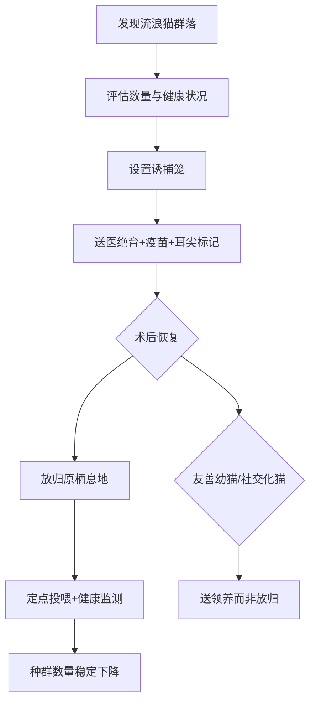

# 猫的繁殖与孕育：绝育、TNR与幼猫照料全指南

你以为绝育残忍？其实不绝育的猫患病风险高3倍以上。我是怕浪猫，今天把猫的繁殖、绝育、TNR和幼猫照料一次讲清楚。从发情期的应对到新生猫的护理，从TNR的社区实践到幼猫社会化训练，这篇是"猫的生育百科全书"。

系列进度 9/12

## 9.1 发情期的识别与应对

### 母猫发情信号：嚎叫、蹭地、抬臀与频繁标记

母猫进入发情期（Estrus）后，行为变化非常明显。最常见的信号包括：持续嚎叫（尤其是夜间，声音类似婴儿哭）、在地上蹭滚、抬高臀部（Lordosis Posture，脊柱前凸姿势）、频繁用脸颊摩擦物体、排尿标记增多。

母猫发情时主人最容易误判的一点：猫不是"来月经"。猫是诱导性排卵动物（Induced Ovulator），意味着只有交配刺激才会排卵。没有交配，发情期会持续约5-10天后自然结束，然后间隔2-3周再次发情。

### 发情周期频率：每隔2-3周一次的季节性循环

猫是季节性多次发情动物（Seasonally Polyestrous）。在北半球，发情季节通常从1月持续到9月，光照时间缩短后停止。一只未绝育母猫在一个繁殖季节可能经历3-5次发情循环。

| 发情阶段 | 持续时间 | 行为特征 |
|---------|---------|---------|
| 发情前期（Proestrus） | 1-2天 | 轻度躁动，吸引公猫但不接受交配 |
| 发情期（Estrus） | 5-10天 | 主动求偶，抬臀，嚎叫 |
| 发情间期（Interestrus） | 10-14天 | 无发情行为，如未怀孕则循环 |
| 假孕（Pseudopregnancy） | 35-40天 | 表现怀孕行为但实际未怀孕 |
| 乏情期（Anestrus） | 10-12月-1月 | 非繁殖季节，无发情 |

> 室内猫因为人工照明可能全年发情。如果你家猫在冬天也发情，检查是否有长时间开灯的房间——光照超过12小时/天会抑制褪黑素（Melatonin），打破季节性节律。

### 公猫性成熟行为：喷尿、打架与远距离游荡

公猫的性成熟通常在6-8月龄。性成熟后最显著的行为变化是喷尿标记（Urine Spraying）——不同于正常排尿，喷尿是站立、尾巴抖动、将少量尿液喷向垂直表面的行为。喷尿的尿液中含有特殊的信息素（Pheromone），传递公猫的体型、健康状况和领地信息。

未绝育公猫的其他行为问题：为争夺母猫与其他公猫打架（导致咬伤脓肿和传染猫艾滋FIV）、长距离游荡寻找母猫（走失风险激增）、夜间嚎叫。这些行为的强度与公猫体内的睾酮（Testosterone）水平直接相关。

公猫打架的方式主要是咬和抓，咬伤常发生在头部、颈部和四肢根部。咬伤伤口容易形成脓肿（Abscess），因为猫口腔中含有大量细菌。发现猫身上有不明肿块或毛发潮湿，要警惕咬伤脓肿，需要兽医处理。

> 未绝育公猫的平均活动范围是绝育公猫的10倍。活动范围越大，走失、车祸和感染疾病的风险越高。绝育不仅是为了不生小猫，更是为了猫自身的安全。

### 发情期应激管理：环境安抚与隔离方案

如果不打算繁殖，发情期母猫需要额外的安抚。有效措施包括：增加互动游戏消耗精力（每次15分钟，每天2-3次）、提供安静避光的休息空间（减少光照可抑制发情周期）、使用费洛蒙扩散器（Feliway）缓解焦虑、保持环境温度适中。

最差的做法是惩罚猫的嚎叫——猫不是故意吵你，是激素驱动它必须这样做。惩罚只会增加猫的压力，让嚎叫更严重。同样，不要在发情期给猫穿"生理裤"——猫不是人，发情不是排泄行为，穿裤只会让猫更焦虑。

如果母猫发情频繁且不打算繁殖，最好的选择是在发情间期预约绝育手术。虽然发情期也可以做手术，但子宫充血会增加出血风险，兽医通常建议在发情间期进行。

### 假孕的识别与处理

假孕（Pseudopregnancy）是母猫排卵后未怀孕，但体内孕酮（Progesterone）水平升高导致出现怀孕样症状。表现为：腹部膨大、筑巢行为、乳腺发育甚至泌乳、母性反应（叼玩具当幼猫）。

假孕通常无需治疗，35-40天后自然消退。但反复假孕的母猫患子宫蓄脓（Pyometra）的风险增加，建议绝育。子宫蓄脓是子宫内细菌感染积脓，如果不及时发现可能子宫破裂导致腹膜炎，死亡率高达50%以上。

假孕期间不要挤压猫的乳腺，挤压会刺激更多泌乳。如果乳腺肿胀严重，冷敷可以缓解不适。最重要的是尽快预约绝育手术——假孕是身体在告诉你“下一次可能是真的怀孕了”。

## 9.2 绝育手术的利弊与最佳时机

### 绝育的健康收益：降低乳腺肿瘤、子宫蓄脓与睾丸癌风险

绝育（Spay/Neuter）是宠物医学中证据最充分的健康干预之一。

| 疾病 | 未绝育风险 | 绝育后风险 | 降低幅度 |
|------|----------|----------|---------|
| 乳腺肿瘤（第一次发情前绝育） | 基准 | 0.5% | 99% |
| 乳腺肿瘤（第二次发情前绝育） | 基准 | 8% | 92% |
| 乳腺肿瘤（2岁后绝育） | 基准 | 基准 | 无显著降低 |
| 子宫蓄脓 | 23% | ~0% | 100% |
| 睾丸癌 | 基准 | 0% | 100% |
| 卵巢癌 | 基准 | 0% | 100% |

> 乳腺肿瘤是猫最常见的恶性肿瘤之一，恶性率高达85%。第一次发情前绝育几乎完全消除此风险。这不是"可以等一等"的决定——每过一次发情期，保护效果递减。

### 绝育的行为改善：减少喷尿、打架与逃跑行为

绝育对行为的改善效果显著但不是100%。绝育后约85-90%的公猫停止喷尿，但已经形成喷尿习惯的成年公猫可能需要更长时间或无法完全消除。绝育后打架行为减少约80%，游荡行为减少约90%。

行为改善的时间线：术后2-4周睾酮水平降至基线，行为变化在术后4-8周最明显。但喷尿等已固化的行为可能需要配合行为训练才能改善。

### 手术时机争议：传统6月龄 vs 早期绝育

传统观念认为绝育应在6月龄进行。但近年来早期绝育（Early Age Neuter, EAN）在8-16周龄进行已被广泛接受。

| 指标 | 传统绝育（6月龄） | 早期绝育（8-16周） |
|------|-----------------|------------------|
| 手术时间 | 15-30分钟 | 5-10分钟 |
| 恢复速度 | 7-10天 | 1-2天 |
| 术后并发症 | 1-2% | 0.5-1% |
| 骨骼发育 | 正常 | 轻微延迟骨骺闭合 |
| 行为问题 | 已可能形成喷尿习惯 | 习惯尚未形成 |
| 体重管理 | 需控制 | 需控制 |

美国猫科医师协会（American Association of Feline Practitioners, AAFP）支持在8-16周龄进行绝育，尤其是流浪猫TNR项目中的幼猫。

### 绝育后体重管理：代谢变化与热量调整

绝育后猫的基础代谢率（Basal Metabolic Rate, BMR）下降约20-30%。这是因为性激素（雌激素和睾酮）有促进代谢的作用。如果不调整饮食，绝育后6个月内体重平均增加30%。

绝育后的热量调整建议：

```python
def calculate_neutered_cat_calories(weight_kg, age_months, activity_level):
    """
    绝育后猫的每日热量需求计算
    activity_level: 'low' = 1.0, 'normal' = 1.2, 'high' = 1.4
    """
    # 基础代谢率 (RER - Resting Energy Requirement)
    rer = 70 * (weight_kg ** 0.75)
    
    # 绝育猫的维持能量需求系数
    if age_months < 12:
        # 幼猫仍需高能量
        factor = 2.0
    elif age_months > 84:
        # 老年猫
        factor = 1.1
    else:
        # 成年绝育猫
        factor = 1.2  # 比未绝育(1.4-1.6)低
    
    activity_factor = {'low': 1.0, 'normal': 1.2, 'high': 1.4}
    daily_kcal = rer * factor * activity_factor.get(activity_level, 1.2)
    
    return round(daily_kcal)

# 4kg成年绝育猫，正常活动
print(f"每日热量需求: {calculate_neutered_cat_calories(4, 36, 'normal')} kcal")
# 每日热量需求: 261 kcal
```

### 手术风险与术后护理：麻醉安全与恢复期注意事项

绝育是常规手术但不是无风险手术。母猫绝育（卵巢子宫切除术，Ovariohysterectomy, OHE）比公猫绝育（去势术，Castration）复杂，需要开腹。

术前准备：术前禁食8-12小时、术前体检（血液检查评估肝肾功能和凝血功能）、选择有猫科麻醉经验的医院。

### 术后护理要点

术后护理要点：
- 术后7-10天限制剧烈活动（不让猫跳跃高处）
- 佩戴伊丽莎白圈（E-Collar）5-7天防止舔伤口
- 每天检查伤口红肿、渗液情况
- 母猫术后7-10天拆线（可吸收线无需拆）
- 术后食欲不振超过24小时需就医
- 提供浅口食盆和水碗（戴圈时深碗不方便）

公猫绝育后恢复极快，通常术后当天就能正常活动。母猫因为是开腹手术，恢复期较长，需要7-10天。术后第一天猫可能昏昏沉沉，这是麻醉药代谢的正常过程。如果术后24小时猫仍然精神萎靡、呕吐不止或体温过高，需要联系兽医。

> 术后体重管理是绝育猫最容易被忽略的“后遗症”。绝育后代谢率下降20-30%，如果不调整饮食量，6个月内体重平均增加30%。从术后第一天就开始按新的热量需求喂食，比胖了再减肥容易十倍。

## 9.3 TNR（捕捉-绝育-放归）与流浪猫管理

### TNR理念：人道控制流浪猫种群的国际经验

TNR（Trap-Neuter-Return，捕捉-绝育-放归）是目前国际公认最人道的流浪猫种群管理方式。相比传统的捕杀（Trap-and-Kill），TNR能有效稳定种群数量且不造成动物福利问题。

### TNR的科学依据

TNR的科学依据：猫的繁殖能力极强，一对未绝育猫及其后代在7年内可繁殖约370,000只。单纯捕杀无法消灭种群（空白区域会被邻近猫填补，即"真空效应"），而TNR通过绝育降低繁殖率，同时已绝育猫占据领地阻止新猫迁入。

TNR的成功案例：美国奥兰多大学校园实施TNR后，流浪猫数量从1991年的155只下降到2002年的23只，且无新猫迁入。意大利罗马市实施TNR后，流浪猫福利显著改善，居民投诉量下降60%。

TNR失败的原因通常是：只绝育了部分猫（未覆盖全部繁殖个体）、没有持续管理（放归后不再投喂和监测）、没有处理新迁入的猫。成功的TNR需要“绝育+管理+持续”三要素同时到位。



### 诱捕笼使用方法：安全捕捉与转运流程

诱捕笼（Live Trap）是TNR的核心工具。使用要点：
- 在猫常出没的位置放置诱捕笼，最好在猫固定的投喂点附近
- 用气味浓郁的食物（罐头）做诱饵，放在笼子最里面
- 诱捕笼放在阴凉处，避免阳光直射
- 诱捕后用布盖住笼子让猫安静
- 尽快送医，不超过24小时

诱捕前不要喂猫——饥饿的猫更容易进笼。如果你一直在定点投喂，诱捕前一天停止喂食。诱捕当天早上放置诱捕笼，用最受猫欢迎的罐头做诱饵。

> 诱捕时一定要在笼子上盖一块布或毛巾。猫在暗处会更快安静下来，减少自伤风险。不盖布的猫会疯狂撞击笼门导致面部受伤，甚至牙齿断裂。

运输过程中保持车内安静，不要开音乐。如果路程超过1小时，在笼底垫尿垫以防猫排泄。夏天运输注意空调温度不要太高，冬天注意保暖。

### 耳尖标记：已绝育流浪猫的视觉识别系统

耳尖（Ear Tip）是国际通用的已绝育流浪猫标记方法：在麻醉状态下切除左耳尖约1cm，形成平整的切口。这种标记在远距离就能看到，避免重复捕捉和手术。

有人认为耳尖影响美观。但考虑到耳尖是在全身麻醉下进行的无痛操作，且其功能价值（避免重复手术的痛苦）远大于美观损失，这是目前最合理的方案。相比其他标记方法（耳标、纹身、微芯片），耳尖不需要靠近猫就能确认绝育状态，这对不亲人的流浪猫尤其重要。

耳尖的另一个好处是向社区传递信息。当居民看到一个耳尖猫时，知道这只猫已经绝育、有TNR团队管理、不会继续繁殖。这有助于减少居民对流浪猫的抵触情绪，也避免重复向物业或城管投诉已管理的猫。

### 放归后的群落管理：定点投喂与健康监测

TNR不是"绝育了就不管了"。放归后的群落需要长期管理：定点定时投喂（维持猫的营养和健康）、定期观察是否有新猫加入（新猫需捕捉绝育）、监测已绝育猫的健康状况（生病时送医）。

一个管理良好的TNR群落，猫的数量会在2-3年内自然下降（无新出生、自然死亡），且猫的健康状况和生活质量显著优于未管理的流浪猫。定点投喂还能减少猫翻垃圾和捕猎野生动物的行为，降低与居民的冲突。

投喂点应选择远离居民楼入口的隐蔽位置，投喂后清理剩余食物和餐具，避免招引老鼠和昆虫。建议设立固定的投喂志愿者轮值表，确保每天有人投喂和观察。如果发现新猫加入群落，尽快安排诱捕绝育，避免出现未绝育猫繁殖导致种群数量反弹。

### TNR的社区沟通与法律环境

TNR的执行常遇到社区阻力。居民可能担心猫的卫生和噪音问题。有效的沟通策略：
- 解释TNR能减少猫的总数（长期解决数量问题）
- 绝育后猫不再嚎叫和喷尿（解决噪音和气味问题）
- 定点投喂减少猫翻垃圾的行为
- 猫的存在能控制鼠患

在国内法律层面，目前尚无专门针对流浪猫管理的全国性法规。部分城市的地方性法规可能涉及流浪动物管理，但执行标准不统一。TNR团队在操作前应了解当地法规，与社区物业和居委会提前沟通，争取理解和支持。一些城市（如北京、上海）的动保组织已经与社区达成了TNR合作协议，这些成功案例可以作为沟通参考。

## 9.4 孕猫的护理与分娩准备

### 怀孕诊断：触诊、超声与X光的适用阶段

猫的怀孕期（Gestation Period）平均63-65天。不同阶段的诊断方法：

| 阶段 | 诊断方法 | 可获取信息 |
|------|---------|----------|
| 3-4周 | 腹部触诊 | 能摸到胎儿团块（需经验，勿自行操作） |
| 25-28天 | 超声检查（Ultrasound） | 确认怀孕、检测胎心 |
| 40天后 | X光检查 | 确定胎儿数量、评估胎儿大小 |

> 不要在怀孕早期用力按压猫腹部试图摸胎儿。不当触诊可能导致流产。如果需要确认怀孕，去兽医院做超声。

超声检查是最安全也最常用的怀孕诊断方法。在25-28天时，超声不仅能确认怀孕，还能检测胎儿心跳以评估胎儿活力。但超声无法精确计算胎儿数量，因为猫的子宫角弯曲且胎儿位置重叠。如果需要知道有几个幼猫（为了准备产房大小和评估难产风险），在40天后做X光更准确——此时胎儿骨骼已经钙化，X光下可以清晰计数头骨。

猫怀孕的早期行为信号包括：乳头变粉红（怀孕约3周出现，叫"乳头粉红化" Pinkening of Nipples）、食欲增加、性格变得更粘人、腹部逐渐膨大。但这些都是非特异性表现，最终确认还是需要超声。

### 孕期营养：高热量、高钙饮食与渐进式增量

孕猫的营养需求从怀孕第3-4周开始增加，到生产前达到正常量的1.5-2倍。

| 怀孕阶段 | 热量需求 | 饮食建议 |
|---------|---------|---------|
| 第1-2周 | 正常量 | 维持日常饮食 |
| 第3-4周 | 正常量的1.1倍 | 换幼猫粮（更高蛋白和热量） |
| 第5-6周 | 正常量的1.3倍 | 少食多餐（每天3-4餐） |
| 第7-9周 | 正常量的1.5-2倍 | 自由采食，随时有食物 |
| 哺乳期 | 正常量的2-3倍 | 高热量幼猫粮+湿粮 |

### 产房准备：安静、昏暗与温暖的产箱设置

### 产箱（Queening Box）应在预产期前1-2周准备好

产箱（Queening Box）应在预产期前1-2周准备好，让母猫提前适应。如果母猫不喜欢产箱，她可能选择在衣柜、床底或其他你认为不合适的地方生产。提前放置可以让她把产箱当成"安全的窝"。

产箱要求：
- 尺寸至少60x40x30cm（母猫能舒适躺下且翻身）
- 一面开一个15cm高的出入口（母猫进出方便，幼猫爬不出）
- 放在安静、避光、温暖的房间角落
- 铺 disposable 垫材（旧毛巾或宠物尿垫，方便更换）
- 产箱附近放食物、水和猫砂盆（母猫产后不愿远离幼猫）

一个常被忽略的细节：产箱的底部需要有重量感（放一块木板做底），防止母猫进出时箱子滑动。猫在生产时需要稳定的支撑面来用力，如果箱子滑动会让母猫焦虑。

### 分娩过程：三个产程的识别与正常时限

| 产程 | 持续时间 | 表现 |
|------|---------|------|
| 第一产程（开宫口） | 6-12小时 | 焦躁、喘气、筑巢、体温下降1°C |
| 第二产程（产出胎儿） | 每只10-60分钟，总长2-6小时 | 腹部收缩、用力、幼猫产出 |
| 第三产程（排出胎盘） | 每只5-15分钟 | 胎盘在每只幼猫后15分钟内排出 |

正常分娩：幼猫间隔30-60分钟产出。母猫会咬断脐带、舔干幼猫。第一只幼猫产出后，后续幼猫的间隔通常较短。

### 难产识别：何时需要剖腹产的紧急判断

以下情况需要立即就医：
- 第一产程超过24小时仍未开始生产
- 强烈宫缩超过30分钟但未产出幼猫
- 产出一只后间隔超过4小时无下一只
- 母猫极度虚弱、体温过高或过低
- 阴道分泌物呈暗绿色或黑色（非正常羊水颜色）
- 胎儿卡在产道部分露出

> 难产的黄金处理时间是从第一次强烈宫缩算起2小时内。如果猫在用力超过30分钟没有进展，不要等"再看看"，直接送医院。扁脸品种（波斯猫等）因骨盆结构异常难产率高达30-40%。

剖腹产（Cesarean Section）是难产的最终方案。猫的剖腹产技术已很成熟，手术时间约30-45分钟，术后恢复期7-10天。如果母猫此前有过难产史，下一胎大概率也需要剖腹产，建议直接绝育不再繁殖。

## 9.5 新生幼猫的照料要点

### 初乳（Colostrum）是母猫产后48小时内泌的乳汁

初乳（Colostrum）是母猫产后48小时内分泌的乳汁，含有高浓度的母源抗体（Maternal Antibody）。新生幼猫的肠道在出生后24小时内能直接吸收完整抗体分子，24小时后肠道"关闭"，不再能吸收大分子抗体。

没有获得初乳的幼猫，感染死亡率高达80%以上。如果母猫无法哺乳（弃仔、死亡、无乳），需要尽快寻找代乳母猫或使用猫专用初乳替代品。

幼猫从初乳中获得的抗体叫被动免疫（Passive Immunity）。这些抗体会逐渐降解，到幼猫8-12周龄时降到保护阈值以下。这也是为什么幼猫疫苗在6-8周龄开始接种——在母源抗体下降到不能完全保护但又不至于完全干扰疫苗效果的窗口期内进行。如果在母源抗体还很高时打疫苗，抗体会中和疫苗中的抗原，导致免疫失败。

> 初乳的24小时窗口期是幼猫生命中最关键的24小时。如果你救助了没有母猫的初生幼猫，第一件事不是喂奶，而是找猫初乳替代品或联系兽医。

### 体温维持：新生猫无法自主调温的保温方案

新生幼猫体温调节系统未发育完善，出生后前2周无法自主维持体温。环境温度要求：

| 日龄 | 环境温度 | 保温方法 |
|------|---------|---------|
| 0-7天 | 30-32°C | 加热垫（低温档）+毛毯 |
| 7-14天 | 27-29°C | 加热垫（低温档） |
| 14-21天 | 24-27°C | 室温+毛毯 |
| 21天+ | 22-24°C | 正常室温 |

> 加热垫不能覆盖整个产箱——必须留一个不加热的区域让母猫和幼猫在过热时能移开。温度过高（>35°C）和过低一样致命。

### 每日体重记录：正常增重曲线与生长迟缓预警

健康幼猫每天应增重10-15g。出生体重约90-110g，2周龄应达到200-250g，4周龄应达到400-500g。

```python
def kitten_growth_tracker(weights):
    """
    幼猫体重增长追踪器
    weights: 每日体重记录列表(克)
    """
    alerts = []
    for i in range(1, len(weights)):
        daily_gain = weights[i] - weights[i-1]
        day = i + 1
        if daily_gain < 7:
            alerts.append(f"第{day}天: 增重{daily_gain}g，低于正常范围(10-15g)")
        elif daily_gain < 0:
            alerts.append(f"第{day}天: 体重下降{abs(daily_gain)}g，紧急就医!")
    
    total_gain = weights[-1] - weights[0]
    avg_daily = total_gain / (len(weights) - 1)
    
    return {
        'total_gain_g': total_gain,
        'avg_daily_gain_g': round(avg_daily, 1),
        'alerts': alerts if alerts else ['增长正常']
    }

# 示例：7天体重记录
record = [100, 112, 124, 131, 120, 145, 158]
print(kitten_growth_tracker(record))
# {'total_gain_g': 58, 'avg_daily_gain_g': 9.7, 'alerts': ['第4天: 增重7g，低于正常范围(10-15g)', '第5天: 体重下降11g，紧急就医!']}
```

### 人工喂养：猫专用奶粉配方与喂奶姿势

当母猫无法哺乳时，需要人工喂养。关键要点：

- 必须使用猫专用奶粉（Kitten Milk Replacer, KMR），不能用牛奶（牛奶中的乳糖会导致幼猫严重腹泻，而腹泻对幼猫来说可能是致命的）
- 喂奶温度：38-39°C（滴在手背上感觉温热但不烫）
- 喂奶姿势：幼猫趴卧，头微抬，用注射器或专用奶瓶缓慢推入
- 每日喂奶量：每100g体重约喂8-10ml，分6-8次（每2-3小时一次，包括夜间）
- 喂奶后轻拍背部帮助排气

> 绝对不能让幼猫仰躺喂奶。仰躺姿势奶液容易进入气管导致吸入性肺炎，这是人工喂养幼猫死亡的主要原因之一。

0-1周龄的幼猫需要每2小时喂一次，包括凌晨2点和4点。这意味着你可能需要定闹钟起床喂奶。1-2周龄可以延长到每3小时一次，3周龄可以每4-6小时一次。到4周龄可以开始引入湿粮糊糊，逐渐减少奶量。

喂奶器具的消毒也很重要。每次使用后用热水冲洗，每天煮沸消毒一次。幼猫的免疫系统非常脆弱，不洁净的喂奶器具可能导致细菌感染。

### 排泄刺激：模拟母猫舔舐的排尿排便辅助

新生幼猫在3-4周龄前无法自主排尿排便。母猫通过舔舐幼猫生殖器和肛门区域刺激排泄。人工喂养时需要模拟这一行为：

每次喂奶后，用温湿棉球或纱布轻轻擦拭幼猫的生殖器和肛门区域，模仿母猫舔舐的动作。通常几秒钟内幼猫就会排尿/排便。持续擦拭直到不再有排泄物。

正常幼猫的尿液应为淡黄色透明，粪便应为黄棕色软膏状。如果尿液深黄说明脱水（奶液浓度过高或喂奶量不足），如果粪便呈水样或绿色说明腹泻（可能是奶液温度不当、器具不洁或感染）。腹泻对幼猫来说很危险，因为幼猫的体液量小，脱水速度极快，几小时的腹泻就可能导致生命危险。

3-4周龄时幼猫开始能自主排泄，可以逐渐减少排泄刺激的频率。到4周龄开始使用猫砂盆时，把幼猫放入浅口砂盆中，用手指轻轻扒砂，大多数幼猫会本能地学会使用。

正常幼猫粪便应为黄色或黄棕色软膏状。如果粪便呈绿色可能提示感染，白色可能提示肝脏问题，水样腹泻可能提示寄生虫或细菌感染。排泄物的颜色和质地是判断幼猫健康的重要指标。

> 如果幼猫超过24小时未排尿，这是紧急情况——可能意味着脱水或先天性泌尿畸形，需要立即就医。正常幼猫每天应排尿4-6次、排便1-3次。

## 9.6 幼猫的社会化关键期训练

### 社会化窗口期：决定一生性格的关键阶段

猫的社会化窗口期（Socialization Period）在2-7周龄。在这个阶段接触的各种刺激（人、动物、声音、环境）会被幼猫"编码"为"安全的"，而在窗口期结束后接触的新事物更容易被标记为"危险的"。

这个窗口期的存在有其进化意义：幼猫在安全巢穴中接触到的刺激是"家庭"，而离开巢穴后接触的新事物可能是"威胁"。这种快速分类机制在野外有助于生存，但在家养环境中，如果窗口期没有足够的正面刺激，猫会成长为对一切都恐惧的成年猫。

社会化不仅是"接触"，更重要的是"正面体验"。如果幼猫在窗口期被小孩粗暴对待，它对小孩的恐惧反应会被编码，比完全没有接触过小孩更糟糕。每一次社会化互动都必须以幼猫感到安全和舒适为前提。

| 年龄阶段 | 社会化重点 |
|---------|----------|
| 2-3周 | 触摸、轻柔抚摸、适应人手 |
| 3-5周 | 不同人（男/女/儿童）、声音暴露 |
| 5-7周 | 其他猫、温和的狗、新环境 |
| 7-12周 | 巩固已学经验、基本训练 |

> 在社会化窗口期被人类温柔对待的幼猫，成年后对人类的亲近度是未社交化幼猫的20倍。这2-5周的社会化投入，决定了猫未来15年的性格底色。

### 触觉脱敏：轻柔触摸全身各部位的分步训练

让幼猫适应被触摸全身，是未来剪指甲、刷牙、体检的基础。

训练步骤：
1. 从头部开始：轻轻触摸额头、耳根、下巴
2. 逐渐到身体：背部、侧腹、尾巴根部
3. 敏感区域：爪子（每只脚趾轻按）、耳朵内侧、嘴周围
4. 每次触摸后给零食奖励
5. 每天练习2-3次，每次3-5分钟

### 声音适应：吸尘器、门铃与雷声的渐进暴露

对声音的脱敏应从低音量开始，逐渐增加。方法：先在远处播放录音，幼猫不紧张时给零食。逐渐缩短距离或增大音量。如果幼猫紧张，退回上一步。

需要脱敏的常见声音：吸尘器、吹风机、门铃、雷声、烟花、汽车喇叭、婴儿哭声。

### 多物种共处：与狗、小孩及其他猫的正面介绍

引入新物种时的原则：安全距离、正面联想、循序渐进。

与狗的介绍：先用门隔开让双方闻到彼此气味→用婴儿门栏隔开可见→牵绳控制下近距离接触→无障碍接触。全程给双方零食建立正面联想。选择猫友善的狗品种（如金毛、比格）成功率更高。猫必须有高处逃跑路线（猫爬架或墙面跳板），让它在不舒服时能脱离。

与小孩的介绍：教小孩"温柔手"——轻摸、不追、不强抱。监督所有互动。小孩的奔跑和尖叫对猫来说是威胁信号，需要让猫在安全高处观察小孩活动。不要让幼儿单独与猫相处，即使猫性格再好，幼儿可能无意间弄疼猫导致防卫性攻击。

与其他猫的引入需要最长时间。新猫到家后先隔离在单独房间7-14天，让两只猫通过门缝闻彼此气味。然后用婴儿门栏让它们可见但无法直接接触。接下来在有人监督的情况下短时间共处，如果出现紧张信号（低吼、哈气、飞机耳），退回上一步。整个引入过程可能需要2-6周，不要急于求成。

### 行为问题预防：从幼猫期建立的良好习惯清单

| 习惯 | 训练时机 | 方法 |
|------|---------|------|
| 用猫砂盆 | 3-4周龄 | 把幼猫放入砂盆，模仿母猫扒砂 |
| 用猫抓柱 | 4-5周龄 | 在猫抓柱上撒猫薄荷，引导抓挠 |
| 不咬人 | 4-8周龄 | 咬人时立即停止游戏离开 |
| 适应猫包 | 5-6周龄 | 把猫包散开放在活动区，内放零食 |
| 接受剪指甲 | 6-8周龄 | 每次只剪1-2个指甲，给零食 |
| 接受刷牙 | 8-12周龄 | 先用纱布蘸肉汤擦牙，过渡到牙刷 |

幼猫期建立的好习惯会伴随猫一生。其中最重要的两条原则：一是“咬人=游戏结束”的规则，二是“被触摸=有零食”的正面联想。这两条规则如果幼猫期不建立，成年后再纠正事倍功半。投入两周的耐心训练，换取未来十五年的和谐共处，这笔账怎么算都划算。

另一个常被忽略的社会化内容是“适应猫包/航空箱”。很多猫只有在去医院时才看到猫包，导致猫包成为“恐惧信号”。如果从小把猫包敞开放在活动区域，偶尔放零食进去，猫会把它当成安全的避难所而非去医院的不祥预兆。

## 本章总结

| 主题 | 核心要点 | 关键数据 |
|------|---------|---------|
| 发情期 | 诱导排卵、季节性循环 | 每2-3周一次 |
| 绝育收益 | 乳腺肿瘤、子宫蓄脓预防 | 首次发情前绝育降99%风险 |
| 绝育时机 | 早期绝育(8-16周) vs 传统(6月龄) | AAFP支持早期绝育 |
| TNR | 人道控制流浪猫种群 | 7年繁殖37万只→TNR稳定下降 |
| 孕期管理 | 63-65天怀孕期，渐进增食 | 产前需1.5-2倍热量 |
| 幼猫照料 | 初乳、保温、体重监测 | 每日增重10-15g |
| 社会化 | 2-7周窗口期决定性格 | 接触多样刺激 |

收藏这篇，如果你打算养第二只猫或者遇到流浪猫需要做TNR项目，翻出来照着做就行。

你觉得绝育的最佳时机是什么时候？评论区聊聊你的经验和看法。怕浪猫会回复每一条留言。

关注怕浪猫，下期我们聊聊猫在人类文化中的角色——从夏目漱石到多丽丝·莱辛，猫到底给了人类什么样的精神慰藉和文化启示。

系列进度 9/12

下一篇：从夏目漱石到多丽丝·莱辛，猫在文学和文化中到底是什么角色？我们聊聊猫与人类之间跨越千年的文化纽带。
