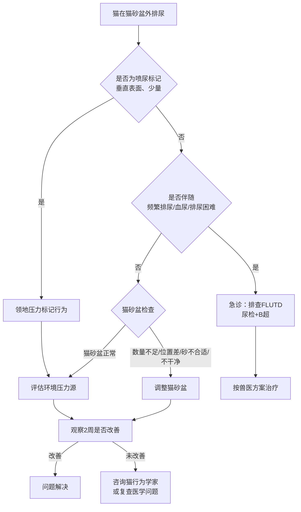

# 第十二章 养猫全实践手册：从新手到老手的终极参考

养猫3年踩了无数坑，这篇把怕浪猫踩过的坑全总结成清单了。新手老手都建议收藏，用的时候翻出来照着做。

我是怕浪猫，这是系列最后一篇，给你一份能收藏一辈子的猫知识实践手册。前十一章我们从猫的5000万年进化史一路讲到行为学、营养学、疾病预防，这一章不展开理论，只给你能直接用的工具——清单、表格、决策树、日历表。你遇到问题的时候翻开对应的章节，照着做就行。

> 养猫不是靠感觉，是靠系统。清单就是你的系统。

## 12.1 新手养猫完整准备清单

### 养猫前评估：时间、经济、居住环境与家庭成员

养一只猫的寿命通常15到20年，这个决定比大多数人换工作的周期还长。在把猫带回家之前，你需要诚实评估四个维度。

第一是时间。猫不需要遛，但每天至少需要30分钟的互动陪伴和15分钟的环境维护（清理猫砂盆、换水、喂食）。幼猫期（1岁以内）需要更多时间进行社会化训练，老年猫需要更频繁的健康监测。如果你每月出差超过一周，需要提前规划寄养方案。

第二是经济。第一年养猫的基础花费（含购买/领养费、物资、疫苗、绝育、体检）通常在5000至10000元之间。之后每年日常花费约3000至5000元，老年期医疗费用会显著上升，年度预算建议上浮到8000元以上。宠物保险（Pet Insurance）每月约30至100元，可以在重大疾病时分担大部分费用。

第三是居住环境。室内养猫是当前科学共识，但室内环境需要满足猫的基本行为需求：垂直空间（猫爬架或高处平台）、躲藏空间（猫窝或纸箱）、磨爪区域（猫抓板或猫抓柱）。阳台必须封网，窗户必须有纱窗，这些是硬性要求。

第四是家庭成员。全家需要就以下问题达成一致：谁负责铲屎、谁负责喂食、谁负责带猫看病。对猫毛过敏的家庭成员需要提前测试。家中有幼儿的，需要教育孩子正确与猫互动的方式。如果家里已经有其他宠物，需要规划物种间的引入流程。

以下是养猫前的可行性自评表：

| 评估维度 | 需要满足的条件 | 不满足的后果 |
|---------|--------------|------------|
| 时间 | 每天至少45分钟可用 | 猫出现行为问题（焦虑、破坏家具） |
| 经济 | 月收入能覆盖猫的日常+突发医疗 | 生病时被迫放弃治疗 |
| 住房 | 允许养宠、阳台可封网 | 猫坠楼或被迫弃养 |
| 过敏 | 家庭成员无猫毛过敏 | 被迫送走猫，对人猫都是伤害 |
| 家庭共识 | 全家同意且分工明确 | 责任推诿，猫被忽视 |

### 基础物资采购清单：食碗、水碗、猫砂盆、猫爬架

物资采购是养猫的"硬件投入"，买对了省心，买错了反复花冤枉钱。以下是怕浪猫验证过的采购清单，按优先级排序。

**必须项（带猫回家前必须备齐）：**

- 猫粮：幼猫选幼猫粮或全期粮，成猫选成猫粮或全期粮。品牌选择参考第十一章的营养标准。
- 食碗：陶瓷或不锈钢材质，直径12至15厘米，浅口。避免塑料碗（易致下巴粉刺）。
- 水碗：宽口浅碗，远离食碗放置（猫天性中饮水点和进食点分离）。或者使用宠物饮水机。
- 猫砂盆：长度至少为猫体长的1.5倍。数量遵循"猫数量+1"原则。
- 猫砂：豆腐砂、矿砂或混合砂。新猫到家先用前主人用的同款砂，再逐步过渡。
- 航空箱：硬壳、可顶部打开的款式。看病、搬家、应急疏散都用得上。
- 猫抓板：瓦楞纸材质的平放抓板至少一块，立式猫抓柱至少一根（高度超过猫站立时前爪伸直的高度）。

**强烈推荐项（第一周内补齐）：**

- 猫爬架：至少一米高，有平台和躲藏洞。放在猫活动最多的区域。
- 猫窝：不需要买太贵的，一个纸箱铺上旧衣服往往比几百块的猫窝更受欢迎。
- 玩具：逗猫棒（羽毛款）、小球、猫薄荷玩具。轮流使用避免腻烦。
- 指甲剪：猫用专用款，每两周剪一次。
- 梳子：短毛猫用橡胶梳，长毛猫用排梳和开结梳。

**可选项（按需购买）：**

- 自动喂食器：适合上班族控制喂食量和时间。
- 宠物监控摄像头：出门时观察猫的状态。
- 猫隧道/猫帐篷：增加环境丰富度。
- 猫用牙刷牙膏：推行家庭口腔护理。

> 在猫身上花钱的原则是：花在环境上的钱比花在猫身上的更值。一个好爬架比十件玩具更实用。

### 新猫到家第一天：隔离房间、气味适应与初步探索

新猫到家的第一天是建立信任的起点，也是最容易被搞砸的一天。核心原则是：慢下来。

带猫回家后，直接把航空箱放进提前准备好的隔离房间。打开航空箱的门，然后离开。不要急着抱猫，不要急着喂零食，不要邀请邻居来参观。让猫自己决定什么时候出来。

隔离房间需要包含：猫砂盆（放在房间角落，远离食碗和水碗）、食碗和水碗（放在房间另一侧）、一个躲藏空间（猫窝或纸箱，放在安静的位置）、一块猫抓板。

第一天猫可能不吃不喝不尿，这是正常的应激反应。只要猫在12小时内开始探索环境，24小时内开始进食饮水，就说明适应正常。如果24小时未进食或48小时未排尿，需要联系兽医。

气味适应是猫建立安全感的关键机制。你可以在隔离房间里放一件自己穿过的旧T恤，让猫熟悉你的气味。每次进房间时先轻声说话再出现，让猫将你的声音与安全关联。

以下是新猫到家第一天的检查清单程序化输出：

```python
def new_cat_day_one_checklist():
    """新猫到家第一天检查清单"""
    room_items = {
        "隔离房间": ["猫砂盆", "食碗", "水碗", "躲藏空间", "猫抓板"],
        "环境检查": ["门窗关闭", "有毒植物移除", "电线收纳", "小物件清理"],
        "行为记录": ["出箱时间", "首次进食时间", "首次饮水时间", "首次排尿时间", "首次排便时间"],
        "禁忌事项": ["不要强行抱猫", "不要大声说话", "不要让其他宠物进入", "不要邀请访客"]
    }
    
    print("=== 新猫到家第一天检查清单 ===\n")
    for category, items in room_items.items():
        print(f"【{category}】")
        for item in items:
            print(f"  [ ] {item}")
        print()
    
    print("正常指标：12h内开始探索，24h内进食饮水")
    print("异常信号：24h未进食→联系兽医 | 48h未排尿→急诊")

new_cat_day_one_checklist()
```

### 第一周适应期：逐步开放空间与建立信任

第一周的目标是让猫从"适应隔离房间"过渡到"适应整个家"。这个过程不能急，每天一个小变化。

第一天到第三天：猫待在隔离房间。你每天进去3到4次，每次10到15分钟，坐在地上不做任何事，让猫主动接近你。如果猫主动来闻你或蹭你，可以缓慢伸手让猫嗅闻，不要直接摸头。

第四天到第五天：如果猫在隔离房间表现放松（正常进食、使用猫砂盆、主动探索），可以打开房间门，让猫自己决定是否出去。不要把猫抱出去，让它自己探索。

第六天到第七天：猫开始探索其他房间时，确保其他房间的猫安全措施已经到位（窗户关闭、有毒植物移除、易碎物品收好）。如果有其他宠物，此时可以开始气味交换——把两只猫用过的毛巾互换，让它们通过气味了解对方。

建立信任的核心方法是"按猫的节奏互动"。猫主动来找你时给予回应（抚摸、零食、声音），猫不想互动时绝不追着它。猫的信任是用耐心换来的，不是用零食买的。

> 猫信任你的标志不是它让你抱，而是它在你面前露出肚皮、在你身边睡觉、看到你回来时竖起尾巴走向你。

### 兽医初诊：健康检查、驱虫与疫苗计划制定

新猫到家后一周内应该完成第一次兽医就诊。无论猫来自猫舍、领养还是流浪救助，初诊都是必要的。

初诊需要携带的信息：猫的年龄（或预估年龄）、来源（猫舍/领养中心/救助）、已知的疫苗和驱虫记录、当前喂食的猫粮品牌和量。如果你有猫的健康记录文件，全部带上。

初诊检查项目包括：体格检查（体重、体温、心率、呼吸率、口腔、耳朵、眼睛、皮肤、淋巴结触诊）、粪便检查（排查寄生虫）、猫白血病病毒（Feline Leukemia Virus, FeLV）和猫免疫缺陷病毒（Feline Immunodeficiency Virus, FIV）筛查（新猫必做）、基础血液检查（如果猫年龄未知或疑似成年猫）。

驱虫计划：如果粪便检查发现寄生虫，针对性用药。无论是否有虫，建议进行一次广谱驱虫。常用驱虫药覆盖蛔虫、钩虫、绦虫和心丝虫。体外驱虫（跳蚤、蜱虫）根据生活环境影响，室内猫的风险较低但不是零。

疫苗计划制定：核心疫苗包括猫三联（猫瘟、猫疱疹病毒、猫杯状病毒）。首次接种通常在8至9周龄，间隔3至4周接种第二针和第三针。成猫如果从未接种过，需要两针基础免疫后间隔一年加强。非核心疫苗包括猫白血病疫苗（建议户外猫或多猫家庭接种）和狂犬疫苗（部分地区法规要求）。

以下是初诊后需要建立的健康档案基础信息表：

| 档案项目 | 记录内容 | 更新频率 |
|---------|---------|---------|
| 基本信息 | 品种、性别、出生/预估年龄、毛色、芯片号 | 首次建立 |
| 体重 | 每次称重数值 | 每月 |
| 疫苗记录 | 疫苗名称、批号、接种日期、下次接种时间 | 每次接种 |
| 驱虫记录 | 药品名称、剂量、日期、下次驱虫时间 | 每次驱虫 |
| 体检报告 | 检查项目、结果、异常项、医嘱 | 每次就诊 |
| 用药记录 | 药品、剂量、疗程、效果 | 每次用药 |

## 12.2 猫咪行为问题诊断与矫正指南

### 乱尿问题：医学排查-猫砂盆问题-领地压力的三步诊断

乱尿是猫主人最常遇到的行为问题之一，也是导致猫被弃养的主要原因之一。但乱尿几乎总是有原因的，找到原因就能解决。

第一步是医学排查。猫在猫砂盆外排尿，首先要排除泌尿系统疾病。猫下泌尿道疾病（Feline Lower Urinary Tract Disease, FLUTD）在公猫中尤其常见，症状包括频繁排尿、排尿困难、尿中带血、在硬质表面上排尿。一旦发现乱尿，48小时内带猫去兽医做尿检和B超。如果猫完全尿不出（堵塞性FLUTD），这是急诊，数小时内可能危及生命。

第二步是猫砂盆问题排查。如果医学检查正常，检查猫砂盆的以下维度：数量是否足够（N+1原则）、位置是否安静且不封闭、猫砂类型是否被猫接受（有些猫拒绝水晶砂或松木砂）、猫砂盆是否够大（长度=猫体长x1.5）、清洁频率是否足够（每天至少铲一次，每两周全换一次砂）。一个常见错误是用了带盖的封闭猫砂盆，很多猫觉得在封闭空间里不安全。

第三步是领地压力评估。如果猫砂盆没问题，考虑环境压力源。新搬的家、新添的宠物、外面的野猫（窗台上的气味）、家庭关系变化（吵架、离婚）、装修噪音。猫通过尿液标记领地来缓解焦虑，这与排尿（蹲下大量排尿）不同，标记通常是站立少量喷尿在垂直表面上。

以下是乱尿问题诊断决策树：



### 攻击行为：游戏性攻击、恐惧性攻击与转移性攻击

猫的攻击行为需要先分类再处理，不同类型的攻击有完全不同的成因和矫正方法。

游戏性攻击（Play Aggression）是最常见的类型，尤其出现在幼猫和年轻猫中。表现特征是：埋伏后扑咬人的脚踝或手、咬住后蹬后腿、攻击力度不大但可能划伤皮肤。成因是猫的捕猎天性没有得到足够的适当出口。矫正方法是：每天进行2到3次、每次10到15分钟的逗猫棒互动，模拟"追逐-捕捉-扑咬"的完整捕猎序列。结束时喂零食让猫获得"捕猎成功"的满足感。绝对不要用手脚逗猫，这会教会猫"人手是猎物"。

恐惧性攻击（Fear Aggression）发生在猫感到受威胁时。表现特征是：身体压低、耳朵平贴、瞳孔放大、发出嘶嘶声或低吼、在无法逃脱时才攻击。矫正原则是消除恐惧源，而不是惩罚攻击。给猫提供高处躲藏空间，不要追猫，不要强行社交。使用费洛蒙（Feliway）扩散器可以辅助降低焦虑。对于严重恐惧的猫，需要行为学家制定系统脱敏（Systematic Desensitization）方案。

转移性攻击（Redirected Aggression）是最容易被误判的类型。猫被某个刺激激怒（例如看到窗外的野猫），但无法触及那个刺激源，于是攻击身边最近的活体——通常是主人或其他宠物。表现特征是：突然无预警攻击、攻击力度大、持续性强、事后猫自己看起来也很困惑。矫正方法是识别并消除触发刺激（拉上窗帘遮住窗外视野、移除触发源），在猫激动时不要靠近，等它自己平复。

> 猫的攻击从来不是"恶意"，而是本能的错误表达。矫正行为的第一步是理解它，而不是惩罚它。

### 过度嚎叫：发情、分离焦虑与认知障碍的鉴别

猫嚎叫的原因随年龄和生活状态不同而变化，准确鉴别是矫正的前提。

未绝育猫的嚎叫最常见原因是发情。母猫发情时嚎叫声低沉且持续，尤其在夜间，可能伴随蹭人、抬臀、频繁标记。公猫闻到发情母猫的气味也会焦躁嚎叫。解决方案是绝育。绝育后激素水平下降，发情相关的嚎叫通常在2到4周内消失。

已绝育猫的嚎叫需要排查以下原因。分离焦虑（Separation Anxiety）的表现是：主人离开家后开始嚎叫、主人回家时异常激动、过度黏人。常见于被遗弃过或频繁更换主人的猫。矫正方法是逐步增加独处时间，提供环境丰富化（漏食球、新玩具轮换），离开和回家时保持低调不过度互动。

老年猫的夜间嚎叫需要高度警惕认知障碍（Cognitive Dysfunction Syndrome, CDS）。CDS是老年猫的神经退行性疾病，类似人类的阿尔茨海默症。症状包括：夜间定向力丧失（在熟悉的地方迷路）、昼夜节律颠倒（白天睡、夜里嚎）、与人互动方式改变、在家具或角落里卡住。CDS无法治愈但可以管理：夜间留一盏小灯、补充抗氧化营养（如S-腺苷甲硫氨酸）、保持规律的日常作息、使用费洛蒙辅助安抚。需要兽医排除疼痛（关节炎、牙痛）导致的嚎叫后再诊断CDS。

以下嚎叫类型鉴别表帮助快速定位：

| 嚎叫特征 | 可能原因 | 首要行动 |
|---------|---------|---------|
| 未绝育+夜间低沉持续嚎 | 发情 | 绝育手术 |
| 主人离开后嚎叫+过度黏人 | 分离焦虑 | 独处训练+环境丰富化 |
| 老年猫+夜间嚎叫+定向力差 | CDS | 兽医评估+环境调整 |
| 突然嚎叫+姿势异常 | 疼痛/疾病 | 兽医检查 |
| 进食前后嚎叫 | 食物相关行为 | 定时喂食+漏食球 |

### 异食癖：吮吸织物、吃塑料与舔墙的成因分析

异食癖（Pica）是指猫持续摄入非食物物质的行为，在品种猫（特别是暹罗猫和伯曼猫）中发生率较高。

吮吸织物（ Wool Sucking）是最轻的形式，猫反复吸吮毛毯、衣物或主人的头发。这在东方品种猫中有遗传倾向，通常在幼猫期开始。轻度吮吸不需要干预，但如果发展为吞食织物纤维，可能导致肠梗阻。

吃塑料是另一个常见表现。猫被塑料袋的质地和气味吸引，尤其是曾经装过食物的塑料袋。有些猫只是舔舐和啃咬，有些会吞下塑料碎片。管理方法是：所有塑料袋放在猫无法触及的地方，提供替代啃咬物（猫薄荷玩具、冻干肉块）。

舔墙或吃砂土可能提示营养缺乏或消化系统疾病。如果猫突然开始舔食墙壁、砂土或猫砂，需要兽医检查全项血液和粪便，排除贫血、矿物质缺乏和炎症性肠病（Inflammatory Bowel Disease, IBD）。

异食癖的管理原则是"管理环境优先于矫正行为"。把危险物品收好是最有效的措施。同时增加猫的进食挑战——使用漏食球、把食物藏在不同的位置让猫寻找，满足猫的觅食天性。

### 行为矫正原则：正向强化 vs 惩罚的无效性证据

在行为矫正领域，一个核心原则被反复证实：惩罚对猫不仅无效，还会制造更多问题。

惩罚的问题在于：猫无法将"被惩罚"与"之前的行为"建立因果关联。你大声呵斥乱尿的猫，猫学到的不是"不应该在这里尿"，而是"主人出现时可怕"。结果是猫学会躲着你尿，而不是改变排尿位置。水枪喷水同样如此，猫只是学会怕水枪和怕你，行为本身不会改变。

正向强化（Positive Reinforcement）是科学验证有效的行为矫正方法。原理是：当猫做出期望行为时立即给予奖励（零食、抚摸、语言），增加该行为的频率。例如猫在猫抓板上磨爪时给予零食奖励，猫会逐渐增加在猫抓板上磨爪的行为。

行为矫正的通用流程如下：

```python
def behavior_modification_protocol(problem, trigger, desired_behavior):
    """
    行为矫正通用协议
    problem: 问题行为描述
    trigger: 触发情境
    desired_behavior: 期望替代行为
    """
    steps = [
        "1. 消除或减少触发源",
        "2. 提供满足相同需求的替代行为出口",
        "3. 当猫执行替代行为时立即给予正向强化",
        "4. 忽略问题行为（不惩罚、不关注）",
        "5. 持续记录行为频率变化",
        "6. 两周无改善→咨询猫行为学家",
        "7. 任何行为突变→先排除医学原因"
    ]
    print(f"行为矫正计划：{problem}")
    print(f"触发情境：{trigger}")
    print(f"目标行为：{desired_behavior}\n")
    for step in steps:
        print(f"  {step}")
    print("\n注意：惩罚（呵斥/喷水/关禁闭）对猫无效且有害")

behavior_modification_protocol(
    problem="乱尿",
    trigger="猫砂盆不干净或环境压力",
    desired_behavior="在猫砂盆内排尿"
)
```

> 惩罚教猫害怕你，正向强化教猫信任你。你想养的是伙伴，不是囚犯。

## 12.3 养猫年度时间表：疫苗、体检与季节护理

### 年度体检项目：血常规、生化、尿检与甲状腺筛查

年度体检是预防医学的核心。猫是隐藏病痛的高手，等到主人发现异常时，疾病往往已经进展到中晚期。定期体检是唯一能在早期发现问题的方法。

1到7岁的成年猫建议每年体检一次。基础体检项目包括：体格检查（体重、体态评分、体温、心率、呼吸率、口腔评估、淋巴结触诊、腹部触诊）、血常规（红细胞、白细胞、血小板）、生化全项（肝功能、肾功能、血糖、电解质、蛋白质）、尿液分析（比重、pH、尿蛋白、尿沉渣）。这些基础项目能覆盖大多数常见疾病的早期筛查。

对于7岁以上的老年猫，建议增加甲状腺功能（T4）筛查。猫甲状腺功能亢进（Feline Hyperthyroidism）是老年猫最常见的内分泌疾病，发病率在10岁以上的猫中超过10%。症状包括：体重下降、食欲亢进、活动量增加、呕吐、心率增快。

血压测量也应该纳入老年猫的常规检查。猫高血压（Systemic Hypertension）通常继发于肾病或甲亢，如果不治疗会导致视网膜脱落和失明。

以下是年度体检项目与频率表：

| 年龄段 | 体检频率 | 基础项目 | 附加项目 |
|-------|---------|---------|---------|
| 1-6岁 | 每年1次 | 体格+血常规+生化+尿检 | 根据需要 |
| 7-10岁 | 每年1次 | 基础项目+T4 | 血压测量 |
| 10-15岁 | 每半年1次 | 基础项目+T4+血压 | SDMA（肾功能早期标志物） |
| 15岁以上 | 每半年1次 | 全项+腹部B超 | 心脏超声（如有杂音） |

### 疫苗加强针：核心疫苗的年度或三年接种方案

猫的核心疫苗是猫三联（FVRCP），预防猫瘟病毒（Feline Panleukopenia Virus, FPV）、猫疱疹病毒（Feline Herpesvirus, FHV）和猫杯状病毒（Feline Calicivirus, FCV）。

关于加强针的接种间隔，目前国际上有两种主流方案。美国猫科医师协会（American Association of Feline Practitioners, AAFP）建议成猫每三年接种一次核心疫苗。而部分亚洲国家的兽医临床实践仍倾向于年度接种。两种方案各有依据，具体选择可以和你的兽医讨论，考虑因素包括：猫是否出门、是否接触其他猫、当地疫病流行情况、疫苗品牌说明书。

非核心疫苗的接种建议：猫白血病疫苗（FeLV）推荐给户外猫、多猫家庭和接触未知健康状态猫的风险群体。狂犬疫苗在某些地区是法规要求的，即使室内猫也建议接种。

疫苗接种后的注意事项：大多数猫无不良反应，少数可能出现轻微嗜睡和食欲下降，通常24小时内自行恢复。如果出现面部肿胀、持续呕吐或呼吸急促，需要立即就医（疫苗过敏反应）。

以下是疫苗接种记录表模板：

| 疫苗名称 | 接种日期 | 疫苗批号 | 接种兽医 | 下次接种日 | 备注 |
|---------|---------|---------|---------|----------|------|
| FVRCP（猫三联） | YYYY-MM-DD | | | YYYY-MM-DD | 核心疫苗 |
| FeLV（猫白血病） | YYYY-MM-DD | | | YYYY-MM-DD | 非核心/按需 |
| 狂犬疫苗 | YYYY-MM-DD | | | YYYY-MM-DD | 法规要求 |

### 季节性任务表：春季驱虫、夏季防暑、秋季换毛与冬季保暖

养猫的日常护理随季节变化而调整。以下是全年季节性护理任务表：

| 月份 | 重点护理任务 | 注意事项 |
|-----|------------|---------|
| 1月 | 保暖、加湿 | 暖气导致空气干燥，建议湿度40-60% |
| 2月 | 保暖、口腔检查月 | 年度口腔评估安排 |
| 3月 | 春季驱虫、疫苗加强 | 冬末春初是疫苗加强的常见时间 |
| 4月 | 换毛期开始、梳毛频率增加 | 长毛猫每天梳毛预防毛球症 |
| 5月 | 防跳蚤蜱虫高峰期 | 体外驱虫加强 |
| 6月 | 防暑、保证饮水 | 室温超过30度提供降温措施 |
| 7月 | 防暑、避免高温时段运输猫 | 航空箱内放冰垫 |
| 8月 | 防台风/暴雨应急准备 | 检查应急包 |
| 9月 | 秋季换毛期、梳毛频率增加 | 毛球膏补充 |
| 10月 | 秋季驱虫、年度体检安排 | 入冬前全面体检 |
| 11月 | 保暖准备、猫窝位置调整 | 避免猫窝放在冷风口 |
| 12月 | 保暖、节假日安全 | 圣诞树/装饰品可能被猫误食 |

夏季防暑特别提醒：猫的散热能力不如狗，出汗主要靠脚垫。环境温度超过32度时猫可能中暑，症状包括张口呼吸、流口水、精神萎靡。提供凉爽的地板空间、开启空调或风扇、多处放置饮水点是基本防暑措施。长毛猫和扁脸品种（如波斯猫、加菲猫）尤其怕热，需要额外关注。

冬季保暖注意事项：老年猫和幼猫对寒冷更敏感。提供温暖的猫窝或加热垫（温度不超过38度，自动断电款）。注意加热设备的安全，猫可能烫伤或咬断电线。

### 牙科检查周期：每年口腔评估与洗牙安排

牙科疾病是猫最被低估的健康问题。研究显示，3岁以上的猫中超过70%存在不同程度的牙周疾病（Periodontal Disease），但大多数主人毫不知情。

猫的牙科问题包括：牙菌斑和牙结石积累、牙龈炎（Gingivitis）、牙周炎（Periodontitis）、牙吸收（Feline Tooth Resorption, TR）和口腔炎症（Feline Chronic Gingivostomatitis, FCGS）。其中牙吸收是一种猫特有的疼痛性疾病，病因不明，表现为牙体被侵蚀，发病率在4岁以上的猫中约30%。

建议每年由兽医进行一次口腔评估。如果发现牙结石、牙龈红肿或牙吸收，需要安排专业洗牙（Professional Dental Cleaning）。猫洗牙需要全身麻醉，包括超声波洁牙、抛光和全口X光检查。全口X光是必须的，因为猫的很多牙科问题（如牙吸收、牙根脓肿）只能通过X光发现，肉眼看不到。

家庭口腔护理建议：每天或隔天用猫专用牙刷和牙膏刷牙。不要使用人类牙膏（含氟化物对猫有毒）。如果猫完全不接受刷牙，可以使用口腔护理凝胶和洁齿零食作为辅助，但效果不如刷牙。

> 刷牙这件小事，可能比你花的任何一笔猫医疗费都更值钱。

### 老年猫（10岁+）：半年体检与肾功能重点监测

猫在10岁后进入老年期，衰老速度明显加快。老年猫的体检频率建议提高到每半年一次，重点监测肾功能。

猫慢性肾病（Chronic Kidney Disease, CKD）是老年猫排名第一的死因。10岁以上的猫中约30%患有不同程度的CKD，15岁以上超过50%。CKD早期没有明显症状，当主人注意到猫多饮多尿、体重下降时，肾功能往往已经损失了75%以上。

早期检测CKD的关键指标是SDMA（Symmetric Dimethylarginine）。传统指标肌酐（Creatinine）在肾功能损失66%以上才会升高，而SDMA在肾功能损失40%时就能提示异常。老年猫的体检务必包含SDMA。

CKD的管理方案包括：处方肾脏粮（低磷、适量优质蛋白）、皮下补液（在家操作，每日或隔日一次）、磷结合剂（控制血磷）、血压监测和管理、促红细胞生成素（如出现贫血）。早期干预可以显著延缓CKD进展，让猫多活数年。

老年猫还需要关注以下问题：关节炎（Arthritis）——超过90%的12岁以上猫有影像学关节炎证据，但主人常误以为"只是老了"。表现为跳跃困难、不爱动、上厕所姿势改变。管理方法包括关节保健品（葡萄糖胺、Omega-3脂肪酸）、提供低入口猫砂盆、阶梯和坡道。老年猫认知障碍（CDS）——上一节已讨论。老年猫甲状腺功能亢进——体重下降伴食欲增加需排查。

## 12.4 猫咪应急预案：灾难疏散与寄养方案

### 猫咪应急包：航空箱、食物、药品、照片

灾难来临时你只有几分钟时间撤离，提前准备好猫的应急包可以在紧急情况下救命。

应急包应该是一个防水、容易携带的包，放在家里所有人都知道的位置。内容物每半年检查一次，替换过期食品和药品。

以下是猫咪应急包完整清单：

```python
def cat_emergency_kit():
    """猫咪应急包清单生成"""
    kit = {
        "必需品": [
            "航空箱（硬壳，可顶部打开）×1",
            "猫粮（密封保存）×7天量",
            "饮用水（瓶装）×7天量",
            "折叠猫砂盆 ×1",
            "猫砂（密封袋分装）×3天量",
            "食碗和水碗（折叠款）×各1"
        ],
        "医疗用品": [
            "猫的健康记录复印件（疫苗、用药、体检报告）",
            "兽医联系方式卡片",
            "当前用药（至少2周量）",
            "驱虫药 ×1次量",
            "急救包：纱布、碘伏、止血粉、体温计",
            "宠物用急救手册"
        ],
        "身份与寻回": [
            "猫的近期彩色照片 ×3（正面、侧面、全身）",
            "微芯片（Microchip）登记号和登记机构联系方式",
            "项圈和身份牌（写有你的电话）",
            "临时寄养联系人的地址和电话"
        ],
        "舒适与安抚": [
            "猫熟悉的毯子或玩具（提供安全感）",
            "费洛蒙喷雾 ×1瓶",
            "猫薄荷或零食（缓解压力）"
        ]
    }
    
    print("=== 猫咪应急包清单 ===\n")
    for category, items in kit.items():
        print(f"【{category}】")
        for i, item in enumerate(items, 1):
            print(f"  {i}. {item}")
        print()
    print("检查频率：每6个月检查一次，替换过期物品")
    print("存放位置：全家都知道的固定位置")

cat_emergency_kit()
```

### 火灾与地震疏散：快速捕捉与安全转运方案

灾难发生时的疏散原则是：人的安全第一，但猫也要一起走。提前规划可以兼顾两者。

火灾疏散：火灾时烟雾是最大威胁，猫会躲在床下或柜子里。准备一条大毛巾或毯子，找到猫后迅速包裹（防止挣扎和抓伤），放入航空箱撤离。如果你无法在30秒内找到猫，不要继续找——撤离后告诉消防员猫的位置，消防员有装备进入烟雾环境。平时在卧室门上贴一张猫的藏身点地图（猫受到惊吓时最可能躲的位置），帮助救援人员。

地震疏散：地震时猫可能惊慌逃跑。平时训练猫对特定声音（如摇晃零食罐子）产生条件反射，紧急时可以帮助定位。地震后检查猫是否有外伤（跛行、呼吸急促、瞳孔不等大可能提示头部外伤）。余震期间不要让猫外出。

安全转运方案：航空箱内铺好尿垫，放一件猫熟悉的衣物。如果是高温天气，箱内放冰垫。如果是冬季，箱外裹毯子保暖。转运过程中保持箱门关闭，不要为了让猫"舒服"而打开箱门，惊吓中的猫可能跳出逃跑。

> 灾难不会预约。你准备好的那天可能永远不来，但来了的那天你必须准备好。

### 寄养选择：宠物酒店、上门喂养与朋友代管的比较

当你需要出差或旅行时，猫的安置有三种主要方案。选择时需要考虑猫的性格、出行时长和预算。

| 方案 | 适合情况 | 优点 | 缺点 | 日均费用参考 |
|-----|---------|------|------|------------|
| 宠物酒店 | 超过7天、需要专业照看 | 有监控、有医疗资源 | 环境陌生、应激风险高 | 80-300元 |
| 上门喂养 | 3天以上、猫胆小不愿出门 | 猫留在熟悉环境 | 陌生人进入、需要信任 | 50-150元 |
| 朋友代管 | 短期、朋友熟悉猫 | 猫认识的人、免费或低成本 | 朋友可能不了解猫的需求 | 0-100元 |

选择宠物酒店时需要实地考察：看笼舍大小（是否够猫活动和放猫砂盆）、看通风和卫生、看是否有摄像头可以远程查看、看是否要求疫苗证明（正规机构应该要求）。提前让猫适应航空箱，减少运输途中的应激。

上门喂养服务选择标准：选择有资质和评价的平台或个人。首次服务前安排见面，观察喂猫人与猫的互动方式。安装宠物监控摄像头，远程查看情况。详细书面交代猫的饮食习惯、猫砂盆位置、紧急联系方式。

猫是领地性极强的动物，对于大多数猫来说，留在自己家里由人上门照料是应激最小的方案。但如果猫有特殊医疗需求（如皮下补液、喂药），宠物酒店或有经验的专业人员可能更合适。

### 旅行与猫：自驾带猫的准备 vs 留守在家的安排

带猫旅行通常是一件压力很大的事，对猫来说更是如此。绝大多数情况下，让猫留守在家是更好的选择。但有些场景（搬家、长途迁移、部分猫适应后可接受短途旅行）需要带猫出行。

自驾带猫的准备清单：航空箱固定在后座（用安全带绑住），箱内铺尿垫。出发前3小时停食，预防晕车呕吐。车内温度保持22至26度。每2到3小时停车检查，提供水和猫砂盆。绝不要把猫单独留在车里，即使天气凉爽——车内温度上升速度超出大多数人想象。

长距离迁移（如搬家）需要更多准备：提前让猫适应航空箱（在箱里喂食一周）。到达新家后先将猫隔离在一个房间，等搬家混乱结束后再让猫探索全屋。搬家当天最容易发生猫逃跑，确保门窗在搬运过程中关闭。

留守在家的安排：3天以内可以由人每天上门一次照顾。超过3天建议每天上门两次（早晚各一次喂食和铲屎）。超过7天如果没有人每天来，建议请住家宠物保姆。自动喂食器和饮水机可以作为辅助但不能替代人——设备故障、猫生病、猫跑出屋外这些情况需要人到场处理。

### 猫走失的应对：搜索范围、寻猫启事与微芯片登记

猫走失是主人最恐惧的经历之一。但冷静、系统的行动可以大幅提高找回概率。

室内猫走失后通常不会跑远。它们在陌生环境中会寻找最近的藏身处——灌木丛下、车底、邻居院子里的杂物堆。90%的走失室内猫在离家50米范围内被发现。

搜索策略分三个阶段。第一阶段（走失后1到6小时）：在楼道和小区附近低声呼唤猫的名字，摇晃零食罐。带一个强光手电筒，照射车底和灌木丛——猫眼睛反光可以被发现。不要大声呼喊，可能吓到猫让它跑更远。

第二阶段（走失后6到72小时）：扩大搜索范围到周围200米。在小区物业群、社区论坛发布寻猫启事。张贴打印的寻猫海报（猫的彩色照片、特征描述、你的联系方式、酬金金额）。海报贴在小区出入口、电梯口、附近宠物店和兽医诊所。

第三阶段（走失72小时以上）：联系当地动物收容所和救助组织，提供猫的照片和芯片号。在社交媒体上扩散寻猫信息。在走失地点附近放置猫用过的猫砂和食碗——气味可以帮助猫找到回家的方向。

微芯片（Microchip）是猫的永久身份证明。米粒大小的芯片植入肩胛骨皮下，包含唯一的识别码。收容所和兽医诊所都有扫描设备。确保你的联系方式在芯片登记系统中是最新的——芯片只在登记信息正确时才有用。

> 芯片植入只需要一分钟，但那分钟可能是你和猫重逢的唯一机会。

## 12.5 推荐阅读与进阶学习资源

### 科普读物推荐：从《猫咪家庭医学大百科》到《猫行为学指南》

读书是系统学习猫知识最高效的方式。以下是怕浪猫验证过的书单，按主题分类。

健康医学类首推《猫咪家庭医学大百科》（林政毅著）。这本书覆盖了从新生猫到老年猫的全生命周期健康管理，内容包括常见疾病的识别、用药指导和护理方法。语言通俗但信息准确，适合猫主人作为家庭参考书。配合《猫博士的猫科疾病详解》可以更深入了解具体疾病的病理和治疗方案。

行为学类推荐《猫行为学指南》（Cat Sense, John Bradshaw著）。Bradshaw是布里斯托大学动物行为学教授，这本书从进化生物学和动物行为学的角度解释猫为什么这么做。不是训练手册，而是理解猫的思维方式的基础读物。配合《Catify to Satisfy》（Jackson Galaxy著）可以获得更多环境改造的实用建议。

营养学类推荐《犬猫营养学》（Canine and Feline Nutrition）。虽然书名包含犬，但猫的营养部分非常详尽，涵盖了营养需求、不同生命阶段的 feeding 方案和处方粮的原理。适合想深入理解猫营养的主人。

### 品种图鉴资源：《猫》与在线品种数据库

品种识别和品种特性了解是选择适合自己生活方式的猫的重要参考。

《猫：全世界250多种猫的彩色图鉴》（DK出版社）是目前最全面的品种图鉴。每种猫配有高质量照片，涵盖外观特征、性格概述、护理要点和品种历史。适合在选猫阶段翻阅，了解不同品种的特点。

在线品种数据库推荐国际猫协会（The International Cat Association, TICA）和猫爱好者协会（Cat Fanciers' Association, CFA）的官方网站。两个组织都有完整的品种标准（Breed Standards）文档，详细描述每个品种的理想外观特征。需要注意的是，品种标准是为繁育比赛制定的，宠物猫不需要完全符合标准。

选择品种时的关键考虑因素：

| 因素 | 需要了解的品种特征 |
|-----|-----------------|
| 过敏 | 暂无真正低敏猫品种，"低敏"品种只是致敏蛋白较少 |
| 时间 | 长毛品种需要每天梳毛，短毛品种几乎不需要 |
| 空间 | 大型品种（缅因猫、布偶猫）需要更大空间 |
| 性格 | 暹罗猫极度话多黏人，英短相对独立冷静 |
| 健康 | 扁脸品种（波斯、加菲）呼吸道和眼病问题多 |

### 实用养护参考：《图解版室内养猫生活指南》与66条窍门实践

实用养护类书籍的价值在于提供可操作的日常管理建议。

《图解版室内养猫生活指南》是日本出版的一本图文并茂的养猫手册，以图解方式展示了猫的日常护理操作：剪指甲的姿势、喂药的技巧、刷牙的方法、梳毛的手法。对于视觉学习者特别友好。

国内养猫达人整理的"66条养猫窍门"是社区实践经验的汇总，覆盖了从选购猫粮到处理猫毛的各类生活技巧。这类社区资源的优势在于贴近本土实际情况（产品可购买、气候条件匹配），但需要注意辨别信息质量——任何来源的建议都应该和兽医确认后再执行。

实用资源还包括：猫粮成分数据库（如CatFoodDB、All About Cats），可以查询商业猫粮的成分分析和评分。世界小肠动物兽医协会（WSAVA）发布的猫营养指南，是判断猫粮质量的权威标准。

### 文学作品延伸：《小猫杜威》《特别的猫》《我是猫》等

科学知识之外，文学作品能提供另一种理解猫的方式——情感的和文化的。

《小猫杜威》（Dewey: The Small-Town Library Cat Who Touched the World, Vicki Myron著）讲述了一只被遗弃在图书馆还书箱里的小猫如何成为小镇的精神象征。这是一个关于猫与人之间深度情感连接的真实故事，也是关于猫如何改变社区的真实记录。

《特别的猫》（Particularly Cats, Doris Lessing著）是诺贝尔文学奖得主多丽丝·莱辛写的猫散文。莱辛以作家的敏锐观察力记录了她一生中养过的猫，每一只都有鲜明的性格。这不是一本"养猫指南"，而是一本关于猫作为独立个体的文学记录。

《我是猫》（夏目漱石著）是日本文学经典，以猫的视角观察人类社会的荒诞。虽然是虚构作品，但猫叙述者的心理描写精准得惊人——夏目漱石家里确实养了猫，他对猫行为的观察是真实的。

《猫咪处方箋》和《毛毯貓租借中》是近年来较受欢迎的猫主题中文书。前者从兽医视角讲述猫的疾病故事，后者记录了一个猫咪租借服务的温暖故事。两本书都适合在轻松阅读中获取猫知识。

> 读科学书让你知道怎么养猫，读文学书让你理解为什么养猫。两者都需要。

### 在线学习平台：iCatCare 与 AAFP 指南资源

在线资源可以获取最新、最权威的猫科学信息，弥补书籍出版周期的滞后。

国际猫护理组织（International Cat Care, iCatCare）是一个总部位于英国的非营利组织，致力于猫的福利和健康。其官方网站（icatcare.org）提供大量面向猫主人的免费资源：行为指南、健康百科、生命阶段护理建议。iCatCare还运营"猫友好诊所"（Cat Friendly Clinic）认证项目，帮助主人找到对猫友好的兽医机构。

美国猫科医师协会（American Association of Feline Practitioners, AAFP）是猫科医学的权威专业组织。其网站（catvets.com）发布的各类临床指南是兽医的实践标准，也是猫主人深入了解特定疾病管理的参考。重要指南包括：猫慢性肾病管理指南、猫生命阶段护理指南、猫行为环境需求指南、猫疫苗指南。

其他有价值的在线资源：Cornell Feline Health Center（康奈尔猫健康中心）的猫主人教育页面，提供简洁准确的健康信息。International Association of Animal Behavior Consultants（IAABC）网站提供行为问题的科学管理资源。

以下是推荐资源汇总表：

| 资源名称 | 类型 | 网址 | 适合人群 |
|---------|------|------|---------|
| iCatCare | 综合科普 | icatcare.org | 所有猫主人 |
| AAFP | 专业指南 | catvets.com | 深度学习者 |
| Cornell FHC | 健康教育 | vet.cornell.edu/cats | 健康问题查阅 |
| CatFoodDB | 猫粮评测 | catfooddb.com | 选粮参考 |
| IAABC | 行为咨询 | iaabc.org | 行为问题处理 |

## 12.6 附录：猫咪健康记录表与体重追踪模板

### 疫苗接种记录表模板

保持完整的疫苗记录是养猫的基本功。以下模板可以直接复制使用，也可以用电子表格管理。

| 序号 | 疫苗名称 | 接种日期 | 疫苗品牌与批号 | 接种兽医 | 诊所名称 | 下次接种日 | 不良反应记录 |
|-----|---------|---------|--------------|---------|---------|----------|------------|
| 1 | FVRCP第一针 | | | | | | |
| 2 | FVRCP第二针 | | | | | | |
| 3 | FVRCP第三针 | | | | | | |
| 4 | FeLV第一针 | | | | | | |
| 5 | FeLV第二针 | | | | | | |
| 6 | 狂犬疫苗 | | | | | | |
| 7 | FVRCP加强 | | | | | | |
| 8 | | | | | | | |

### 驱虫用药记录表模板

驱虫记录帮助你追踪用药时间和药品批次，避免漏驱或重复驱虫。

| 序号 | 驱虫类型 | 药品名称 | 给药日期 | 剂量 | 给药方式 | 下次驱虫日 | 备注 |
|-----|---------|---------|---------|------|---------|----------|------|
| 1 | 体内驱虫 | | | | 口服 | | |
| 2 | 体外驱虫 | | | | 滴剂 | | |
| 3 | 体内驱虫 | | | | 口服 | | |
| 4 | 体外驱虫 | | | | 滴剂 | | |
| 5 | | | | | | | |
| 6 | | | | | | | |

### 每月体重追踪曲线模板

体重是猫健康最敏感的晴雨表。猫体重在一个月内下降10%就值得警惕，下降20%需要立即就医。养成每月称重的习惯可以在早期发现很多问题。

建议使用婴儿秤或宠物专用秤称重，精度到50克以内。在家称重的方法：先称自己抱着猫的重量，再称自己的重量，两者相减。或者直接把猫放在航空箱里称，减去航空箱重量。

以下是每月体重追踪表模板：

| 月份 | 体重(kg) | 体态评分(1-9) | 与上月变化 | 食量(g/天) | 备注 |
|-----|---------|-------------|-----------|-----------|------|
| 1月 | | | | | |
| 2月 | | | | | |
| 3月 | | | | | |
| 4月 | | | | | |
| 5月 | | | | | |
| 6月 | | | | | |
| 7月 | | | | | |
| 8月 | | | | | |
| 9月 | | | | | |
| 10月 | | | | | |
| 11月 | | | | | |
| 12月 | | | | | |

体态评分（Body Condition Score, BCS）是国际通用的猫体态评估标准，1分过瘦到9分过胖，理想范围为4到5分。4分的标准是：能摸到肋骨但不明显可见，腰线明显，腹部脂肪层薄。5分的标准是：肋骨有薄脂肪覆盖，腰线可见但不突出，腹部圆润。

如果你发现体重连续两个月下降，即使幅度很小，也应该带猫去兽医检查。老年猫的体重下降尤其需要重视，这可能是慢性肾病、甲状腺功能亢进或肿瘤的早期信号。

### 日常饮食与饮水量记录表

记录猫的饮食和饮水量可以帮助你建立基线数据，在异常时及时发现。猫的正常饮水量约为每天40到60毫升每公斤体重，喂湿粮的猫饮水量会偏低（因为湿粮含水量约70-80%）。

| 日期 | 干粮(g) | 湿粮(g) | 零食(g) | 饮水量(ml) | 尿量(估算) | 便便情况 | 呕吐 | 备注 |
|-----|--------|--------|--------|-----------|-----------|---------|------|------|
| / | | | | | | | | |
| / | | | | | | | | |
| / | | | | | | | | |

饮食记录的重点不是每一天都精确到克，而是建立一个常态范围。当你知道猫平时每天吃多少、喝多少时，任何明显变化都会立刻被注意到。突然食欲下降可能是牙痛、恶心或全身性疾病的表现。突然饮水量大增可能提示肾病或糖尿病（Diabetes Mellitus, DM）。

便便情况的记录使用简单的描述即可：成型（正常）、软便、腹泻、便秘、带血、带毛。这些信息在就诊时对兽医诊断非常有价值。

> 数据不会说谎。你记录的每一行数据，都可能在某天救猫一命。

### 体检报告存档与异常指标追踪表

每次体检后，要求兽医提供完整的检查报告复印件。将这些报告按时间顺序归档保存，建立猫的完整健康档案。

异常指标追踪表用于记录历次体检中超出正常范围的指标，帮助你追踪指标变化趋势：

| 检查日期 | 异常指标 | 检测值 | 参考范围 | 兽医解读 | 处理方案 | 下次复查 |
|---------|---------|-------|---------|---------|---------|--------|
| | | | | | | |
| | | | | | | |
| | | | | | | |

常见需要追踪的指标包括：肌酐（Creatinine，肾功能）、SDMA（早期肾功能）、T4（甲状腺功能）、血糖（Blood Glucose，糖尿病筛查）、ALT/ALP（肝功能）、尿蛋白/肌酐比（UPC，蛋白尿评估）。

对于确诊慢性病的猫，异常指标追踪表是管理疾病的核心工具。以慢性肾病为例，你需要追踪肌酐、SDMA、血磷、血压和UPC的变化趋势，每次复诊后更新数据。趋势比单次数值更重要——一个在正常范围上限但持续上升的肌酐值，比一个偶尔超标但稳定的值更值得关注。

---

这个系列从猫的5000万年进化史讲到实践手册，12篇涵盖了科学认知、实践养护和人文共生。感谢追更到最后的你，关注怕浪猫，后续会出更多猫知识深度内容。

