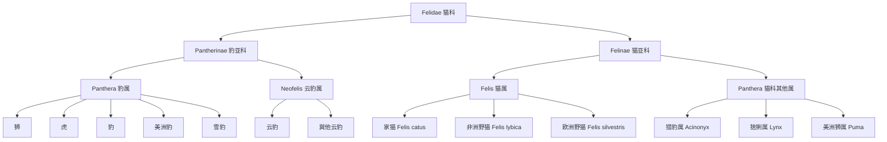
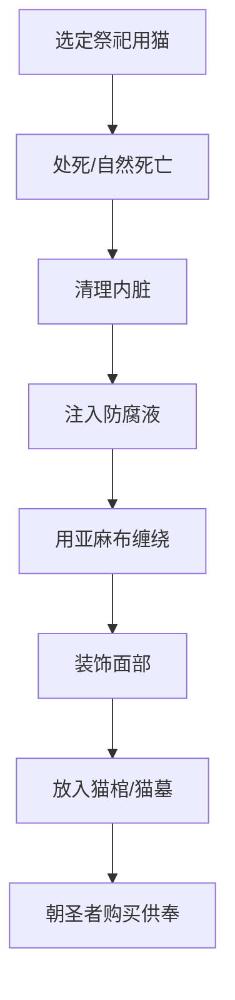
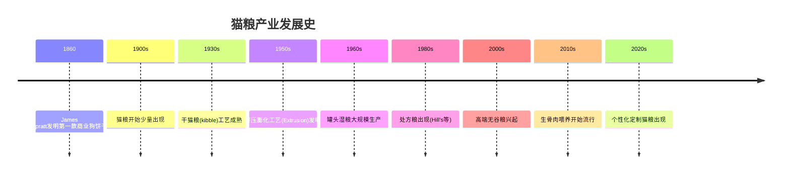

# 家猫的5000万年进化史:从古猫兽到你的沙发上

家猫和老虎的基因相似度高达95.6%,这个数字意味着什么?我是怕浪猫,一个沉迷猫科知识的科普博主。今天带你从5000万年前讲起,看看你家那只懒猫是怎么一步步占领人类家庭的。

这个系列叫「猫的知识全书」,从科学认知到实践养护再到人文共生,一共12篇。这是第1篇,我们从猫的起源开始。

## 1.1 猫科的远古祖先:从古猫兽到现代猫科

### 古猫兽:一切的开端

大约5000万年前,地球上出现了一种体型如黄鼠狼般大小的小型食肉动物--古猫兽(Miacis, Miacidae)。它是猫科、犬科、熊科等所有现代食肉目的共同祖先。

古猫兽体型只有30厘米左右,生活在森林树冠层。它有五趾的脚掌和可旋转的腕关节,适合攀爬。虽然它的后代分化出了无数分支,但有两条路线尤其重要:一条走向犬科,另一条走向猫科。

> 古猫兽不是猫的直系祖先,而是猫和狗共同的"曾祖父"--就像人类和黑猩猩有共同祖先,但人不是黑猩猩变的。

现代基因组学研究显示,猫科动物的分化时间远比我们想象的早。2017年发表在《Nature Ecology & Evolution》上的全基因组比对研究确认,猫亚科和犬科在约4200万年前分道扬镳。

### 假猫:第一只"真猫"

距今约2500万年的渐新世晚期,真正意义上的猫科动物出现了--假猫(Proailurus lemanensis)。它的化石最早发现于法国的圣热朗勒皮。

假猫体型比现代家猫稍大,约9公斤重。它有以下特征:

| 特征 | 假猫 | 现代家猫 |
|------|------|---------|
| 体型 | 约9kg | 3-5kg |
| 足部 | 半趾行 | 完全趾行 |
| 尾巴 | 长 | 中等 |
| 栖息 | 树栖为主 | 地面为主 |
| 猎食 | 伏击型 | 伏击型 |

假猫的牙齿结构已经具备了猫科动物的标志性特征:高度特化的裂齿(carnassial teeth),用于剪切肌肉。这意味着它在进化上已经锁定了"食肉"这条路线。

### 剑齿虎亚科:灭绝的猫科巨兽

提到史前猫科动物,最著名的莫过于剑齿虎亚科(Machairodontinae)。它们最显眼的特征是一对长达20-28厘米的上犬齿。

剑齿虎亚科并非一个单一物种,而是一个包含至少三个族群的亚科:

| 族群 | 代表物种 | 生存年代 | 灭绝时间 |
|------|---------|---------|---------|
| 剑齿虎族 | 斯剑虎(Smilodon fatalis) | 250万年前 | 约1万年前 |
| 后猫族 | 后猫(Metailurus) | 1000万年前 | 约500万年前 |
| 似剑齿虎族 | 似剑虎(Homotherium) | 500万年前 | 约1万年前 |

剑齿虎的灭绝原因至今有争议。主流观点认为与更新世末期大型猎物(如猛犸象、大地懒)的灭绝直接相关。当它们的专食猎物消失,那些过度特化的巨大犬齿反而成了进化包袱。

> 剑齿虎的失败告诉我们:进化不是追求"更强",而是追求"更适配"。过度特化在环境剧变时就是最大的风险。

### 现代猫科的分化:豹亚科与猫亚科

现代猫科(Felidae)分为两个亚科:



豹亚科和猫亚科的分化发生在约1080万年前。一个关键的基因差异是:豹亚科拥有完整的舌骨骨化结构,能发出真正的"吼声";而猫亚科的舌骨部分软骨化,只能发出"呼噜"声。

这就是为什么你家猫能呼噜但不能吼,而老虎能吼但不能呼噜。

### 家猫的直系祖先:非洲野猫

现代家猫的直系祖先被锁定为非洲野猫(Felis lybica),更准确地说是其近东亚种(Felis lybica lybica)。

2007年,《Science》杂志发表了一项里程碑研究。研究团队分析了979只家猫和野生猫的线粒体DNA(mitochondrial DNA, mtDNA),结论如下:

| 发现 | 数据 |
|------|------|
| 家猫起源时间 | 约1万年前 |
| 起源地点 | 新月沃地(Fertile Crescent) |
| 祖先物种 | 非洲野猫(F. lybica lybica) |
| 驯化事件次数 | 至少5次独立驯化 |
| 基因差异 | 家猫与非洲野猫基因差异极小 |

家猫和非洲野猫的基因差异小到什么程度?它们之间完全可以杂交并产生可育后代。从基因层面看,你的家猫本质上还是一只"住在你家的非洲野猫"。


> 猫是人类驯化的所有动物中,唯一与野生祖先仍属同种的。狗和狼已经分化为不同物种,但家猫和非洲野猫仍然是Felis lybica。

## 1.2 农业革命与猫的驯化契机

### 新月沃地:粮仓引来鼠患,鼠患引来猫

大约1万年前,新月沃地(Fertile Crescent)的人类完成了从狩猎采集到农业定居的转变。小麦、大麦的种植带来了粮食储存,也带来了一种全新的生态位:谷仓鼠患。

家鼠(Mus musculus)是人类的伴生种,它们追随人类的粮仓扩散。而家鼠恰好是非洲野猫的主要猎物之一。于是,一个完美的共生链条形成了:


这个过程的关键在于:人类没有主动"驯化"猫。是猫自己选择了靠近人类的生态位。

### 共生而非驯服:猫的自我驯化假说

传统驯化模型(如狗的驯化)通常是人类主动选择、控制和繁殖动物。但猫的驯化路径完全不同。

2009年,加州大学圣克鲁兹分校的Carlos Driscoll提出了"自我驯化"(Self-Domestication)假说:

| 传统驯化(狗) | 自我驯化(猫) |
|--------------|-------------|
| 人类主动选择温顺个体 | 猫自主进入人类生态位 |
| 人类控制繁殖 | 猫自主繁殖 |
| 快速性状分化 | 极少性状变化 |
| 与野生祖先生殖隔离 | 与野生祖先可杂交 |
| 依赖人类生存 | 仍可独立生存 |

猫的"自我驯化"意味着:不是人选择了猫,而是猫选择了人的粮仓。人只是没有赶走它而已。

> 狗是人类最好的朋友,猫是人类最好的室友--前者是被选出来的,后者是自己搬进来的。

### 考古证据:塞浦路斯人猫合葬墓

2004年,法国考古学家Jean-Denis Vigne在塞浦路斯的Shillourokambos遗址发现了一具距今9500年的人猫合葬墓。这是目前已知最早的人猫关系考古证据。

这具墓葬的特征:

- 人和猫面对面埋葬,间距仅40厘米
- 猫的骨架完整,没有屠宰痕迹
- 墓葬有人工装饰品(石器、贝壳)
- 猫的体型比非洲野猫略大,接近现代家猫

塞浦路斯是一个没有本土猫科动物的岛屿。这意味着这只猫一定是被人类特意带到岛上的。这证明在9500年前,人和猫之间已经建立了超越"捕鼠工具"的情感关系。

### 基因研究:现代家猫与非洲野猫的基因差异

2014年,华盛顿大学医学院的基因组学研究揭示了家猫与非洲野猫的基因差异。研究对1只家猫和22只野生猫进行了全基因组测序。

关键发现:

| 基因区域 | 功能 | 差异 |
|---------|------|------|
| KIT | 白斑/毛色 | 家猫出现白斑突变 |
| TFAM | 黑色素细胞 | 毛色多样化 |
| AGRP | 食欲调控 | 家猫食欲调控变化 |
| CMAH | 神经发育 | 与记忆和学习相关 |
| ARC | 神经可塑性 | 可能与温顺性有关 |

注意:家猫和非洲野猫的基因差异总共只有约13个关键区域。相比之下,狗和狼的基因差异超过数百个区域。这再次印证了猫的"浅度驯化"特征。

以下是一个简化的基因差异分析代码示例,展示如何使用Python比较家猫和野生猫的SNP(Single Nucleotide Polymorphism)数据:

```python
import pandas as pd

# 模拟SNP数据:家猫 vs 非洲野猫
domestic_cat_snps = {
    'KIT': {'position': 'chr1:45200000', 'ref': 'G', 'alt': 'A', 'effect': 'white_spotting'},
    'AGRP': {'position': 'chr3:89100000', 'ref': 'C', 'alt': 'T', 'effect': 'appetite_change'},
    'CMAH': {'position': 'chr5:12300000', 'ref': 'A', 'alt': 'G', 'effect': 'neuro_dev'},
    'ARC': {'position': 'chr7:78000000', 'ref': 'T', 'alt': 'C', 'effect': 'docility'}
}

wildcat_snps = {
    'KIT': {'position': 'chr1:45200000', 'ref': 'G', 'alt': 'G', 'effect': 'none'},
    'AGRP': {'position': 'chr3:89100000', 'ref': 'C', 'alt': 'C', 'effect': 'none'},
    'CMAH': {'position': 'chr5:12300000', 'ref': 'A', 'alt': 'A', 'effect': 'none'},
    'ARC': {'position': 'chr7:78000000', 'ref': 'T', 'alt': 'T', 'effect': 'none'}
}

def compare_snps(domestic, wild):
    diff_list = []
    for gene in domestic:
        if domestic[gene]['alt'] != wild[gene]['alt']:
            diff_list.append({
                'gene': gene,
                'position': domestic[gene]['position'],
                'domestic_allele': domestic[gene]['alt'],
                'wild_allele': wild[gene]['alt'],
                'effect': domestic[gene]['effect']
            })
    return pd.DataFrame(diff_list)

result = compare_snps(domestic_cat_snps, wildcat_snps)
print(f"差异基因数量: {len(result)}")
print(result.to_string(index=False))
# 输出: 差异基因数量: 4
# KIT, AGRP, CMAH, ARC 四个基因在家猫中发生了突变
```

### 驯化的局限:为什么猫始终保留"野性"

猫被驯化了1万年,但它的基因和行为几乎没有改变。这与其他驯化动物形成鲜明对比。

| 驯化特征 | 狗(1.5万年) | 猫(1万年) |
|---------|-------------|-----------|
| 体型变化 | 显著缩小 | 几乎不变 |
| 耳朵形态 | 下垂耳 | 直立耳 |
| 毛色变化 | 极其多样 | 有限变化 |
| 尾巴变化 | 卷尾等多样 | 基本不变 |
| 社交行为 | 群居性增强 | 仍保持独居本能 |
| 消化系统 | 淀粉酶增加 | 仍是专性肉食 |
| 离开人类后 | 难以生存 | 可独立生存 |

猫保留"野性"的根本原因在于:猫的驯化选择压力极弱。人类从未像繁育狗那样对猫进行功能性选择(牧羊、看家、狩猎等)。猫的唯一"功能"是捕鼠,而这个功能不需要改变猫的任何生物学特征。

> 你养的不是一个被驯化的宠物,而是一个选择和你同居的微型掠食者。

## 1.3 古埃及的猫崇拜与神圣地位

### 巴斯女神:猫首人身的女神信仰

古埃及人对猫的崇拜在人类历史上达到了前所未有的高度。这种崇拜的核心是巴斯女神(Bastet),一位猫首人身的女神。

巴斯最初是下埃及的战争与保护女神,形象是狮首。但随着时间推移,她的形象逐渐"猫化"。到了公元前1000年左右,巴斯已经成为家庭、生育和保护的象征。

巴斯女神的核心属性:

| 属性 | 象征 | 猫的关联 |
|------|------|---------|
| 保护 | 抵御邪恶 | 猫捕杀蛇/蝎 |
| 生育 | 多产 | 猫的高繁殖力 |
| 家庭 | 家庭守护 | 猫的家居习性 |
| 母性 | 哺育 | 猫的母性本能 |
| 太阳 | 日光 | 猫眼随太阳变化 |

巴斯神庙位于布巴斯提斯(Bubastis),是古埃及最重要的宗教中心之一。希罗多德(Herodotus)在《历史》中描述这座神庙是"最值得看的建筑"。

### 古埃及法律对杀猫者的严惩

古埃及对猫的保护上升到法律层面。根据戴奥多罗斯(Diodorus Siculus)的记录:

"在埃及,无论谁故意杀死一只猫,都将被处以死刑。即使是不小心杀死了猫,也会受到严厉惩罚。"

公元前60年,一只猫被一名罗马士兵意外杀死,引发了一场暴动。埃及民众涌入罗马士兵的住所将他处死,尽管当时埃及法老试图阻止但民众不为所动。

这种法律保护的核心不是"爱护动物",而是宗教禁忌。杀猫等同于亵渎神灵,是对巴斯女神的冒犯。

### 猫木乃伊:宗教仪式与考古发现

古埃及人制作猫木乃伊的规模远超想象。2018年,法国考古团队在萨卡拉(Saqqara)墓地发现了数百具猫木乃伊,以及猫神铜像。

猫木乃伊的制作流程:



据估计,仅布巴斯提斯一地就埋藏了数百万具猫木乃伊。19世纪末,英国商人曾将运回的19吨猫木乃伊碾碎做肥料,可见其数量之巨。

### 希罗多德笔下的埃及猫文化记录

希罗多德在公元前450年游历埃及,他在《历史》第二卷中详细记录了埃及的猫文化:

| 记录内容 | 原文大意 |
|---------|---------|
| 家庭养猫 | "每家都养猫,猫死了全家剃眉" |
| 火灾中的猫 | "失火时先救猫,人放第二位" |
| 猫死亡 | "猫自然死亡后全家剃眉哀悼" |
| 猫的墓葬 | "猫被送到布巴斯提斯制成木乃伊" |
| 猫与狗 | "狗死后埋在城里,猫送到神庙" |

希罗多德的记录虽然可能带有夸大成分,但考古发现基本印证了他的描述。大量猫木乃伊的出土证明古埃及确实存在系统性的猫崇拜。

### 猫从埃及走向地中海世界的传播路径

猫从埃及向全球扩散经历了几个关键阶段:

| 时期 | 传播方向 | 传播载体 |
|------|---------|---------|
| 公元前1500年 | 埃及到努比亚 | 贸易 |
| 公元前1000年 | 埃及到希腊/罗马 | 贸易与战争 |
| 公元前500年 | 地中海沿岸 | 贸易船 |
| 公元前后 | 罗马帝国全境 | 罗马扩张 |
| 公元500年 | 北欧 | 贸易网络 |
| 公元900年 | 中国 | 丝绸之路 |
| 公元1000年 | 日本 | 唐朝遣唐使船 |

罗马人是猫在欧亚大陆扩散的关键推手。罗马军队将猫带入不列颠、高卢和日耳曼地区,用于保护军粮。罗马灭亡后,猫在欧洲的地位经历了剧烈起伏。

## 1.4 猫在世界各文明中的角色变迁

### 中国:从"狸奴"到宫廷宠物

中国关于猫的最早文字记录出现在《诗经》中。《诗经·韩奕》有"有熊有罴,有猫有虎"的句子,但这里的"猫"指的是野猫。

家猫传入中国大约在汉代。随着丝绸之路的开通,来自中亚的家猫进入中国。

中国猫文化的发展脉络:

| 时期 | 称谓 | 角色 |
|------|------|------|
| 先秦 | 狸 | 野猫,捕鼠 |
| 汉代 | 狸奴 | 家猫引入 |
| 唐宋 | 狸奴/猫 | 宫廷宠物 |
| 宋代 | 狸奴 | 文人雅趣 |
| 明清 | 猫 | 普及到民间 |

宋代是中国猫文化的巅峰。陆游写过多首咏猫诗,其中最著名的是《十一月四日风雨大作》其一:

"溪柴火软蛮毡暖,我与狸奴不出门。"

陆游还给自己的猫起名"粉鼻"和"雪儿",堪称最早的"猫奴"记录。

### 日本:唐船带来的猫与招财猫的起源

猫在平安时代(794-1185年)由唐朝商船带入日本。最初只限皇室和贵族饲养,被视为珍贵礼物。

日本猫文化的关键节点:

- 平安时代:猫是贵族专属,日记文学中频繁出现
- 江户时代:猫进入庶民家庭,招财猫文化兴起
- 江户中期:短尾猫特征在日本固定化(基因漂变导致的自然选择)
- 现代:日本是猫文化最发达的国家之一

招财猫(Maneki-neko)的起源传说众多,最流行的是"豪德寺猫":一只寺庙猫向路过的藩主招手,引他入寺避雨,寺因此获重修资助。招财猫举左爪招人,举右爪招财。

### 欧洲中世纪:猫与女巫审判的黑暗时期

中世纪欧洲是猫历史上最黑暗的时期。1233年,教皇格里高利九世发布诏书《Vox in Rama》,将猫与撒旦崇拜联系在一起。

此后数百年间,欧洲发生了大规模的猫迫害:

| 迫害形式 | 时期 | 受害猫数量 |
|---------|------|-----------|
| 宗教审判焚烧 | 13-17世纪 | 不可计 |
| 圣约翰节焚烧 | 14-18世纪 | 数千/年 |
| 女巫审判连坐 | 15-17世纪 | 不可计 |
| 黑死病期间屠杀 | 14世纪 | 大量 |

讽刺的是,中世纪大规模杀猫可能加剧了黑死病(Black Death, 鼠疫)的传播。猫被杀后鼠类失去天敌,携带鼠疫杆菌(Yersinia pestis)的老鼠大量繁殖。

> 中世纪杀猫运动是人类历史上最反直觉的生态灾难之一--杀死了保护自己的猫,把瘟疫之门彻底打开。

### 伊斯兰文化中猫的受敬地位

与基督教中世纪的黑暗形成鲜明对比,伊斯兰文化中猫一直享有崇高地位。

先知穆罕默德是著名的爱猫人。据圣训(Hadith)记载:

- 穆罕默德的猫名叫Muezza
- 他曾为不惊醒睡在袍子上的猫而剪掉袍袖
- 他说"爱猫是信仰的一部分"
- 清真寺允许猫自由出入
- 用猫喝水进行的小净(Wudu)是被允许的

伊斯兰文化中猫受敬的原因:猫被认为是"洁净"的动物,与狗在伊斯兰传统中的"不洁"地位形成对比。

### 航海时代:船猫在全球扩散中的关键角色

大航海时代(15-17世纪)的每艘船上几乎都有船猫(Ship's Cat)。船猫的主要职责是控制船上的鼠患。

著名船猫包括:

| 船猫名 | 所属船只 | 事迹 |
|--------|---------|------|
| Trim | HMS Investigator | 环澳大利亚航行,有纪念雕像 |
| Mrs. Chippy | Endurance | 随沙克尔顿南极探险 |
| Convoy | HMS Hermes | 二战军舰猫,有军衔 |
| Unsinkable Sam | Bismarck等三艘军舰 | 从三艘沉船中生还 |
| Emmy | RMS Empress of Ireland | 船沉前携猫逃跑(预知?) |

船猫在猫的全球扩散中扮演了关键角色。它们随商船和军舰到达美洲、澳洲、非洲南端和亚洲各港口,将家猫带到了地球上几乎每一个角落。

## 1.5 从捕鼠工具到家庭成员:猫的身份演变

### 农场猫到城市猫:栖息地的转变

19世纪工业革命后,大量人口从农村涌入城市,猫也随之进入城市。城市猫的生态位与农场猫截然不同:

| 特征 | 农场猫 | 城市猫 |
|------|--------|--------|
| 食物来源 | 自主捕猎为主 | 人工喂食为主 |
| 活动范围 | 数百米到数公里 | 室内为主 |
| 社交对象 | 少量人类接触 | 密集人类接触 |
| 繁殖 | 自由繁殖 | 绝育控制 |
| 寿命 | 3-5年 | 12-18年 |

这一转变是猫身份演变的基础:从"工具动物"变成"伴侣动物"。

### 维多利亚时代的品种培育热潮

19世纪维多利亚时代的英国,猫品种培育成为上流社会的时尚。1871年,英国在水晶宫举办了第一届猫展(Crystal Palace Cat Show),展出了170只猫。

品种培育的核心逻辑是:选择特定毛色、体型和面部结构的猫进行定向繁殖。这导致了大量人工品种的出现:

| 品种 | 培育年代 | 起源 | 突出特征 |
|------|---------|------|---------|
| 波斯猫 | 16世纪 | 波斯(?) | 扁脸长毛 |
| 暹罗猫 | 14世纪 | 泰国 | 重点色短毛 |
| 英国短毛猫 | 19世纪 | 英国 | 圆脸粗壮 |
| 缅因猫 | 19世纪 | 美国缅因州 | 大体型长毛 |
| 阿比西尼亚猫 | 19世纪 | 埃塞俄比亚(?) | 棕色短毛 |

品种培育是一把双刃剑。它创造了丰富的猫品种多样性,但也带来了品种特有的遗传疾病。这个话题我们在第3章详细讨论。

> 品种猫的美丽背后,往往藏着人类对"审美"凌驾于"健康"之上的代价。

### 20世纪猫粮产业兴起对养猫方式的革命

20世纪之前,猫的饮食以自行捕猎和家庭剩饭为主。二战后,商业猫粮产业迅速崛起,彻底改变了猫的饮食方式。

猫粮产业发展的关键时间线:



猫粮工业化带来的影响是深远的。一方面,它让养猫变得更便捷,推动了室内养猫的普及。另一方面,干粮的高碳水化合物和低水分含量也为猫的泌尿系统疾病和肥胖埋下了隐患。

### 室内养猫的普及与"喵星人"文化的崛起

20世纪后期,特别是在美国和欧洲,"indoor-only cat"(纯室内猫)理念逐渐成为主流。推动这一趋势的因素包括:

- 城市化进程加速,户外环境不安全
- 车辆交通增加,室外猫死亡率高
- 对野生动物(鸟类)的保护意识增强
- 猫砂(cat litter)的发明让室内养猫变得可行

1947年,Edward Lowe发明了膨润土猫砂(bentonite clay litter),这是室内养猫史上的革命性事件。没有猫砂,就没有现代室内养猫模式。

| 年代 | 室内猫比例(美国) | 推动因素 |
|------|------------------|---------|
| 1930s | <10% | 无猫砂,难以室内饲养 |
| 1950s | ~20% | 膨润土猫砂普及 |
| 1970s | ~40% | 城市化+安全意识 |
| 1990s | ~60% | 动物保护理念推广 |
| 2010s | ~70% | 猫砂技术迭代+室内猫文化 |

### 数字时代:猫作为互联网文化符号

进入21世纪,猫完成了从"家庭宠物"到"互联网文化符号"的跃迁。

2007年,第一支爆款猫视频"Surprised Kitty"在YouTube获得超过1亿次观看。此后,猫成为互联网上最受欢迎的内容类型之一。

互联网猫文化的几个标志性现象:

| 现象 | 时间 | 传播规模 | 文化意义 |
|------|------|---------|---------|
| LOLcats | 2007 | 数百万 | 猫meme文化起源 |
| Surprised Kitty | 2007 | 1亿+播放 | 第一支爆款猫视频 |
| Nyan Cat | 2011 | 1.5亿+播放 | 病毒式动画 |
| Grumpy Cat | 2012 | 全球IP | 不爽猫经济 |
| Cat Tinder | 2015 | 数百万 | 猫社交化 |
| 云吸猫 | 2018 | 中国现象级 | 猫内容消费模式 |

为什么猫在互联网上如此受欢迎?有几个理论解释:

1. 猫的面部表情平淡,便于人类投射情感(空白的画布理论)
2. 猫的行为不可预测,更容易产生意外和趣味
3. 猫体型小、安全,观看时无威胁感
4. 猫的独立性与现代人自我认同产生共鸣

> 在农业时代,猫的价值在于捕鼠。在数字时代,猫的价值在于治愈。变的不是猫,而是人对猫的需求。

## 猫的驯化程度:与其他动物对比分析

为了更清晰地理解猫在驯化谱系中的位置,我们将其与几种代表性驯化动物进行系统对比。

| 动物 | 驯化时间 | 驯化方式 | 基因变化程度 | 离开人类后生存能力 |
|------|---------|---------|------------|----------------|
| 狗 | ~1.5万年前 | 主动选择 | 高(数百基因) | 弱 |
| 猫 | ~1万年前 | 自我驯化 | 极低(~13基因) | 强 |
| 牛 | ~1万年前 | 主动选择 | 中 | 弱 |
| 马 | ~5500年前 | 主动选择 | 中 | 弱 |
| 羊 | ~1.1万年前 | 主动选择 | 中 | 弱 |
| 鸡 | ~8000年前 | 主动选择 | 中 | 中 |

猫的独特性一目了然:它是唯一一种自我驯化、基因变化极小、仍能独立生存的驯化动物。

以下代码展示了如何用Python对驯化动物数据进行排序和可视化分析:

```python
import pandas as pd
import json

domestication_data = [
    {"animal": "Dog", "years_ago": 15000, "method": "active", "gene_changes": 500, "survival": 1},
    {"animal": "Cat", "years_ago": 10000, "method": "self", "gene_changes": 13, "survival": 5},
    {"animal": "Cattle", "years_ago": 10000, "method": "active", "gene_changes": 200, "survival": 1},
    {"animal": "Horse", "years_ago": 5500, "method": "active", "gene_changes": 150, "survival": 2},
    {"animal": "Sheep", "years_ago": 11000, "method": "active", "gene_changes": 180, "survival": 1},
    {"animal": "Chicken", "years_ago": 8000, "method": "active", "gene_changes": 120, "survival": 3}
]

df = pd.DataFrame(domestication_data)
df_sorted = df.sort_values('gene_changes', ascending=False)
print(df_sorted[['animal', 'gene_changes', 'method']].to_string(index=False))

# 输出:
# Dog, 500, active
# Cattle, 200, active
# Sheep, 180, active
# Horse, 150, active
# Chicken, 120, active
# Cat, 13, self
# 猫的基因变化数量是狗的2.6%--这就是"浅度驯化"的量化证据
```

## 猫驯化的基因证据深度解析

前面提到家猫与非洲野猫仅有约13个关键基因区域存在差异。这些基因到底改变了什么?我们逐一分析。

### KIT基因:白斑的起源

KIT基因控制黑色素细胞的迁移和存活。在家猫中,KIT基因的调控区域发生了突变,导致部分区域缺乏黑色素细胞,形成白色斑块。这就是为什么很多家猫胸口有白毛、爪子是白色的--这在野生猫中极为罕见。

白斑分布有一个量化分级体系:

| 等级 | 白斑比例 | 表现 |
|------|---------|------|
| 1 | 0% | 纯色 |
| 2 | 1-5% | 胸口/腹部小白点 |
| 3 | 5-25% | 胸腹白色延伸 |
| 4 | 25-50% | 面部/四肢白色 |
| 5 | 50-75% | 大面积白色 |
| 6 | 75-95% | 仅头部有色斑 |
| 7 | 95-100% | 几乎全白 |

> 野生非洲野猫的KIT基因完全正常(等级1),而你家猫的"白手套"是驯化后才出现的基因突变。研究表明,白斑等级与温顺性存在微弱正相关--白斑越多的猫,平均行为测试得分更温和。这可能是因为KIT基因与神经嵴细胞(Neural Crest Cell)迁移有关,而神经嵴细胞同时影响色素和肾上腺素分泌。

### CMAH基因:神经发育与"温顺性"

CMAH基因编码一种名为胞苷单N-乙酰神经氨酸羟化酶(Cytidine Monophosphate N-Acetylneuraminic Acid Hydroxylase)的酶。这个酶影响大脑中唾液酸(Sialic Acid)的类型,进而影响神经突触的形成。

人类在进化过程中也丢失了CMAH基因的功能(约200-300万年前),这与人类大脑发育和社交认知变化有关。家猫的CMAH基因也发生了类似变化,虽然不能说"猫和人类大脑变化相同",但这是一个有趣的趋同进化(Convergent Evolution)案例。

### AGRP基因:食欲调控的变化

AGRP(Agouti-Related Protein)基因在家猫中发生了调控区突变。在野生环境中,猫的食欲受到严格调控以维持狩猎状态。而在家猫中,AGRP基因的变化导致食欲调控机制放松--家猫更容易"吃多"。

这解释了为什么室内猫容易肥胖:不是猫"懒",而是基因层面的食欲调控发生了变化,加上食物充足、运动减少,三者叠加导致体重失控。

## 被误解的猫:常见迷思与澄清

关于猫的起源和驯化,存在不少流传甚广的错误认知。我们逐一澄清。

### 迷思一:猫起源于古埃及

很多人认为猫是古埃及人驯化的,这是一个持久误解。基因证据指向新月沃地(约1万年前),比古埃及猫崇拜早了至少5000年。古埃及不是猫的起源地,而是猫崇拜的巅峰期。

### 迷思二:猫和狗一样被人类驯化

狗的驯化有人类主动选择的过程:选择温顺个体、控制繁殖、训练功能行为。猫没有经历这个过程。猫是自己走进人类聚居区的,人类从未对猫进行系统性的行为选择。

### 迷思三:猫是驯化不完全的动物

这个说法暗示猫"应该"被完全驯化但"没做到"。事实上,猫的驯化程度恰好适合它的生态位。猫不需要像狗那样被深度改造,因为猫的"原始"行为模式(捕猎、独居)恰好是人类需要的。

### 迷思四:猫不亲人是因为不够驯化

猫的亲人程度并非由驯化程度决定,而是由其社交结构决定。猫是兼性独居动物(Facultatively Solitary),在资源充足时可以形成社交关系。猫对人的依恋风格属于安全型依恋(Secure Attachment),研究显示65%的猫对主人表现出安全型依恋,比例与人类幼儿对父母的依恋比例相似。

> 猫不是"没驯化好的狗"，猫是另一种完全不同的驯化策略的产物。用狗的标准衡量猫，就像用鱼的标准衡量鸟。

### 迷思五：猫离开人类会变野

这个说法部分正确但需要澄清。家猫如果离开人类，确实可以恢复野化状态（Feral），但这不是"退化"，而是猫本来就保留着完整的生存技能。家猫能捕猎、能领地、能繁殖——这些能力从未被驯化掉。

但并非所有家猫都能成功野化。研究表明，室内长大的猫如果突然被放到户外，头72小时的死亡率极高。能成功野化的猫通常是多代户外生活的社区猫（Community Cat）。

### 迷思六：猫和狗是竞争对手

猫和狗在生态位上几乎不重叠。猫是专性肉食的伏击型猎手，狗是杂食的追击型猎手。它们在人类家庭中的角色也完全不同。所谓"猫狗不合"更多是社交化不足导致的，而非天性。多猫多狗家庭中，猫狗能形成稳定社交关系的案例比比皆是。

## 本章总结

回看这5000万年的旅程，猫的进化史可以用三个关键词概括：分化、适应、共生。

分化——从古猫兽到豹亚科和猫亚科的分道扬镳，猫科动物在进化树上尝试了无数可能性。剑齿虎走向了巨体特化的死胡同，而小型猫科动物凭借灵活性和低能耗策略存活至今。

适应——从沙漠到森林，从野外到城市，猫展现了惊人的生态适应力。它的基因几乎没有改变，但它的行为策略足以让它从非洲草原一路走进你的客厅。

共生——猫与人的关系不是主仆，不是工具，而是一种独特的共生关系。猫选择了人类的粮仓，人类接受了猫的存在。这种松散但持久的合作关系，持续了1万年。

| 阶段 | 时间 | 猫的身份 | 与人的关系 |
|------|------|---------|-----------|
| 远古 | 5000万年前 | 野生食肉兽 | 无交集 |
| 史前 | 1万年前 | 自我驯化的捕鼠者 | 共生 |
| 古埃及 | 5000年前 | 神圣的化身 | 崇拜 |
| 中世纪 | 1000年前 | 邪恶的象征 | 迫害 |
| 航海时代 | 500年前 | 船上捕鼠员 | 工具 |
| 维多利亚 | 150年前 | 品种展示品 | 审美 |
| 现代 | 50年前 | 家庭伴侣 | 陪伴 |
| 数字时代 | 现在 | 互联网符号 | 治愈 |

猫用了5000万年,从树冠上的小型食肉兽变成了沙发上的毛球。但它的基因几乎没有改变。当你看着你家猫凝视窗外的眼神时,你看到的其实是5000万年的进化积淀。

觉得有用?收藏起来,下次和朋友聊猫的时候直接用。从5000万年前的古猫兽到今天的互联网猫meme,这篇够你聊很久了。

你觉得猫真的被人类驯化了吗?还是猫驯化了人类?评论区说说你的看法。猫的自我驯化假说 vs 人类主动驯化,你站哪个?

关注怕浪猫,下期我们讲猫的生理结构,揭秘猫为什么是"液体"。


下一篇:猫的骨骼为何能穿过比身体小得多的洞?竖瞳和胡须到底有多强?我们拆解猫的生理结构密码。
