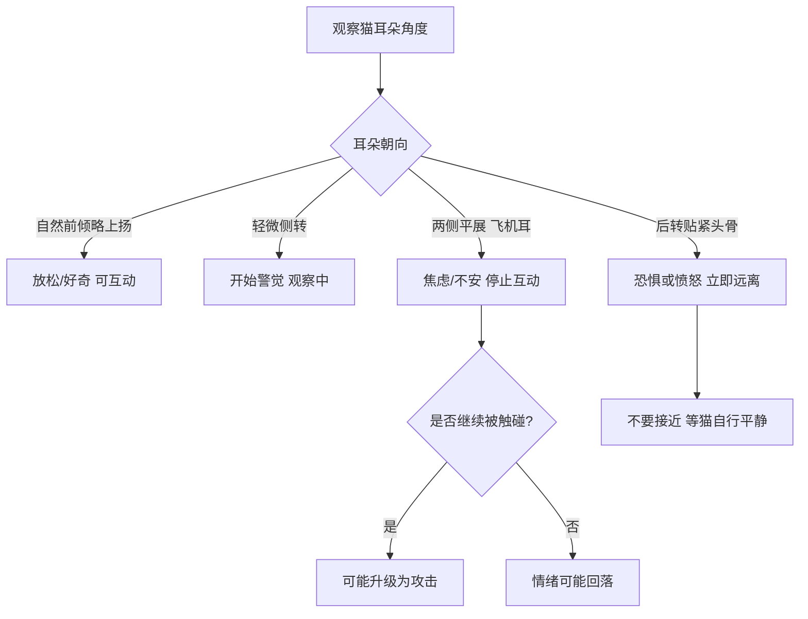
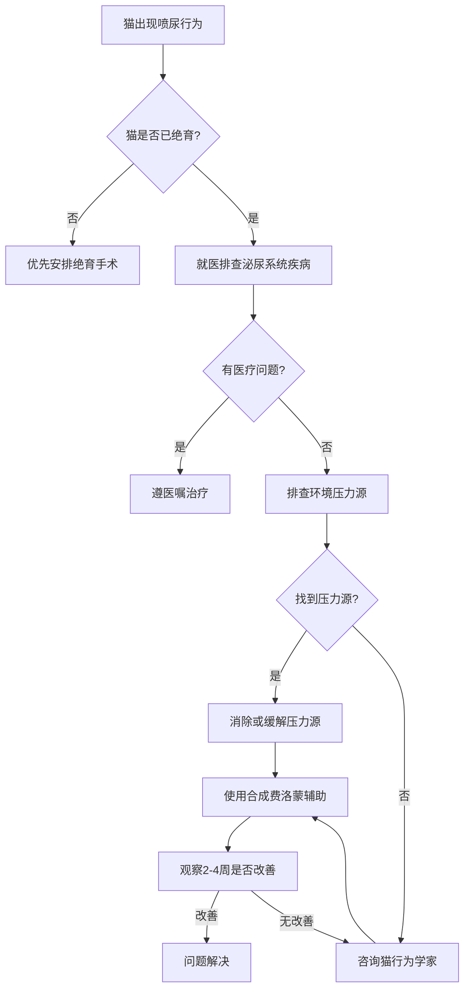

# 第四章 听懂猫话、看懂猫身：猫的行为语言完全解码

猫半夜三更跑酷、突然咬你、对着空气叫——这些行为到底什么意思？你以为猫神经病，其实它每一步、每一声、每一个眼神都在"说话"。只是人类的耳朵和眼睛，从来没装过猫语翻译器。

我是怕浪猫，今天教你听懂猫话、看懂猫身。这一章我们把猫的肢体语言、声音信号、领地行为、狩猎本能、社交结构和智力水平全部拆开来讲。读完之后，你家猫在你眼里将不再是一个毛茸茸的谜团，而是一本打开的书。

> 猫不会说人话，但它们从未停止表达——只是人类太忙于倾听自己的声音。

## 4.1 猫的肢体语言：尾巴、耳朵与瞳孔的秘密

猫的身体就是它的语言系统。尾巴是信号旗，耳朵是雷达盘，瞳孔是情绪窗口，每一个细微变化都携带着明确的信息。问题是，大多数铲屎官只看得懂"炸毛=害怕"这一条，剩下的全靠猜。下面我们把猫的肢体语言逐项拆解，让你像读仪表盘一样读猫。

### 尾巴信号：竖尾、夹尾、甩尾与炸毛尾的精准解读

尾巴是猫身上最活跃的信号发射器。竖直向上的尾巴，尾尖微微弯曲像问号，是猫世界里的"你好，我很开心见到你"。这是猫对人或其他猫表达友好和自信的最高礼遇。如果你回家时猫竖着尾巴走向你，那不是讨饭，是在说"欢迎回来"。

夹尾就是尾巴紧紧贴着身体下方或夹进两腿之间，这是典型的恐惧或顺从信号。猫在感到威胁时会把尾巴收起来保护腹部和尾根腺体，同时让自己看起来更小。甩尾需要分情况讨论——缓慢甩动通常表示猫在专注观察或思考（比如盯着窗外的鸟），而快速用力甩动则是烦躁的预警，意思是"你再摸一下试试"。

炸毛尾也叫瓶刷尾，是猫在受到突发惊吓时，尾巴毛发瞬间竖起的反应。这不是"生气"，而是交感神经系统激活后毛发竖立肌收缩的结果，本质是让自身体型看起来更大以吓退潜在威胁。通常伴随弓背和侧身站立，整套组合叫"万圣节猫姿势"。

| 尾巴状态 | 情绪含义 | 建议响应 |
|---------|---------|---------|
| 竖直+尾尖弯曲 | 友好、自信、开心 | 可以互动，给予抚摸 |
| 竖直+尾尖抽动 | 兴奋但克制 | 轻互动，注意边界 |
| 静止平举 | 警觉、关注 | 不要突然动作 |
| 缓慢摆动 | 专注思考中 | 让它安静观察 |
| 快速用力甩动 | 烦躁、即将攻击 | 立即停止互动 |
| 夹紧腹部 | 恐惧、顺从 | 给予安全感，不要强迫 |
| 炸毛瓶刷状 | 惊吓、防御中 | 远离威胁源，给空间 |
| 缠绕你的腿 | 亲昵、标记 | 享受此刻的猫式拥抱 |

### 耳朵角度：前倾、平贴与后转的含义图谱

猫的耳朵由32块肌肉控制，可以独立旋转180度。这个超能力不只是为了听老鼠在墙壁里跑步，更是为了精确表达情绪状态。

耳朵自然朝前且略微上扬，是放松和好奇的标志。这时猫对环境感到安全，愿意探索和互动。耳朵向两侧平展开，俗称"飞机耳"，是焦虑或即将升级为攻击的信号。猫在感到威胁时会压低耳朵保护它们，同时让自己头部看起来更小——这和夹尾的逻辑一样，是在降低存在感。

耳朵完全后转贴紧头骨，是极度恐惧或极度愤怒的表现，通常出现在即将发生攻击之前。如果你看到猫的耳朵贴到了脑壳上，立刻后退——这不是建议，是安全指令。



### 瞳孔变化：放大与收缩背后的情绪密码

猫的瞳孔会在极短时间内从一条细线扩张到几乎覆盖整个虹膜。这个变化之快，让人类肉眼都能明显观察到。但很多人误以为瞳孔放大只和光线有关，实际上在光线不变的环境里，瞳孔变化直接反映猫的情绪激唤水平。

瞳孔突然放大通常意味着猫受到了刺激——可能是兴奋（看到猎物/玩具），也可能是恐惧（听到巨响/看到狗）。你需要结合其他信号来区分这两种状态。如果瞳孔放大同时身体低伏、尾巴快速甩动，那是狩猎兴奋；如果瞳孔放大同时炸毛、弓背、嘶嘶叫，那是恐惧防御。

瞳孔收缩成细线，在光线充足的环境中是正常的放松状态。但如果环境昏暗时猫的瞳孔仍然很窄，可能表示疼痛或极度紧张——猫在疼痛时会缩瞳，这与人类的反应不同。

> 猫的眼睛不会说谎，因为瞳孔不受意识控制——它是猫身上唯一无法伪装的情绪通道。

### 身体姿态：弓背、侧躺与"面包卷"姿势的含义

猫的身体姿态是整体情绪的综合表达。弓背炸毛是最容易被识别的防御姿势，但很多人不知道，猫在不炸毛的情况下也可能弓背——那通常是伸懒腰，是放松的表现。区分关键在于毛发状态和持续时间：炸毛弓背是防御，光溜溜弓背+拉伸是放松。

侧躺露出腹部是猫表达极度信任的姿势。但请注意，这不一定意味着"摸我肚子"。猫的腹部是最脆弱的部位，露腹是信任的证明，不是抚摸的邀请。很多猫在被人摸肚子后会突然攻击，因为信任被"辜负"了。

"面包卷"姿势是指猫把四只爪子收在身体下方，尾巴绕在身边，整体看起来像一个面包。这是猫的休息待机模式——既放松又随时可以起身行动。猫在这种姿势下观察环境，处于"待机但不紧张"的状态。

| 身体姿态 | 含义 | 互动建议 |
|---------|------|---------|
| 面包卷 | 放松待机 | 可以轻声招呼 |
| 侧躺露腹 | 极度信任 | 不要摸肚子 |
| 弓背炸毛 | 防御恐惧 | 远离给空间 |
| 弓背无炸毛 | 伸懒腰放松 | 可以互动 |
| 低伏匍匐 | 狩猎模式 | 不要打断 |
| 四脚朝天熟睡 | 完全放松 | 别吵它 |
| 蜷缩成球 | 保暖或轻度警觉 | 温和接近 |

### 微表情：缓慢眨眼（猫之吻）与胡须朝向的社交意义

猫的微表情比大多数人想象的丰富得多。缓慢眨眼被称为"猫之吻"（Cat Kiss），是猫对信任对象表达善意的方式。当猫看着你并缓慢地闭上眼睛再慢慢睁开，它实际上在说"我信任你到愿意在你面前暂时失去视觉"。你可以回以同样的缓慢眨眼来加深你们之间的纽带。

胡须也是猫的情绪指示器。胡须自然向两侧展开，表示猫处于放松好奇的状态。胡须向后紧贴面部，是恐惧或紧张的信号。胡须明显前倾并展开，是狩猎时的"探测模式"——猫在用胡须测量猎物的位置和运动轨迹。

猫还有一个容易被忽略的微表情：嘴角。猫嘴角微微上翘不是在笑，而是弗莱门反应（Flehmen Response）的一部分。猫在嗅闻强烈气味后会微张嘴巴，通过犁鼻器（Vomeronasal Organ）分析化学信号。这个表情看起来像在做鬼脸，实际上是猫在"品尝"气味。

## 4.2 声音交流：喵叫、呼噜声与嘶嘶声的含义

猫的声学交流系统比多数人认知的要复杂得多。家猫能发出至少十几种不同功能的声音，频率范围从低频的呼噜声到高频的尖叫，覆盖了远超人类听觉范围的声谱。我们逐一拆解这些声音的含义和声学特征。

### 喵叫（Meow）：成年猫之间罕见，主要为人而发的交流

这里有一个让很多人震惊的事实：成年猫之间几乎不互相喵叫。喵叫是幼猫用来呼唤母亲的叫声，成年猫之间只在特殊情况下才使用。但家猫发现了一件事——人类对喵叫声有强烈反应。

研究表明，家猫演化出了一种专门针对人类的喵叫策略。猫通过调整喵叫的频率、持续时间和音调，来触发人类的养育本能。高频、带哭腔的喵叫特别有效，因为它在声学特征上接近人类婴儿的啼哭声。这不是阴谋，而是几千年共同生活的演化结果。

不同猫的"喵语词汇量"差异很大。有的猫只会一种喵叫，有的猫能发出十几种不同的喵叫，分别对应"饿了""开门""陪我玩""猫砂盆脏了"等不同需求。主人的识别准确率与相处时间正相关——养猫三年以上的人通常能区分自家猫70%以上的不同喵叫。

```python
# 猫喵叫分类器伪代码示意
def classify_meow(audio_sample):
    """根据声学特征分类猫的喵叫意图"""
    features = extract_features(audio_sample)
    # features包含: 基频F0, 持续时长, 谐波结构, 能量分布
    
    if features.f0 > 600 and features.duration < 0.3:
        return "greeting"  # 高频短促 = 问候
    elif features.f0 < 300 and features.duration > 0.8:
        return "demand"    # 低频长叫 = 要求(食物/开门)
    elif features.has_voicing_break:
        return "distress"  # 声带断裂音 = 焦虑/不适
    elif features.repetition_rate > 3:
        return "urgency"   # 高频重复 = 紧急需求
    else:
        return "attention" # 默认 = 引起注意
```

### 呼噜声（Purr）：满足、自愈与压力释放的多功能性

呼噜声是猫最迷人的声音之一。长期以来人们以为呼噜声就是"猫开心了"，但动物行为学研究发现真相远比这复杂。猫在满足时会呼噜，但在疼痛、分娩、临终时也会呼噜。这说明呼噜声不仅仅表达愉悦，还具有自我疗愈的功能。

猫呼噜声的频率范围在25到150赫兹之间，这个频率范围恰好落在已被证明能促进骨骼愈合、组织修复和疼痛缓解的治疗频率区间内。猫在受伤或生病时呼噜，可能是在用声波给自己做物理治疗。这是一个令人惊叹的演化适应。

猫在紧张情境下（比如去宠物医院的路上）也会呼噜，这时的呼噜声起到自我安抚的作用，类似于人类在紧张时深呼吸或哼歌。所以"猫在呼噜就是开心"是一个需要语境的判断——你要看猫同时的肢体语言来确认它到底是在享受、自愈还是安抚自己。

> 呼噜声是猫的万能频率——它既是情歌，也是止痛药，也是临终的摇篮曲。

### 嘶嘶声与低吼：防御性警告的声学特征

嘶嘶声（Hissing）和低吼（Growling）是猫的防御性声音信号。嘶嘶声在声学上模仿蛇的嘶嘶声，这是一种跨物种的恐吓策略——很多哺乳动物天生对蛇的嘶嘶声有恐惧反应，猫利用了这一点。嘶嘶声的意思很明确："退后，我现在不想打架但我会打。"

低吼是比嘶嘶声更严肃的警告。低吼是持续的低频声波，来自声带的深层振动。猫在低吼时通常已经做好了攻击准备。如果嘶嘶声是"警告"，低吼就是"最后警告"。

这两种声音的声学特征有显著差异。嘶嘶声是宽频噪声，频率从500赫兹延伸到超过10000赫兹，持续时间短促。低吼的基频通常在50到150赫兹之间，持续时间长，带有明显的谐波结构。了解这些差异有助于判断猫的防御状态处于哪个阶段。

| 声音类型 | 频率范围 | 含义 | 干预建议 |
|---------|---------|------|---------|
| 喵叫 | 300-1200 Hz | 对人交流需求 | 识别具体需求并回应 |
| 呼噜声 | 25-150 Hz | 满足/自愈/安抚 | 结合肢体语言判断 |
| 嘶嘶声 | 500-10000+ Hz | 防御警告 | 立即后退给空间 |
| 低吼 | 50-150 Hz | 最后警告 | 不要接近 |
| 尖叫 | 800-3000 Hz | 激烈攻击/剧痛 | 紧急分离/就医 |
| 咔嗒声 | 2000-5000 Hz | 狩猎兴奋 | 正常行为无需干预 |

### 颤音（Trill）与啁啾（Chirp）：母猫对幼猫的亲切音调

颤音是猫发出的最温柔的声音之一。它听起来像是一个短促的"brrrt"音，声调从低到高上升。颤音是母猫对幼猫使用的声音，意思是"跟着我"或"注意我"。成年猫之间也会用颤音表达友好，猫对信任的人也会颤音打招呼。

啁啾和颤音类似但更短促，通常带有降调。猫在看到窗外的鸟或昆虫时会发出这种声音，有时伴随着下颌的快速颤动，这被称为"狩猎颤动"（Chattering）。这种行为的原因尚不完全清楚，主流假说认为是猫在模拟咬断猎物颈椎的动作，或者是因无法捕获猎物而产生的挫败感表达。

颤音和啁啾的频率通常在3000到8000赫兹之间，远高于普通喵叫。这种高频声音对幼猫的听觉特别敏感，有利于母猫在嘈杂环境中有效召唤幼崽。这也是为什么猫对人发出的颤音特别有穿透力——它直接命中人类听觉最敏感的频段。

### 猫的"词汇量"：不同喵叫频率与主人识别的关系研究

动物行为学家对猫的"词汇量"进行了系统研究。2020年一项发表在《动物认知》（Animal Cognition）上的研究发现，猫平均能发出12到21种不同的声音，其中喵叫变体最多。每只猫的"叫声指纹"是独特的——声谱分析显示，不同猫的喵叫在基频、谐波结构和频率调制模式上都有显著差异。

更有趣的是主人识别研究。研究者让猫主人听自家猫和陌生猫的喵叫录音，结果发现主人识别自家猫喵叫的准确率高达78%。这个准确率与相处年限正相关——养猫超过5年的人，准确率超过90%。但同一主人在识别陌生猫的"意图喵叫"时准确率骤降到38%，说明人对猫叫的理解高度依赖个体经验，而非通用翻译。

这意味着不存在一本通用的"猫语词典"。每对猫和人之间都发展出了独特的沟通密码。你的猫"说的方言"，只有你能完全听懂。

## 4.3 领地意识与气味标记行为

猫是领地动物，但它们的领地管理方式和大多数人的理解不同。猫不是用铁丝网和"禁止入内"的牌子来划地盘的——它们用的是气味、视觉标记和空间策略。理解猫的领地行为，是解决很多"行为问题"的钥匙。

### 脸颊摩擦（Bunting）：费洛蒙标记与信任表达

猫用脸颊、额头和下巴在物体或人身上摩擦的行为叫"蹭头"或Bunting。这个动作看起来像撒娇，但它的生物学功能是气味标记。猫的脸颊、额头和下巴分布着多个皮脂腺，这些腺体分泌的费洛蒙（Pheromone）是一种化学信号物质。

当猫蹭你的时候，它实际上是在你身上盖一个"安全"和"归属"的化学印章。费洛蒙标记传递的信息是"这个物体/人是安全的、熟悉的"。所以猫蹭你不只是表达喜爱，更是在给自己建立环境安全感——你的气味加上它的费洛蒙，构成了它认知中的"安全区域"。

猫蹭头的频率和对象可以反映它的状态。一个新到家的猫开始蹭家具和墙壁，是它在建立领地标心的积极信号，说明它开始适应环境。一个只蹭某一个人的猫，可能在表达特别的信任和依恋。

### 爪痕抓挠：视觉标记与爪腺气味的双重功能

猫抓挠家具是新手铲屎官最头疼的问题之一。但抓挠行为的功能远不止"磨指甲"这么简单。猫的爪垫间分布着汗腺和皮脂腺，抓挠时这些腺体的分泌物会留在物体表面。所以每一次抓挠都是在同时做三件事：去除老旧指甲鞘、留下视觉标记、释放气味标记。

视觉标记对猫来说同样重要。在野外，猫会在树干和地面留下醒目的抓痕，这些抓痕的高度和深度向其他猫传递关于体型和力量的信息。这就是为什么猫特别偏爱抓沙发扶手和门框——这些位置视觉显眼、高度合适、材质通常足够粗糙。

了解了抓挠的多重功能，你就能理解为什么单纯阻止猫抓挠是无效的。正确做法是提供合法的抓挠目标——猫抓柱或猫抓板，放置在猫已经在抓的位置附近，材质选择猫偏好的类型（瓦楞纸、剑麻绳或地毯）。等到猫转移目标后，再逐步移走不想要的抓挠对象。

### 喷尿标记：未绝育公猫的领地宣示行为

喷尿标记（Urine Spraying）是猫领地行为中最让人类困扰的部分。需要首先区分的是：喷尿标记和普通排尿是两种完全不同的行为。喷尿时猫通常站立、尾巴竖直抖动、将少量尿液喷洒在垂直表面上。普通排尿则是蹲在猫砂盆里完成。

喷尿标记的主要驱动力是性激素。未绝育的公猫在性成熟后（通常6到8月龄）开始喷尿，标记自己的领地以吸引母猫和警告其他公猫。绝育可以解决90%以上的公猫喷尿问题。母猫也会喷尿，但频率低得多。

如果已绝育猫突然开始喷尿，首先要排除医疗问题（尿路感染、膀胱炎等），然后排查环境压力源。搬家、新宠物加入、户外野猫出没等都可能触发已绝育猫的喷尿行为。解决路径是：医疗检查优先，环境排查其次，行为干预最后。



### 领地核心区与外围的区分：猫的空间层次感

猫的领地不是一个均匀的"地盘"，而是有明确的空间层次。猫的领地结构分为核心区（Core Area）、活动区（Home Range）和外围区（Periphery）。核心区是猫睡觉、进食和感到最安全的区域，通常不会与其他猫共享。活动区是猫日常巡逻和狩猎的区域。外围区是猫偶尔巡视但不长期停留的边界地带。

室内猫同样有这种空间分层。猫可能把卧室视为核心区、客厅视为活动区、入户玄关视为外围区。当家里来了客人或新宠物时，猫首先会让出外围区，退守活动区，最后退守核心区。如果你观察到猫从平时的活动区域退缩到卧室床底下不出来，说明它的领地安全感已经被严重侵蚀。

理解这个层次结构对多猫家庭特别重要。在一个多猫家庭中，如果资源（食盆、水盆、猫砂盆、猫窝）都集中在同一个区域，就会导致猫在核心区被迫与其他猫产生冲突。正确做法是将资源分散放置在不同区域，让每只猫都有自己的核心安全区。

### 合成费洛蒙（Feliway）的应用：缓解领地焦虑的原理

合成费洛蒙产品是一类模仿猫天然面部费洛蒙的化学制剂。最知名的品牌是Feliway，它合成了猫面部F3费洛蒙的类似物。这种费洛蒙是猫在脸颊摩擦时释放的"安全标记"信号。

合成费洛蒙的工作原理不是"让猫开心"，而是"让环境闻起来更安全"。当环境中有F3费洛蒙信号时，猫会认为这个区域已经被标记为安全区，从而减少焦虑驱动的行为问题。临床研究显示，合成费洛蒙对喷尿标记、过度抓挠、躲藏行为和多猫冲突有一定的缓解效果，但并非万能——它是辅助手段，不能替代环境改造和行为训练。

使用合成费洛蒙时需要注意几点：扩散器需要插在猫活动最多的房间，每个房间需要一个独立扩散器，效果通常需要2到4周才能显现。如果4周后没有改善，说明行为问题的根源不是领地焦虑，需要寻找其他原因。

> 费洛蒙不是魔法药水，它只是给猫的鼻子写了一张"这里安全"的便条——但如果真正的威胁还在，便条就只是废纸。

## 4.4 狩猎本能与游戏行为

猫是天生的捕食者。即便是从来不出门的室内猫，也保留着完整的狩猎驱力和捕猎行为序列。不理解猫的狩猎本能，就无法理解很多"问题行为"的根源——夜间跑酷、攻击人的手脚、对玩具突然失去兴趣，这些都和狩猎行为有关。

### 捕猎序列：搜索-跟踪-扑击-捕获-击杀-进食

猫的捕猎行为不是一个随机的动作，而是一个有固定顺序的行为序列。完整的捕猎序列包含六个阶段：搜索（Searching）、跟踪（Stalking）、扑击（Pouncing）、捕获（Catching）、击杀（Killing-Bite）和进食（Consuming）。

每个阶段都有特定的行为模式和神经驱动。搜索阶段猫会缓慢巡视环境，使用视觉和听觉定位猎物。跟踪阶段猫会压低身体，目光锁定目标，缓慢移动接近。扑击阶段是爆发性的弹跳，后腿提供推力。捕获阶段用前爪控制猎物。击杀阶段用犬齿精准咬断猎物颈椎。进食阶段则根据饥饿程度决定是否进行。

理解这个序列的关键在于：每个阶段都有独立的满足感回路。如果游戏只让猫完成了前三个阶段但没有"捕获"和"击杀"，猫的狩猎驱力就没有被释放，它会继续寻找目标——这时候你的脚踝就成了替代品。这就是为什么逗猫棒游戏结束时一定要让猫"抓到"一次，而不能永远让它追着够不着的东西。

| 捕猎阶段 | 行为特征 | 游戏对应 | 满足感来源 |
|---------|---------|---------|-----------|
| 搜索 | 巡视、嗅闻 | 让猫看到玩具移动 | 探索欲 |
| 跟踪 | 压低身体、缓慢移动 | 逗猫棒缓慢移动 | 专注力 |
| 扑击 | 爆发跳跃 | 快速抽动逗猫棒 | 运动快感 |
| 捕获 | 前爪控制 | 让猫按住玩具 | 成就感 |
| 击杀 | 咬合动作 | 提供可咬的玩具 | 本能释放 |
| 进食 | 撕咬吞咽 | 游戏后喂食/零食 | 完整闭环 |

### 玩具作为猎物替代：逗猫棒使用的正确方式

逗猫棒是最有效的猫玩具之一，但大多数人的使用方式是错的。人类倾向于让逗猫棒在猫头顶快速画圈，这不符合任何猎物的运动模式，猫很快就会失去兴趣。

正确的逗猫棒操作应该模拟猎物的行为。啮齿类动物会沿墙根跑、突然停下、躲进障碍物后面。鸟类会短距离飞行、落地啄食、再飞走。鱼会在水中不规则游动。你的逗猫棒应该模仿这些模式：让"猎物"在地面移动、偶尔躲到沙发垫后面、突然窜出来又跑回去。

最重要的原则：让猫赢。不是每次都赢，但每场游戏至少要有2到3次成功"捕获"。如果猫永远抓不到逗猫棒上的猎物，它会进入"习得性无助"状态——这是心理学中描述动物因反复失败而放弃尝试的现象。一旦猫对游戏产生习得性无助，它会变得懒散、不爱动，进而出现肥胖和抑郁问题。

### "赠送猎物"行为：猫给主人送老鼠/虫子的含义

很多铲屎官被猫"赠送"的死老鼠、死鸟或半死不活的蟑螂吓到过。这个行为在人类看来恶心或可怕，但在猫的行为逻辑里是一种高度社交性的行为。

主流解释有两种。第一种是"母性教学"假说：母猫会把受伤的猎物带回给幼猫，让幼猫练习捕猎。猫把你视为不会捕猎的"大幼猫"，在教你生存技能。第二种是"资源分享"假说：猫把你视为家人，在和你分享它最珍贵的东西——食物。

无论哪种解释，正确的反应不是尖叫和扔掉"礼物"。这会让猫困惑——它付出巨大努力获取的珍贵资源被你嫌弃了。理想的做法是平静地接受"礼物"，把猫引开后再处理。如果你不想再收到这类礼物，解决方案是给猫戴上安全铃铛（减少成功捕猎概率）或在黄昏和黎明（猫捕猎高峰时段）限制外出。

### 室内猫的捕猎满足：如何通过游戏消耗狩猎驱力

室内猫没有机会进行真正的捕猎，但这不意味着它们的狩猎驱力消失了。如果这种驱力得不到释放，就会转化为各种行为问题——攻击人的手脚、夜间跑酷、过度舔毛、暴食或厌食。

满足室内猫捕猎需求的核心策略是"结构化游戏"（Structured Play）。每天安排2到3次、每次10到15分钟的逗猫棒游戏，按照捕猎序列的节奏进行。早晨一次消耗精力，傍晚一次对应猫的黄昏活动高峰，睡前一次帮助猫安静过夜。

游戏之外，食物丰容（Food Enrichment）也是释放狩猎驱力的有效方式。把干粮放在漏食球或藏在不同位置让猫"搜索"，用食物拼图（Food Puzzle）代替食盆直接喂食。这些方式让猫的进食过程从"张嘴等饭"变成"搜索-操作-获取"，部分替代了捕猎序列中的搜索和捕获阶段。

> 你给猫的不是玩具，而是一个假装猎物的许可——猫需要的不只是运动量，更是完成整个捕猎故事的满足感。

### 过度狩猎本能导致的行为问题：夜间攻击与扑咬

当猫的狩猎驱力长期得不到释放时，最常见的行为问题是夜间攻击。猫是晨昏活动动物（Crepuscular），在黎明和黄昏最为活跃。如果白天猫无所事事积攒了大量未释放的能量，夜间就会出现跑酷、攻击主人脚趾、大声嚎叫等行为。

解决这个问题的公式是"消耗-喂食-休息"（Play-Eat-Sleep循环）。在睡前进行15到20分钟的高强度逗猫棒游戏，让猫完成完整的捕猎序列，然后立即喂食一顿小餐。猫的生理节律在"捕猎-进食"后会自然进入休息状态，这就是为什么猫在野外捕猎进食后会长时间睡觉。

另一个常见问题是手咬。如果主人从小用手逗猫（把手在猫面前晃来晃去），猫就学会了"手=猎物"。一旦这个联想建立，以后每次手在猫面前移动都可能触发扑咬。纠正方法是用玩具替代手，永远不要用身体部位作为猫的猎物。如果猫已经养成咬手习惯，每次它咬手时立刻抽手并停止互动5分钟，让猫建立"咬手=互动结束"的联想。

## 4.5 猫的社交结构：独居还是群居？

"猫是独居动物"这句话只对了一半。猫的社交策略是高度灵活的——在食物稀缺的环境中它们确实独居，但在资源充足且存在血缘关系的情况下，猫会形成复杂的社会结构。理解猫的社交弹性，是养好多猫家庭的前提。

### 资源分散型独居：野生猫的社交策略

野生猫的社交策略取决于食物的分布方式。当猎物（主要是啮齿类）分散分布且密度低时，猫采取独居策略，每只猫占据独立的领地，通过气味标记和避免直接接触来减少冲突。这是绝大多数野生猫科动物的默认模式。

但即使在这种"独居"状态下，猫也不是完全与同类隔绝的。它们通过气味标记、视觉信号和声音来维持一个"社交网络"——虽然不直接见面，但彼此知道对方的存在和大致位置。猫的领地系统允许边缘重叠，重叠区域是"公共通道"，猫通过错峰使用来避免直接相遇。

这种"独居但有社交网络"的模式解释了为什么室内猫在引入新猫时会如此紧张——它们的空间被压缩了，无法通过距离来回避冲突。

### 母系群落：流浪猫群中的血缘联盟与协作育幼

在资源集中的环境中（比如有人投喂的社区猫群），猫会形成母系群落（Matrilineal Clowder）。这种群落的核心是多代有血缘关系的母猫——祖母、母亲和女儿们共享一个领地核心区，协作育幼和防御领地。

母系群落中的公猫是"过客"——它们在群落外围活动，交配时进入，交配后离开。年轻的公猫在性成熟后被群落驱离，避免近亲繁殖。这种模式与狮群的社交结构有相似之处，只是规模更小。

群落内母猫之间的协作行为令人惊叹。她们会互相舔毛、共同守护幼崽、甚至互相哺乳。研究表明，同一群落中的母猫能通过叫声和气味识别彼此的幼崽，对群落外的猫则表现出明显的排斥。这种识别能力是猫社交认知水平的直接证据。

### 室内多猫的社交层级：线性vs非线性关系

在室内多猫环境中，猫之间会形成社交层级。但猫的层级结构和狗不同——狗倾向于形成线性层级（A>B>C>D），而猫的层级更常是非线性的（A>B和A>C，但B和C之间可能平等或因情境而变化）。

猫的社交关系还受到资源分布的影响。在资源充足时，猫可能不表现出明显的层级——大家各吃各的，相安无事。但当资源稀缺（比如只有一个猫砂盆或一个食盆）时，层级关系就会显现，优势猫会控制资源入口。

这就是为什么多猫家庭的黄金法则是"资源数量=猫数量+1"。三只猫的家庭应该有四个猫砂盆、四个进食点、四个饮水点、多个猫窝和猫抓板。这个冗余设计让劣势猫永远有替代选择，不需要和优势猫正面冲突。

| 社交指标 | 和谐关系表现 | 紧张关系表现 |
|---------|------------|------------|
| 睡眠距离 | 叠睡或靠近 | 永远保持距离 |
| 舔毛行为 | 互相舔毛 | 单方向强迫舔毛 |
| 食物分享 | 能同时进食 | 一方吃完另一方才吃 |
| 猫砂盆使用 | 轮流使用无紧张 | 门口埋伏或排挤 |
| 身体接触 | 鼻子碰鼻子 | 互相嘶嘶或低吼 |
| 尾巴状态 | 放松自然 | 频繁甩尾或夹尾 |

### 猫的友谊标志：互相舔毛、叠睡与鼻子碰鼻子

猫之间的友谊有一套明确的信号体系。最高级别的友谊标志是互相理毛（Allogrooming）——两只猫互相舔毛，尤其是头部和颈部等自己够不到的区域。互相理毛不仅是清洁行为，更是社会纽带的强化仪式。

叠睡（Co-sleeping）是另一个重要的友谊标志。猫只对完全信任的同伴露出腹部并叠在一起睡觉。在多猫家庭中，哪些猫经常叠睡在一起，就构成了一个"小联盟"。

鼻子碰鼻子（Nose Bop）是猫之间的标准问候方式，相当于人类的握手。猫在相遇时会缓慢接近，轻轻碰一下鼻尖，然后决定是继续互动还是各走各路。如果猫对你做鼻子碰碰的动作（用鼻子凑近你的脸或手指），它在用猫的方式和你打招呼。

> 猫的友谊不靠宣言，靠叠在一起的体温——能和另一只猫叠睡的猫，已经交出了自己最脆弱的防线。

### 多猫冲突的识别：隐性攻击与资源竞争的干预

多猫冲突有两种形式：显性冲突和隐性冲突。显性冲突有嘶嘶声、低吼、追打等明显信号，容易被识别。但更常见也更危险的是隐性冲突——一只猫通过"无声的压迫"控制另一只猫。

隐性攻击的典型表现包括：优势猫长时间盯着劣势猫、挡在劣势猫通往食盆/猫砂盆/猫窝的路线上、在劣势猫接近时轻微起身示警。这些行为不会发出声音，人类很容易忽略，但劣势猫长期处于压力之下，可能出现过度舔毛、尿路问题、食欲下降等应激反应。

识别隐性冲突的方法是观察劣势猫的行为模式。如果一只猫总是等你不在的时候才去吃东西、总是绕远路避开另一只猫的路线、在你摸另一只猫时紧张地观察——这些都是隐性冲突的信号。

干预策略的第一步是增加资源冗余（食盆、猫砂盆、猫窝分散放置在不同房间）。第二步是创造垂直空间——猫架、猫墙和高处猫窝，让劣势猫有安全的回避路线。第三步是如果冲突严重，需要将两只猫完全隔离后重新进行引入程序（Separation and Reintroduction），这是一个耗时数周的渐进式重新社会化过程。

## 4.6 猫的智力与学习能力

猫聪明吗？这个问题在科学界经历了从"猫不可训练"到"猫有复杂认知能力"的观念转变。猫的智力之所以长期被低估，是因为它们不像狗那样急于讨好人类——猫不是不会，是不想在你面前表演。

### 脑体比：猫的大脑结构与人脑的相似性

猫的大脑约占体重的0.9%，虽然比人脑的2%低很多，但在哺乳动物中属于较高水平。更重要的是，猫大脑皮层的结构与人脑惊人地相似。猫的大脑皮层有约3亿个神经元（狗约1.6亿），皮层折叠模式也类似于人类。

猫大脑中负责信息处理的区域——特别是视觉皮层和听觉皮层——高度发达。猫的视觉信息处理速度远超人类，这就是为什么猫能捕捉到人类肉眼看不见的快速运动。猫的听觉皮层能处理高达64000赫兹的声音信号（人类上限约20000赫兹），这解释了为什么猫能听到老鼠在墙壁里活动而人类毫无察觉。

在情感和决策层面，猫的大脑结构和人类有显著的对应关系。猫的杏仁核（Amygdala）负责情绪处理，海马体（Hippocampus）负责记忆形成，前额叶皮层（Prefrontal Cortex）负责决策和冲动控制——这些区域在功能和神经递质系统上与人类高度保守。这意味着猫的基本情绪回路——恐惧、愉悦、愤怒、焦虑——在神经学层面上和人类的工作方式非常相似。

### 观察学习：猫通过观察同类或人类获取技能

长期以来人们以为猫只能通过试错学习，但研究证明猫具备观察学习（Observational Learning）的能力。实验显示，猫在观看另一只猫完成开启食物盒的任务后，能更快地学会同样的操作——它们通过观察获得了任务解决的"灵感"。

猫甚至能通过观察人类来学习。一项日本研究发现，猫在观察人类用特定方式打开容器后，会尝试模仿人类的动作。这种跨物种观察学习的能力在动物界并不常见，暗示着猫对人类行为有关注和解读能力。

但猫的观察学习有一个重要限制：它们只在"觉得值得"的时候学习。狗会为了取悦主人而执行任务，猫只在任务与自身利益直接相关时才投入学习。这不是"笨"，而是不同的生存策略——猫的祖先独居狩猎，没有动机去取悦同类，所以它们的学习驱力指向直接收益。

### 记忆力研究：短期记忆与长期记忆的测试

猫的记忆力比大多数人想象的强得多。在短期记忆测试中，猫能记住物体被隐藏的位置长达16小时——作为对比，狗的短期记忆通常只有5分钟。这种差异可能与猫的独居狩猎需求有关：独居猎手需要记住猎物的位置和路径，而群猎的犬科动物可以依赖同伴。

长期记忆方面，猫能记住特定的人、其他动物和地点长达数年甚至终生。有案例记录猫在分离10年后仍然认出原来的主人。猫也能记住负面经历——曾在宠物医院有过痛苦体验的猫，会在数年后仍然对类似环境表现出恐惧。

猫还有空间认知地图的能力。研究发现，猫能在脑中构建环境的空间模型，记住家中不同区域的相对位置和功能。这就是为什么猫在新家需要时间适应——它不是在"适应装修"，而是在重建空间认知地图。一旦地图建成，猫就能在黑暗中精确导航。

> 猫不是记不住，是不想记住你让它记的东西——它的记忆力全部留给了重要的事情：哪里有食物、谁是安全的、哪条路最安全。

### 训练猫的可能：响片训练（Clicker Training）的基本原理

"猫不能训练"是最顽固的误解之一。事实上猫完全可以被训练，只是方法不同于训狗。猫对惩罚零容忍——打骂只会让猫学会躲你，不会让它学会正确行为。唯一有效的猫训练方法是正向强化（Positive Reinforcement），而响片训练是其中最实用的工具。

响片训练的原理是"标记-奖励"循环。响片发出的短促"咔嗒"声是一个精确的行为标记——在猫做出正确动作的瞬间按下响片，然后立即给予零食奖励。猫很快学会"咔嗒声=这个行为是对的=有零食"，于是开始主动重复被标记的行为。

```python
# 响片训练基本流程伪代码
def clicker_training_session(cat, target_behavior, max_minutes=10):
    """单次响片训练流程"""
    session = {
        "duration": 0,
        "rewards_given": 0,
        "successful_reps": 0
    }
    
    while session["duration"] < max_minutes:
        behavior = observe(cat)
        if matches(behavior, target_behavior):
            click()           # 精确标记正确行为
            reward(cat, treat="small")  # 立即奖励
            session["successful_reps"] += 1
            session["rewards_given"] += 1
        else:
            # 不惩罚错误，只是不标记
            pass
        
        session["duration"] += 1
        # 关键: 每次训练不超过10分钟
        # 猫的注意力窗口短于狗
    
    if session["successful_reps"] < 2:
        return "lower_criteria"  # 降低标准,拆分步骤
    elif session["rewards_given"] > 8:
        return "raise_criteria"  # 提高标准,增加难度
    
    return "good_progress"
```

响片训练的关键原则有三条。第一，时机精确——响片必须在正确行为发生时按下，早一秒晚一秒都不行。第二，奖励即时——响片后3秒内必须给零食，否则猫无法建立关联。第三，循序渐进——每个目标行为拆分成多个小步骤，先奖励接近目标的行为，再逐步提高标准。

通过响片训练，猫可以学会坐下、握手、转圈、钻圈、击掌、甚至使用人类马桶。但训练猫的目的不是表演把戏——训练过程本身是猫的脑力消耗，能缓解无聊、减少行为问题，并加深你和猫之间的沟通。

### 猫能认出主人吗？面部识别与声音辨识的实验证据

"猫能认出主人吗"这个问题的答案是肯定的，而且猫识别主人的方式比很多人想象的复杂。

声音辨识方面，东京大学2019年的一项研究让猫听主人和其他人叫自己名字的录音。结果显示，猫对主人声音的耳朵转动反应显著强于对陌生人声音的反应。有趣的是，猫虽然能区分主人的声音，但不一定会回应——很多猫听到主人叫名字后只是转动耳朵，身体纹丝不动。这不是"没听见"，是猫的选择性回应策略。

面部识别方面，2022年的一项研究使用屏幕展示人脸照片给猫看。结果发现猫能区分主人脸和陌生人脸，特别是当主人的脸和陌生人脸同时出现时，猫看主人脸的时间更长。但猫的面部识别能力弱于狗——这可能是因为猫的社交需求不如狗强，不需要精细的面部识别来维持群体关系。

更令人惊讶的是猫对主人脚步声的识别。很多猫主人发现，猫能在众多脚步声中分辨出主人的脚步声，在主人上楼前就跑到门口等待。这表明猫的多模态识别能力——结合声音、气味和日常模式来识别特定的人——远超我们的想象。

| 认知能力 | 猫的表现 | 对比参考 |
|---------|---------|---------|
| 短期记忆 | 16小时 | 狗约5分钟 |
| 长期记忆 | 数年至终生 | 与狗相当 |
| 面部识别 | 能区分主人和陌生人 | 弱于狗 |
| 声音辨识 | 高精度区分主人声音 | 与狗相当 |
| 观察学习 | 能通过观察获取技能 | 强于多数犬种 |
| 空间认知 | 能构建环境心理地图 | 优于狗 |
| 自我控制 | 有但不稳定 | 弱于狗 |

> 说猫笨的人，只是还没找到猫愿意表演的舞台——在猫的认知法庭上，没有观众席，只有它自己决定什么时候开庭。

---

读完这一章，你已经掌握了猫的肢体语言、声音信号、领地行为、狩猎本能、社交结构和认知能力的核心知识。但知道和理解之间还有距离——真正的改变发生在你开始用这些知识去观察你家猫的那一刻。

猫不是缩水版的人类，也不是傲慢版的狗。它们是一套独立运转的行为系统，有自己的语法、逻辑和边界。当你学会用猫的方式去理解猫，你会发现它一直在和你说话——只是过去你听不见。

把这一章的内容当成工具箱，遇到猫的行为问题时翻出来对照：查尾巴信号表判断情绪状态，查声音对照表理解它的诉求，用行为诊断流程图定位问题根源。工具箱不会一次用完，但有了它，你不会再对着猫的行为束手无策。

收藏这一章，不是因为它写得好，而是因为下次你家猫半夜三点在你脸上踩来踩去的时候，你需要一个参考答案。

下一篇：怎么把家装成猫喜欢的样子？66条室内养猫窍门一次给你。

