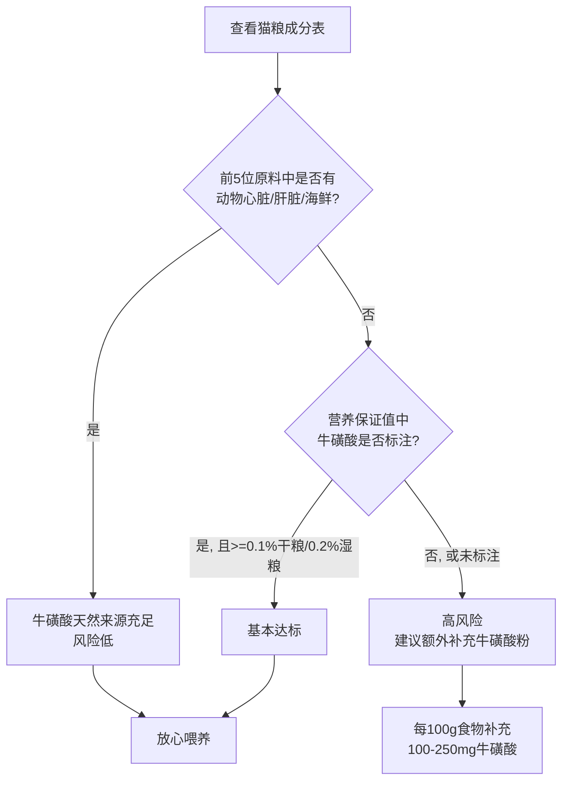
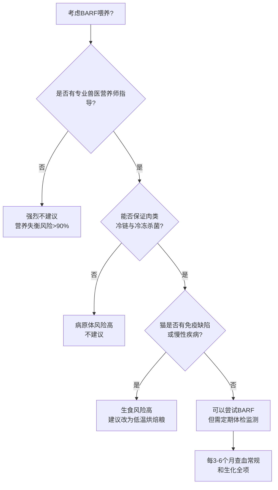
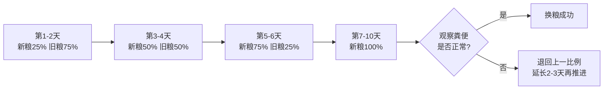
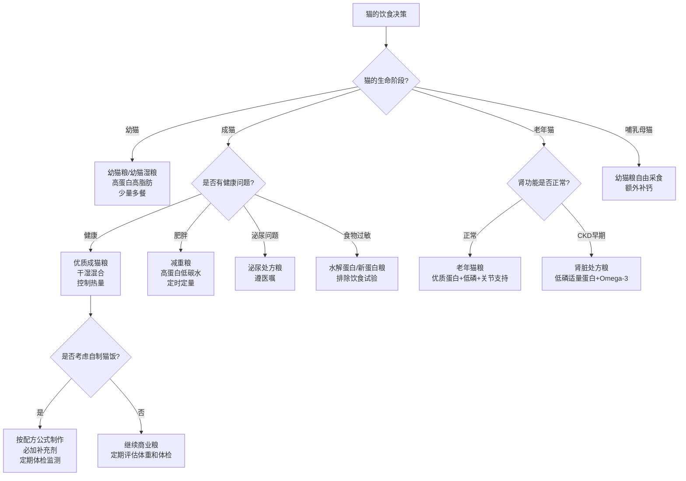

# 第七章 猫的营养与饮食：从成分表到自制猫饭的完整指南

90%的猫家长看不懂猫粮成分表，而选错粮可能导致猫3年后肾衰竭。

我是怕浪猫，今天把猫的吃饭问题一次讲透。这只每天在你脚边蹭来蹭去的小怪兽，本质上是一个严格肉食的微型猎手。它的身体从牙齿到肠道，从肝脏到肾脏，全都为一件事而设计——吃肉。但你给它碗里倒的那堆褐色小颗粒，真的能满足它几百万年进化出来的营养需求吗？

这一章，我会带你从猫的细胞层面开始，搞清楚猫到底需要什么营养、市售猫粮到底该怎么选、什么阶段该喂什么、哪些食物碰都不能碰，以及如果你想自己给猫做饭，到底该怎么做才不会害了它。

> 猫不是小型犬，它的营养需求是一条独立赛道，用养狗的逻辑养猫，就是在拿猫的肾做实验。

## 7.1 猫的必需营养素：蛋白质、脂肪、牛磺酸与维生素

### 高蛋白需求：猫对氨基酸的独特代谢途径

猫是专性肉食动物（Obligate Carnivore），这个身份意味着它的身体永远在"期待肉类"。狗可以在食物不足时下调尿素循环酶的活性来节省蛋白质，猫却不行——猫的尿素循环酶始终保持高活性状态，即便食物中蛋白质不足，猫的身体也会照常分解自身肌肉来维持氨基酸代谢。

这就引出了一个关键概念：猫的最低蛋白质需求远高于狗和人类。美国饲料管理协会（Association of American Feed Control Officials, AAFCO）规定，成年猫粮的粗蛋白含量最低应为26%（干物质基础），但这只是"不死"的底线。大量研究指出，猫在最理想状态下需要约40%-50%的蛋白质供能比，才能维持瘦体重（Lean Body Mass）不流失。

猫对几种特定氨基酸的需求也远高于其他动物。精氨酸（Arginine）就是最典型的例子。猫每天进食后，蛋白质分解会产生大量氨，需要通过尿素循环将氨转化为尿素排出体外。这个循环的第一步就需要精氨酸参与。猫的肠道合成精氨酸能力极弱，一旦食物中精氨酸不足，猫会在几小时内出现高氨血症（Hyperammonemia），表现为呕吐、共济失调，严重时抽搐甚至死亡。

| 营养素 | 成猫最低需求（干物质基础） | 推荐优质范围 | 狗的最低需求（对比） |
|--------|--------------------------|-------------|-------------------|
| 粗蛋白 | 26% | 36%-50% | 18% |
| 精氨酸 | 1.04% | 1.5%-2.0% | 0.51% |
| 蛋氨酸 | 0.2% | 0.3%-0.5% | 0.09% |
| 牛磺酸 | 0.1%（干粮）/ 0.2%（湿粮） | 0.2%-0.4% | 非必需 |

另一个值得关注的氨基酸是蛋氨酸（Methionine）。猫需要蛋氨酸来合成牛磺酸，但这条合成路径在猫体内效率极低。同时蛋氨酸本身也参与毛发形成和肝脏脂肪代谢。商业猫粮中动物蛋白通常能提供充足的蛋氨酸，但以植物蛋白为主的廉价猫粮容易出现缺口。

以下是猫每日蛋白质需求的简单估算公式：

```python
# 猫每日蛋白质需求估算
weight_kg = 4.0  # 猫的体重（kg）
# 成年猫维持期：至少2g蛋白质/kg体重/天
min_protein_g = weight_kg * 2.0
# 优质喂养推荐：3-4g/kg/天
ideal_protein_g = weight_kg * 3.5

print(f"最低蛋白质需求: {min_protein_g}g/天")
print(f"推荐蛋白质摄入: {ideal_protein_g}g/天")
# 输出: 最低蛋白质需求: 8.0g/天
# 输出: 推荐蛋白质摄入: 14.0g/天
```

### 必需脂肪酸：花生四烯酸与Omega-3/6的平衡

脂肪不只是能量的来源，它还承载着猫无法缺少的必需脂肪酸。猫和狗最大的脂质代谢差异在于花生四烯酸（Arachidonic Acid, AA）。这是一种Omega-6多不饱和脂肪酸，狗可以通过亚油酸（Linoleic Acid）自行合成花生四烯酸，猫却因为肝脏中缺乏delta-6去饱和酶（Delta-6 Desaturase），几乎无法完成这步转化。

花生四烯酸在猫体内参与炎症反应、血液凝固和生殖功能。缺少它的猫会出现皮肤问题、繁殖障碍和血小板功能异常。因此，猫粮中必须直接提供动物来源的花生四烯酸，主要来源是动物脂肪和禽肉脂肪。

Omega-3脂肪酸同样重要，尤其是二十碳五烯酸（Eicosapentaenoic Acid, EPA）和二十二碳六烯酸（Docosahexaenoic Acid, DHA）。这两种长链脂肪酸对猫的神经系统发育、视网膜功能和炎症调控都有积极作用。鱼油是最好的EPA和DHA来源，一份优质猫粮的Omega-6与Omega-3比例建议在5:1到10:1之间。

| 脂肪酸类型 | 来源 | 功能 | 猫是否需要食物提供 |
|-----------|------|------|------------------|
| 花生四烯酸（AA） | 动物脂肪、禽肉 | 炎症调控、生殖、凝血 | 是（必需） |
| 亚油酸（LA） | 玉米油、大豆油 | 皮肤屏障、毛色 | 是（必需） |
| EPA + DHA | 鱼油、深海鱼 | 神经发育、抗炎 | 建议补充 |
| α-亚麻酸（ALA） | 亚麻籽油 | 转化为EPA效率低 | 非必需 |

> 脂肪不是猫的敌人，劣质脂肪才是。猫的祖先是吃整条鱼、整只鼠的，它需要的脂肪酸谱就藏在那条鱼和那只鼠的脂肪里。

### 牛磺酸（Taurine）：猫无法自行合成的生命必需氨基酸

牛磺酸可能是猫营养学中被讨论最多的一个词。它是一种含硫氨基酸，在猫体内参与胆汁酸结合、视网膜光信号传导和心肌细胞功能调控。猫的肝脏中合成牛磺酸的限速酶——半胱次磺酸脱羧酶（Cysteinesulfinic Acid Decarboxylase, CSD）活性极低，而且这条路径还会因为食物中牛磺酸充足而被进一步抑制。

牛磺酸缺乏会导致三种严重后果。第一是猫中央视网膜变性（Feline Central Retinal Degeneration, FCRD），一种不可逆的视力丧失。第二是扩张型心肌病（Dilated Cardiomyopathy, DCM），心肌变薄无力，最终心力衰竭。第三是繁殖障碍和幼猫发育迟缓。

AAFCO规定干粮中牛磺酸含量不低于0.1%，湿粮不低于0.2%。湿粮之所以要求更高，是因为罐装过程中的高温会导致部分牛磺酸流失，同时湿粮中水分稀释了浓度。动物心脏、肝脏和海鲜类原料是天然牛磺酸的优质来源，一份以鸡肉粉为主原料的干粮通常能达标，但以植物蛋白替代动物蛋白的廉价猫粮则风险极高。

以下是一个牛磺酸摄入是否达标的快速判断流程：



### 维生素需求：维生素A、D与烟酸的猫科特殊性

猫在维生素代谢上有三个独特之处。首先是维生素A。大多数动物能将植物中的β-胡萝卜素转化为活性维生素A（视黄醇），猫却因为肠道中缺乏β-胡萝卜素双加氧酶（Beta-Carotene Dioxygenase）而几乎无法完成这步转化。猫必须从食物中直接获取预先形成的维生素A，主要来源是动物肝脏、鱼肝油和蛋黃。

维生素A缺乏会导致猫的皮肤角质化、夜盲和繁殖障碍。但维生素A过量同样危险——长期摄入大剂量维生素A会导致颈椎关节强直（Cervical Spondylosis），猫会出现颈部僵硬、前肢跛行。因此，如果给猫喂大量猪肝或鸡肝，必须控制频率和量，每周不超过两次，每次不超过总食量的5%。

其次是维生素D。猫不能像人类那样通过皮肤照射紫外线合成足量维生素D，必须依赖食物摄入。维生素D参与钙磷代谢调控，缺乏会导致佝偻病，过量会导致软组织钙化。AAFCO建议成猫食物中维生素D含量为280-300 IU/kg干物质，上限不超过3008 IU/kg。

第三是烟酸（Niacin，即维生素B3）。大多数动物能将色氨酸转化为烟酸，猫的这条转化路径因为限速酶特性而效率极低。猫的食物中必须直接提供烟酸，需求量为40 mg/kg干物质。动物肉类和内脏是天然来源，以植物为主的低质猫粮容易出现烟酸不足，表现为口腔溃疡、腹泻和皮肤粗糙。

| 维生素 | 猫的特殊性 | 最低需求（干物质） | 过量风险 | 优质来源 |
|--------|-----------|------------------|---------|---------|
| 维生素A | 无法转化β-胡萝卜素 | 3332 IU/kg | 颈椎强直 | 肝脏、鱼肝油 |
| 维生素D | 皮肤合成能力弱 | 280 IU/kg | 软组织钙化 | 鱼肝油、蛋黄 |
| 烟酸（B3） | 色氨酸转化效率极低 | 40 mg/kg | 基本无中毒报告 | 肝脏、鸡肉 |
| 维生素B1（硫胺素） | 对热和防腐剂敏感 | 5.6 mg/kg | 罕见 | 猪肉、全谷物 |
| 维生素E | 高脂饮食需求增加 | 30 IU/kg | 出血倾向 | 植物油、坚果 |

### 矿物质平衡：钙磷比与镁的泌尿影响

矿物质的平衡比绝对含量更重要。钙磷比（Calcium-to-Phosphorus Ratio, Ca:P）是猫营养中最常被讨论的指标之一。猫的理想钙磷比在1.0:1到1.3:1之间。磷过高会与钙结合形成不溶性磷酸钙，导致钙吸收下降，长期高磷饮食还会加速肾功能减退。

一只4kg的成年猫，每天大约需要钙0.3g、磷0.25g。商业猫粮通常会通过添加骨粉或碳酸钙来调整比例。如果你给猫喂自制猫饭而不添加骨骼或钙粉，几乎一定会出现钙磷比严重失调——纯肉中磷含量高而钙极低，Ca:P可能低至1:15，这会导致猫出现继发性甲状旁腺功能亢进（Secondary Hyperparathyroidism），骨骼被溶解，幼猫会出现病理性骨折。

镁（Magnesium）是另一个需要关注的矿物质。镁在猫体内参与三百多种酶反应，但猫粮中镁过量与鸟粪石（Struvite）尿结石的形成有关。当尿液pH偏高且镁浓度高时，镁与铵和磷酸根结合形成结晶。AAFCO建议猫粮中镁含量不超过0.15%干物质。但近年来的研究表明，尿液的pH值比镁的绝对含量更重要——酸化饮食（尿液pH 6.0-6.5）能有效预防鸟粪石结晶。

| 矿物质 | 成猫最低需求 | 推荐范围 | 过量风险 | 关键注意事项 |
|--------|------------|---------|---------|-------------|
| 钙 | 0.6% DM | 0.8%-1.2% | 软组织钙化 | 必须与磷保持比例 |
| 磷 | 0.5% DM | 0.6%-1.0% | 加速肾损伤 | 高磷是肾猫的隐形杀手 |
| 镁 | 0.04% DM | 0.08%-0.12% | 鸟粪石结石 | 控制在0.15%以下 |
| 钾 | 0.6% DM | 0.8%-1.2% | 心律失常 | 肾猫需额外监测 |
| 钠 | 0.2% DM | 0.3%-0.5% | 高血压 | 心脏病猫需限制 |

> 矿物质的世界里没有"多就是好"。钙磷比偏离1:1，镁超过0.15%，磷在肾功能下降时还高高在上——这些都是每天都在发生的、看不见的慢性伤害。

## 7.2 干粮、湿粮与生骨肉喂养的利弊比较

### 干粮优势与局限：便捷性vs水分不足的问题

干粮（Dry Food）是全球最普及的猫粮形态，这主要归功于它的便捷性和经济性。干粮的水分通常在6%-10%，能量密度高，可以自由采食而不易变质，单价也低于同品质的湿粮。对于上班族的猫家长来说，早上倒一碗干粮出门是最现实的喂养方案。

但干粮有一个先天缺陷：水分太低。猫的祖先来自沙漠，天然猎物的含水量约70%-75%，而猫的口渴驱动力很低——即使吃干粮的猫喝水量增加了，总水分摄入仍然只有吃湿粮猫的三分之二左右。长期慢性脱水会浓缩尿液，增加鸟粪石和草酸钙结石的风险，也对肾脏造成持续负担。

一项追踪了200只猫7年的研究发现，纯干粮喂养的猫下泌尿道疾病（Feline Lower Urinary Tract Disease, FLUTD）发病率是湿粮喂养猫的3.5倍。虽然这个研究无法完全排除其他变量干扰，但水分摄入与泌尿系统健康的关联已被多项研究反复确认。

| 比较维度 | 干粮 | 湿粮 |
|---------|------|------|
| 水分含量 | 6%-10% | 70%-85% |
| 单位价格 | 较低 | 较高（2-4倍） |
| 保存便捷性 | 高（可常温存数周） | 低（开罐后需冷藏24h内食用） |
| 牙齿清洁效果 | 轻微机械摩擦（有限） | 几乎无 |
| 自由采食可行 | 可以 | 不建议 |
| 下泌尿道疾病风险 | 较高 | 较低 |
| 碳水化合物含量 | 通常偏高（20%-40%） | 通常偏低（5%-15%） |

干粮的另一个争议是碳水化合物含量。猫没有唾液淀粉酶，肠道中也缺乏蔗糖酶的某些同工型，对碳水化合物的消化效率低于杂食动物。虽然猫能通过葡萄糖异生（Gluconeogenesis）将蛋白质转化为血糖，但高碳水干粮会增加餐后血糖波动。这对健康成猫影响有限，但对糖尿病倾向猫（如肥胖猫）则可能加速病情发展。

### 湿粮优势与局限：高水分vs开罐保存与成本

湿粮（Wet Food）的最大优势是水分。一罐85g的湿粮含约60-70ml水，一只4kg的猫如果每天吃两罐湿粮加少量干粮，仅从食物中就能获得120-150ml水分，接近其每日需水量的60%。这大幅降低了尿液浓度，对泌尿和肾脏保护有明显意义。

湿粮的蛋白质含量通常也更高（以干物质基础计算），碳水化合物更低，更接近猫的自然饮食结构。口感和接受度方面，多数猫天然偏好湿粮的质地和气味。对于食欲下降、老年猫或术后恢复期的猫，湿粮的适口性优势尤为突出。

但湿粮也有明显短板。第一是成本——高品质湿粮的月均花费通常是干粮的2-4倍。第二是保存问题：开罐后必须冷藏且在24-48小时内吃完，夏季常温下放置超过2小时就可能滋生细菌。第三是牙齿问题：湿粮对牙齿几乎无机械清洁作用，长期只吃湿粮的猫更容易出现牙菌斑和牙结石。

> 如果你只能在干粮和湿粮之间选一个，选湿粮。如果经济条件不允许全湿粮，那就在干粮的基础上尽可能多掺湿粮——每多一勺湿粮，你的猫就多喝了一口水，它的肾就少一点负担。

### 生骨肉喂养（BARF）：理论依据与营养失衡风险

生骨肉喂养（Biologically Appropriate Raw Food, BARF）的理念源于澳洲兽医Ian Billinghurst在1993年提出的假说：猫在进化中一直吃生肉和骨头，商业猫粮是工业产物，回归自然饮食最健康。BARF的典型配方包括生肌肉肉、生骨头、生内脏和少量蔬菜，搭配营养补充剂。

BARF的理论依据有一定道理。猫的自然猎物（小鼠、鸟类）的肌肉、骨骼、内脏比例确实与商业猫粮差别很大。生食的蛋白质未经高温变性，某些热敏营养素（如牛磺酸、维生素B1）保存更完整。咀嚼整只猎物或大块肉骨也能提供牙齿清洁和心理满足。

但BARF的实践风险同样显著。第一是营养失衡。一项对95个家庭自制BARF配方的分析发现，超过90%的配方至少缺乏一种关键营养素，最常见的缺口是钙、牛磺酸、维生素E和碘。第二是病原体风险。生鸡肉中常携带沙门氏菌（Salmonella）、弯曲杆菌（Campylobacter）和大肠杆菌（E. coli），不仅猫可能感染，处理生肉的猫家长也面临食源性疾病风险。第三是骨刺风险，尤其是煮熟的骨头——煮熟后骨头变脆，碎片可能刺穿消化道。



### 混合喂养方案：干湿搭配的最佳实践

混合喂养（Mixed Feeding）是怕浪猫最推荐的日常方案。核心思路是利用干粮的经济性和便捷性作为基础，用湿粮补充水分和优质蛋白。一个典型的混合方案是：早晚各一顿湿粮（每顿半罐到一罐），白天留少量干粮自由采食。

混合喂养的配比可以根据预算灵活调整。预算充裕的家庭可以做到70%湿粮+30%干粮；预算有限的家庭至少做到30%湿粮+70%干粮。关键是确保猫每天的总水分摄入不低于40ml/kg体重。

| 喂养方案 | 湿粮比例 | 干粮比例 | 月均费用（4kg猫） | 水分摄入评估 | 适合人群 |
|---------|---------|---------|-----------------|-------------|---------|
| 全湿粮 | 100% | 0% | 400-800元 | 充足 | 经济宽裕/有泌尿问题史 |
| 高湿混合 | 70% | 30% | 300-600元 | 良好 | 大多数家庭推荐 |
| 均衡混合 | 50% | 50% | 200-400元 | 尚可 | 上班族/多猫家庭 |
| 低湿混合 | 30% | 70% | 120-250元 | 偏低，需鼓励饮水 | 预算有限 |
| 全干粮 | 0% | 100% | 80-150元 | 不足，风险高 | 不推荐长期使用 |

混合喂养时需要注意总热量控制。很多猫家长犯的错误是把湿粮当成"加餐"而不减少干粮量，导致猫超重。正确的做法是先计算每日总热量需求，再按湿粮和干粮的比例分配热量，最后根据各自动粮的能量密度换算成实际喂量。

```python
# 猫每日热量需求与混合喂养分配计算
weight_kg = 4.0
# 成年猫维持期热量需求：约50-60 kcal/kg/天
daily_kcal = weight_kg * 55  # = 220 kcal

# 方案：50%湿粮 + 50%干粮
wet_ratio = 0.5
dry_ratio = 0.5

wet_kcal = daily_kcal * wet_ratio   # 110 kcal
dry_kcal = daily_kcal * dry_ratio   # 110 kcal

# 假设湿粮能量密度：80 kcal/100g，干粮能量密度：350 kcal/100g
wet_g = (wet_kcal / 80) * 100   # 137.5g
dry_g = (dry_kcal / 350) * 100  # 31.4g

print(f"每日总热量: {daily_kcal} kcal")
print(f"湿粮喂量: {wet_g:.1f}g/天 (约1.6罐85g)")
print(f"干粮喂量: {dry_g:.1f}g/天 (约一小把)")
```

### 商业猫粮标签解读：成分表、营养保证值与AAFCO标准

学会看猫粮包装上的标签，是你为猫做选择时最重要的技能。AAFCO要求猫粮标签上至少包含以下信息：成分列表（按重量降序排列）、保证分析值（Guaranteed Analysis）、饲喂试验声明或营养充足性声明。

成分列表是第一道关。前五位成分决定了这款粮的蛋白质来源质量。如果第一位是"新鲜去骨鸡肉"或"鸡肉粉"，说明主要蛋白源是动物蛋白。如果前五位中出现了多个"玉米蛋白粉"或"大豆蛋白"，说明厂家在用廉价植物蛋白凑蛋白质含量。注意"肉粉"（Meat Meal）本身不是坏东西——优质的鸡肉粉蛋白质含量比新鲜鸡肉高得多（因为去除了水分），关键是来源是否明确标注。

保证分析值只列出了粗蛋白、粗脂肪、粗纤维和水分的最低/最高值。这个信息太粗糙，不足以判断品质。更有用的是换算成干物质基础（Dry Matter Basis, DMB）来比较不同产品。换算公式很简单：干物质值 = 保证值 / (1 - 水分含量)。例如一款湿粮保证粗蛋白10%，水分80%，则干物质粗蛋白 = 10% / (1 - 0.80) = 50%。

| 标签信息 | 好猫粮的特征 | 差猫粮的特征 |
|---------|------------|------------|
| 第一成分 | 明确动物蛋白（鸡肉/鱼肉/蛋） | 模糊肉源（"肉类副产品"） |
| 前五成分 | 2-3个动物蛋白来源 | 2个以上植物蛋白 |
| 碳水来源 | 无谷物或低GI谷物（糙米/燕麦） | 大量玉米/小麦/大豆 |
| 保质剂 | 天然保鲜（迷迭香提取物） | BHA/BHT/乙氧基喹啉 |
| 牛磺酸标注 | 明确标注含量 | 未标注 |
| AAFCO声明 | "通过饲喂试验"优于"配方符合标准" | 无声明或仅标注"补充饲喂" |

> 买猫粮不是看广告，是看标签。标签上的每一个字都是法律承诺，广告上的每一句话都是营销话术。

## 7.3 不同生命阶段的营养需求：幼猫、成猫与老年猫

### 幼猫期（0-12月）：高能量、高蛋白的快速生长期配方

幼猫的生长速度在哺乳动物中相当惊人。一只出生时仅100g的小猫，到6月龄时体重可达2-3kg，增长了20-30倍。这个阶段的营养需求极为密集——幼猫每公斤体重需要的能量是成年猫的2-3倍，蛋白质需求也远高于成猫。

AAFCO对幼猫粮（Growth阶段）的最低粗蛋白要求是30%干物质，但优质幼猫粮通常在40%-50%。脂肪含量也更高（17%-25%干物质），因为幼猫需要大量能量来驱动生长。钙磷比在1.0:1到1.3:1之间，钙的绝对需求量高于成猫以支持骨骼发育。

断奶通常在4-8周龄完成。从3-4周开始可以引入糊状过渡食物，将幼猫粮用温水或代乳粉泡软后喂食。8周龄后逐步减少浸泡水量，12周龄可以完全过渡到干粮或湿粮。断奶期是猫一生中味觉和食物质地接受度最宽的窗口期——这个阶段接触过多种蛋白质来源（鸡肉、鱼肉、牛肉等）的猫，成年后挑食概率显著降低。

| 年龄段 | 体重范围 | 每日热量需求 | 推荐喂食频率 | 关键营养重点 |
|--------|---------|------------|------------|------------|
| 0-4周 | 100-500g | 由母乳提供 | 全天哺乳 | 初乳中的抗体和乳糖 |
| 4-8周 | 500-800g | 25 kcal/100g体重 | 4-6次/天 | 过渡到固体食物 |
| 2-6月 | 0.8-3kg | 200-300 kcal/天 | 3-4次/天 | 高蛋白高脂肪驱动生长 |
| 6-12月 | 3-4.5kg | 200-250 kcal/天 | 2-3次/天 | 逐步降低能量密度 |
| 12月+ | 3.5-5.5kg | 180-280 kcal/天 | 2次/天 | 切换到成猫维持粮 |

### 成猫期（1-7岁）：维持期热量控制与均衡营养

成猫期是猫一生中最长的阶段，也是营养管理最容易松懈的阶段。1-7岁的猫如果保持适当体重、正常活动量和定期体检，营养管理的目标是"维持"——不增重不减重，各项指标稳定。

成猫的每日热量需求约为50-60 kcal/kg体重。一只4kg的室内猫大约需要200-240 kcal/天。但这个数字会受活动量、环境温度、是否绝育等因素影响。绝育后的猫基础代谢率下降约25%，如果不调整喂量，很容易在1-2年内超重。

成猫期最容易犯的错误是过度喂养。美国宠物肥胖预防协会（Association for Pet Obesity Prevention, APOP）2022年的数据显示，约61%的猫超重或肥胖。肥胖猫患糖尿病的风险是正常体重猫的4倍，关节炎风险增加3倍，寿命平均缩短2年。

> 猫不会自己倒猫粮。它胖了，不是它的问题，是你的勺子的问题。

### 老年猫期（7岁以上）：低磷、优质蛋白与关节支持

猫在7岁后进入老年前期，11岁后被视为老年。老年猫的营养管理面临一个核心矛盾：它需要更少的能量（因为活动量下降），但需要更高质量的蛋白质（因为吸收效率下降）。很多家长看到猫老了就改喂"低蛋白"粮，这是一个危险的误区。

研究明确指出，老年猫并不需要减少蛋白质摄入。相反，老年猫对蛋白质的消化吸收能力下降，需要更高的蛋白质摄入来维持瘦体重。减少蛋白只会加速肌肉流失。真正需要控制的是磷——随着肾功能自然减退，高磷饮食会加速肾小球滤过率下降。

| 营养素 | 成猫期 | 老年猫期调整 | 原因 |
|--------|--------|------------|------|
| 热量 | 50-60 kcal/kg | 40-55 kcal/kg | 活动量与代谢下降 |
| 蛋白质 | 26%-40% DMB | 40%-50% DMB（不降反升） | 吸收率下降，需维持瘦体重 |
| 磷 | 0.5%-1.0% DMB | 控制在0.5%-0.7% DMB | 保护肾功能 |
| 钠 | 0.3%-0.5% DMB | 0.2%-0.3% DMB | 预防高血压 |
| 脂肪 | 9%-15% DMB | 10%-18% DMB（维持适口性） | 老年猫食欲下降，需保证摄入 |
| 维生素E | 30 IU/kg | 50-100 IU/kg | 增强抗氧化保护 |
| Omega-3 | 0.5%-1.0% | 1.0%-2.0% | 抗炎、保护关节和认知功能 |

老年猫还面临食欲下降的问题。味蕾退化、嗅觉减弱、牙齿问题都会导致进食量减少。这时可以通过加热食物（增强气味）、提供多种质地和口味、少量多餐等方式刺激食欲。如果猫连续24小时不进食，需要立即就医——猫在饥饿时容易发生肝脂质沉积症（Hepatic Lipidosis），尤其是肥胖猫。

### 哺乳期母猫：热量需求激增与钙质补充

哺乳期是母猫一生中能量需求最高的阶段。带3-4只幼崽的哺乳母猫，热量需求是平时的2-4倍，高峰期可达250-350 kcal/kg体重。这个阶段应该自由采食高能量、高蛋白的食物——幼猫粮就是很好的选择，因为它的能量密度和蛋白质含量都高于成猫粮。

钙质补充在哺乳期尤为关键。泌乳会大量流失钙，如果母猫钙摄入不足，可能在产后2-3周出现产后低血钙症（Postpartum Hypocalcemia），表现为躁动、肌肉震颤、体温升高，严重时抽搐。但补钙也不能盲目过量——过量钙会抑制骨骼释放钙的反馈机制，反而加重低血钙。最安全的方式是确保食物中钙磷比在1.1:1到1.3:1之间，而不是额外灌钙片。

### 生命阶段过渡期的饮食切换策略

换粮不是一蹴而就的事。猫的肠道菌群需要时间适应新的食物成分，突然换粮几乎一定会引起腹泻。标准的换粮周期是7-10天，逐日增加新粮比例。



换粮期间需要密切观察猫的粪便。正常的猫粪应该是深棕色、成形、不软不硬。如果出现软便或腹泻，说明肠道菌群还在适应，应该退回上一个比例多维持几天。同时确保猫在换粮期间食欲正常，精神活泼。如果出现呕吐或完全拒食，可能说明猫对新粮的某种成分不耐受，需要咨询兽医更换其他配方。

## 7.4 特殊需求饮食：泌尿处方粮、肾脏支持与低敏粮

### 泌尿处方粮：溶解结石与调节尿液pH的原理

猫的下泌尿道疾病（Feline Lower Urinary Tract Disease, FLUTD）是猫科临床最常见的疾病之一。约15%的猫一生中会经历至少一次下泌尿道问题，而饮食是管理这类疾病的核心手段之一。

泌尿处方粮的核心原理有两个：控制尿液pH和控制矿物质浓度。鸟粪石（Struvite）结石在碱性尿液中形成，处方粮通过添加酸化剂（如蛋氨酸、磷酸铵）将尿液pH降至6.0-6.5，在这个范围内鸟粪石会溶解。草酸钙（Calcium Oxalate）结石则相反，它在酸性尿液中更易形成，处方粮会适度提高尿液pH并降低钙和草酸含量。

| 结石类型 | 形成条件 | 目标尿液pH | 处方粮策略 | 可否溶解 |
|---------|---------|-----------|-----------|---------|
| 鸟粪石（Struvite） | 碱性尿、高镁 | 6.0-6.5 | 酸化饮食、限镁 | 可以溶解 |
| 草酸钙（Calcium Oxalate） | 酸性尿、高钙 | 6.5-7.0 | 减少酸化、控钙 | 不能溶解，需手术 |

需要强调的是，泌尿处方粮不是"保健品"，是"治疗手段"。它应该在兽医确诊结石类型后按医嘱使用，自行购买泌尿粮喂健康猫可能导致尿液过度酸化，反而增加草酸钙结石风险。

### 肾脏处方粮：低磷、适量蛋白与Omega-3补充

慢性肾病（Chronic Kidney Disease, CKD）是老年猫的"头号杀手"。国际肾脏兴趣组织（International Renal Interest Society, IRIS）的数据显示，15岁以上的猫中超过30%患有不同程度的慢性肾病。

肾脏处方粮的核心策略是"减负"。低磷是第一优先级——研究证实，将食物中磷限制在0.3%-0.5%干物质基础，可以显著延缓CKD进展并延长存活时间。其次是"适量"蛋白质：不是低蛋白，而是用高生物价（Biological Value, BV）的优质蛋白，在减少氮质废物的同时维持营养。最后是补充Omega-3脂肪酸（EPA+DHA），它具有抗炎作用，能减缓肾小球硬化。

一项发表于《美国兽医研究杂志》的里程碑研究追踪了211只CKD猫，发现食用肾脏处方粮的猫中位存活时间为264天，而继续吃普通粮的猫仅113天——差距超过一倍。

### 低敏粮与水解蛋白粮：食物过敏的诊断与饮食管理

猫的食物过敏（Food Adverse Reaction, FAR）并不罕见，主要症状是慢性瘙痒、皮肤炎症和慢性腹泻。诊断食物过敏的"金标准"是排除饮食试验（Elimination Diet Trial）：用一种猫从未吃过的单一蛋白质来源的食物喂养8-12周，观察症状是否改善。

水解蛋白粮（Hydrolyzed Protein Diet）是诊断和管理食物过敏的利器。它将蛋白质分子水解成小肽和氨基酸，使其分子量低于免疫系统能识别的阈值，从而避免过敏反应。水解蛋白粮常以大豆或鸡羽毛为原料，经过工业化水解处理，虽然听起来不够"自然"，但对食物过敏猫确实有效。

| 饮食类型 | 原理 | 适用场景 | 局限性 |
|---------|------|---------|-------|
| 排除饮食（单一新蛋白） | 用猫未接触过的蛋白源 | 诊断食物过敏 | 需要8-12周严格执行 |
| 水解蛋白粮 | 蛋白质分解为小肽 | 诊断和管理食物过敏 | 价格较高，适口性有时较差 |
| 有限成分粮（Limited Ingredient） | 只含1-2种蛋白源 | 长期管理食物过敏 | 可能缺乏某些营养素 |
| 新型蛋白粮 | 鹿肉、鸭肉、兔肉等 | 替代常见过敏原 | 逐惭变"旧"蛋白，需轮换 |

### 糖尿病饮食：低碳水化合物与高蛋白配方

猫的糖尿病（Diabetes Mellitus, DM）绝大多数是2型（非胰岛素依赖型），与肥胖和饮食中高碳水化合物密切相关。猫的糖尿病管理中，饮食调整的效果有时甚至优于药物。

糖尿病猫的饮食原则是"高蛋白、低碳水"。蛋白质供能比建议45%以上，碳水化合物控制在12%以下（干物质基础）。这种配比能减缓餐后血糖上升，减少胰岛素波动。同时需要控制总热量以促进减重，因为肥胖是胰岛素抵抗的核心因素之一。

对于使用胰岛素的猫，定时定量进食至关重要。注射胰岛素前后需要有食物摄入，避免低血糖。建议每天固定时间喂食两次，每次注射前先确认猫已进食。

### 胃肠道处方粮：易消化纤维与电解质平衡

胃肠道处方粮主要针对猫的慢性腹泻、炎症性肠病（Inflammatory Bowel Disease, IBD）和胃肠术后恢复。这类粮的特点是高度易消化的蛋白质来源、适量可溶性纤维和电解质补充。

可溶性纤维（如甜菜粕、洋车前子壳）能被肠道菌群发酵产生短链脂肪酸（Short-Chain Fatty Acids, SCFA），尤其是丁酸（Butyrate），它是结肠上皮细胞的主要能量来源，能促进肠道屏障修复。但纤维过多会影响营养吸收，需要平衡。

> 处方粮不是万能药，但它是兽医工具箱里最重要的一把扳手。关键是要在正确的时机、针对正确的问题、在专业指导下使用。

## 7.5 猫不能吃的食物：毒性食物清单

### 百合科植物：全株剧毒与急性肾衰竭

百合（Lilium spp.）和萱草（Hemerocallis spp.）是对猫最具威胁的植物之一。这两种植物的所有部位——花瓣、叶片、茎、花蕊、甚至花瓶里的水——都含有对猫剧毒的物质（具体毒素尚未完全确定，可能属于甾体皂苷类）。猫误食哪怕一小片百合叶，也可能在12-72小时内发展为急性肾衰竭。

百合中毒的机制是肾小管上皮细胞坏死。猫误食后6-12小时内会出现呕吐、嗜睡和食欲废绝。随后24-72小时内血肌酐和尿素氮急剧上升，尿量从多尿转为少尿甚至无尿。如果不在6小时内开始静脉输液治疗，死亡率极高。

据美国动物毒物控制中心（ASPCA Animal Poison Control Center）统计，百合是猫中毒致死案例中最常见的植物类原因。春季（3-6月百合花季）是中毒高发期。家里有猫，就不要买百合，没有例外。

### 葱蒜类：氧化性溶血性贫血的机制

葱类（Allium spp.）包括洋葱、大蒜、韭菜、大葱和小葱，都含有正丙基二硫醚（N-Propyl Disulfide）和硫代硫酸盐类化合物。这些物质会破坏猫红细胞膜上的还原型谷胱甘肽，导致血红蛋白氧化变性，形成海因茨小体（Heinz Body），最终引发氧化性溶血性贫血。

猫的红细胞膜本身就比狗和人更脆弱，对氧化损伤更敏感。中毒剂量方面，洋葱的毒性阈值约为15-30g/kg体重，大蒜的毒性更强，约为上述剂量的五分之一。中毒症状通常出现在误食后1-5天，包括虚弱、黏膜苍白、尿液变深（血红蛋白尿）、心率加快。

需要特别注意的是，浓缩形式的洋葱粉和大蒜粉毒性更强，一些婴儿食品和调味料中含有这些成分。给猫喂人类餐桌食物时，务必确认不含洋葱和大蒜成分。

### 巧克力与咖啡因：甲基黄嘌呤中毒

巧克力中的可可碱（Theobromine）和咖啡因（Caffeine）都属于甲基黄嘌呤类（Methylxanthines），猫对这些物质的代谢极慢。可可碱在猫体内的半衰期约17.5小时（人类约2-3小时），这意味着即使少量摄入也会在体内持续蓄积。

烘焙巧克力和黑巧克力中可可碱含量最高（14-20 mg/g），牛奶巧克力约2 mg/g，白巧克力几乎不含。猫的中毒阈值约为100-200 mg可可碱/kg体重。一只4kg的猫吃下约20g烘焙巧克力就可能达到中毒剂量。症状包括烦躁、心率加快、震颤、抽搐和心律失常。

### 葡萄与葡萄干：肾毒性报告与安全阈值

葡萄和葡萄干对猫的肾毒性最早是在狗身上发现的。1999年美国动物毒物控制中心首次报告了葡萄/葡萄干导致狗急性肾衰竭的案例群。此后，猫的类似案例也有报道，虽然比狗少见。

目前葡萄中的具体肾毒性物质尚未确定，可能的候选包括酒石酸、草酸钙和某些霉菌毒素。由于毒理不明，无法确定安全阈值，因此建议将葡萄和葡萄干列为猫的"零容忍"食物。即使是一两颗葡萄也可能对敏感个体造成伤害。

### 木糖醇、酒精与生面团：家居隐蔽毒素

木糖醇（Xylitol）是一种常见的人造甜味剂，广泛存在于无糖口香糖、牙膏和烘焙食品中。木糖醇对狗有剧毒（导致胰岛素大量释放和严重低血糖），对猫的毒性研究尚不充分，但已有病例报告显示猫也可能受影响。安全起见，所有含木糖醇的产品都应远离猫。

酒精对猫的毒性原理与人类相同，但猫的体型小、肝脏代谢能力弱，极少量酒精就可能中毒。猫的酒精中毒剂量约为5-8 ml纯乙醇/kg体重。一汤匙烈酒（40%酒精，约15ml）就可能让一只4kg的猫出现中毒症状。

生面团中的酵母在温暖环境中会持续发酵产气和产酒精。猫误食生面团后，面团会在胃中膨胀导致胃扩张，同时产生的酒精被吸收导致中毒。这种双重危害使生面团成为容易被忽视的家居毒素。

| 毒性食物 | 有毒成分 | 中毒剂量（4kg猫） | 主要症状 | 紧急处理 |
|---------|---------|-----------------|---------|---------|
| 百合 | 甾体皂苷（未完全确定） | 一片叶/一瓣花 | 呕吐→急性肾衰 | 6h内就医洗胃+输液 |
| 洋葱/大蒜 | 正丙基二硫醚 | 洋葱15-30g/kg | 溶血性贫血 | 就医输血+抗氧化治疗 |
| 黑巧克力 | 可可碱 | 20g烘焙巧克力 | 心律失常+抽搐 | 催吐+输液+控制痉挛 |
| 葡萄/葡萄干 | 未确定 | 无安全阈值 | 呕吐→肾衰 | 立即就医观察72h |
| 木糖醇 | 木糖醇 | 未确定 | 低血糖+肝损伤 | 立即就医 |
| 酒精 | 乙醇 | 5-8 ml/kg | 酒精中毒 | 就医支持治疗 |

> 猫的好奇心会害死它自己。你家里阳台上那束百合，厨房台面上的巧克力，垃圾桶里的一颗葡萄——在猫的世界里都是陷阱。猫化端环境，是猫家长的第一责任。

## 7.6 自制猫饭的配方原则与营养均衡

### 自制猫饭的基本公式：肌肉+内脏+骨骼+营养补充剂

自制猫饭的核心理念是模拟猫的自然饮食结构。一只野鼠的构成大约是：肌肉80%、内脏10%、骨骼5%、毛发/其他5%。对应的猫饭公式就是：80%肌肉肉+10%内脏+5%骨骼+5%营养补充剂。

肌肉肉是蛋白质和水分的主要来源，建议选用2-3种动物蛋白轮换，比如鸡胸肉、鸡腿肉、牛肉。内脏提供维生素和矿物质，鸡肝是维生素A和铁的优质来源，但量不能多。骨骼提供钙和磷，是维持钙磷比的关键。营养补充剂用来补充肉类中不足的营养素，主要包括牛磺酸、维生素E、鱼油和碘。

| 猫饭成分 | 比例 | 推荐食材 | 提供的营养 | 常见错误 |
|---------|------|---------|-----------|---------|
| 肌肉肉 | 80% | 鸡胸、鸡腿、牛肉、鸭肉 | 蛋白质、脂肪、B族维生素 | 只用单一蛋白源 |
| 内脏 | 10% | 鸡肝5%+鸡心3%+其他2% | 维生素A、铁、牛磺酸 | 肝脏超过10%导致维A过量 |
| 骨骼 | 5% | 鸡翅尖、鸡脖（生） | 钙、磷 | 用熟骨（碎裂风险） |
| 补充剂 | 5% | 见下文 | 牛磺酸、维E、碘、鱼油 | 遗漏牛磺酸或维E |

### 必须添加的营养补充剂：牛磺酸、维生素E与鱼油

自制猫饭如果不添加补充剂，几乎一定会缺乏以下营养素。第一是牛磺酸。虽然鸡肉和内脏中含有一些牛磺酸，但冷冻、解冻和储存过程中牛磺酸会流失。建议每100g食物添加100-250mg纯牛磺酸粉。

第二是维生素E。高脂肪饮食会增加猫对维生素E的需求，缺乏会导致"黄脂病"（Steatitis），一种疼痛的脂肪组织炎症。建议每100g食物添加5-10 IU维生素E。

第三是鱼油。鱼油提供EPA和DHA，但鱼油中缺乏维生素D3，需要额外补充。建议每周2-3次在食物中添加少量鱼油（每100g食物约1g鱼油），同时补充维生素D3约100-200 IU/天。

第四是碘。如果配方中不包含海鱼或海带，需要添加碘补充剂。碘缺乏会导致甲状腺功能减退，影响代谢和毛色。建议每100g食物添加150-300 μg碘（碘酸钾形式）。

### 骨钙比例：生骨来源 vs 碳酸钙粉替代方案

钙磷比的平衡是自制猫饭中最容易出错的地方。纯肉的钙磷比约为1:15，远低于猫所需的1:1到1.3:1。必须通过添加骨骼或钙粉来纠正。

生骨是最天然的钙源。鸡翅尖、鸡脖中的骨骼不仅能提供钙磷，咀嚼过程还能清洁牙齿。但生骨喂养有两个风险：一是骨刺可能卡在消化道，二是禽流感等病原体风险。如果选择生骨方案，建议使用鸡翅尖（软骨多、不易碎裂），每周2-3次，每次一小段。

更安全的替代方案是碳酸钙粉或骨粉。碳酸钙粉（Food Grade Calcium Carbonate）便宜易得，每100g食物添加约0.5-0.7g碳酸钙粉就能将钙磷比调整到1:1左右。骨粉（Bone Meal）除了钙磷外还含有微量元素，但重金属污染风险需要关注——务必选择食品级产品。

```python
# 自制猫饭钙磷比计算示例
# 假设配方：80g鸡腿肉 + 10g鸡肝 + 10g鸡心

# 各原料的钙磷含量（每100g）
# 鸡腿肉: 钙 10mg, 磷 170mg
# 鸡肝: 钙 8mg, 磷 300mg
# 鸡心: 钙 7mg, 磷 180mg

meat_ca = 0.80 * 10  # 8mg
meat_p = 0.80 * 170  # 136mg
liver_ca = 0.10 * 8  # 0.8mg
liver_p = 0.10 * 300  # 30mg
heart_ca = 0.10 * 7  # 0.7mg
heart_p = 0.10 * 180  # 18mg

total_ca = meat_ca + liver_ca + heart_ca  # 9.5mg
total_p = meat_p + liver_p + heart_p  # 184mg

current_ratio = total_ca / total_p  # 0.052:1  严重缺钙!
print(f"补充前 钙: {total_ca:.1f}mg, 磷: {total_p:.1f}mg, Ca:P = 1:{1/current_ratio:.1f}")

# 需要添加碳酸钙粉（含钙约40%）将Ca:P调到1.2:1
target_ca = total_p * 1.2  # 220.8mg
needed_ca = target_ca - total_ca  # 211.3mg
ca_powder_g = needed_ca / 400  # 碳酸钙含钙400mg/g
print(f"需补充碳酸钙粉: {ca_powder_g:.3f}g ({ca_powder_g*1000:.0f}mg)")
# 输出: 需补充碳酸钙粉: 0.528g (528mg)
```

### 常见配方错误：营养失衡的典型案例分析

案例一："纯鸡胸肉猫饭"。这是最常见的自制猫饭错误——把猫当健身教练养。鸡胸肉蛋白质高脂肪低，但长期只喂鸡胸肉会导致：钙极度缺乏（Ca:P约1:20）、牛磺酸不足、维生素A和D完全缺失。坚持喂3-6个月，猫会出现骨骼变形、心肌无力和夜盲。

案例二："大量猪肝拌饭"。有些家长觉得猪肝有营养又便宜，每顿都给猫喂一大块猪肝拌米饭。猪肝中维生素A含量极高（约4972 μg/100g），长期大量摄入会导致维生素A中毒。同时米饭是高碳水食物，猫几乎不需要。这种喂法的猫通常在半年内出现颈椎强直和肥胖。

案例三："煮熟的全鱼猫饭"。鱼是优质蛋白和牛磺酸来源，但某些鱼类（如金枪鱼）含有高量不饱和脂肪酸，会消耗猫体内的维生素E。长期只喂鱼可能导致黄脂病。此外，煮熟的鱼刺比生鱼刺更危险——煮熟后鱼刺变硬变脆，容易刺穿消化道。

### 自制猫饭的卫生安全：冷冻杀菌与交叉污染防范

自制猫饭的卫生管理直接关系到猫和人的健康安全。生肉中可能携带的病原体包括沙门氏菌、弯曲杆菌、大肠杆菌和李斯特菌。这些细菌不仅影响猫，也会通过猫的粪便和唾液传播给家庭成员。

冷冻杀菌是一种部分有效的措施。将肉类在-20°C冷冻至少7天（最好14天）可以杀灭大部分寄生虫（如弓形虫和绦虫），但对细菌杀灭效果有限。解冻时应在冷藏室缓慢解冻，不要在室温下长时间放置。

| 卫生步骤 | 目的 | 具体做法 |
|---------|------|---------|
| 采购 | 降低初始污染 | 选择人食用级新鲜肉类，当天制作或立即冷冻 |
| 冷冻 | 杀灭寄生虫 | -20°C冷冻7-14天 |
| 解冻 | 控制细菌繁殖 | 冷藏室缓慢解冻，不超过24h |
| 制作 | 避免交叉污染 | 专用砧板和刀具，与人类食材分开 |
| 储存 | 延长保鲜 | 分装小份冷冻，冷藏解冻后24h内食用 |
| 清洁 | 消毒环境 | 制作后用热水和洗涤剂清洗所有接触表面 |

> 自制猫饭不是"做饭"，是"配方制作"。做饭可以凭感觉，配方制作必须用秤。0.5g碳酸钙粉和1g碳酸钙粉之间的差别，就是你的猫骨骼健康和骨骼疾病的分界线。

## 本章总结：猫的营养决策树

猫的饮食管理是一个系统工程，不是"买最贵的粮"或"跟着感觉喂"就能解决的。怕浪猫帮你梳理一个决策框架，帮你找到最适合你家猫的喂养方案。



记住三个核心原则。第一，猫是专性肉食动物，动物蛋白质是它一切营养的基石。第二，水分是被最多人忽略的营养素，湿粮的价值远不止"口感好"。第三，没有任何一种食物适合所有猫，最好的食物是适合你家猫的年龄、健康状况和生活方式的食物。

> 喂猫这件事，不复杂，但也不简单。复杂在于你需要理解几百万年的进化在猫身体里留下的烙印，简单在于你只需要尊重这个烙印——给猫吃肉，给猫喝水，给猫定期检查。做到这三件事，你就比90%的猫家长都强。

下一篇：猫瘟、尿闭、肾衰竭——这些致命疾病的早期信号你一定要知道。

---


*怕浪猫·猫科学全书 | 第七章完*
