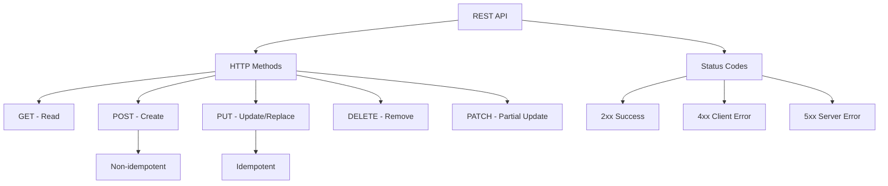

# 第十八章：从阅读到输出

> 读过的东西如果不经过加工，就像水流过沙地——湿了一下表面，很快蒸发干净。真正让英语能力产生质变的，不是你读了多少英文文档，而是你输出了多少。这一章，我们来聊怎么把输入变成输出，从技术读书笔记到英文博客，从翻译练手到开源贡献，最终在英文技术社区建立你自己的影响力。

---

## 18.1 读书笔记与技术拆解写作

读完一本技术书或者一篇深度文章，你有没有过这种感觉——"我看懂了，但让我说说讲了啥，我说不出来"？这不是你的理解力有问题，而是缺少了从"被动阅读"到"主动重构"的中间环节。

### 18.1.1 为什么技术读书笔记不一样

技术读书笔记不是摘抄。摘抄是复制粘贴，笔记是拆解重组。好的技术笔记应该做到：**能让三个月后的你，或者一个完全没读过这本书的同事，通过你的笔记理解核心概念。**

这个标准看起来很高，但其实只要方法对了，做起来很自然。

### 18.1.2 Feynman 技巧：用最简单的话解释

物理学家 Richard Feynman 有一个著名的学习方法，核心就一句话：**如果你不能用简单的语言把一个概念讲清楚，说明你还没有真正理解它。**

具体到技术读书笔记，操作步骤是这样的：

1. **读完一个章节后，合上书**（关掉页面），用自己的话把核心概念写出来
2. **用英文写**——这很关键，因为你在读的是英文资料，用英文重构能逼迫你主动使用刚学到的词汇和句式
3. **写到卡壳的地方就停下来**——卡壳说明这里有知识盲区，回去重新读
4. **简化、再简化**——第一遍写完后再回头精简，去掉术语堆砌，用大白话

举个例子，你读了关于 React Server Components 的文档，用 Feynman 技巧写出来的笔记可能是这样的：

```
# React Server Components (RSC) - My Understanding

## What is it?
RSC lets you write components that run only on the server.
They never get sent to the browser as JavaScript.

## Why does it exist?
Before RSC, all React components ran in the browser.
This means all the code and data fetching happened client-side,
which can make apps slow on mobile devices.

## The key insight
Think of it as "server-side rendering but with interactivity."
The server sends HTML, but interactive parts are still hydrated
with client components.

## What confused me at first
I thought RSC replaces SSR. It doesn't. They work together:
SSR gives you the initial HTML, RSC decides which components
stay on the server.
```

注意到了吗？这不是摘抄文档，而是**你自己的理解重构**。用词可能不完美，语法可能有瑕疵，但这恰恰是最高效的英语输出练习。

### 18.1.3 概念卡片法

对于散落的知识点，概念卡片（Concept Cards）是个好工具。每张卡片只讲一个概念，格式固定：

| 字段 | 说明 | 示例 |
|------|------|------|
| **Term** | 术语名 | Idempotent |
| **Definition** | 一句话定义 | An operation that produces the same result no matter how many times you run it |
| **Analogy** | 类比 | Like an elevator button — pressing it 10 times still only calls the elevator once |
| **Code Example** | 代码示例 | `PUT /users/1 {name: "Alice"}` — always sets the same state |
| **Related** | 相关概念 | PUT vs POST, REST API design |
| **My Question** | 我的疑问 | Is DELETE idempotent? Yes — deleting the same resource twice gives the same end state |

概念卡片的好处是**原子化**——每个概念独立成卡，方便检索、复习、重组。你可以用 Anki、Notion、甚至普通 Markdown 文件来管理。

英语学习角度来说，每张卡片就是一次微型写作练习。Definition 字段训练你精确表达，Analogy 字段训练你用英语打比方，My Question 字段训练你用英语提问。

### 18.1.4 知识图谱：把概念连起来

单个概念理解了，还要知道概念之间的关系。知识图谱（Knowledge Graph）就是干这个的。

不需要用什么花哨的工具，Markdown + Mermaid 就够了：



画图的过程就是梳理关系的过程。你会发现自己边画边想："等等，PUT 和 PATCH 到底什么关系？" 然后回去查——这个查的过程，又是一次英文阅读练习。

### 18.1.5 读书笔记模板

给你一个可以直接用的模板，适用于大部分技术书籍和长文章：

```markdown
# [Book/Article Title] - Reading Notes

## Meta
- Author: 
- Date Read: 
- Reading Time: ~X hours
- Difficulty: 1-5

## One-Sentence Summary
[用一句话概括全书/全文核心观点]

## Key Concepts

### Concept 1: [Name]
- **My understanding:** [用英文写你的理解]
- **Why it matters:** [为什么这个概念重要]
- **Code/Example:** [代码或实例]
- **Confusion:** [没搞懂的地方，用英文提问]

### Concept 2: [Name]
...

## Mental Model
[这个知识如何融入你已有的知识体系]

## Action Items
- [ ] [具体可执行的下一步]
- [ ] [具体可执行的下一步]

## Vocabulary
| Word | Meaning in Context | My Sentence |
|------|-------------------|-------------|
| ... | ... | ... |
```

最后的 Vocabulary 表格很重要。技术阅读中遇到的生词，放进你自己的句子里，才能真正记住。比如你遇到了 "leverage" 这个词，不要只写 "利用"，写一个你自己的句子："We can leverage TypeScript's type inference to reduce boilerplate."

### 18.1.6 从笔记到技术拆解文章

笔记是给自己看的，拆解文章是给别人看的。当你对某个主题的笔记积累到一定程度，就可以考虑写成一篇结构化的技术拆解文章。

这个过程其实就是：**笔记 → 大纲 → 初稿 → 修订 → 发布**。注意，这里说的"发布"不一定是对外发布，先发在自己的知识库或者团队内部 Wiki 里也行。关键是从"自用"走向"他用"——这会逼迫你把英语表达打磨得更清晰。

---

## 18.2 翻译技术文章的方法与练习

翻译是连接阅读和写作的一座桥梁。你已经能读懂英文技术文章了，翻译能让你更深入地理解英文的表达结构和用词选择，为自主写作打下基础。

### 18.2.1 翻译流程：四步法

一个成熟的翻译流程不是拿到文章从头翻到尾，而是分四步走：

**第一步：通读全文（Read-Through）**

先不翻译，完整读一遍。目的有三个：
- 理解文章的整体结构和论点
- 标记不认识的专业术语
- 判断哪些地方需要意译，哪些可以直译

通读时用 highlight 标出你不确定的表达，这些是稍后需要重点处理的地方。

**第二步：分段翻译（Segment Translation）**

按段落逐段翻译。这里有一个关键原则：**先求达意，不求优美**。第一遍翻译的时候，把每段的含义用中文准确表达出来就行，不要纠结中文文采。

```
原文：React Server Components allow you to render parts of your
application entirely on the server, sending zero JavaScript
to the client for those components.

初译：React Server Components 允许你完全在服务器上渲染应用的某些部分，
对这些组件不向客户端发送任何 JavaScript。

说明：初译已经准确传达了含义，但"对这些组件"有点生硬，
后面校对时优化。
```

**第三步：术语统一（Terminology Check）**

技术翻译最怕的是术语不一致。比如 "render" 在同一篇文章里一会儿翻译成"渲染"，一会儿翻译成"绘制"，读者会很困惑。

建一个术语表，在翻译过程中持续维护：

| 英文 | 中文翻译 | 备注 |
|------|---------|------|
| render | 渲染 | UI 语境下统一用"渲染" |
| hydration | 水合 | React 术语，不译为"注水" |
| bundle size | 包体积 | 不译为"打包大小" |
| tree shaking | tree shaking | 保留英文，业界约定俗成 |
| progressive enhancement | 渐进增强 | web 标准术语 |

有些术语业界已经约定俗成保留英文，比如 tree shaking、hoisting、polyfill，不要强行翻译。

**第四步：校对润色（Review & Polish）**

对照原文逐句校对，重点检查三件事：
1. **有没有漏译**——尤其是从句、定语修饰这些容易被忽略的部分
2. **中文是否通顺**——初译常有"翻译腔"，需要调整为中文的表达习惯
3. **技术含义是否准确**——这是技术翻译的红线，宁可不优美，不能不准确

### 18.2.2 常见翻译陷阱

**陷阱一：长句拆分**

英文技术文章喜欢用长句，嵌套多层从句。硬翻成一句中文会非常难读。

```
原文：The component, which is responsible for rendering
the user's profile information and which relies on data
fetched from three different API endpoints, was refactored
to use React Query for better caching and error handling.

❌ 硬翻：这个负责渲染用户个人资料信息且依赖于从三个不同的 API 端点
获取数据的组件被重构为使用 React Query 以获得更好的缓存和错误处理。

✅ 拆分：该组件负责渲染用户个人资料，数据来自三个不同的 API 端点。
重构后改用 React Query，以获得更好的缓存和错误处理能力。
```

**陷阱二：被动语态**

英文技术文档大量使用被动语态（"is configured"、"are deployed"），但中文被动句用多了会很别扭。很多时候改成主动句更自然。

```
❌ 配置文件被应用程序加载。
✅ 应用程序加载配置文件。
```

**陷阱三：介词短语堆叠**

英文可以通过介词短语不断叠加修饰，中文这样会很冗长。

```
原文：a tool for building APIs for microservices
for handling data validation in distributed systems

❌ 一个用于构建用于处理分布式系统中数据验证的微服务的 API 的工具

✅ 一款 API 构建工具，专为分布式系统中的数据验证场景设计，
面向微服务架构。
```

**陷阱四："假朋友"词汇**

有些词看起来认识，实际含义和你想的不一样：

| 英文词 | 常见误解 | 正确含义（技术语境） |
|--------|---------|-------------------|
| introduce | 介绍 | 引入、采用（如 "introduced in v2.0"） |
| leverage | 杠杆作用 | 利用、借助 |
| transparent | 透明的 | 对用户无感知的、自动处理的 |
| primitive | 原始的 | 基础构件、原语（中性，非贬义） |
| resolution | 决议 | 分辨率/解决方案（看语境） |
| convention | 大会 | 约定、规范 |

### 18.2.3 翻译练习建议

**练习策略：从短到长，从易到难**

1. **第一周**：翻译 GitHub README 的 Feature 段落（通常几百词，结构清晰）
2. **第二周**：翻译官方文档的 Quick Start / Getting Started 页面
3. **第三周**：翻译一篇 1000-2000 词的技术博客
4. **第四周**：翻译一篇有深度技术分析的长文

**练习方法：对照法**

找一篇已经有高质量中文翻译的文章（比如 React 官方文档的中文版），先自己翻译一遍，然后和官方译文对照。看看自己哪里理解偏了，哪里表达不如官方流畅。这种对照练习进步最快。

**发布建议**

翻译完成后可以考虑发布在以下平台：
- 个人博客
- 掘金/segmentfault 等中文技术社区（翻译标签）
- GitHub 仓库（积累翻译作品集）

注意：翻译外文文章发布时，务必确认原文的版权许可。很多技术博客使用 CC BY 协议，翻译发布是允许的，但要注明出处和原作者。

---

## 18.3 用英文写技术博客并发布

从中文博客过渡到英文博客，最大的障碍不是英语水平，而是心理障碍。"我写的英语不够好怎么办？""别人会不会笑话我的语法？"——说实话，技术博客的读者根本不在乎你的语法，他们在乎的是你的内容有没有价值。

### 18.3.1 从中文到英文的过渡策略

**阶段一：中英对照写作**

先写中文，再翻译成英文。这个阶段重点是适应英文技术写作的结构和表达。你会发现，翻译过程中你不得不调整句子结构、重新组织段落——这个调整的过程就是学习的过程。

**阶段二：英文大纲 + 中文填充**

用英文写大纲和关键句，用中文填充细节。然后逐步把中文部分替换成英文。这个阶段你开始用英文思考文章结构了。

**阶段三：直接英文写作**

直接用英文写。不需要完美，写出第一稿就行。写完之后可以用 Grammarly 或 LanguageTool 检查语法，用 ChatGPT/Claude 帮忙润色（但不要完全依赖 AI，你要自己理解为什么改）。

**阶段四：英文思维写作**

不仅写作用英文，连构思、打草稿、做笔记都是英文。到这个阶段，英文写作已经不是"翻译"而是"表达"了。

### 18.3.2 英文技术博客的结构模板

英文技术博客有一些约定俗成的结构模式，掌握了模板，写作难度会大幅降低：

```markdown
# [Catchy Title: Problem + Solution/Insight]

## TL;DR
[1-3 sentences summarizing the key takeaway]

## The Problem
[Describe the problem you encountered or want to solve]

## Why It Matters
[Explain why this problem is worth caring about]

## The Solution
### Step 1: ...
### Step 2: ...
### Step 3: ...

## Code Example
```language
[code with comments]
```

## Gotchas / Things to Watch Out For
[Edge cases, common mistakes]

## Conclusion
[Wrap up + what's next]

## References
- [Link 1]
- [Link 2]
```

这个模板适用于 80% 的技术博客。你不需要每次都创新结构，先用好模板，熟练了再灵活变化。

### 18.3.3 写作中的英语技巧

**技巧一：短句优先**

技术博客不是文学作品。短句更清晰，也更不容易出语法错误。

```
❌ In order to properly configure the authentication middleware
which is responsible for verifying JWT tokens that are sent by
the client in the Authorization header, you need to first install
the jsonwebtoken package.

✅ To configure JWT authentication, first install the jsonwebtoken
package. The middleware verifies tokens from the Authorization header.
```

**技巧二：用主动语态**

```
❌ The file is parsed by the compiler.
✅ The compiler parses the file.
```

**技巧三：避免模糊表达**

```
❌ This approach is very fast and quite reliable.
✅ This approach handles 10,000 requests/second in our benchmarks,
   with a 99.9% success rate.
```

**技巧四：善用过渡词**

过渡词让文章逻辑更清晰，是英文技术写作的标志性特征：

| 过渡词 | 用途 | 示例 |
|--------|------|------|
| However | 转折 | However, this approach has limitations. |
| Therefore | 因果 | Therefore, we need a different strategy. |
| In contrast | 对比 | In contrast, the async version handles this gracefully. |
| Specifically | 具体说明 | Specifically, the memory usage dropped by 40%. |
| In practice | 实践角度 | In practice, you'll want to add error handling. |
| That said | 让步 | That said, it's still a viable option for small projects. |

### 18.3.4 发布平台选择

| 平台 | 优势 | 劣势 | 适合谁 |
|------|------|------|--------|
| **dev.to** | 社区活跃，容易获得反馈，支持 Markdown，免费 | 排版自定义有限，流量依赖社区算法 | 英文写作新手 |
| **Hashnode** | 简洁美观，支持自定义域名，开发者友好 | 社区规模比 dev.to 小 | 注重博客美观的开发者 |
| **Medium** | 流量大，有付费墙收益，读者质量高 | 付费墙可能限制传播，编辑器不太友好代码 | 希望获得广泛曝光的作者 |
| **个人博客** | 完全可控，可以积累个人品牌，利于 SEO | 需要自己搭建和维护，初期没流量 | 长期主义者 |
| **GitHub Pages** | 免费，和代码仓库集成好，技术感强 | 需要一定前端能力搭建 | 开源项目维护者 |

**我的建议**：初期在 dev.to 发表（获得社区反馈），同时在 Hashnode 或 GitHub Pages 上同步一份（积累个人站点）。等写了几篇有质量的文章后，选一篇投到 Medium 试试水。

### 18.3.5 SEO 基础

写了文章没人看？可能是 SEO 没做好。技术博客的基础 SEO 其实不难：

1. **标题包含关键词**——不要起太文艺的标题。"How to Handle Async Errors in TypeScript" 比 "A Journey Through Async Patterns" 更容易被搜到
2. **URL slug 简洁**——`/how-to-handle-async-errors-typescript` 而不是 `/post-12`
3. **开头 200 字包含关键词**——搜索引擎对文章开头的权重更高
4. **代码块标注语言**——` ```typescript ` 而不是 ` ``` `，有助于语法高亮和搜索
5. **图片加 alt 文字**——``
6. **内链和外链**——链接到你的其他文章（内链）和相关权威资源（外链）

---

## 18.4 参与开源项目文档贡献

很多人觉得参与开源项目就是写代码，其实文档贡献同样是重要的贡献方式，而且对英语水平的提升特别大——你要用英文和 maintainer 沟通，用英文写文档，用英文参与 review 讨论。

### 18.4.1 从 typo 修复开始

最简单的文档贡献是修复 typo（拼写错误）。这不要求你有很深的技术背景，门槛极低，但能让你走完整个 PR（Pull Request）流程。

**怎么找 typo？**

在阅读开源项目文档的过程中，如果发现拼写错误、语法错误、链接失效，就可以提 PR。你也可以主动去找——在 GitHub 上搜索：

```
# 搜索标记了文档问题的 issue
label:documentation label:"good first issue"

# 搜索 README 中的常见拼写错误
"recieve" OR "seperate" OR "occured" filename:README
```

**Typo 修复 PR 流程：**

```bash
# 1. Fork 项目到自己的 GitHub 账号
# 2. Clone 你的 fork
git clone https://github.com/yourname/project.git
cd project

# 3. 创建一个分支
git checkout -b fix-typo-readme

# 4. 修改文件（修复拼写错误）
# 5. 提交
git add README.md
git commit -m "docs: fix typo in README"

# 6. 推送到你的 fork
git push origin fix-typo-readme

# 7. 在 GitHub 上创建 Pull Request
```

**PR 描述模板（英文）：**

```markdown
## What does this PR do?
Fixes a typo in the README.md file.

## Details
- "recieve" → "receive" (line 42)

## Checklist
- [x] Documentation update
```

虽然只是改一个单词，但 commit message 和 PR 描述都要认真用英文写。这是练习的好机会。

### 18.4.2 从 typo 到文档贡献

修了几次 typo 之后，你可以开始尝试更大的文档贡献。GitHub 上很多项目会标记 `good first issue` 和 `documentation` 标签，专门给新手准备的。

**寻找文档贡献机会：**

1. **good first issue + documentation 标签**：这是最友好的入口
2. **文档缺失**：你在用某个工具时发现文档没讲清楚的地方，这本身就是贡献机会
3. **翻译文档**：很多项目欢迎多语言文档翻译
4. **更新过时文档**：文档里的代码示例和实际 API 不一致？提 PR 修

**文档贡献 PR 描述模板：**

```markdown
## What does this PR do?
Adds documentation for the `useDebounce` hook that was introduced
in v2.3.0 but not yet documented.

## Why is this needed?
The hook has been available since v2.3.0, but users have to read
the source code to understand how to use it. This PR adds a
"Usage" section with examples.

## Changes
- Added "useDebounce" section to docs/api.md
- Added code example with import statement and basic usage
- Added a note about the `delay` parameter default value

## Screenshots / Examples
```typescript
import { useDebounce } from 'lib/hooks';

const debouncedValue = useDebounce(inputValue, 300);
```

## Related Issues
Closes #123
```

### 18.4.3 参与文档 review

当你的文档 PR 被 review 时，maintainer 可能会提出修改建议。这时候你需要用英文回复，这也是很好的练习。

**回复 review 的技巧：**

- **被要求修改时**：`Good point, I've updated the PR. Please take another look.`
- **解释你的写法时**：`I phrased it this way because [reason]. But I'm happy to change it if you prefer the other version.`
- **有分歧时**：`That's a fair point. Let me think about this and get back to you.`（不要在 PR 里吵架）
- **感谢反馈时**：`Thanks for the detailed review! I learned a lot from your suggestions.`

### 18.4.4 成为文档 maintainer

如果你持续给某个项目贡献文档，maintainer 可能会邀请你成为 collaborator。这时候你不只是提 PR，还要 review 别人的 PR、参与文档方向的讨论、决定文档结构。这已经是真正的英文技术协作了。

**常用文档维护相关的英文表达：**

| 场景 | 表达 |
|------|------|
| 建议文档重构 | "I think we should restructure the getting-started guide to reduce cognitive load." |
| 指出文档过时 | "This section references the old API. We should update it for v3." |
| 提议新增文档 | "I noticed we don't have a troubleshooting guide. I'd be happy to draft one." |
| Review 文档 PR | "Nice work! A few suggestions: 1) ... 2) ..." |
| 合并文档 | "LGTM! Merging now. Thanks for the contribution." |

---

## 18.5 在英文社区建立技术影响力

写作和贡献是基础，但如果想让更多人看到你的内容、认识你这个人，还需要有策略地在英文技术社区建立存在感。

### 18.5.1 Twitter/X 技术分享

Twitter 是英语技术社区最活跃的平台之一。很多技术大牛、开源项目维护者、公司 CTO 都在上面。

**账号设置建议：**

- Bio 写清楚你的技术方向：`Backend engineer | Go & Kubernetes | Building distributed systems`
- 固定一条推文（Pinned Tweet）介绍你自己和你最好的技术文章
- 头像用真人照片或专业头像，不要用默认头像

**内容策略：**

1. **Thread（推文串）**：把一个技术知识点拆成 5-10 条推文的串。这是 Twitter 技术社区最受欢迎的内容形式

```
Thread 示例：

1/ Let's talk about something that confused me for years:
JavaScript's event loop.

A short thread 🧵

2/ First, forget everything about "multi-threading."
JavaScript is single-threaded. One thing at a time.

3/ But then how does setTimeout work? How do API calls not
block everything?

The answer: the event loop.

4/ Think of it as a restaurant:
- Call stack = the chef (one chef, one dish at a time)
- Web APIs = the waiters (they take orders and come back)
- Callback queue = the order tickets waiting to be cooked

5/ When the chef is free, they pick up the next ticket from
the queue. That's the event loop in one sentence.

...
```

2. **Build in Public**：分享你在学什么、做什么项目、踩了什么坑。真实比完美重要

3. **转发 + 评论**：不要只发自己的内容。转发别人的好内容时加上你的评论，这是参与社区对话的方式

**互动技巧：**

- 关注你技术领域的活跃账号，定期互动（回复、转发）
- 参与技术讨论（比如 #100DaysOfCode、#DevDiscuss 等标签）
- 不要怕英语不完美。Twitter 技术社区对非英语母语者非常友好
- 保持频率：每周至少 3-5 条技术相关推文

### 18.5.2 LinkedIn 技术内容

LinkedIn 的氛围和 Twitter 不同——更职业、更正式、更注重长文和项目展示。

**LinkedIn 适合发什么：**

- 项目总结：`I recently built a real-time chat system using Socket.io and Redis. Here's what I learned...`
- 技术对比：`PostgreSQL vs MongoDB for a startup: my experience after 2 years`
- 学习心得：`Completed the AWS Solutions Architect certification. Here are the resources that helped me most...`
- 行业观察：`My thoughts on the serverless hype after migrating a production system...`

**LinkedIn 写作技巧：**

- 第一句话要抓住人（LinkedIn 的算法重视前几行）
- 用 `---` 或空行分隔段落，避免大段文字
- 加上相关图片或代码截图
- 结尾提一个问题引导讨论：`What's your experience with this? I'd love to hear different approaches.`

### 18.5.3 Mastodon / Bluesky：去中心化技术社区

Mastodon 和 Bluesky 在技术社区中越来越受欢迎，尤其是一些从 Twitter 迁移出来的开发者。

**Mastodon 的特点：**

- 去中心化，没有算法推荐，时间线按时间排序
- 技术社区氛围浓厚，互动质量高
- 字数限制更宽松（500 字 vs Twitter 的 280 字）
- 没有"流量焦虑"，适合深度交流

**建议**：选择一个技术导向的实例（instance），如 `hachyderm.io`、`fosstodon.org` 等。这些实例上聚集了大量开发者，互动质量比 Twitter 更高。

### 18.5.4 技术演讲

演讲是建立技术影响力最有效的方式之一，但也是门槛最高的。好消息是，很多技术会议（特别是线上会议）非常欢迎新讲者。

**从零开始的演讲路径：**

1. **公司内部分享**：先在团队或公司内部做分享，积累演讲经验
2. **Meetup 演讲**：在本地技术 Meetup 上讲一个小话题（15-20 分钟）
3. **线上闪电演讲（Lightning Talk）**：5-10 分钟，很多线上社区有这种机会
4. **技术会议演讲**：提交 CFP（Call for Proposals）到技术会议

**CFP 提交技巧：**

CFP（Call for Proposals）是会议征集演讲的流程。你需要提交一个演讲提案，包括标题、摘要、目标受众、大纲。

**CFP 模板：**

```markdown
## Title
From Callback Hell to Async/Await: A JavaScript Async Journey

## Abstract (100-200 words)
Asynchronous JavaScript has evolved dramatically over the years.
From nested callbacks to Promises, from generators to async/await,
each iteration made our code cleaner — but also added new concepts
to understand.

In this talk, we'll trace the evolution of async patterns in JavaScript,
understand why each solution was introduced, and see practical examples
of common pitfalls and how to avoid them.

You'll leave with a mental model for choosing the right async pattern
for different scenarios, and debugging skills for when things go wrong.

## Target Audience
Intermediate JavaScript developers who are comfortable with Promises
and async/await syntax but want deeper understanding.

## Key Takeaways
1. The evolution of async patterns and why each was needed
2. Common pitfalls with async/await (unhandled rejections, sequential vs parallel)
3. Practical debugging strategies for async code
4. When to use which pattern: callbacks, Promises, async/await, streams

## Outline
- 5 min: Brief history of async in JS
- 10 min: Callbacks → Promises (why and how)
- 10 min: Promises → async/await (the syntactic sugar)
- 10 min: Common pitfalls and debugging
- 5 min: Q&A
```

**找 CFP 的渠道：**

- [papercall.io](https://www.papercall.io) — 汇总了大量技术会议的 CFP
- [sessionize.com](https://sessionize.com) — 另一个 CFP 平台
- 关注你关注的技术会议的 Twitter/官网
- 关注 `#cfp` 标签

### 18.5.5 创办技术 Newsletter

当你在某个领域积累了足够的知识和写作经验，创办一个英文技术 Newsletter 是建立长期影响力的好方式。

**为什么选 Newsletter？**

- 不依赖平台算法，读者订阅后直接收到邮件
- 逼自己定期输出，形成写作习惯
- 订阅者是你的私域流量，价值最高
- 技术领域有很多成功的 Newsletter 先例：JavaScript Weekly、Go Newsletter、Bytes 等

**工具选择：**

| 工具 | 特点 | 费用 |
|------|------|------|
| **Substack** | 最简单，免费起步，有付费订阅功能 | 免费（付费订阅抽成 10%） |
| **ConvertKit** | 功能强大，适合营销 | 免费最多 1000 订阅者 |
| **Mailchimp** | 老牌选择，模板丰富 | 免费最多 500 订阅者 |
| **Ghost** | 开源，可自建，同时是博客+Newsletter | 自建免费（需服务器） |

**Newsletter 内容类型：**

1. **策展型**：每周精选该领域的 5-10 条重要新闻/文章，加上简短点评
2. **教程型**：每期一个技术主题的深度教程
3. **思考型**：对技术趋势、行业动态的个人观点
4. **混合型**：以上几种的混搭

**起步建议：**

- 先确定你的 niche（细分领域）：不是 "JavaScript"，而是 "JavaScript performance optimization for web apps"
- 先写 5 期内容再开始推广，这样读者订阅后能立刻看到多篇内容
- 初期目标是 100 个订阅者——这个数字比你想的容易达到
- 每期内容控制在 5-10 分钟阅读量（约 1000-2000 词）

### 18.5.6 影响力建设的节奏感

不要试图同时在所有平台上发力。建议按照以下节奏来：

| 阶段 | 时间 | 重点 | 目标 |
|------|------|------|------|
| 第一阶段 | 1-3 个月 | 写英文技术博客（dev.to） | 发 4-6 篇文章 |
| 第二阶段 | 3-6 个月 | Twitter + 开源文档贡献 | 积累 200+ 关注者，提 3-5 个 PR |
| 第三阶段 | 6-12 个月 | 深度内容 + 会议演讲 | 投 2-3 个 CFP，做 1 次演讲 |
| 第四阶段 | 12 个月+ | Newsletter / 个人品牌 | 创办 Newsletter，建立个人域名 |

关键不是速度，而是**持续性**。每周花 2-3 小时在英文输出上，一年后你会惊讶于自己的进步。

---

## 本章小结

这一章我们聊了从"读"到"写"的完整链路：

- **读书笔记**不是摘抄，而是用 Feynman 技巧和概念卡片做主动重构，英语学习内化于笔记过程中
- **翻译练习**是阅读到写作的过渡桥梁，四步流程（通读→分段→术语→校对）帮你系统化地提升双语转换能力
- **英文技术博客**的关键不是英语多优美，而是内容有没有价值。从模板开始，从短文开始，先发再优化
- **开源文档贡献**从 typo 修复起步，走完 PR 流程，逐步过渡到文档撰写和 review 参与
- **技术影响力建设**需要策略和节奏，Twitter/LinkedIn/Newsletter 各有定位，按阶段推进，持续输出

记住一个核心原则：**输出是最好的输入**。当你开始用英文写笔记、翻译文章、发博客、提 PR 的时候，你的英语能力会在使用中自然提升——这不是刻意学习，而是在做实事的过程中附带习得。别怕写得不好，别等"准备好了"才开始。先发出去，再变更好。

下一章，我们将进入一个更实战的场景——英文技术面试。看看怎么把前面积累的所有英语能力，在面试的高压环境下发挥出来。
