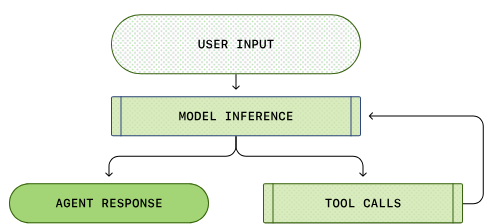
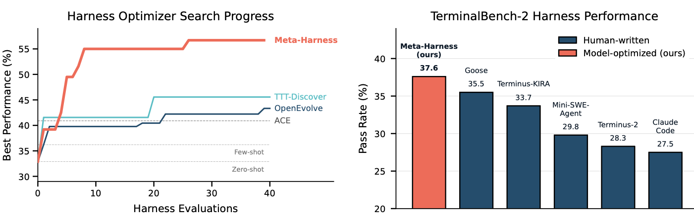
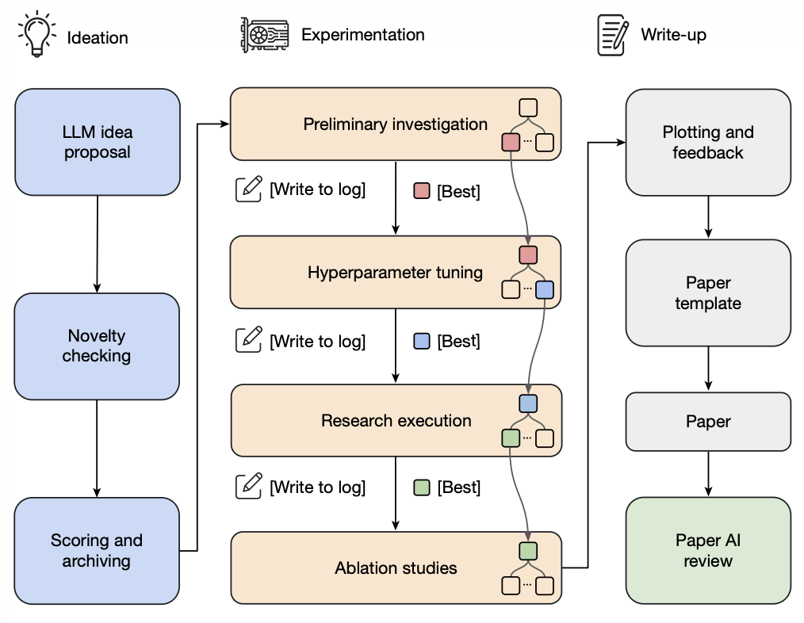
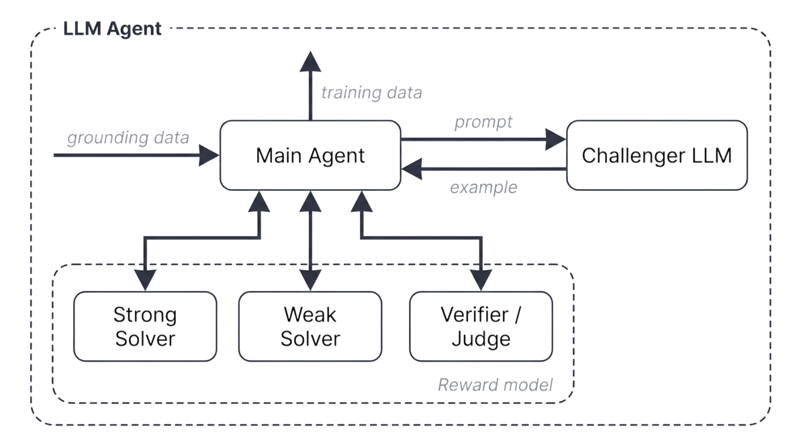
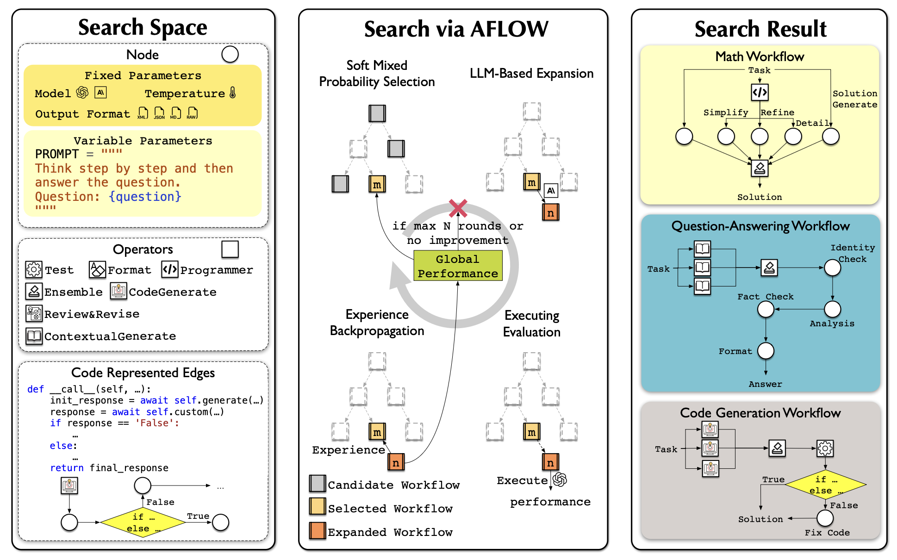
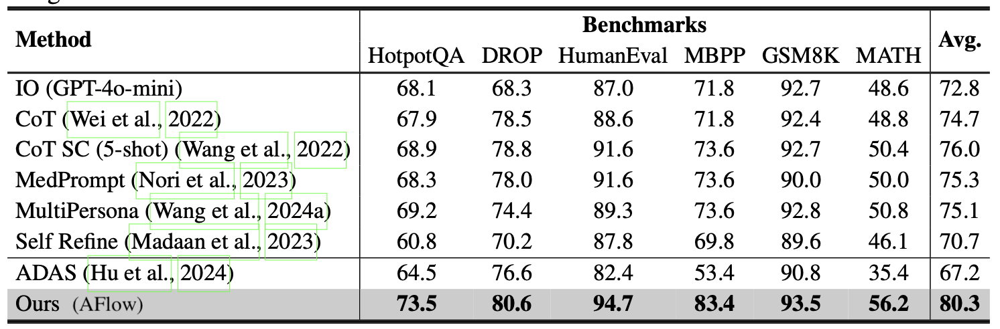
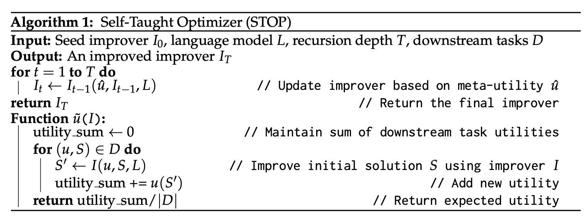
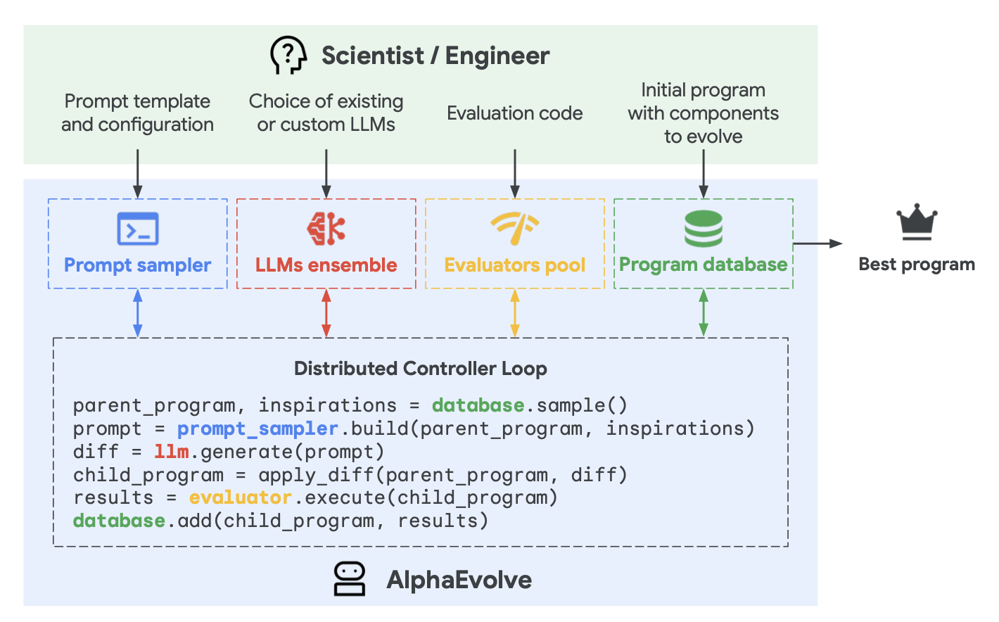

# 面向自我改进的驾驭工程

> 原文：[Harness Engineering for Self-Improvement](https://lilianweng.github.io/posts/2026-07-04-harness/) | 作者：Lilian Weng | 发布日期：2026年7月4日

**递归自我改进（Recursive Self-Improvement, RSI）**的概念可以追溯到 [I. J. Good (1965)](https://philpapers.org/rec/GOOSCT)，他将"超智能机器"定义为一种能够超越人类所有智力活动、并设计更好的机器来改进自身的系统。[Yudkowsky (2008)](https://www.lesswrong.com/posts/JBadX7rwdcRFzGuju/recursive-self-improvement) 使用"递归自我改进"一词来描述一种特定的反馈循环：AI利用其当前的智能来改进产生其智能的认知机制。

在现代AI中，这种反馈循环可能意味着模型直接重写自身的权重，或者更广泛地说，模型改进*训练流水线*和*部署系统*，从而催生一个在各类有经济价值的任务上表现更优的后续模型。AI研究发展的速度在前沿实验室中已显著加速（[Anthropic](https://www.anthropic.com/institute/recursive-self-improvement)；[OpenAI](https://openai.com/index/how-agents-are-transforming-work/)）。

我特意提及*"部署系统"*是因为，原始模型与真实世界上下文之间的这一层似乎与模型的原始智能（即预训练后的评估结果）同样重要。驾驭工程（Harness Engineering）是AI部署的重要组成部分，如Claude Code和Codex等成功的编程代理产品所展示的那样。**驾驭（harness）**是围绕基础模型构建的系统，负责编排执行、决定模型如何思考和规划、调用工具和执行行动、感知和管理上下文、存储产物以及评估结果。

本文将聚焦于驾驭工程相关的研究及其如何促进RSI。近期关于自动研究、自我改进代理和进化程序搜索的大量工作都可以围绕这一问题进行组织。其他关于模型自博弈、合成数据、测试时训练以及更广泛的持续学习主题的工作也符合RSI的愿景（例如 [Yuan et al. 2024](https://arxiv.org/abs/2401.10020)、[Chen et al. 2024](https://arxiv.org/abs/2401.01335)）、[Zhao et al. 2025](https://arxiv.org/abs/2505.03335)、[Choi et al. 2026](https://openreview.net/forum?id=lTbBFAoPSA)），但它们不是本文的重点。

# 驾驭设计模式

与[早期代理框架](https://lilianweng.github.io/posts/2023-06-23-agent/)"代理 = LLM + 记忆 + 工具 + 规划 + 行动"相比，驾驭工程额外包含*工作流设计（如循环工程）、评估、权限控制和持久状态管理*。它不再仅仅是提示模板，而是更接近运行时和软件系统设计：模型如何观察、行动、记忆、自检和改进。

设计应当刻意保持简单和通用以实现泛化，可能需要参考现有的软件工程实践以从预训练知识中受益。操作系统与驾驭之间也存在很强的类比关系。与操作系统类似，驾驭应当封装复杂的逻辑，同时保持接口简洁。与此同时，配置、工具接口和其他协议可能会逐渐在行业内实现标准化。

## 模式一：工作流自动化

定义一个模型可以在其中操作、测试和迭代的工作流是自动化的关键设计。Karpathy的autoresearch仓库（[https://github.com/karpathy/autoresearch](https://github.com/karpathy/autoresearch)）是构建此类工作流的一个简洁示例。常见的工作流遵循一个面向目标的循环：规划、执行、观察/测试、改进，然后再次执行，*直到*目标达成。该过程可能会主动向用户请求澄清任务规格或执行偏好。



工作流图还强调模型分析自身的轨迹和失败案例，然后通过"代理运行时"而非静态提示模板来迭代改进其进展。

## 模式二：文件系统作为持久记忆

在长周期代理系统中，一个反复出现的模式是对丰富状态和产物的简单控制。驾驭不应将整个工作流和所有日志携带在上下文中；相反，它应将持久状态保存在文件中。在长周期代理 rollout 中，实验日志、代码差异、论文摘要、错误追踪和过去的 rollout 轨迹等产物通常远超模型训练时的上下文窗口。

学习如何读取、写入和编辑文件系统（通常通过 `bash` 命令）是LLM的基础技能，因此以文件这种简单形式管理持久记忆自然能从核心模型能力的改进中受益。

## 模式三：子代理和后端任务

驾驭可以生成多个子代理并行执行，并监控后端任务。当主代理需要搜索多个假设、并发运行实验或委托隔离的子任务而不污染主上下文时，这非常有用。父代理随后需要一个小型进程管理器：启动任务、检查日志、取消失败的运行，以及将结果合并回主代理线程。

关键的设计选择是使并行化变得显式且可检查。如果子代理的输出仅存在于短暂的聊天上下文中，它们很快就会过时并被隐藏。如果它们以文件、日志和状态记录的形式存储，模型就可以在中断后恢复，并对其自身的执行历史进行推理。

## 案例研究：编程代理驾驭

主流编程代理的核心接口已在 Claude Code、Codex、OpenCode 和 Cursor 风格的代理中趋于稳定。它们通常使用如下循环：


通过访问一组工具，编程代理能够在给定的代码仓库中开发和调试问题，类似于人类开发者使用IDE的方式。

（并非完整列表；仅作演示用。如感兴趣可阅读[这里](https://github.com/yasasbanukaofficial/claude-code)。）

| 分组 | 工具定义 |
|------|----------|
| 文件系统 | - 文件发现：`glob`, `grep`, `ls`<br />- 文件读取：`read`, `read_many`<br />- 文件修改：`write`（写入全新文件）；`edit`（字符串精确匹配替换）；`multi_edit`；`apply_patch`（应用结构化补丁/diff） |
| Shell执行 | 运行命令：`bash`, `PowerShell` |
| IO | `lsp`，git工具如 `git_status`, `git_diff`, `git_commit` |
| 外部上下文 | MCP工具，Skills |
| 网络搜索 | `web_search`, `web_fetch`，浏览器工具 |
| 产物 | 读取文档、图片；生成HTML、图片 |
| 后端进程 | 如：`CronCreate`, `CronDelete`, `CronList` |
| 代理委托 | 如：`spawn_agent`, `resume_agent`, `wait_agent`, `list_agents`, `close_agent`, `interrupt_agent` 等 |

## 驾驭层与核心智能的关系？

很难预测RSI的未来有多大程度将依赖于驾驭工程，但RSI的近期路径不太可能从模型直接重写自身权重开始。我对实际近期路径的预测是：

- 驾驭工程将向元方法论（即改进获取更好答案的机制，而非仅仅改进答案本身）的方向演进。驾驭系统本身成为优化目标，启发式规则更少，通用机制更多。

- 反过来，成熟的驾驭使能模型自我改进循环的自动研究，而更智能的模型则防止驾驭过度工程化，保持系统的可持续性。

最终，许多驾驭改进可能会被*内化*为核心模型行为，但与外部上下文和工具的接口应当保留。我们已经在[提示工程](https://lilianweng.github.io/posts/2023-03-15-prompt-engineering/)中看到了这种模式的较温和版本：随着指令调优和模型推理能力的提升，手动提示技巧变得不那么核心，但*指定目标、约束、上下文和评估的需求并未消失*。

# 驾驭优化

驾驭系统中优化对象的演进大致为：指令[提示](https://lilianweng.github.io/posts/2023-03-15-prompt-engineering/) → 结构化上下文 → 工作流 → 驾驭代码 → 优化器代码。随着模型变得更智能、更强大，我们向更复杂的目标和更通用的方法迈进。

## 上下文工程

简单地将所有工具响应和模型生成追加到上下文中，随着代理任务周期的显著增加，会很快失控。上下文管理是一个为LLM构建更结构化和简洁上下文、并管理持久状态的层。毫无疑问，长上下文研究将继续取得进展，但目前长上下文智能和上下文工程时常交织在一起。

**代理上下文工程**（Agentic Context Engineering, ACE；[Zhang et al. 2025](https://arxiv.org/abs/2510.04618)）将上下文视为一个不断演化的 playbook，而非不断变长的提示。它包含三个组件，用于维护一个由条目（每个条目有标识符和描述）组成的上下文 playbook。

- *生成器*：参考条目生成任务轨迹。

- *反思器*：从成功和失败的轨迹中提炼洞察。

- *策展器*：以增量化的、逐条目的方式更新结构化上下文。


为了防止迭代重写过程中的上下文坍缩和简洁性偏差，ACE的一个关键设计选择是策展器不重写整个提示块。相反，它输出一组结构化的、逐条的条目，形式为（标识符, 描述），这些条目通过确定性逻辑合并到结构化上下文日志中。上下文条目会定期进行精炼和去重。

ACE从 rollout 中学习洞察有助于我们向自管理记忆迈进，但更新规则和整体工作流仍是手工设计的。为了向更自我改进的循环迈进，**元上下文工程**（Meta Context Engineering, MCE；[Ye et al. 2026](https://arxiv.org/abs/2601.21557)）将机制（如何管理上下文）与产物内容（上下文中有什么）分离，在元优化层面运行技能进化，在基础层面运行上下文优化。

MCE技能 $s \in \mathcal{S}$ 定义了一个上下文函数 $c_s=(\rho_s,F_s)$，将输入 $x$ 映射到上下文 $c = F_s(x;\rho_s)$，其中：

- $\rho_s = \{\rho_1,\dots,\rho_m\}$ 是静态组件（提示、知识库、代码库）。

- $F_s = \{F_1,\dots,F_k\}$ 是动态算子（搜索、选择、过滤、格式化）。

双层优化是在训练数据上找到给定技能 $s$ 的最佳上下文 $c_s^*$，而外层循环找到在验证集上提供最佳性能的最优技能：

$$
\text{内层: }c_s^*=\arg\max_{c_s}J_\text{train}(c_s;s)\quad
\text{外层: }s^*=\arg\max_{s\in\mathcal{S}}J_\text{val}(c_s^*)
$$

技能数据库跟踪先前技能、上下文函数和评估指标的历史 $\mathcal{H}_{k-1} = \{(s_i,c_i,J_i^\text{train}, J_i^\text{val})\}_{i=1}^{k-1}$。元级代理对先前技能进行代理[交叉](https://en.wikipedia.org/wiki/Crossover_(evolutionary_algorithm))操作，以根据任务 $\tau$ 创建新技能：$s_k=\text{crossover}(\tau,\mathcal{H}_{k-1})$。

然后基础级上下文工程师执行技能 $s_k$，并在当前技能的指导下从 rollout 反馈 $\mathcal{R}_k$ 中学习上下文函数：$c_k=\text{engineer}(\tau,s_k;c_{k-1}^*,\mathcal{R}_k)$。


MCE不像ACE那样对如何结构化上下文强制执行启发式规则。它使用*自由形式的技能*来存储任务最重要的知识，并迭代地共同进化技能和技能条件化的上下文。在实现上，上下文函数 $c$ 被实例化为专用目录中的文件集合，包括静态（`skill.md`）和动态（上下文和数据 rollout）组件。元级和基础级优化都在代理编程环境中以标准工具集执行，

$$
\mathcal{T}=\{\texttt{Read},\texttt{Write},\texttt{Edit},\texttt{Bash},\texttt{Glob},\texttt{Grep},\texttt{TodoWrite}\}
$$

**Meta-Harness**（[Lee et al. 2026](https://arxiv.org/abs/2603.28052)）更进一步：优化的对象是决定和优化什么信息应该被存储、检索和呈现给模型的*代码*。其名称中的"元"意味着它是用于优化驾驭的驾驭。


创建新驾驭的提议者本身就是一个编程代理，最终输出是 Pareto 前沿上的一组驾驭候选方案。

- 整个执行历史可通过文件系统访问，因此编程代理使用 `grep` 或 `cat` 等命令来阅读它，而不是将所有内容塞入单个提示上下文。

- 提议的驾驭是文件系统中的一个字典，包含其自身的源代码、分数、rollout 轨迹和状态更新。

- 元驾驭循环迭代地创建新驾驭，仅保留合格的。



然而，重要的教训是清晰的：一旦驾驭设计成为一个可执行的搜索空间，强大的编程代理就可以利用人类工程师使用的同一设计空间。

## 工作流设计

驾驭工程中的工作流设计可以由领域专家手工设计。以自动研究为例，已有多种框架被提出和测试。**AI Scientist**系统（[Lu et al. 2026](https://www.nature.com/articles/s41586-026-10265-5)）构建了一个流水线，用于提出研究想法、编写代码、运行实验、分析结果、撰写论文并进行同行评审。[Meng et al. (2026)](https://arxiv.org/abs/2605.26340)在**ScientistOne**中将可验证性作为核心设计约束，每个声明（引用、数值、方法论、结论）都必须追溯到证据来源，并通过证据链检查进行审计。



**Autodata**代理（[Kulikov et al. 2026](https://arxiv.org/abs/2606.25996)）被设计为一个数据科学家，用于生成训练和评估数据。主代理管理一个*挑战者*（提出问题）、一个*弱求解器*、一个*强求解器*和一个*验证器/评判器*，目标是合成"恰好合适"难度的数据——即强求解器能成功但弱求解器会失败。

在Autodata中，挑战者提示根据求解器和验证器的反馈迭代更新。这里的局限性在于，合成的任务仅用于微调弱求解器而非强求解器；如果该循环无法迭代地改进强模型，它更像是针对生成的提示分布的间接蒸馏，RSI意味较弱。



工作流的设计空间是*巨大的*，自然而然地，我们可以将工作流设计视为一个搜索问题，因此我们应该能够通过算法而非仅靠手工来找到好的解决方案。沿此方向，**代理系统自动设计**（Automated Design of Agentic Systems, ADAS；[Hu et al. 2025](https://arxiv.org/abs/2408.08435)）将代理设计本身形式化为一个优化问题，即"元代理搜索"，由元代理提出新的代理工作流设计。

- 用简单代理（如CoT和self-refine）初始化一个代理工作流档案库。

- 要求元代理以*代码*形式编程新代理，受到档案库中现有解决方案的启发。

- 元代理首先生成新工作流的高层描述，然后以代码实现。

- 草案程序经过两步自我精炼（即要求模型提供反馈，然后要求同一模型根据反馈精炼先前生成的输出；[Madaan et al. 2023](https://arxiv.org/abs/2303.17651)），由元代理检查其新颖性。

- 评估每个新候选方案，将成功的添加回档案库。

- 重复步骤2-3直到达到最大迭代次数。


**AFlow**（[Zhang et al. 2025](https://arxiv.org/abs/2410.10762)）将代理工作流表示为一个图，节点表示调用LLM的动作，边以代码实现逻辑操作。工作流优化依赖于[MCTS](https://en.wikipedia.org/wiki/Monte_Carlo_tree_search)（蒙特卡洛树搜索）：

- 用模板在树中初始化起始工作流 $W_0$。

- 使用分数和均匀探索的软混合选择工作流节点。

- 通过要求LLM根据评估性能生成修改后的工作流来扩展它。

- 执行并评估新工作流。

- 如果新工作流在 $N$ 轮预算内显示出改进，则将其添加回树中。

- 重复步骤2-5，当top-$k$平均分数趋于平稳或达到预算时停止。



AFlow在QA、代码和数学任务上的实验表明，AFlow相比手工设计的工作流和ADAS有不错的改进。



## 自我改进的驾驭

无论是上下文工程还是工作流设计，都只是驾驭的一部分。我们需要在整个设计空间中搜索，同时优化上下文管理逻辑、工作流、权限和许多其他驾驭组件。正如我们在Meta-Harness、ADAS和AFlow等工作中所见，**✨代码✨**是定义程序和系统的**通用语言**。简单来说，驾驭是编程提示、工具调用、子代理、控制流、记忆和工作流逻辑如何协同工作的代码。如果LLM能优化执行代理的代码，它就能访问比手写提示*大得多的设计空间*。

**自教学优化器**（Self-Taught Optimizer, STOP；[Zelikman et al. 2023](https://arxiv.org/abs/2310.02304)）是递归脚手架改进的早期示例之一。在 $t=0$ 步的种子改进器 $I_0$ 接收一个初始解 $s$、一个效用函数 $u$ 和一个黑盒语言模型 $M$，返回一个改进的解 $s'$，即 $s' = I(u, s; M)$。STOP的目标不是直接改进 $s$，而是*改进改进器 $I$ 本身*。

首先，定义元效用为给定改进器函数 $I$ 在下游任务集合 $\mathcal{D}$ 上的平均效用：

$$
\hat{u}(I) \triangleq \frac{1}{\vert\mathcal{D}\vert}\mathbb{E}_{(u,s)\sim \mathcal{D}}[u(I(u,s; M))]
$$

由于改进改进器函数本身就是一个优化问题，我们可以通过自我改进更新，基于 $I_{t-1}$ 的元效用度量来递归获得新版本 $I_t$：

$$
I_t=I_{t-1}(\hat{u},I_{t-1};M)
$$



在 Zelikman et al. (2023) 的实验中，改进后的改进器发现了各种策略，如遗传算法、分解并改进各部分、多臂提示赌博机、模拟退火、变化温度和束/树搜索。这类似于驾驭工作流如何被表示为优化的对象。


他们的发现中一个*警示性*结果是：STOP在使用GPT-4时跨迭代改进了平均下游性能，但在GPT-3.5和Mixtral等较弱模型上反而退化。仅有递归结构是不够的。基础模型必须*足够有能力*来改进机制。这意味着驾驭改进使能了模型的更好部署，但智能仍然是核心。

一项更近期的工作**Self-Harness**（[Zhang et al. 2026](https://arxiv.org/abs/2606.09498)），依赖LLM代理通过提出-评估-接受的循环来改进自身的驾驭。


Self-Harness的循环有三个阶段：

- *弱点挖掘*：将失败聚类为基于验证器的失败模式。

- 当前驾驭 $h_t$ 用于评估任务，并收集执行轨迹以供分析。

- 注意，两次运行在表面的错误日志中可能共享相同的验证器结果（如超时或缺失产物），但具有不同的因果机制。因此我们需要信息丰富的失败记录，包含终端验证器层面的原因、相关代理行为的因果状态，以及轨迹暴露的抽象代理机制，以揭示根本原因。

- *驾驭提议*：基于挖掘的失败模式提出有界的驾驭编辑。

- 同一模型在 $h_t$ 下作为提议者被调用。

- 模型被提供有界的提议上下文：(1) 当前驾驭的可编辑表面，(2) 评估系统中基于验证器的失败模式，(3) 应保留的通过行为的记录，(4) 先前尝试过的编辑摘要。

- 驾驭编辑应优先考虑可解决的反复出现的错误模式（如非任务特定的困难），并且可以通过窄范围的更改来解决。

- 驾驭编辑候选方案应当是独特且多样化的。

- *提议验证*：验证并合并合格的编辑以创建新驾驭 $h_{t+1}$。

- 候选编辑通过留入集 $D_\text{in}$（测试弱点是否已解决）和留出集 $D_\text{out}$（检查是否引入了其他未知问题）上的回归测试进行评估。

- 仅当候选方案在留入集和留出集上均无回归时才被接受。

- 接受的候选方案被合并以更新驾驭至 $h_{t+1}$，而被拒绝的候选方案仅被记录而不改变活跃驾驭。

在 `MiniMax M2.5`、`Qwen3.5-35B-A3B` 和 `GLM-5` 上运行 Terminal-Bench-2 时，Self-Harness 被证明能学习到针对不同基础模型不同弱点的模型特定驾驭指令，并提高留出集通过率。

Self-harness类型的工作确实让我担忧：如果允许程序编辑操作系统，抽象边界就被打破了。可编辑表面需要被妥善设计，权限控制和安全层需要位于此循环之外。[奖励黑客](https://lilianweng.github.io/posts/2024-11-28-reward-hacking/)的所有挑战仍然存在。

## 进化搜索

进化搜索是一种受自然选择启发的优化方法（参见我关于[进化算法](https://lilianweng.github.io/posts/2019-09-05-evolution-strategies/)的旧文）。它通过对解决方案群体进行变异，并仅保留群体中高"适应度"的个体来进化。当(1)搜索空间庞大或形状奇特；(2)难以用梯度直接优化但容易评估解决方案时，进化搜索就派上用场。驾驭搜索似乎很符合这里。

进化搜索在过去的研究中已被用于提示工程。**Promptbreeder**（[Fernando et al. 2023](https://arxiv.org/abs/2309.16797)）通过一组丰富的变异操作优化任务特定提示，有趣的是，变异提示（即指示LLM变异任务提示的指令）本身也通过进化来改进。**GEPA**（[Agrawal et al. 2025](https://arxiv.org/abs/2507.19457)）将基于[反思](https://lilianweng.github.io/posts/2023-06-23-agent/#self-reflection)的提示与进化搜索相结合，使用对试错轨迹的自然语言反思来提出提示更新。

[Novikov et al. (2025)](https://arxiv.org/abs/2506.13131) 引入了 **AlphaEvolve** 作为一个编程代理进化搜索系统，它存储一个候选程序池，并提示冻结的LLM生成改进的 diff。随着系统反复评估子程序并保留成功的程序，它能随时间发现更好的解决方案。



AlphaEvolve设计中的几个细节很重要：

- 提示包括父程序、结果、指令，有时还有元信息。

- 编程代理可以访问完整的代码仓库，但需要改进的代码区域用 `# EVOLVE-BLOCK-START` 和 `# EVOLVE-BLOCK-END` 显式标记。

- 元提示与指令和上下文共同进化，由LLM建议，方式类似于我们进化解决方案程序。

消融实验展示了进化过程、提示中的上下文、元提示、全文件进化以及使用更强LLM的价值。


最近的变体如 **ThetaEvolve**（[Wang et al. 2025](https://arxiv.org/abs/2511.23473)）将进化搜索与强化学习和上下文学习相结合。**ShinkaEvolve**（[Lange et al. 2025](https://arxiv.org/abs/2509.19349)）则引入了三个新组件来提高LLM采样效率：

- 通过设计父代采样来平衡性能排名和后代数量，实现更高效的探索。

- 基于嵌入的余弦相似度，丢弃与现有群体过于相似的候选方案，实现代码新颖性拒绝采样。

- 在元暂存区中识别成功解决方案中的良好模式，以指导未来的变异。

与上述关注解决方案改进的方法不同，**Darwin Gödel Machine**（DGM；[Zhang et al. 2025](https://arxiv.org/abs/2505.22954)）明确针对使用基于LLM的编程代理进化可编辑的驾驭代码仓库。具体而言，该代理被允许修改自身的驾驭。后续工作 Hyperagents（[Zhang et al. 2026](https://arxiv.org/abs/2603.19461)）引入了元代理来控制如何修改现有任务代理以创建新代理。

- 从池中的一个编程代理开始。

- 在每次迭代中，以正比于性能、反比于其子代数量的概率选择一个父代，进行修改和分支以产生新代理。

- 被选中的父代代理检查自身的基准评估日志，然后提出对其自身驾驭代码库的改进，以生成新版本的编程代理。代码编辑通过两个基本工具实现：(1) bash（参数：``）和(2) editor（参数：`view/create/edit `）。

- 新编程代理被评估，仅性能足够高的才被添加回池中。

- 重复步骤2-4直到达到某个停止条件。

DGM是在固定模型下的驾驭进化。在使用 `Claude 3.5 Sonnet` 作为基础LLM和简单初始驾驭配置的实验中，DGM发现的代理在 SWE-bench Verified（20%到50%）和 Polyglot（14.2%到30.7%）上可比拟或超越手工设计的代理。

这类方法在候选解决方案可自动评估、候选适应度易于量化的领域效果良好，如矩阵乘法、GPU核优化、算法竞赛、数据中心调度。在评估缓慢、模糊或主要基于启发式的领域中则表现不佳。计算的效率和进化的有效性也是需要关注的问题。

## 与模型权重的联合优化

驾驭进化改变的是模型周围的非参数系统。要实现完全的自我改进，完全可以允许模型同时更新自身的权重。权重更新可以通过改进模型训练流水线或测试时的持续学习来实现。持续学习的主题值得未来单独写一篇文章。

**SIA**（[Hebbar et al. 2026](https://arxiv.org/abs/2605.27276)）是在同一优化循环中结合驾驭改进和模型参数更新的早期尝试，设计包含三个组件：

- *元代理*：提出初始驾驭。

- *任务特定代理*：执行任务。

- *反馈代理*：根据最近的轨迹选择更新驾驭还是模型权重。


SIA的实验中存在一些混淆因素，使得结果难以解释。例如，任务特定代理比用于元代理和反馈代理的模型弱得多（`gpt-oss-120b` 对比 `Claude Sonnet 4.6`），且基线太弱，无法与相关方法进行干净的交叉参考。我认为这个方向很有趣，但证据是初步的。许多挑战仍然存在，如训练稳定性和 Goodhart 效应。

# 未来挑战

AI Scientist 系列工作有力地证明了专家设计的驾驭可以协调自动研究循环的大部分环节，以撰写研究论文的形式进行了实验。但论文产出不等同于科学发现。一个系统可以写出一篇看似合理的论文，但仍然存在虚构引用、实现漂移或弱实验结果的问题。

[Trehan & Chopra (2026)](https://arxiv.org/abs/2601.03315) 测试了LLM能否在最少脚手架和基本工具（即 `read_file`、`write_file`、`llm_search`、`list_files`）的条件下从研究想法到论文。每个想法都有一个专用工作空间，代理可以在其中生成和读取文档作为上下文的一部分。他们在三个领域（世界模型、多代理强化学习、AI安全与对齐）进行了实验，每个领域包含45-50篇高质量种子文档以启发新想法。只有四个想法被人类专家选中运行完整流水线，仅有一个被完全执行成论文。他们在实验中观察到六种反复出现的失败模式：

- *偏向训练数据默认值*：使用旧库、过时命令、标准格式或未基于实际仓库或数据集的假设。

- *执行压力下的实现漂移*：当实现在技术上变得复杂时，模型可能转向常见的更简单解决方案，而非提出的方法。

- *记忆和上下文退化*：长周期项目会丢失关键细节，除非日志被写为持久产物。

- *过度乐观*：模型在实验嘈杂或失败时仍宣布成功，类似于 [Bubeck et al. (2025)](https://arxiv.org/abs/2511.16072) 观察到的"p-hacking和eureka-ing"模式，模型可能引入"数值胶带"并在信号仍然是噪声时宣布胜利。

- *领域智能不足*：模型缺乏隐性技艺知识，如预测实现复杂度、判断实验结果是否合理或知道哪些基线重要。

- *科学品味薄弱*：实验可能是可执行的，但未能回答正确的问题。

迈向完全的RSI，研究人员已取得真实进展，但若干瓶颈仍然存在。

**1. 弱且模糊的评估器。** 许多研究声明没有快速且精确的验证器，许多真实世界任务也是如此。当前的自我改进循环在评估指标可衡量且客观的任务上效果最好，类似于[强化学习的工作方式](https://lilianweng.github.io/posts/2018-02-19-rl-overview/)。

研究品味、新颖性和长期科学价值要难以衡量得多。例如，研究品味通常混合了问题框架、实验设计，以及关于哪些令人惊讶的结果值得追求、哪些失败案例值得重试的判断。

**2. 上下文和记忆生命周期。** 随着AI代理变得更加自主和独立，记忆会不断增长。有用的驾驭需要管理上下文和记忆，以补充长上下文生成的现有局限性，同时最大化长周期任务的成功率。由于人类能够在一生中维持记忆，我在这里看到一个类比：[上下文工程](#上下文工程)将且应该成为智能的核心组成部分，而非停留在软件系统层。

**3. 负面结果。** 研究人员被激励发表成功的结果，因此文献偏向于成功案例。在海量数据（至少目前主要是人类创建的，哈哈）上训练的LLM可能不擅长决定何时放弃假设、报告负面结果，甚至承认失败，因为数据中成功与失败案例的不平衡。研究驾驭应使失败的尝试易于保存，因为从失败中学习是缩减任务搜索空间的最佳方式。

**4. 多样性坍缩。** 进化和强化学习循环倾向于利用已知的高奖励模式。我们需要[机制](https://lilianweng.github.io/posts/2020-06-07-exploration-drl/)来防止群体坍缩为同一解决方案的变体。这对于开放式研究尤为关键，因为最佳路径在当前评估器下最初可能看起来更差。

**5. [奖励黑客](https://lilianweng.github.io/posts/2024-11-28-reward-hacking/)。** 自我改进循环会优化它所得到的任何信号。如果奖励来自单元测试，代理可能过拟合到测试；如果来自评判模型，它可能学习特定于该评判器的奖励黑客技巧；如果来自基准分数，它可能利用基准工件。

评估器和权限控制可能应位于进化驾驭的循环之外，在关键决策点设置留出测试、轨迹审计和人工审查——多少监督可以被扩展和自动化仍然是一个开放的研究问题。

**6. 长期成功。** 外在优化循环作用于我们可以在训练沙箱中模拟的个体 rollout 之外的奖励。

以编程代理为例。编程代理已经提高了软件工程的日常生产力，但许多优化目标仍然过于短期。它通常能完成手头的任务，但如何保护由数百或数千名工程师共同维护的仓库的长期健康则不太明显。标准的基于沙箱的RLVR式训练很少涵盖可维护性、所有权边界、迁移成本、向后兼容性或未来的调试负担。

**7. 人类的角色。** 人类应该向栈的上层移动，而不是被移出循环，这意味着人类应该在正确的时间、正确的抽象级别提供监督，我们的系统设计应该考虑何时以及如何设置此类接触点。

上述许多挑战都需要人类的反馈和引导。毕竟，我们是在为人类更美好的未来构建技术，而不是反过来。

# 引用

请按以下方式引用本文：

> Weng, Lilian. "Harness Engineering for Self-Improvement". Lil'Log (Jul 2026). https://lilianweng.github.io/posts/2026-07-04-harness/

或使用BibTeX引用：

```bibtex
@article{weng2026harness,
  title = {Harness Engineering for Self-Improvement},
  author = {Weng, Lilian},
  journal = {lilianweng.github.io},
  year = {2026},
  month = {July},
  url = "https://lilianweng.github.io/posts/2026-07-04-harness/"
}
```

# 附录：一些有用的基准测试

- **[PaperBench](https://arxiv.org/abs/2504.01848)**：从零开始复现20篇ICML 2024 Spotlight和Oral论文，包括理解论文贡献、开发代码库和成功执行实验。

- 每个复现任务被分解为更小的、可单独评分的任务。

- 总计8,316个评分标准，与论文作者共同开发。

- 当时最好的模型（`Claude 3.5 Sonnet`，约21%）无法超越ML博士。

- 包括PaperBench、PaperBench Code-Dev（较轻版本）和JudgeEval。

- **[CORE-Bench](https://arxiv.org/abs/2409.11363)**：评估已发表研究的计算可复现性。

- 基于计算机科学、社会科学和医学领域90篇科学论文的270个任务。

- 任务涉及从提供的代码和数据中复现结果。

- 包括多个难度级别，以及纯语言和视觉-语言任务。

- 当时最好的报告代理（`GPT-4o`和`GPT-4o-mini`）在最难的任务上仅达到21%的准确率。

- **[ScienceAgentBench](https://arxiv.org/abs/2410.05080)**：评估LLM代理在数据驱动科学发现方面的能力。

- 从四个学科（数学、化学、生物、地理）的44篇同行评审出版物中提取102个任务。

- 涵盖这些领域的基本数据科学任务：数据处理、模型开发、数据分析和信息可视化。

- **[RE-Bench](https://arxiv.org/abs/2411.15114)**：在现实的ML研究工程环境中评估前沿AI代理与人类专家的对比。

- 7个具有挑战性的、开放式的ML研究工程环境。

- 每个环境 =（评分函数、起始解决方案、参考解决方案）；每个可在8张或更少H100 GPU上运行。

- 示例：优化核函数、运行缩放定律实验、修复嵌入、微调GPT-2用于QA等。

- 包含61名不同人类专家的71次8小时尝试数据。

- 人类专家在82%的8小时尝试中获得非零分数；24%匹配或超过了强参考解决方案。

- 最好的AI代理在2小时预算下得分比人类高4倍，但人类在更长预算下有更好的回报，在8小时和32小时设置下超过代理。

- **[MLE-bench](https://arxiv.org/abs/2410.07095)**：在离线Kaggle竞赛中评估ML工程代理。

- 包含从Kaggle精选的75个ML工程竞赛。

- 测试训练模型、准备数据集、运行实验和提交预测到评分脚本。

- 使用Kaggle公开排行榜作为人类基线。

- 论文中的最佳设置，`o1-preview`配合AIDE脚手架，在16.9%的竞赛中达到至少Kaggle铜牌水平。

- 包括资源扩展和污染分析。

- **[KernelBench](https://arxiv.org/abs/2502.10517)**：评估生成的GPU核的正确性和速度。

- 250个PyTorch任务，评估LLM是否能编写快速且正确的核。

- 评估指标 fast_p = 生成的核中正确且快于基线的百分比。

# 参考文献

[1] Good, I. J. ["Speculations Concerning the First Ultraintelligent Machine."](https://philpapers.org/rec/GOOSCT) *Advances in Computers*, 6:31–88, 1965.

[2] Yudkowsky, Eliezer. ["Recursive Self-Improvement."](https://www.lesswrong.com/posts/JBadX7rwdcRFzGuju/recursive-self-improvement) LessWrong, 2008.

[3] Choi, et al. ["Anchored Self-Play for Code Repair."](https://openreview.net/forum?id=lTbBFAoPSA) ICML 2026.

[4] Zhao, et al. ["Absolute Zero: Reinforced Self-play Reasoning with Zero Data."](https://arxiv.org/abs/2505.03335) arXiv preprint arXiv:2505.03335, 2025.

[5] Yuan, et al. ["Self-Rewarding Language Models."](https://arxiv.org/abs/2401.10020) arXiv preprint arXiv:2401.10020, 2024.

[6] Chen, et al. ["Self-Play Fine-Tuning Converts Weak Language Models to Strong Language Models."](https://arxiv.org/abs/2401.01335) ICML 2024.

[7] Zhang, et al. ["Agentic Context Engineering: Evolving Contexts for Self-Improving Language Models."](https://arxiv.org/abs/2510.04618) ICLR 2026.

[8] Ye, et al. ["Meta Context Engineering via Agentic Skill Evolution."](https://arxiv.org/abs/2601.21557) arXiv preprint arXiv:2601.21557, 2026.

[9] Lee, et al. ["Meta-Harness: End-to-End Optimization of Model Harnesses."](https://arxiv.org/abs/2603.28052) arXiv preprint arXiv:2603.28052, 2026.

[10] Lu, et al. ["Towards end-to-end automation of AI research."](https://www.nature.com/articles/s41586-026-10265-5) *Nature*, 651:914–919, 2026.

[11] Meng, et al. ["ScientistOne: Towards Human-Level Autonomous Research via Chain-of-Evidence."](https://arxiv.org/abs/2605.26340) arXiv preprint arXiv:2605.26340, 2026.

[12] Kulikov, et al. ["Autodata: An agentic data scientist to create high quality synthetic data."](https://arxiv.org/abs/2606.25996) arXiv preprint arXiv:2606.25996, 2026.

[13] Hu, Lu, and Clune. ["Automated Design of Agentic Systems."](https://arxiv.org/abs/2408.08435) ICLR 2025.

[14] Madaan, et al. ["Self-Refine: Iterative Refinement with Self-Feedback."](https://arxiv.org/abs/2303.17651) NeurIPS 2023.

[15] Zhang, et al. ["AFlow: Automating Agentic Workflow Generation."](https://arxiv.org/abs/2410.10762) ICLR 2025.

[16] Zelikman, et al. ["Self-Taught Optimizer (STOP): Recursively Self-Improving Code Generation."](https://arxiv.org/abs/2310.02304) COLM 2024.

[17] Zhang, et al. ["Self-Harness: Harnesses That Improve Themselves."](https://arxiv.org/abs/2606.09498) arXiv preprint arXiv:2606.09498, 2026.

[18] Fernando, et al. ["Promptbreeder: Self-Referential Self-Improvement Via Prompt Evolution."](https://arxiv.org/abs/2309.16797) arXiv preprint arXiv:2309.16797, 2023.

[19] Agrawal, A. et al. ["GEPA: Reflective Prompt Evolution Can Outperform Reinforcement Learning."](https://arxiv.org/abs/2507.19457) arXiv preprint arXiv:2507.19457, 2025.

[20] Novikov, et al. ["AlphaEvolve: A coding agent for scientific and algorithmic discovery."](https://arxiv.org/abs/2506.13131) arXiv preprint arXiv:2506.13131, 2025.

[21] Lange, Imajuku, and Cetin. ["ShinkaEvolve: Towards Open-Ended And Sample-Efficient Program Evolution."](https://arxiv.org/abs/2509.19349) arXiv preprint arXiv:2509.19349, 2025.

[22] Wang, et al. ["ThetaEvolve: Test-time Learning on Open Problems."](https://arxiv.org/abs/2511.23473) arXiv preprint arXiv:2511.23473, 2025.

[23] Zhang, et al. ["Darwin Gödel Machine: Open-Ended Evolution of Self-Improving Agents."](https://arxiv.org/abs/2505.22954) arXiv preprint arXiv:2505.22954, 2025.

[24] Zhang, et al. ["Hyperagents."](https://arxiv.org/abs/2603.19461) arXiv preprint arXiv:2603.19461, 2026.

[25] Yuksekgonul, et al. ["Learning to Discover at Test Time."](https://arxiv.org/abs/2601.16175) arXiv preprint arXiv:2601.16175, 2026.

[26] Riaz, et al. ["Epistemic Uncertainty for Test-Time Discovery."](https://arxiv.org/abs/2605.11328) arXiv preprint arXiv:2605.11328, 2026.

[27] Hebbar, et al. ["SIA: Self Improving AI with Harness & Weight Updates."](https://arxiv.org/abs/2605.27276) arXiv preprint arXiv:2605.27276, 2026.

[28] Trehan and Chopra. ["Why LLMs Aren't Scientists Yet: Lessons from Four Autonomous Research Attempts."](https://arxiv.org/abs/2601.03315) arXiv preprint arXiv:2601.03315, 2026.

[29] Bubeck, et al. ["Early science acceleration experiments with GPT-5."](https://arxiv.org/abs/2511.16072) arXiv preprint arXiv:2511.16072, 2025.

[30] Starace, et al. ["PaperBench: Evaluating AI's Ability to Replicate AI Research."](https://arxiv.org/abs/2504.01848) ICML 2025.

[31] Wijk, et al. ["RE-Bench: Evaluating frontier AI R&D capabilities of language model agents against human experts."](https://arxiv.org/abs/2411.15114) ICML 2025.

[32] Chan, et al. ["MLE-bench: Evaluating Machine Learning Agents on Machine Learning Engineering."](https://arxiv.org/abs/2410.07095) arXiv preprint arXiv:2410.07095, 2024.

[33] Chen, et al. ["ScienceAgentBench: Toward Rigorous Assessment of Language Agents for Data-Driven Scientific Discovery."](https://arxiv.org/abs/2410.05080) ICLR 2025.

[34] Siegel, et al. ["CORE-Bench: Fostering the Credibility of Published Research Through a Computational Reproducibility Agent Benchmark."](https://arxiv.org/abs/2409.11363) TMLR 2024.

[35] Ouyang, et al. ["KernelBench: Can LLMs Write Efficient GPU Kernels?"](https://arxiv.org/abs/2502.10517) arXiv preprint arXiv:2502.10517, 2025.
