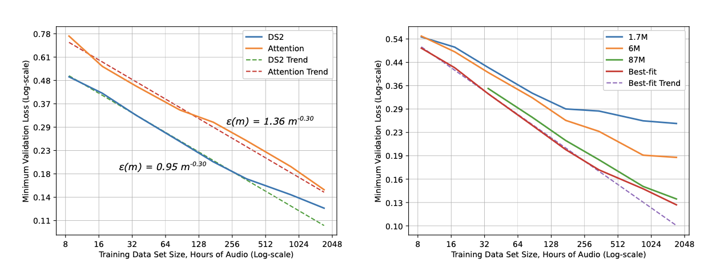
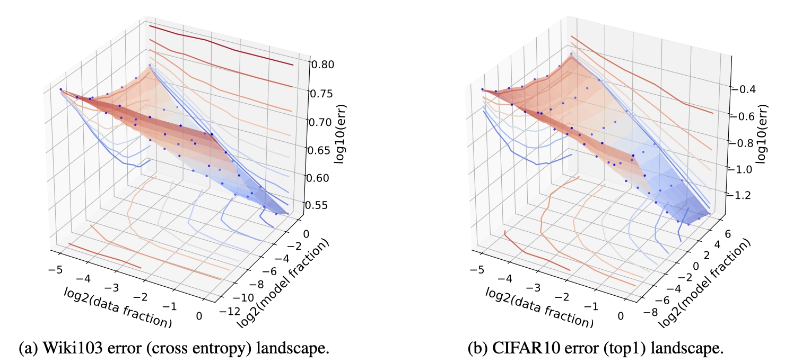
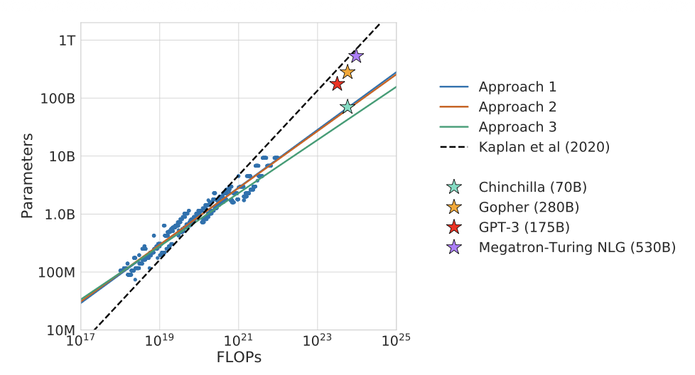
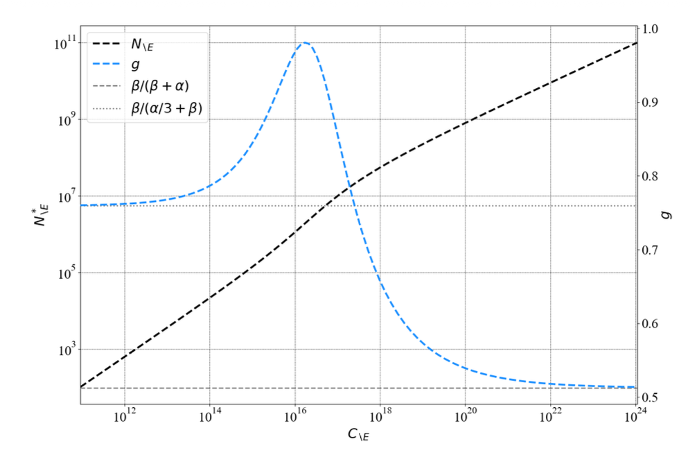

# 缩放定律，谨慎对待

> 原文：[Scaling Laws, Carefully](https://lilianweng.github.io/posts/2026-06-24-scaling-laws/) | 作者：Lilian Weng | 发布日期：2026年6月24日

缩放定律是深度学习中最关键的实证发现之一。其观察形式很简单：训练损失 $L$ 随着模型规模 $N$、数据集规模 $D$ 和计算量 $C$ 的增加而可预测地降低，遵循幂律曲线，在双对数图上呈现为一条直线。我们可以将缩放定律视为描述计算量、损失、模型规模和数据之间关系的框架；其核心在于如何在 $N$ 和 $D$ 之间最优地分配宝贵的计算资源。

这种可预测性使缩放定律在实践中极具价值。常见的工作流程是在少量小规模训练上拟合缩放定律，然后外推以估计更大模型的 token 和计算需求。

| 符号 | 说明 |
|------|------|
| $N$ | 模型规模，以参数数量衡量。 |
| $D$ | 训练数据集规模，通常以 token 数量衡量。 |
| $C$ | 训练计算量，以 FLOPs 为单位。作为一个有用的近似，$C \approx 6ND$（[Kaplan et al. 2020](https://arxiv.org/abs/2001.08361)），其中 $2ND$ 用于前向传播，$4ND$ 用于反向传播。 |
| $E$ | 不可约损失 |
| $L, \hat{L}(.)$ | 测试损失 / 测试损失预测函数；也可指训练损失，因为两者强相关。 |
| $\epsilon$ | 泛化误差。 |

# 早期：机器学习损失的可预测性#

在缩放定律成为主流概念之前，泛化误差随规模的可预测性就已经被研究过了。

[Amari et al. (1992)](https://ieeexplore.ieee.org/document/6796972) 使用贝叶斯方法和退火近似推导了四种类型的学习曲线。

- 确定性学习算法，无噪声数据，唯一解：$\epsilon \sim c \cdot D^{-1}$，其中 $c$ 为某个常数。

- 确定性学习算法，无噪声数据，多个等价解：$\epsilon \sim c \cdot D^{-2}$；每增加一个数据点学习更快，因为模型只需学习参数的最优流形，而非找到唯一解点。

- 确定性学习算法，有噪声数据：$\epsilon \sim c \cdot D^{-1/2}$；数据中的噪声使学习更困难。

- 随机学习算法，有噪声数据：$\epsilon \sim c \cdot D^{-1} + E$；此处不可约损失 $E$ 是随机学习器无法进一步降低的残差误差，例如模型在大数据上容量耗尽时。

所有四种学习曲线都遵循幂律：

$$
\epsilon \sim c \cdot D^\alpha + E
$$

其中 $E$ 可以为 0，$\alpha = -2, -1, -1/2$。虽然他们的理论设置基于简化的二分类任务，但它为构建实证机器学习损失预测模型指明了有用的方向。

[Hestness et al. (2017)](https://arxiv.org/abs/1712.00409) 的一项最早实证研究解释了泛化误差、模型规模和数据之间的关系。对于给定的训练数据规模，他们通过网格搜索确定最佳拟合的模型规模，然后绘制损失与训练数据集规模的关系图。在深度学习的四个不同领域（神经机器翻译、图像分类、语言建模和语音识别）中，观察到了一个反复出现的模式：

- 泛化误差在一组因素（如数据规模）上按幂律缩放。

- 模型改进会移动误差曲线，但似乎不影响幂律指数。

- 有趣的是，架构改变了幂律拟合的偏移量（$E$），但不改变指数（$\alpha$）。幂律的斜率似乎是问题域的属性，而非模型架构的属性。

- 拟合规模为 $D$ 的数据集所需的模型参数数量 $N$ 也按幂律缩放。



一个概念性图示将学习曲线分为三个阶段。在小数据区域，当学习信号不足时，模型的表现仅略好于随机猜测。在中间的"幂律区域"，我们观察到损失、数据和模型规模之间的幂律关系。最终的不可约误差区域可归因于数据中的噪声等因素。


[Rosenfeld et al. (2020)](https://arxiv.org/abs/1909.12673) 进一步推进，尝试将误差建模为模型规模 $N$ 和数据规模 $D$ 的联合函数，涵盖了多种架构（ResNet、WRN、LSTM、Transformer）和优化器（Adam、SGD 变体）。在实证上，他们观察到固定一个轴时，误差按另一个轴的幂律衰减：

$$
\hat{L}(D,N) \approx \frac{A}{N^{\alpha}} + E_N,\quad 
\hat{L}(D,N) \approx \frac{B}{D^{\beta}} + E_D
$$

可以合并为联合形式：

$$
\hat{L}(D, N) \approx \frac{A}{N^{\alpha}} + \frac{B}{D^{\beta}} + E
$$

其中 $A > 0, B > 0, \alpha \geq 0, \beta \geq 0$ 为标量常数，$E$ 不依赖于 $N$ 或 $D$。



因此，他们可以构建一个形式为简单参数函数的预测模型，其中 $\boldsymbol{\theta} = \langle A, B, E, \alpha, \beta \rangle$，通过仅在一组较小的训练配置 $(D, N)$ 上训练，来预测 $(D, N)$ 大于特定阈值时的预期损失。


旁注：这些早期工作依赖于经典学习理论直觉，如 [VC 维度](https://en.wikipedia.org/wiki/Vapnik%E2%80%93Chervonenkis_dimension)（模型可以打散的最大点集的基数）作为容量的代理，但在现代深度学习工作中，VC 维度通常过于粗糙，无法解释实际行为，实证幂律比理论提供的最坏情况界要干净和实用得多。

# 数据无限区域的缩放定律#

## Kaplan et al. 的缩放定律#

[Kaplan et al. (2020)](https://arxiv.org/abs/2001.08361) 是一篇里程碑式的工作，专门聚焦于 Transformer 语言模型。他们提出了以下参数化损失函数：

$$
\hat{L}(N,D) = \left[ \left(\frac{a}{N}\right)^{\frac{\alpha}{\beta}} + \frac{b}{D} \right]^{\beta}
$$

这种形式的一个好处是，过拟合的程度（即模型复杂或数据不足）主要取决于比率 $N^{\alpha / \beta} / D$，这表明数据需要按模型规模增长的特定比例增长，以避免训练受数据限制。


最具影响力、事后看来也最受争议的结论是计算最优分配。Kaplan et al. 发现 $N_\text{opt} \propto C^{0.73}$，并得出结论：模型规模的增长应快于数据集规模。具体而言，对于计算量增加10倍，他们建议将模型规模放大约~5.5倍，但训练 token 仅放大约~1.8倍。Chinchilla 论文后来推翻了这一建议，认为这导致大模型严重*训练不足*。

Kaplan et al. 中另一项有用的分析是根据 $D$ 和 $N$ 估算所需的训练 FLOPs。每次乘加计为 ~2 FLOPs。


给定标准配置 $d_\text{attn} = d_\text{model} = d_\text{ff}/4$，且从 $N$ 和每 token 前向计算中排除嵌入层：

$$
\begin{align}
N &= n_\text{layer} d_\text{model} 3 d_\text{attn} + n_\text{layer} d_\text{attn} d_\text{model} + n_\text{layer} 2 d_\text{model} d_\text{ff} & \small{\text{; 无嵌入层}} \\
&= 2\;n_\text{layer} d_\text{model}(2d_\text{attn} + d_\text{ff}) & \\
&= 12\;n_\text{layer} d_\text{model}^2 & \\
\\
C_\text{fwd} &= 2 n_\text{layer} (d_\text{model} 3 d_\text{attn} + n_\text{ctx}d_\text{attn} + d_\text{attn}d_\text{embed} + 2 d_\text{model} d_\text{ff}) & \\
&= 2 n_\text{layer} (12 d_\text{model}^2 + n_\text{ctx}d_\text{attn}) & \\
&= 2N + 2 n_\text{layer}n_\text{ctx}d_\text{attn} & \\
&\approx 2N \quad\quad \small{\text{; 假设 }n_\text{ctx} \text{ 较小}}
\end{align}
$$

然后我们将反向传播的 FLOPs 计为前向传播 FLOPs 的两倍，因为反向传播运行两次矩阵乘法，分别对输入激活和权重的梯度。因此，每个 token 的训练 FLOPs 总计约为 $6N$，而在 $D$ 个 token 上训练的总 FLOPs 为 $C \approx 6ND$。

## Chinchilla 缩放定律#

Chinchilla 论文（[Hoffmann et al. 2022](https://arxiv.org/abs/2203.15556)）研究了在*固定*计算预算 $C$ 下，最优模型规模 $N$（总参数，*包括*嵌入）与 token 数量 $D$ 之间的关系，采用了更谨慎的实验设计，得出了与 Kaplan et al. 有所不同 的答案。


核心问题是在约束 $\text{FLOPs}(N, D) = C \approx 6ND$ 下如何最优分配资源。换言之，当我们只有有限的 FLOPs（一定数量的 GPU 运行一定时间），我们该如何在更多数据 token 和更多模型参数之间做出选择？

$$
N_\text{opt}(C), D_\text{opt}(C) = \operatorname*{arg\,min}_{\text{s.t. } \text{FLOPs}(N,D) = C} \hat{L}(N, D)
$$

Chinchilla 论文提出了三种设计精巧的缩放定律拟合方法。

实证实验扫描了超过 400 个模型，规模从 70M 到超过 16B 参数，训练 token 从 5B 到 500B。实验假设每个训练 token 都是唯一的（无限数据 regime）。所有运行使用余弦学习率调度，在训练过程中衰减 10 倍。扫描不同模型规模描绘出计算最优前沿。

### 方法一：固定模型规模，改变 token 预算#

对于每个参数数量 $N$，使用不同的 token 预算训练多次运行，记录每个 FLOP 预算 $C$ 下达到的最低损失。


### 方法二：IsoFLOP 轮廓#

固定计算预算 $C$，绘制最终损失与参数数量 $N$ 的关系。每条等 FLOP 曲线在对数空间中大致是一条抛物线，其最小值标志着该计算预算下的最优模型规模。然后跨预算重复此操作，在图中描绘出一条幂律线。


### 方法三：参数化拟合#

直接拟合与 [Rosenfeld et al. (2020)](https://arxiv.org/abs/1909.12673) 相同的参数化函数：

$$
\hat{L}(N, D) = \frac{A}{N^\alpha} + \frac{B}{D^\beta} + E
$$

我们可以通过在约束 $\text{FLOPs}(N,D) = C \approx 6ND$ 下最小化 $\hat{L}(N, D)$，获得最优 $N_\text{opt}(C), D_\text{opt}(C)$ 的闭式近似。

首先将表达式简化为仅包含 $N$：

$$
\begin{align}
\hat{L}(N) &= A N^{-\alpha} + B \Big(\frac{C}{6}\Big)^{-\beta}N^\beta + E \\
\hat{L}'(N) &= -\alpha A N^{-\alpha-1} + \beta B \Big(\frac{C}{6}\Big)^{-\beta} N^{\beta -1} = 0 & \small{\text{; 对 }N\text{ 的导数应为零}} \\
\text{因此}\quad & \alpha A N^{-\alpha-1} = \beta B \Big(\frac{C}{6}\Big)^{-\beta} N^{\beta -1} \\
& \alpha A = \beta B \Big(\frac{C}{6}\Big)^{-\beta} N^{\alpha + \beta} \\
& N_\text{opt} = \Big(\frac{\alpha A}{\beta B}\Big)^{\frac{1}{\alpha + \beta}} \Big(\frac{C}{6}\Big)^{\frac{\beta}{\alpha+\beta}} \\
& D_\text{opt} = \frac{C}{6 N_\text{opt}} = \Big(\frac{\beta B}{\alpha A}\Big)^{\frac{1}{\alpha + \beta}} \Big(\frac{C}{6}\Big)^{\frac{\alpha}{\alpha+\beta}}
\end{align}
$$

当 $\alpha \approx \beta$ 时，模型规模和训练 token 应以相同速率缩放。

为了找到最优的 $\boldsymbol{\theta} = \langle A, B, E, \alpha, \beta\rangle$，Chinchilla 论文采用 [Huber 损失](https://en.wikipedia.org/wiki/Huber_loss)（对异常值鲁棒；$\delta=10^{-3}$）和 [L-BFGS 算法](https://en.wikipedia.org/wiki/Limited-memory_BFGS)（适合少量参数的曲线拟合）。

$$
\begin{align}
\min_{A,B,E,\alpha,\beta} \sum_{\text{runs }\{i\}} \text{Huber}_\delta (\log \hat{L}(N_i, D_i) - \log L_i) \\
\text{ 其中 }\text{Huber}_\delta (x) = \begin{cases}\frac{1}{2} x^2 & \text{当 }\vert x \vert \leq \delta \\ \delta \cdot (\vert x \vert - \frac{1}{2}\delta), & \text{其他情况.}\end{cases}
\end{align}
$$

Chinchilla 通过三种互补方法得出结论，最终结果相互一致，这也是该结果具有说服力的部分原因。




Chinchilla 论文中关于大多数大模型（当时约2022年）训练不足的论断，有一个著名的演示支持：在与 Gopher（[Rae et al. 2021](https://arxiv.org/abs/2112.11446)；280B 参数，300B token 预算）相同的计算预算下，他们训练了 Chinchilla（70B 参数，1.4T token 预算），一个小4倍但训练 token 约多4倍的模型，它在各方面都优于 Gopher。

## 调和 Kaplan 和 Chinchilla#

Chinchilla 缩放定律与 Kaplan et al. 的不同之处在于：

- 不是"模型增长快于数据"（$N_\text{opt} \propto C^{0.73}$），而是模型规模每翻一倍，训练 token 也应翻一倍（$N_\text{opt} \propto C^{0.5}$）。

- 不是"训练一个大模型并在收敛前停止"，而是应该在更多数据上训练一个更小的模型。

两篇论文仍然在相同的底层原理上达成一致，但它们在最优规模与 token 的权衡点上存在分歧。为什么它们分歧如此之大？

**差异一：Kaplan et al. 主要在 小模型上实验。**
Kaplan et al. 主要在较小的模型上实验，而 Chinchilla 论文的实验规模大了10倍以上。当我们在双对数空间外推时，拟合中的小差异可能导致巨大的差异（参见[模拟实验](#模拟实验)）。

**差异二：嵌入参数数量对 小模型 很重要。**
在小参数 regime 中，嵌入参数占总量的不可忽略比例，因此是否计入它们很重要。[Pearce & Song (2024)](https://arxiv.org/abs/2406.12907) 沿这条线做了透彻的分析。我们用 $N_{\setminus E}, C_{\setminus E}$ 表示排除嵌入时的模型规模和计算量，用 $N, C$ 表示总参数。

- Kaplan et al.: $N^*_{\setminus E} \propto C^{0.73}_{\setminus E}$（非嵌入）

- Chinchilla: $N^* \propto C^{0.50}$（总量）

为了桥接它们，他们拟合了总参数 $N_T$ 和非嵌入参数 $N_{\setminus E}$ 之间的关系，对于某个常数 $\omega$：

$$
N = N_{\setminus E} + \omega\, N_{\setminus E}^{1/3}.
$$

这种形式具有良好的性质：严格递增且 $\lim_{N \to \infty} N = N_{\setminus E}$（因为 $\frac{N}{N_{\setminus E}} = 1 + \omega {N_{\setminus E}}^{- \frac{2}{3}}, \lim_{N_{\setminus E} \to \infty} \frac{N}{N_{\setminus E}} = 1$）。

将其代入 Chinchilla 定律方程：

$$
\begin{align}
L(N_{\setminus E}, C_{\setminus E}) &= A(N_{\setminus E} + \omega\, N_{\setminus E}^{1/3})^{-\alpha} + B \Big(\frac{C_{\setminus E}}{6}\Big)^{-\beta} N_{\setminus E}^\beta + E \\
L'(N_{\setminus E}, C_{\setminus E}) &= - \alpha A (N_{\setminus E} + \omega N_{\setminus E}^{1/3})^{-\alpha -1}(1 + \frac{\omega}{3}N_{\setminus E}^{-2/3}) + \beta B \Big(\frac{C_{\setminus E}}{6}\Big)^{-\beta} N_{\setminus E}^{\beta -1} = 0 & \small{\text{; 对 }N_{\setminus E}\text{ 的导数应为零}} \\
\text{整理得 }& \alpha A (N^{*}_{\setminus E} + \omega {N^{*}_{\setminus E}}^{1/3})^{-\alpha -1}(1 + \frac{\omega}{3} {N^{*}_{\setminus E}}^{-2/3}) = \beta B \Big(\frac{C_{\setminus E}}{6}\Big)^{-\beta} {N^{*}_{\setminus E}}^{\beta -1} \\
& 6^{-\beta}\frac{\alpha A}{\beta B} ({N^{*}_{\setminus E}} + \omega {N^{*}_{\setminus E}}^{1/3})^{-\alpha -1}(1 + \frac{\omega}{3}{N^{*}_{\setminus E}}^{-2/3}) {N^{*}_{\setminus E}}^{1 - \beta} = C_{\setminus E}^{-\beta} \\
& 6 \Big(\frac{\beta B}{\alpha A}\Big)^{\frac{1}{\beta}} ({N^{*}_{\setminus E}} + \omega {N^{*}_{\setminus E}}^{1/3})^{\frac{1 + \alpha}{\beta}} ({N^{*}_{\setminus E}} + \frac{\omega}{3}{N^{*}_{\setminus E}}^{1/3})^{-\frac{1}{\beta}} {N^{*}_{\setminus E}} = C_{\setminus E} \\
\end{align}
$$

上述方程中 $C_{\setminus E}$ 和 $N_{\setminus E}$ 之间的关系不再是简洁的幂律。我们只能在局部近似为 $N^*_{\setminus E} \overset{\propto}{\sim} C_{\setminus E}^g$，其中 $g$ 是基于一阶导数的局部指数（$\overset{\propto}{\sim}$），而非全局幂律指数，得到 $g = \frac{\mathrm{d} \log C_{\setminus E}}{\mathrm{d} \log N_{\setminus E}}$。详见 [Pearce & Song (2024)](https://arxiv.org/abs/2406.12907) 附录 A.1 中指数 $g$ 的完整近似细节。



如上图所示，随着 $C_{\setminus E}$ 变大，$g$ 收敛到 Chinchilla 的估计值。通过使用上述方程生成合成训练曲线，在 Kaplan et al. 的模型规模范围（768M 到 1.5B）内，他们估计 $g$ 在该区域接近 Kaplan 的系数 0.73。

## 为什么是幂律？#

幂律在 AI 之外的许多领域也被广泛观察到，如 [Zipf 定律](https://en.wikipedia.org/wiki/Zipf%27s_law)、[无标度网络](https://en.wikipedia.org/wiki/Scale-free_network)、[城市缩放定律](https://en.wikipedia.org/wiki/Urban_scaling)以及许多其他复杂系统。反复出现的模式是：大事件罕见，小事件常见，规模与频率之间的关系在双对数尺度上通常呈一条直线。

**为什么 LLM 缩放定律也具有幂律的形状？**

受不同领域显示不同指数的部分启发（[Hestness et al. 2017](https://arxiv.org/abs/1712.00409)），[Sharma & Kaplan (2020)](https://arxiv.org/abs/2004.10802) 提出了一个早期解释，假设语言建模可以视为在低维数据流形上进行回归。更多模型参数可以诱导数据流形的更精细划分，从而产生更小的泛化误差。简单来说，如果有效规模为 $N$ 的模型将 $d$ 维流形划分为 $O(N)$ 个区域，则典型的线性分辨率缩放为 $\sim N^{-1/d}$。这与上述缩放定律具有类似的幂律形式。这一理论在无限数据、欠拟合 regime 下最为适用，但实际上估计数据流形的本征维度非常困难。

后来的假设（[Michaud et al. 2023](https://arxiv.org/abs/2303.13506)、[Brill 2024](https://arxiv.org/abs/2412.07942)）假设知识或技能以离散的"量子化"块学习，这些技能的频率分布遵循幂律。模型先学习常见技能，后学习罕见技能，导致损失的平滑幂律衰减。

我这里只列了两个假设，但还有更多研究通过数据的谱尾、核特征值、自然语言统计或训练动态中的相变来解释幂律缩放的形状。

# 数据有限区域的缩放定律#

经典缩放定律假设*无限唯一数据*、无重复、无多轮训练。随着模型规模显著增长，我们正在耗尽足够的高质量唯一 token。事实上，关于 AI 缩放能持续多久的一些争论就集中在是否我们正撞上"数据墙"。

还值得强调的是，$D$ 背后的数据集预期已经过清洗。预训练数据流水线通常是有效预训练流水线的大部分，常见步骤包括去重（精确和模糊）、质量过滤、样板去除、安全过滤、PII/版权遮蔽、基准去污染以及基于语言、质量、内容类型等对数据混合组件的仔细重新加权。即使两个数据集包含相同的 token 数 $D$，高质量数据集和互联网垃圾数据集可能产生截然不同的计算效率。

[Hernandez et al. (2022)](https://arxiv.org/abs/2205.10487) 的研究聚焦于一个受控版本：大部分唯一的数据集加上小部分重复数据。从一个大数据集开始，数据混合保持 90% 不重复，但用原始数据中一小部分的重复替换剩余的 10%。通过训练一个 Transformer 模型 100B token，他们观察到了双重下降现象，即测试损失作为重复数据强调程度的函数，实际上可能先变*差*然后再变好，这种效应随着重复比例增加而更加明显。


训练中间的平坦或上升趋势可能由于对重复数据的记忆。具有这种形状的学习曲线使缩放定律拟合不够准确。他们还得出结论，重复数据损害了一些 OOD 评估和下游微调。然而，他们的数据混合是在更像实验室的环境中构建的，而真实世界数据中的重复通常更加微妙（例如不同数据有不同级别的重复、语义重复等）。

与其说数据重复损害训练，我们更感兴趣的是如何在唯一高质量数据不是无限的、且我们可能必须在训练中重复数据的情况下拟合缩放定律。

[Muennighoff et al. (2023)](https://arxiv.org/abs/2305.16264) 承担了当模型训练受数据约束时如何最优分配计算的研究问题。具体来说，他们在约 400 个实验、10M–9B 参数、最多 900B token 数据规模、最多 1500 轮训练中实证研究了数据重复的影响。每轮使用完全相同的数据集，轮间打乱，并在留出测试集上评估。

关键的建模调整是将总 token 数 $D$ 分解为两部分：(i) 唯一 token 数 $U_D$ 和 (ii) 重复次数 $R_D$（即轮数 - 1）。因此 $D = U_D(1 + R_D)$。给定唯一数据预算 $D_\text{uniq}$，根据定义 $U_D = \min \{{ D_\text{uniq}, D\}}$，$R_D = (D / U_D) - 1$。他们使用 Chinchilla 缩放定律找到拟合 $U_D$ 的最优模型规模 $U_N$，并通过重复定义过剩模型规模 $R_N = (N / U_N) - 1$。

然后他们更新 Chinchilla 参数化拟合（[方法三](#方法三参数化拟合)），使用有效（折扣后的）数据 $D'$ 和模型规模 $N'$ 代替原始量：

$$
\hat{L}(N, D) = \frac{A}{N'^\alpha} + \frac{B}{D'^\beta} + E
\quad\text{ 其中 }
D' = U_D + U_D\, r_D\left(1 - \exp\!\left(-\frac{R_D}{r_D}\right)\right).
$$

直觉是，一个 token 的价值随着重复*指数衰减*。在他们的建模中，每次重复使 token 损失其剩余价值的 $(1 - 1/r_D)$ 比例，其中 $r_D$ 是可学习的"半衰期"参数。当 $R_D = 0$ 或 $R_D \ll r_D$ 时，恢复 $D' \approx D$。

对称的公式处理过剩模型规模，$N' = U_N + U_N r_N(1 - \exp(-R_N / r_N))$，捕捉"更大模型在重复数据上过拟合更快"和"模型可能相对于其数据集过大"的想法。这个组件不太直观，我找不到令人满意的解释来说明为什么模型规模需要以与重复数据对称的形式出现。[Lovelace et al. (2026)](https://arxiv.org/abs/2605.01640) 的后续工作改变了这一假设。

他们的实证拟合发现*过剩参数比重复数据价值衰减更快*，$r_N < r_D$，这意味着在不添加更多数据的情况下扩大模型规模不如在更多数据上训练一个更小的模型有效。


[Lovelace et al. (2026)](https://arxiv.org/abs/2605.01640) 重新审视了同一问题，采用了不同的方法。他们没有将过参数化建模为有效模型规模的递减回报，而是显式地建模了模型规模 $\times$ 数据重复之间的交互。在实证上，他们训练了约 300 个模型，规模从 15M 到 1B 参数，唯一 token 从 50M 到 6B。

当他们绘制固定模型规模在一系列数据重复水平下的拟合残差时，观察结果是直观的：更多轮次造成更多损害，有趣的是*更大的模型对重复更敏感*。这暗示损失惩罚可能是模型规模和数据规模的函数。


引入了一个显式的过拟合惩罚项，围绕*容量比* $N / U_D$（参数数量相对于唯一 token）构建：

[Lovelace et al. (2026)](https://arxiv.org/abs/2605.01640) 没有使用对称的指数衰减形式，而是直接在损失函数中添加了一个单独的过拟合惩罚项：

$$
\hat{L}(N, U_D, R_D) = E + \frac{A}{N^\alpha} + \frac{B}{\big(U_D (1 + R_D)\big)^\beta} + \color{red}{P \cdot R_D^\delta \cdot \left(\frac{N}{U_D}\right)^\kappa}
$$

其中：

- $R_D$ 是重复次数；

- 标量 $P$ 是可学习参数；

- 指数 $\kappa$（第2个可学习参数）使惩罚随容量比 $N / U_D$ 非线性缩放；

- 重复次数上的独立指数 $\delta$（第3个可学习参数）将重复非线性与 $\kappa$ 解耦。

添加的项（红色）是一个直接的过拟合惩罚，它随重复次数和模型相对于唯一数据的过参数化程度同时增长。

他们还做了权重衰减如何影响有限数据约束下训练的案例研究，发现强权重衰减减少了数据重复引起的过拟合惩罚。


Muennighoff et al. 和 Lovelace et al. 的两种建模方法都基于实证曲线拟合，因此仍不清楚为什么数据约束缩放定律应该恰好具有这些形式以及为什么需要每个自由参数。对这条线上更多理论工作感到好奇。

# 现实中拟合缩放定律的棘手之处#

尽管形式简洁，在实践中，缩放定律拟合对看似微不足道的程序选择惊人地敏感，比如如何计算参数、如何舍入精度、如何求和或平均损失等。

因为缩放定律仅在我们能负担训练的（相对小、相对便宜的）模型上拟合，而预测是*外推*到数量级更大的模型。在这种设置下，看似舍入误差的选择可能导致预测中的巨大差异。

同时，缩放定律拟合假设唯一变化的因素是*规模*，这意味着模型架构、优化器、学习率调度、批量爬坡、数据混合、分词器和其他设计选择应保持不变。另一个潜在假设是所有这些设置都已被仔细调优，因为训练不足的模型等情况可能导致不同的结论。

Kaplan et al. 和 Chinchilla 结果之间的分歧是展示缩放定律拟合棘手性的一个例子。

第二个例子是一项后续分析，调查为什么 Chinchilla [方法三](#方法三参数化拟合)与其他两种方法略有偏差。[Besiroglu et al. (2024)](https://arxiv.org/abs/2404.10102) 从 Hoffmann et al. (2022) 的图4中提取了原始 $(N, D, L)$ 数据点，重新运行了方法三的参数化拟合。他们发现了几个具体问题：

- L-BFGS-B 最小化器中的高损失尺度，是由于对样本的 Huber 损失值取平均而非求和导致的，这造成了优化的提前终止。原始拟合和自助法中的损失最小化提前停止产生了不一致的估计和难以置信的窄置信区间。

- 报告的 $\alpha$ 和 $\beta$ 被四舍五入到2位精度，这使得导出的 $A, B$ 看起来比实际偏差更大。

## 模拟实验#

这里是一个模拟实验小部件，由 ChatGPT 创建，旨在展示三种特定的失败模式。

我们假设真实函数为：

$$
\hat{L}(N, D) = 482.01 \cdot N^{-0.3478} + 2085.43 D^{-0.3658} + 1.8172
$$

因此 $N_\text{opt} \propto C^{0.5126}, D_\text{opt} \propto C^{0.4874}$。这是 [Besiroglu et al. (2024)](https://arxiv.org/abs/2404.10102) 的估计值。

模拟绘制了损失预测 $\hat{L}$ 与数据集规模 $D$ 的关系，同时提供了一组滑块来展示：

- 损失精度：将损失从高到低小数位舍入可以改变拟合的参数值。

- 损失噪声：仅以毫损失（0.001）单位的乘数扰动损失值就会导致不同的拟合。

- 拟合区域敏感性：仅拟合小模型、仅中等模型或所有模型会给出不同的表观缩放定律。

# 引用#

请按以下方式引用本文：

> Weng, Lilian. "Scaling Laws, Carefully". Lil'Log (Jun 2026). https://lilianweng.github.io/posts/2026-06-24-scaling-laws/

或使用 BibTeX 引用：

```bibtex
@article{weng2026scaling,
  title = {Scaling Laws, Carefully},
  author = {Weng, Lilian},
  journal = {lilianweng.github.io},
  year = {2026},
  month = {June},
  url = "https://lilianweng.github.io/posts/2026-06-24-scaling-laws/"
}
```

# 参考文献#

[1] S. Amari, N. Fujita, and S. Shinomoto. ["Four Types of Learning Curves. Neural Computation."](https://ieeexplore.ieee.org/document/6796972) 4(4):605–618, 1992.

[2] Hestness et al. ["Deep Learning Scaling is Predictable, Empirically."](https://arxiv.org/abs/1712.00409) arXiv preprint arXiv:1712.00409, 2017.

[3] Rosenfeld et al. ["A Constructive Prediction of the Generalization Error Across Scales."](https://arxiv.org/abs/1909.12673) ICLR 2020.

[4] Kaplan et al. ["Scaling Laws for Neural Language Models."](https://arxiv.org/abs/2001.08361) arXiv preprint arXiv:2001.08361, 2020.

[5] Hoffmann et al. ["Training Compute-Optimal Large Language Models."](https://arxiv.org/abs/2203.15556) NeurIPS 2022.

[6] Pearce and Song. ["Reconciling Kaplan and Chinchilla Scaling Laws."](https://arxiv.org/abs/2406.12907) TMLR 2024.

[7] Bahri et al. ["Explaining Neural Scaling Laws."](https://arxiv.org/abs/2102.06701) arXiv preprint arXiv:2102.06701, 2021.

[8] Sharma and Kaplan. ["A Neural Scaling Law from the Dimension of the Data Manifold."](https://arxiv.org/abs/2004.10802) arXiv preprint arXiv:2004.10802, 2020.

[9] Hernandez et al. ["Scaling Laws and Interpretability of Learning from Repeated Data."](https://arxiv.org/abs/2205.10487) arXiv preprint arXiv:2205.10487, 2022.

[10] Muennighoff et al. ["Scaling Data-Constrained Language Models."](https://arxiv.org/abs/2305.16264) NeurIPS 2023.

[11] Lovelace et al. ["Prescriptive Scaling Laws for Data Constrained Training."](https://arxiv.org/abs/2605.01640) arXiv preprint arXiv:2605.01640, 2026.

[12] Besiroglu et al. ["Chinchilla Scaling: A Replication Attempt."](https://arxiv.org/abs/2404.10102) arXiv preprint arXiv:2404.10102, 2024.

[13] Michaud et al. ["The Quantization Model of Neural Scaling"](https://arxiv.org/abs/2303.13506) NeurIPS 2023.

[14] Brill. ["Neural Scaling Laws Rooted in the Data Distribution."](https://arxiv.org/abs/2412.07942) arXiv preprint arXiv:2412.07942, 2024.

[15] Rae et al. ["Scaling Language Models: Methods, Analysis & Insights from Training Gopher."](https://arxiv.org/abs/2112.11446) arXiv preprint arXiv:2112.11446, 2021.
