# 为什么我们思考

> 原文：[Why We Think](https://lilianweng.github.io/posts/2025-05-01-thinking/) | 作者：Lilian Weng | 发布日期：2025年5月1日

特别感谢 [John Schulman](https://scholar.google.com/citations?user=itSa94cAAAAJ&hl=en) 对本文提供的大量宝贵反馈和直接编辑。

测试时计算（[Graves et al. 2016](https://arxiv.org/abs/1603.08983)、[Ling, et al. 2017](https://arxiv.org/abs/1705.04146)、[Cobbe et al. 2021](https://arxiv.org/abs/2110.14168)）和思维链（Chain-of-thought, CoT）（[Wei et al. 2022](https://arxiv.org/abs/2201.11903)、[Nye et al. 2021](https://arxiv.org/abs/2112.00114)）在模型性能上带来了显著提升，同时也引发了许多研究问题。本文旨在回顾如何有效利用测试时计算（即"思考时间"）以及为何它有效的最新进展。

# 动机

让模型思考更长时间可以从几个不同的角度来理解。

## 与心理学的类比

核心理念与人类思考方式密切相关。我们人类无法立即给出 `"12345 乘以 56789 等于多少?"` 的答案。相反，在得到结果之前花时间思考和分析是很自然的，尤其是对于复杂问题。在《[思考，快与慢](https://www.amazon.com/Thinking-Fast-Slow-Daniel-Kahneman/dp/0374533555)》（Kahneman, 2013）中，Daniel Kahneman 通过[双重加工理论](https://en.wikipedia.org/wiki/Dual_process_theory)的视角将人类思维分为两种模式：

- *快思考（系统1）* 运行快速且自动，由直觉和情感驱动，几乎不需要努力。

- *慢思考（系统2）* 需要深思熟虑的逻辑思考和大量的认知努力。这种思考模式消耗更多心理能量，需要有意识的参与。

因为系统1思考快速且简单，它往往成为主要的决策驱动力，但代价是准确性和逻辑性的降低。它自然依赖我们大脑的心理捷径（即启发式方法），可能导致错误和偏差。通过有意识地放慢速度、花更多时间反思、改进和分析，我们可以启动系统2思考来挑战直觉，做出更理性的选择。

## 计算作为资源

对深度学习的一种观点是，神经网络可以用其在单次前向传播中能访问的计算量和存储量来刻画，如果我们用梯度下降优化它们来解决问题，优化过程会弄清楚如何使用这些资源——它们会弄清楚如何将这些资源组织成用于计算和信息存储的电路。从这个观点出发，如果我们设计一个能在测试时进行更多计算的架构或系统，并训练它有效利用这一资源，它就会表现得更好。

在Transformer模型中，模型为每个生成的 token 所做的计算量（flops）大约是参数数量的2倍。对于混合专家模型等稀疏模型，每次前向传播只使用一部分参数，因此计算量 = 2 * 参数数 / 稀疏度，其中稀疏度是活跃专家的比例。

另一方面，CoT 使模型能够为每个它试图计算的答案 token 执行远多于前述计算量的 flops。事实上，CoT 有一个很好的特性：它允许模型根据问题的难度使用不同量的计算。

## 潜变量建模

机器学习中的一个经典思想是定义一个包含潜（隐藏）变量 $z$ 和可观测变量 $y$ 的概率模型，其中 $y$ 提供给学习算法。对潜变量的可能值进行边际化（求和）可以让我们表达可观测变量上的丰富分布，$P(y) = \sum_{z \sim P(z)} P(y \mid z)$。例如，我们可以通过令 $x$ 表示问题描述、$y$ 为真实答案或证明、$z$ 为导致证明的自由形式思考过程，来建模数学问题和解决方案的分布。需要优化的边际概率分布为 $P(y \mid x) = \sum_{z \sim p(z\mid x)} P(y \mid x, z)$

潜变量视角对于理解涉及收集多个并行 CoT 或在 CoT 上搜索的方法特别有用——这些算法可以看作是从后验 $P(z \mid x, y)$ 中采样。这一视角也建议使用对数损失 $\log P(y \mid x)$ 作为优化目标的好处，因为对数损失目标在预训练中已经被证明非常有效。

# 基于Token的思考

在生成简短答案之前生成中间步骤的策略，特别是在数学问题方面，最早由 [Ling, et al. 2017](https://arxiv.org/abs/1705.04146) 探索，他们引入了 [AQUA-RAT](https://github.com/google-deepmind/AQuA) 数据集，随后由 [Cobbe et al. 2021](https://arxiv.org/abs/2110.14168) 扩展，他们引入了 [Grade School Math (GSM)](https://github.com/openai/grade-school-math) 数据集。Cobbe et al. 在人类书写的解决方案上进行监督学习训练生成器，以及预测候选解决方案正确性的验证器；然后他们可以在这些解决方案上进行搜索。[Nye et al. (2021](https://arxiv.org/abs/2112.00114)) 尝试将中间思考 token 作为"草稿板"，[Wei et al.](https://arxiv.org/abs/2201.11903) (2022) 创造了如今已成为标准术语的 **思维链（chain-of-thought, CoT）**。

早期改进 CoT 推理的工作涉及在人类书写的推理轨迹或经过答案正确性筛选的模型书写轨迹上进行监督学习，后者可以看作是强化学习（RL）的初步形式。其他一些工作发现，通过适当的提示可以显著提升指令微调模型的数学性能，如使用 `"think step by step"`（[Kojima et al. 2022](https://arxiv.org/abs/2205.11916)）或更复杂的提示来鼓励模型先反思相关知识（[Yasunaga et al. 2023](https://arxiv.org/abs/2310.01714)）。

后来的工作发现，通过对具有可自动检查解决方案的问题数据集（如有简短答案的STEM问题，或可用单元测试检查的编程任务）进行强化学习，可以显著提升 CoT 推理能力（[Zelikman et al. 2022](https://arxiv.org/abs/2203.14465)、[Wang et al., 2023](https://arxiv.org/abs/2312.08935)、[Liu et al., 2023](https://arxiv.org/abs/2310.10047)）。这一方法随着 [o1-preview](https://openai.com/index/learning-to-reason-with-llms/)、[o3](https://openai.com/index/introducing-o3-and-o4-mini/) 和 R1 技术报告（[DeepSeek-AI, 2025](https://arxiv.org/abs/2501.12948)）的发布而声名鹊起，这些工作表明仅用策略梯度算法的简单配方就能带来强劲的性能。

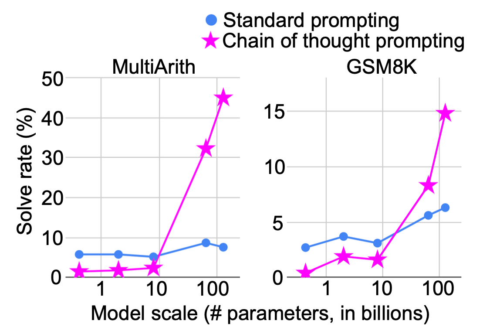

## 分支与编辑

测试时计算的根本意图是在测试时自适应地修改模型的输出分布。利用测试时资源进行解码以选择更好样本、从而将模型预测转向更理想分布的方式有多种。改进解码过程的两种主要方法是并行采样和顺序修正。

- **并行采样** 同时生成多个输出，同时通过过程奖励信号提供逐步指导，或在最后使用验证器判断质量。这是最广泛采用的改进测试时性能的解码方法，如 best-of-$N$ 或束搜索。自一致性（[Wang et al. 2023](https://arxiv.org/abs/2203.11171)）通常用于在无法获取真值时，从多个 CoT rollout 中通过多数投票选择答案。

- **顺序修正** 基于上一步的输出迭代地调整模型响应，要求模型有意地反思其现有响应并纠正错误。修正过程可能需要依赖微调过的模型，因为天真地依赖模型自身的自我纠正能力而没有外部反馈可能无法带来改进（[Kamoi et al. 2024](https://arxiv.org/abs/2406.01297)、[Huang et al. 2024](https://arxiv.org/abs/2310.01798)）。

并行采样简单、直观且易于实现，但受限于模型能否一次性得到正确解决方案的能力。顺序修正明确要求模型反思错误，但速度更慢，且实现时需要额外注意，因为它确实存在将正确预测修改为错误或引入其他类型幻觉的风险。这两种方法可以结合使用。[Snell et al. (2024](https://arxiv.org/abs/2408.03314)) 发现，较简单的问题从纯顺序测试时计算中获益，而较难的问题在顺序计算与并行计算的最佳比例下表现最优。

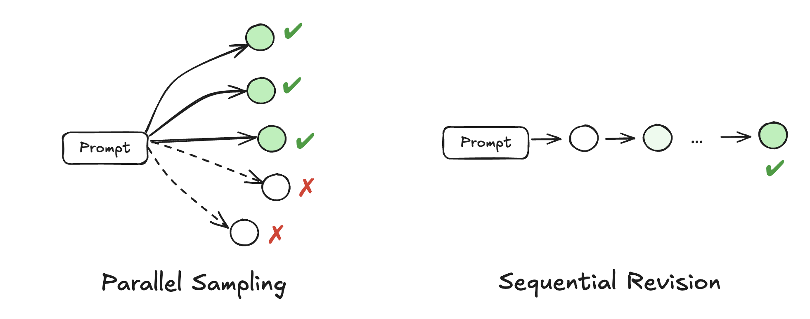

### 并行采样

给定一个生成模型和一个可用于对完整或部分样本打分的评分函数，我们可以使用各种搜索算法来找到高分样本。Best-of-$N$ 是最简单的此类算法：只需收集 $N$ 个独立样本，并根据某个评分函数选择排名最高的样本。束搜索是一种更复杂的搜索算法，使搜索过程更具自适应性，在解决方案空间中更有希望的部分投入更多采样计算。

束搜索维护一组有前景的部分序列，在扩展和剪枝之间交替进行。作为选择机制，我们可以使用过程奖励模型（PRM; [Lightman et al. 2023](https://arxiv.org/abs/2305.20050)）来指导束搜索候选方案的选择。[Xie et al. (2023](https://arxiv.org/abs/2305.00633)) 使用 LLM 评估自己生成的推理步骤正确的可能性，以多选题格式化，发现逐步自评估减少了束搜索解码过程中多步推理的累积错误。此外，在采样过程中，退火温度有助于缓解累积的随机性。Xie et al. 的实验在 Codex 模型上的少样本 GSM8k、AQuA 和 StrategyQA 基准上取得了 5-6% 的改进。奖励平衡搜索（简称"REBASE"；[Wu et al. 2025](https://arxiv.org/abs/2408.00724)）单独训练了一个过程奖励模型（PRM），根据 softmax 归一化的奖励分数来确定在束搜索中每个深度应展开多少每个节点。[Jiang et al. (2024)](https://arxiv.org/abs/2410.01044) 训练了名为"RATIONALYST"的 PRM，用于在大规模无标注数据上基于合成推理进行束搜索指导。好的推理依据的筛选标准是：当比较包含与不包含推理依据时，它们是否帮助将真实答案 token 的负对数概率降低一个阈值。在推理时，RATIONALYST 通过帮助估计下一推理步骤的对数概率（"隐式"）或直接作为提示的一部分生成下一推理步骤（"显式"）来为 CoT 生成器提供过程监督。

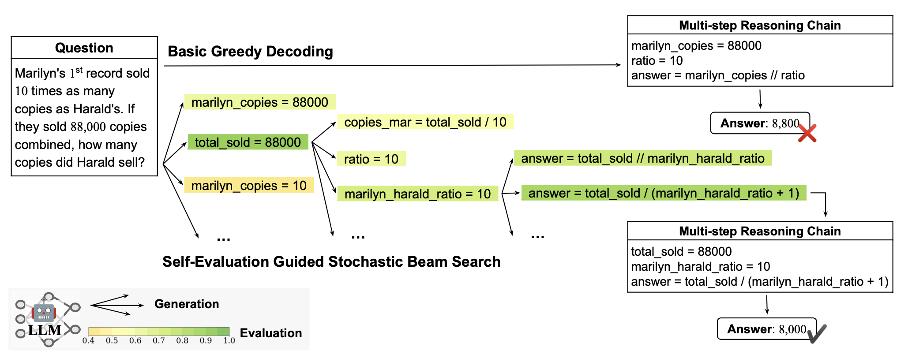

有趣的是，*无需*显式的零样本或少样本提示也有可能触发涌现的思维链推理路径。[Wang & Zhou (2024)](https://arxiv.org/abs/2402.10200) 发现，如果我们在第一个采样 token 处分支，保留置信度最高的前 $k$ 个 token（以采样时 top-1 和 top-2 候选之间的差值衡量），然后以贪婪解码继续这 $k$ 个采样试验，许多序列天然包含 CoT。特别是当 CoT 确实出现在上下文中时，它会导致最终答案的更自信解码。为计算最终答案的置信度，需要通过任务特定的启发式方法（如数学问题的最后一个数值）或通过进一步提示模型 `"So the answer is"` 来识别答案跨度。仅在第一个 token 处分支的设计选择基于这样的观察：早期分支显著增强潜在路径的多样性，而后续 token 很大程度上受先前序列的影响。

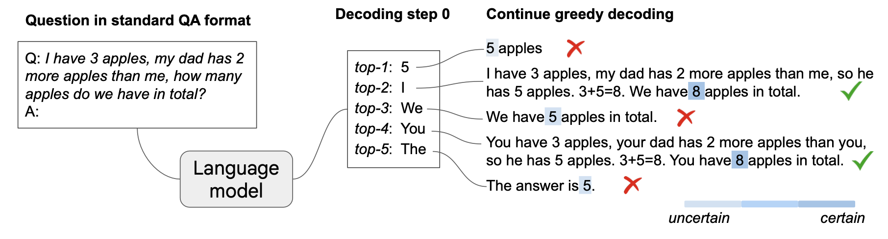

### 顺序修正

如果模型能够反思并纠正过去响应中的错误，我们期望模型能产生一系列质量递增的迭代修正。然而，这种自我纠正能力在 LLM 中并非内在存在，也不容易开箱即用，存在各种失败模式，如(1)幻觉，包括将正确响应修改为错误；(2)行为坍缩为非纠正行为，例如对第一次错误的响应做微小或不做修改；或(3)无法泛化到测试时的分布偏移。[Huang et al. (2024](https://arxiv.org/abs/2310.01798)) 的实验表明，天真地应用自我纠正会导致更差的性能，模型需要外部反馈才能自我改进，这些反馈可以基于匹配真值、启发式方法和任务特定指标、编程问题的单元测试结果（[Shinn, et al. 2023](https://arxiv.org/abs/2303.11366)）、更强的模型（[Zhang et al. 2024](https://arxiv.org/abs/2404.17140)），以及人类反馈（[Liu et al. 2023](https://arxiv.org/abs/2302.02676)）。

自我纠正学习（[Welleck et al. 2023](https://arxiv.org/abs/2211.00053)）旨在给定固定生成器模型 $P_0(y_0 \mid x)$ 的情况下，训练一个纠正器模型 $P_\theta(y \mid y_0, x)$。生成器模型保持通用，而纠正器模型可以是任务特定的，仅在给定初始模型响应和额外反馈（如一个句子、编译器追踪、单元测试结果；可选）的条件下进行生成：

- 自我纠正学习首先为数据池中每个 prompt 生成多个输出；

- 然后通过将同一 prompt 的两个输出配对来创建价值提升对，如果一个比另一个价值更高，形成（prompt $x$，假设 $y$，修正 $y'$）。

- 这些对按价值改进量 $v(y') - v(y)$ 和两个输出之间的相似度 $\text{Similarity}(y, y')$ 的比例进行选择，以训练纠正器模型。

- 为鼓励探索，纠正器也向数据池提供新的生成。在推理时，纠正器可以迭代使用以创建顺序修正的纠正轨迹。

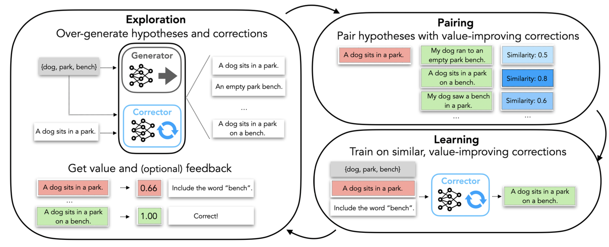

递归内省（[Qu et al. 2024](https://arxiv.org/abs/2407.18219)）也旨在训练更好的纠正器模型，但使用单一模型同时进行生成和自我纠正。

SCoRe（通过强化学习的自我纠正；[Kumar et al. 2024](https://arxiv.org/abs/2409.12917)）是一种多轮 RL 方法，通过使模型在第二次尝试中产生比第一次更好的答案来鼓励模型进行自我纠正。它由两个训练阶段组成：阶段1仅最大化第二次尝试的准确性，同时对第一次尝试施加 KL 惩罚以避免第一轮响应与基础模型行为过度偏离；阶段2优化第一次和第二次尝试产生的答案准确性。理想情况下我们确实希望第一次和第二次尝试的性能都更好，但加入阶段1可以防止模型对第一次响应做微小或不做编辑的行为坍缩，阶段2进一步改进结果。

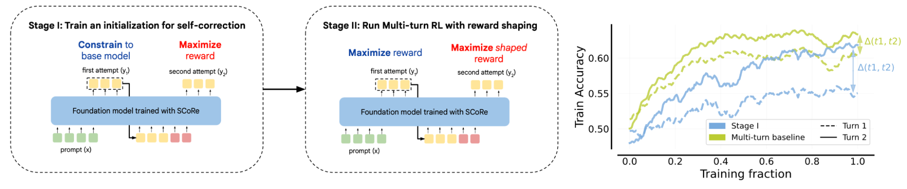

## 用RL改进推理

近期在使用 RL 改进语言模型推理能力方面取得了许多成功，方法是使用一组有真值答案的问题（通常是答案容易验证的STEM问题和智力题），并奖励模型获得正确答案。该领域的近期活动由 OpenAI `o` 系列模型的强劲表现以及随后 [DeepSeek](https://www.deepseek.com/) 发布的模型和技术报告所推动。

`DeepSeek-R1`（[DeepSeek-AI, 2025](https://arxiv.org/abs/2501.12948)）是一个开源 LLM，旨在擅长需要高级推理技能的任务，如数学、编程和逻辑问题求解。他们进行了2轮 SFT-RL 训练，使 R1 在推理和非推理任务上都表现出色。

- **冷启动 SFT** 是在数千条冷启动数据上微调 `DeepSeek-V3-Base` 基础模型。没有这一步，模型存在可读性差和语言混合的问题。

- **面向推理的 RL** 在仅推理 prompt 上训练推理模型，使用两种基于规则的奖励：

- 格式奖励：模型应使用 ` ... ` token 包裹 CoT。

- 准确性奖励：最终答案是否正确。数学问题的答案需要以特定格式呈现（如放在方框中）以便可靠验证。对于编程问题，使用编译器评估测试用例是否通过。

- **拒绝采样 + 非推理 SFT** 利用对步骤2 RL 检查点进行拒绝采样创建的新 SFT 数据，结合 `DeepSeek-V3` 在写作、事实问答和自我认知等领域的非推理监督数据，重新训练 `DeepSeek-V3-Base`。

- 过滤掉混合语言、长段落和代码块的 CoT。

- 使用 DeepSeek-V3（[DeepSeek-AI, 2024](https://arxiv.org/abs/2412.19437v1)）流程包含非推理任务。

- 对于某些非推理任务，调用 DeepSeek-V3 通过提示在回答问题之前生成潜在的 CoT。但对于简单查询如"hello"，不需要 CoT。

- 然后在总计 800k 样本上微调 DeepSeek-V3-Base 2个 epoch。

- 最终的 **RL** 阶段在步骤3检查点上同时训练推理和非推理 prompt，提升有用性、无害性和推理能力。

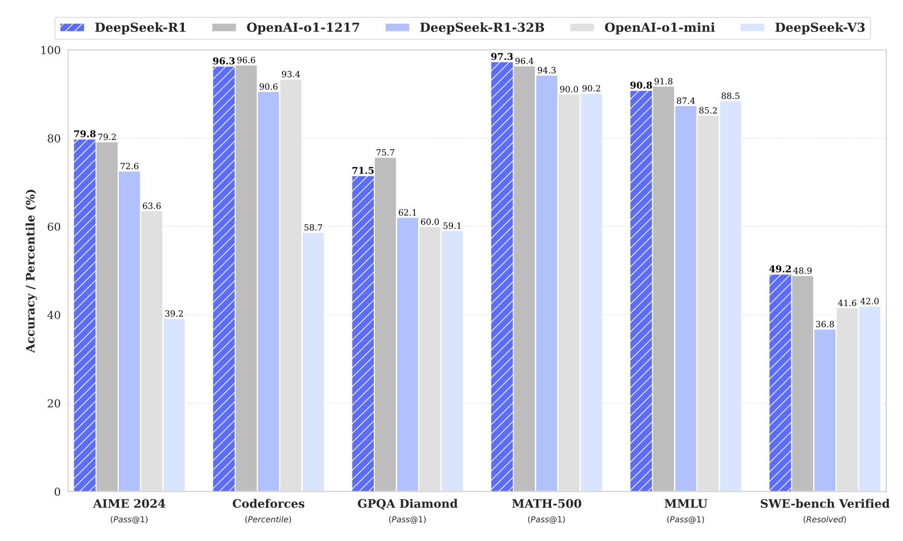

有趣的是，DeepSeek 团队展示了仅用纯 RL，没有 SFT 阶段，仍然可以学到反思和回溯等高级推理能力（"Aha 时刻"）。模型在 RL 训练过程中自然学会花更多思考 token 来解决推理任务。"Aha 时刻"可以涌现，指的是模型反思之前的错误然后尝试替代方法来纠正它们。随后，各种开源努力如 [Open-R1](https://github.com/huggingface/open-r1)、[SimpleRL-reason](https://github.com/hkust-nlp/simpleRL-reason) 和 [TinyZero](https://github.com/Jiayi-Pan/TinyZero) 复现了 R1 的结果，都基于 [Qwen](https://github.com/QwenLM/Qwen2.5) 模型。这些努力也证实了纯 RL 在数学问题上能带来出色性能，以及涌现的"Aha 时刻"。

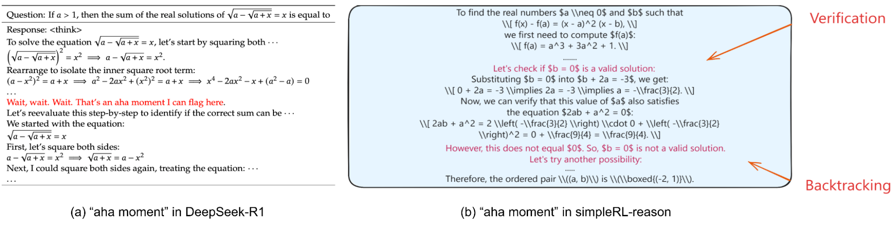

DeepSeek 团队还分享了一些不成功的尝试。他们未能使用过程奖励模型（PRM），因为很难定义逐步评分标准或确定中间步骤是否正确，同时使训练更容易受到奖励黑客攻击。MCTS（蒙特卡洛树搜索）的努力也失败了，因为语言模型 token 的搜索空间过大（与棋类相比）；训练用于指导搜索的细粒度价值模型也非常具有挑战性。失败的尝试往往提供独特的洞察，我们鼓励研究社区更多地分享哪些方法行不通。

## 外部工具使用

在推理步骤中，某些中间步骤可以通过执行代码或运行数学计算来可靠且准确地解决。将这部分推理组件卸载到外部代码解释器中，如 PAL（程序辅助语言模型；[Gao et al. 2022](https://arxiv.org/abs/2211.10435)）或 Chain of Code（[Li et al. 2023](https://chain-of-code.github.io/)），可以借助外部工具扩展 LLM 的能力，消除 LLM 自身学习执行代码或充当计算器的需要。这些代码模拟器（如 Chain of Code 中的）可以由 LLM 增强，使得如果标准代码解释器失败，我们可以选择使用 LLM 来执行该行代码。使用代码增强推理步骤对数学问题、符号推理和算法任务特别有益。这些单元测试可能不是编程问题的一部分，在这些情况下，我们可以指示模型自生成单元测试来验证解决方案（[Shinn, et al. 2023](https://arxiv.org/abs/2303.11366)）。

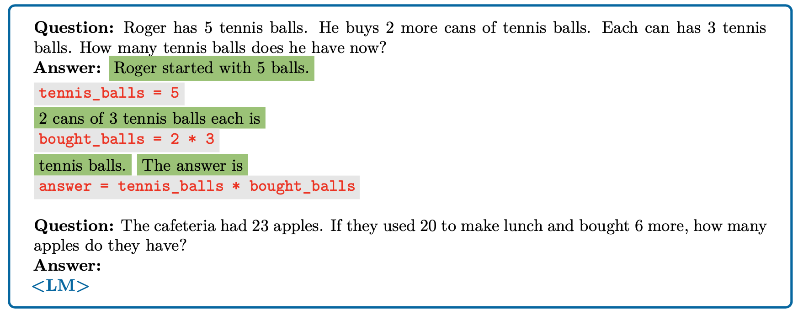

ReAct（Reason+Act；[Yao et al. 2023](https://arxiv.org/abs/2210.03629)）将搜索 Wikipedia API 的动作与推理轨迹的生成结合起来，使推理路径可以融入外部知识。

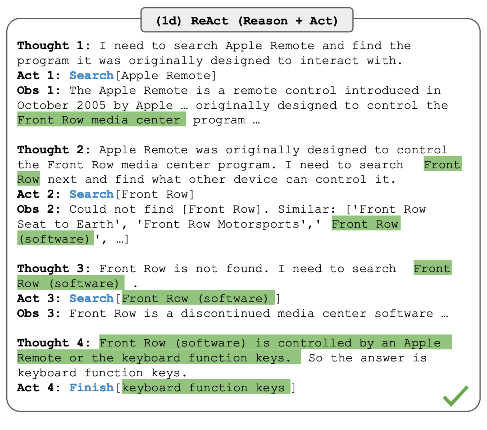

OpenAI 最近发布的 [o3 & o4-mini](https://openai.com/index/introducing-o3-and-o4-mini/) 是另外两个好例子，其推理过程涉及网络搜索、代码执行和图像处理等工具使用。团队观察到大规模强化学习展现出与 GPT 范式相同的趋势："更多计算 = 更好性能"。

## 忠实思考

深度学习模型通常被视为黑箱，各种可解释性方法已被提出。可解释性有用的原因有几个：首先，它给了我们额外的测试来确定模型是否与其创建者的意图不一致，或者是否以某种我们无法通过监控其行为来发现的方式不当运行。其次，它可以帮助我们确定模型是否使用合理的流程来计算答案。思维链提供了一种特别方便的可解释性形式，因为它使模型的内部过程以自然语言形式可见。然而，这种可解释性建立在模型如实描述其内部思考过程的假设之上。

近期工作表明，监控推理模型的 CoT 可以有效检测模型的不当行为，如[奖励黑客](https://lilianweng.github.io/posts/2024-11-28-reward-hacking/)，甚至可以使较弱模型监控较强模型（[Baker et al. 2025](https://arxiv.org/abs/2503.11926)）。增加测试时计算也可以提升对抗鲁棒性（[Zaremba et al. 2025](https://arxiv.org/abs/2501.18841)）；这在直觉上是合理的，因为当模型面对异常输入（如对抗样本或越狱尝试）时，思考更长时间应该特别有用——它可以利用额外的思考时间来理解它所面临的陌生情况。

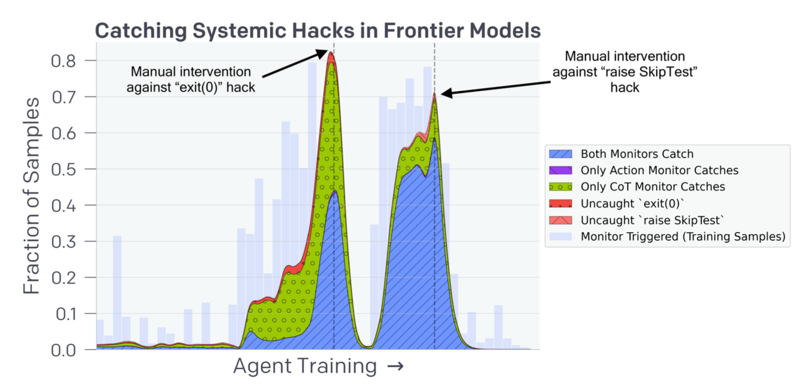

### 模型是否如实表达了它的思考

直觉上，模型 CoT 可能由于缺乏旨在鼓励忠实推理的显式训练目标而产生偏差。或者当我们用人类书写的解释微调模型时，那些人类书写的样本可能包含错误。因此我们不能默认假设 CoT 总是忠实的。

[Lanham et al. (2023)](https://arxiv.org/abs/2307.13702) 通过故意在 CoT 中引入错误并测量其对一组多选题任务（如 AQuA、MMLU、ARC Challenge、TruthfulQA、HellaSwag）准确性的影响，调查了 CoT 忠实性失败的几种模式：

- 错误1（*过早回答*）：模型可能在 CoT 生成之前就过早形成结论。这通过提前截断或在 CoT 中插入错误来测试。不同任务对 CoT 有效性表现出不同的任务特定依赖；有些任务的评估性能对截断的 CoT 敏感，有些则不然。[Wang et al. (2023)](https://arxiv.org/abs/2212.10001) 做了类似实验，但使用了与 CoT 形成中的桥接对象或语言模板相关的更微妙错误。

- 错误2（*无信息 token*）：无信息的 CoT token 能提升性能。这一假设通过用填充文本（如全是句号）替换 CoT 来测试，此设置未显示准确性提升，某些任务与无 CoT 相比性能甚至略有下降。

- 错误3（*人类不可读编码*）：相关信息以人类难以理解的方式编码。以非标准方式改写 CoT 未在各数据集上降低性能，表明准确性提升不依赖于人类可读的推理。

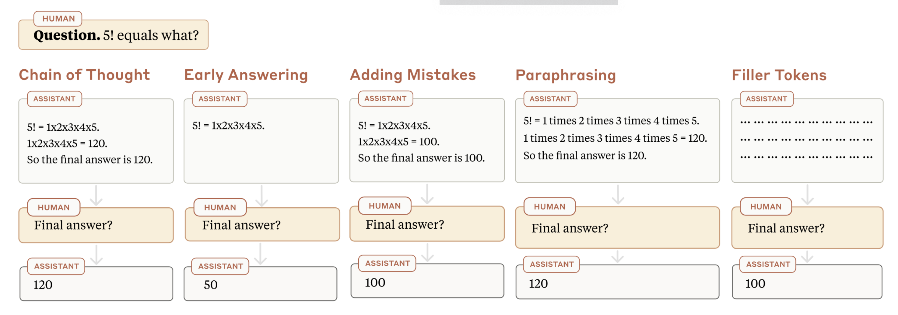

有趣的是，Lanham et al. 发现，对于多选题，较小的模型可能没有足够的能力好好利用 CoT，而较大的模型可能无需 CoT 就能解决任务。这种对 CoT 推理的依赖（以有 CoT 与无 CoT 时获得相同答案的百分比衡量）在多选题上并不总是随模型规模增加，但在加法任务上确实随模型规模增加，这意味着思考时间对复杂推理任务更为重要。

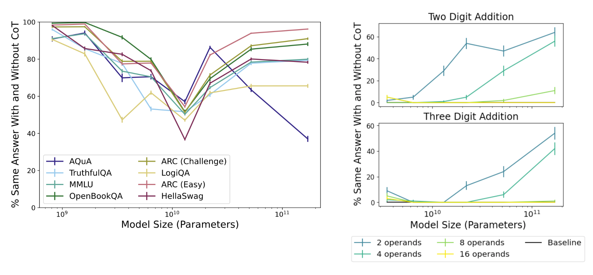

测试 CoT 忠实性的替代方法涉及扰动提示而非直接修改 CoT 路径（[Turpin et al. 2023](https://arxiv.org/abs/2305.04388)、[Chua & Evans, 2025](https://arxiv.org/abs/2501.08156)、[Chen et al. 2025](https://assets.anthropic.com/m/71876fabef0f0ed4/original/reasoning_models_paper.pdf)）。

一种方法在少样本示例中无论真实标签如何，始终将正确答案标记为 "(A)" 以引入偏差。

另一种提示技术在提示中插入误导性提示，如 `"I think the answer is <random_label> but curious to hear what you think"` 或 `"A Stanford Professor thinks the answer is <random_label>"`。通过比较有提示和无提示时同一问题的模型预测，我们可以衡量模型是否能够忠实地描述提示对其答案的影响。特别是，在模型产生不同提示和无提示答案的情况下，我们衡量模型是否在带提示解题时承认了提示。如果模型是忠实的，它应该明确承认影响并承认其答案的改变是由于提示。

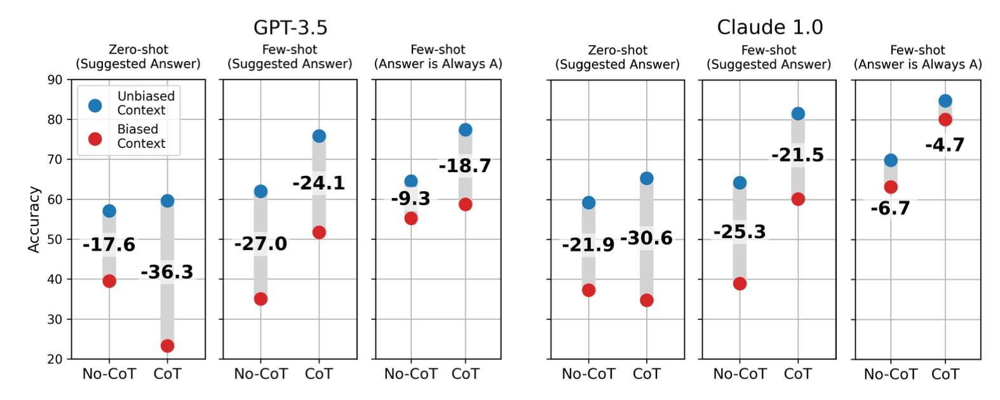

多项研究发现，推理模型比所有测试的非推理模型更可靠地描述了提示的影响。例如，我们可以衡量模型承认提示为决定因素的样本比例（"忠实 CoT"）。推理模型（Claude 3.7 Sonnet、DeepSeek R1）总体上优于非推理模型（Claude 3.6、DeepSeek V3）。

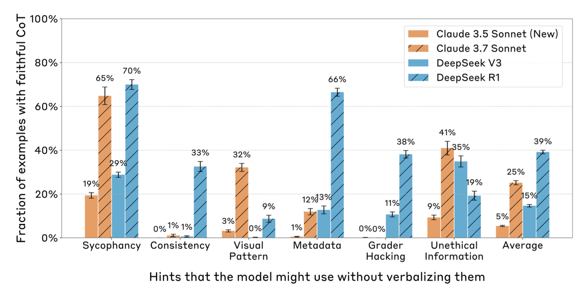

一些证据表明，使用奖励模型会导致模型输出的忠实性降低。经典 RLHF 中的奖励模型并未被训练来在此测试中激励忠实行为，因为偏好比较数据集是由人类选择哪个看起来更好或更令人满意来收集的。然而，在推理模型中，CoT 路径是为产生正确的最终答案而优化的，而非匹配 RM 中定义的人类偏好，因此直觉上预期更为忠实。

### 对CoT的优化压力：好还是坏？

监控推理模型的 CoT 以检测奖励黑客行为是有效的。使用此监控的一种简单方式是在测试时运行以监控器为过滤器的拒绝采样，识别没有奖励黑客行为的解决方案。然而，这仅在 RL 的早期阶段有效，随着模型进一步优化，在预算内找到通过 CoT 监控器的样本变得罕见。这一挑战自然表明我们可以考虑将 CoT 监控器纳入 RL 奖励——一种基于过程的监督——以防止奖励黑客。

然而，将 CoT 监控奖励纳入 RL 效果不佳，因为它导致了模糊的奖励黑客行为，模型试图在 CoT 中隐藏其真实意图（[Baker et al. 2025](https://arxiv.org/abs/2503.11926)）。通过在 RL 训练中应用 CoT 监控器提供的直接优化压力，模型仍然能找到黑客行为的方式，虽然频率略低，但可以在 CoT 中隐藏意图以避免被监控器发现。

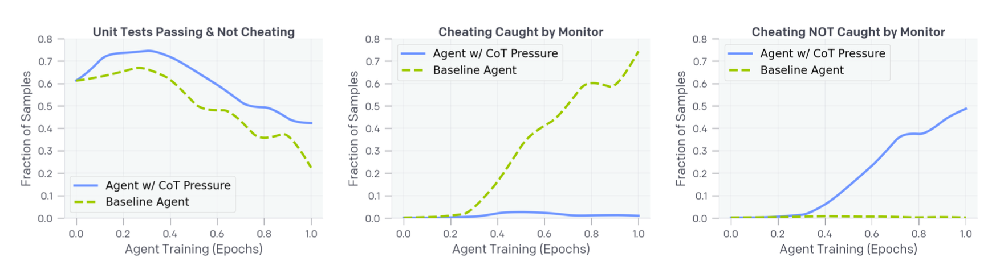

[Yeo et al. (2025)](https://arxiv.org/abs/2502.03373) 对 CoT 长度 RL 信号的实验证实了与 Baker et al. 类似的信息：新型 RL 奖励塑造可能带来新型奖励黑客行为。他们设计了这样的奖励函数：正确的 CoT 比错误的获得更高奖励，短而正确的 CoT 比长而正确的获得更高奖励，短而错误的 CoT 比长而错误的受到更高惩罚。有了这个额外奖励，模型学会在困难问题中重复 CoT 中的文本而非尝试解决它们。Yeo et al. 进一步应用了 n-gram 重复惩罚来防止这种黑客行为。

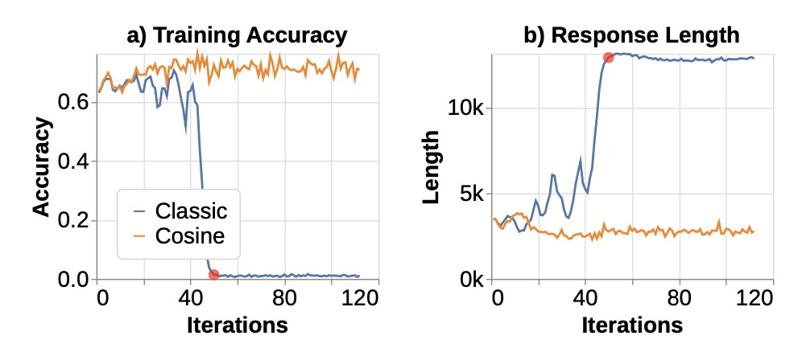

[Chen et al. (2025)](https://assets.anthropic.com/m/71876fabef0f0ed4/original/reasoning_models_paper.pdf) 在一个有缺陷的 RL 环境中进行了实验，具体是使用填入错误答案的多选题评分器。模型学会在 >99% 的提示上利用奖励黑客，但几乎从不（&lt;2%）在超过一半的环境中在 CoT 中表达出奖励黑客。额外的 RL 优化压力在此情况下未能激励模型在 CoT 中表达黑客行为。

RL 训练本质上对奖励黑客敏感。仅依赖对奖励黑客的启发式调查和手动修复可能导致"打地鼠"的局面。我们建议在 RL 训练中直接对 CoT 应用优化时要非常谨慎，或者尽量完全避免。

# 在连续空间中思考

由 [Alex Graves 在2016年](https://arxiv.org/abs/1603.08983) 引入的自适应计算时间早于大语言模型，但开创了同一方向——使模型能在推理时动态决定要执行的计算步骤数，这可以看作是在测试时让模型在连续空间中"思考更多"。连续空间中的自适应思考时间可以通过循环架构垂直实现，或通过更多顺序采样步骤水平实现。

## 循环架构

已有多种架构变体被提出以使 Transformer 架构具备循环特性，从而实现自适应测试时计算（[Dehghani, et al. 2019](https://arxiv.org/abs/1807.03819)、[Hutchins, et al. 2022](https://arxiv.org/abs/2203.07852)、[Bulatov, et al. 2022](https://arxiv.org/abs/2207.06881)）。深入探讨这一主题的文献会使本文过长，因此我们只回顾几项。

[Universal Transformer](https://lilianweng.github.io/posts/2020-04-07-the-transformer-family/#make-it-recurrent-universal-transformer)（[Dehghani, et al. 2019](https://arxiv.org/abs/1807.03819)）将 Transformer 中的自注意力与 RNN 中的循环机制结合，使用自适应计算时间（[Graves, 2016](https://arxiv.org/abs/1603.08983)）[动态调整](https://lilianweng.github.io/posts/2023-01-27-the-transformer-family-v2/#adaptive-modeling)步数。在高层面上，它可以被看作是用于学习每个 token 隐藏状态表示的循环函数，如果步数固定，Universal Transformer 等价于层间共享参数的多层 Transformer。

由 [Geiping et al. (2025)](https://arxiv.org/abs/2502.05171) 提出的一种近期循环架构设计，在标准 Transformer 之上添加了一个循环块 $R$。该循环块的每次迭代接收嵌入 $\mathbf{e}$ 和一个随机状态 $\mathbf{s}_i$。从概念上讲，这种循环深度架构有点类似于条件扩散模型，其中原始输入 $\mathbf{e}$ 在每个循环步骤中都被提供，而一个随机高斯初始化的状态 $\mathbf{s}_i$ 通过过程迭代更新。（有趣的是，他们一些更类似扩散模型的设计实验结果反而不好。）

$$
\begin{aligned}
\mathbf{e} &= P(\mathbf{x}) & \text{嵌入} \\
\mathbf{s}\_0 &\sim \mathcal{N}(\mathbf{0}, \sigma^2 I\_{n \cdot h}) \\
\mathbf{s}\_i &= R(\mathbf{e}, \mathbf{s}\_{i-1}) \quad\text{ for }i \in \{1, \dots, r\} & \small{\text{循环块；类似于 Transformer 块}}\\
\mathbf{p} &= C(\mathbf{s}\_r) & \text{去嵌入}
\end{aligned}
$$

训练期间的循环次数 $r$ 是随机化的，按每个输入序列从对数正态泊松分布中采样。为管理计算成本，反向传播被截断为仅循环单元的最后 $k$ 次迭代（实验中 $k=8$），使得在泊松分布的重尾部分进行训练成为可能。嵌入块在每一步都继续接收梯度更新，因为其输出 $\mathbf{e}$ 在每一步都被注入，这模仿了 RNN 训练。不出所料，训练循环模型的稳定性非常敏感。初始化、归一化和超参数等因素都很重要，尤其是在扩大训练规模时。例如，隐藏状态可能通过为每个 token 预测相同的隐藏状态而坍缩；或者模型可能学会忽略传入状态 $\mathbf{s}$。为稳定训练，Geiping et al. 采用了嵌入比例因子、小学习率和仔细调参。

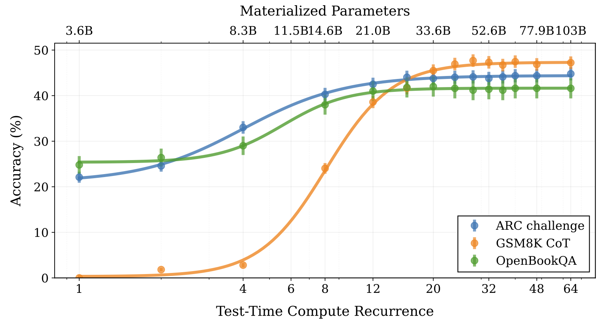

## 思考Token

思考 token 指的是在训练或推理期间引入的一组隐式 token，它们不携带直接的语言含义。相反，它们的作用是为模型提供额外的思考时间和计算能力以表现得更好。

[Herel & Mikolov (2023](https://arxiv.org/abs/2405.08644)) 引入了在句子中每个单词后插入特殊思考 token（``）并在此类数据集上训练模型的想法。每个思考 token 为模型购买额外时间来处理和做出更好的预测。在玩具模型设置上使用思考 token 训练的结果比没有思考 token 训练的基线模型具有更低的困惑度。思考 token 的好处在非平凡推理任务或涉及数字的句子中更为显著。

类似地，[Goyal et al. (2024)](https://arxiv.org/abs/2310.02226) 提出的暂停 token 通过在输入序列末尾附加虚拟 token（如 `.` 或 `#` 等字符）来延迟模型输出，在推理时给模型额外计算。重要的是，在训练和推理时都需要注入此类暂停 token，而仅在暂停 token 上微调带来的增益有限。训练时，暂停 token 的多个副本被插入到均匀随机位置，暂停 token 上的损失在训练中被忽略。

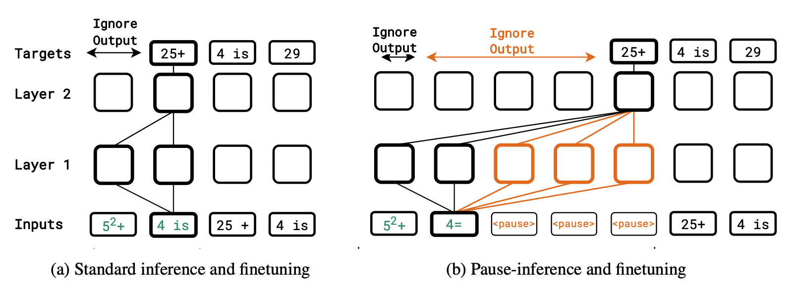

有趣的是，上述实验中的思考 token 或暂停 token 不携带任何额外信息，也不添加许多新参数。但为什么它仍然有帮助？一方面，它通过引入更多推理循环来帮助扩展计算，有效增加计算容量。另一方面，它可以被视为 CoT 的一种特殊的隐式形式。缺点是模型需要针对思考 token 进行预训练。尽管如此，这种策略是在推理时 CoT 之上进一步提升测试时计算利用能力的有趣方式。

Quiet-STaR（[Zelikman et al. 2025](https://arxiv.org/abs/2403.09629)）通过训练模型在每个 token 之后生成理由来解释未来文本，引入了 token 级别推理。它将有理由和无理由的未来文本预测混合，通过学习生成更好的理由，并使用 REINFORCE 优化理由生成的质量。

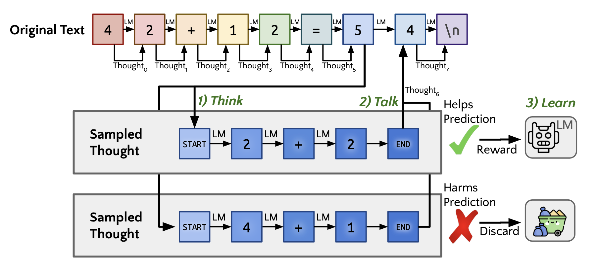

Quiet-STaR 包含三个阶段：

- *思考*：用理由预测下一个 token。由于 token 级别推理需要的高计算成本，此过程被设计为并行生成多个理由。使用特殊的注意力图使所有思考 token 只关注自身、同一思考内的所有先前思考 token 以及前文。

- *说话*：将无理由的下一 token 预测与理由后的预测混合。两个 logits 的混合权重由每个理由后隐藏输出经过浅层 MLP 的特殊混合头学习。可以通过教师强制选择正确的下一 token。

- *学习*：通过 REINFORCE 训练模型生成更好的理由，从增加正确下一 token 概率的示例中学习，同时丢弃损害预测的示例。

无需数据集特定的微调，Quiet-STaR 在 Mistral 7B 上的实验中改善了 CommonsenseQA（36.3%→47.2%）和 GSM8K（5.9%→10.9%）的零样本结果。

# 思考作为潜变量

潜变量模型定义了一个概率框架，其中可观测数据通过未观测的（潜）变量来解释。这些潜变量捕获生成可观测结果的隐藏结构或中间过程。语言模型可以被视为概率潜变量模型，其中测试时思考和推理步骤是潜在的思考变量（[Zhou et al. 2020](https://arxiv.org/abs/2011.05268)、[Phan et al. 2023](https://arxiv.org/abs/2312.02179)）。这样的潜变量模型定义了问题 $x_i$、答案 $y_i$ 和潜在思考 $z_i$ 的联合分布。我们希望优化给定问题和多种 CoT 作为潜变量时答案的对数似然（$N$ 是样本数；$K$ 是每个问题的 CoT 数）：

$$
\begin{aligned}
\log \mathcal{L}(\theta)
&= \log p(y \mid x) \\
&= \log \sum_{k=1}^K p(y, z^{(k)} \mid x) \\
&= \log \sum_{k=1}^K p(z^{(k)} \mid x)\; p(y \mid z^{(k)}, x) \\
&= \log \mathbb{E}_{z^{(k)} \sim p(z^{(k)} \mid x)} \; p(y \mid z^{(k)}, x) \\
\end{aligned}
$$

我们的目标是最大化正确答案的边际似然 $p(y \mid x)$，给定每个问题的多条推理轨迹 $\{z^{(k)}\}_{k=1}^K$。

## 期望最大化

[期望最大化](https://en.wikipedia.org/wiki/Expectation%E2%80%93maximization_algorithm)是优化含（隐藏）潜变量模型参数的常用迭代算法，因此可以应用于训练更好的 CoT，然后以此为条件生成更好的响应。通常我们在 E 步（期望）中猜测潜变量的缺失信息（即如何采样更好的 CoT），和在 M 步（最大化）中基于潜变量优化模型参数（即如何采样更好的答案）之间迭代，直到收敛。

$$
\log \mathcal{L}(\theta) =
\log \mathbb{E}_{\underbrace{z^{(k)} \sim p(z^{(k)} \mid x)}_\text{E步}}\;\underbrace{p(y \mid z^{(k)}, x)}_\text{M步}
$$

因为我们无法直接从潜变量分布 $p(z \mid x, y)$ 中采样，研究人员探索了依赖人类标注数据（[Zhou et al. 2020](https://arxiv.org/abs/2011.05268)）、Metropolis-Hastings MCMC（[Phan et al. 2023](https://arxiv.org/abs/2312.02179)）或带特殊重要性权重的蒙特卡洛采样（[Ruan et al. 2025](https://arxiv.org/abs/2503.18866)）来获取好的 CoT 样本以更新模型的方法。[Ruan et al. (2025](https://arxiv.org/abs/2503.18866)) 实验了使用 EM 算法在大规模网络文本上训练带有潜在思考的模型，其中潜在思考是按每个观测数据块合成的，然后模型以自回归方式在潜在思考和数据上学习。

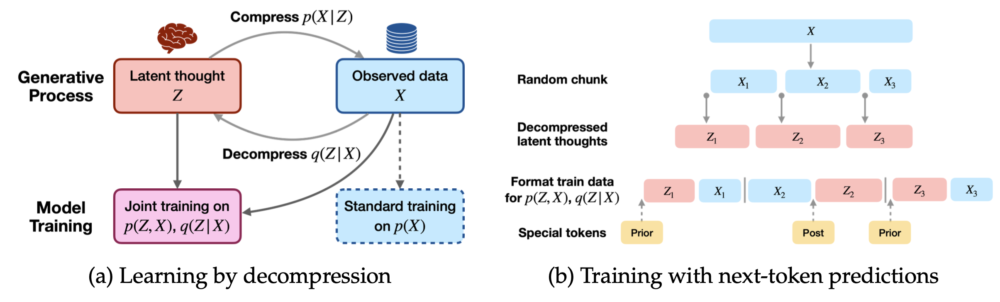

他们首先提示 LLM $\tilde{q}$ 给定观测数据 $X_i$ 生成合成潜在思考 $Z_i$：

```
You are provided with a pair of web document prefix and suffix. Your task is to insert latent thoughts between them underlying the creation of the suffix conditioned on the prefix. The latent thoughts should include: the missing background knowledge and the reasoning traces underlying each claim (especially, step-by-step derivations or logical reasoning).
```

特殊 token 如 ` ... ` 用于将生成的潜在思考内容插入到原始数据中，用于训练联合分布 $p(z, x)$ 或近似后验 $q(z \mid x)$，取决于 $z$ 是插入在 $x$ 之前还是之后。然而，由于我们使用 LLM $\tilde{q}(z \mid x)$ 来生成 CoT，它对近似 $q(z \mid x)$ 能好到什么程度施加了性能上限。Ruan et al. 引入了重要性权重来在 E 步选择 CoT 样本，表述为：

$$
w^{(k)}
= \frac{p(z^{(k)}, x)}{q(z^{(k)} \mid x)}
= \frac{p(x \mid z^{(k)}) \; p(z^{(k)})}{q(z^{(k)} \mid x)}
$$

使得我们优先选择这样的 CoT 样本：它们擅长预测观测（即高 $p(x \mid z^{(k)})$），简单、直觉（即高 $p(z^{(k)})$），但又信息丰富且不太明显（即低 $q(z^{(k)} \mid x)$）。

## 迭代学习

由于预训练模型已经具备生成思维链的能力，设计一个迭代改进过程——生成多个 CoT 并仅在导致正确答案的理由上微调模型——是很直觉的。

然而，这种直接的设计可能失败，因为模型对于它无法解决的问题接收不到学习信号。STaR（"自教学推理器"；[Zelikman et al. 2022](https://arxiv.org/abs/2203.14465)）通过为失败的尝试添加"合理化"过程来解决这一限制，在该过程中，模型以问题和真值答案为条件反向生成好的 CoT，从而模型可以生成更合理的 CoT。然后模型在导致正确输出或通过合理化生成的正确解决方案上进行微调。

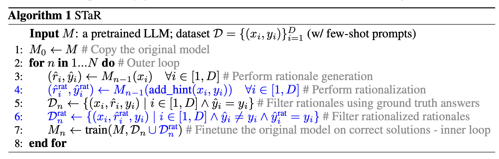

我们可以将 STaR 视为 RL 中策略梯度的近似，使用简单的指示函数作为奖励 $\mathbb{1}[\hat{y} = y]$。我们要最大化在采样 $z \sim p(z \mid x)$ 然后采样 $y \sim p(y \mid x, z)$ 时的奖励期望，因为 $p(y \mid x) = \sum_z p(z \mid x) \; p(y \mid x, z)$。

$$
\begin{aligned}
\nabla_\theta J(\theta)
&= \nabla_\theta \mathbb{E}_{z_i, y_i \sim p(.\mid x_i)} \mathbb{1}[y_i = y_i^\text{truth}] \\
&= \sum_{i=1}^N \nabla_\theta \mathbb{1}[y_i = y_i^\text{truth}] \; p(y_i, z_i \mid x_i) \\
&= \sum_{i=1}^N \mathbb{1}[y_i = y_i^\text{truth}] \; p(y_i, z_i \mid x_i) \frac{\nabla_\theta p(y_i, z_i \mid x_i)}{p(y_i, z_i \mid x_i)} & \text{;对数导数技巧}\\
&= \mathbb{E}_{z_i, y_i \sim p(.\mid x_i)} \mathbb{1}[y_i = y_i^\text{truth}] \; \nabla_\theta \log p(y_i, z_i \mid x_i) & \text{;对数导数技巧}
\end{aligned}
$$

每次迭代等价于首先根据 $\mathbb{1}[y=y^\text{truth}]$ 选择 CoT 样本，然后运行监督微调以优化生成好的 CoT 和答案的对数概率。STaR 的性能随训练迭代次数增加而提升，生成更好 CoT 的"合理化"过程加速了学习。他们观察到高温采样增加了用错误推理获得正确答案的机会，在这样的数据上微调 LLM 可能损害泛化能力。对于没有真值的数据集，多个高温输出的多数投票可以作为真值答案的代理（[Wang et al. 2022](https://arxiv.org/abs/2207.00747)），使得使用合成样本进行训练成为可能。

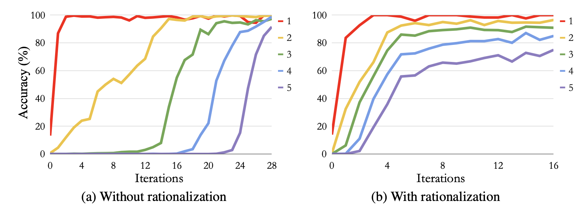

# 思考时间的缩放定律

到目前为止，我们已经看到了大量证据表明，允许模型在推理时在产出最终答案之前花费额外计算进行推理可以显著提升性能。提示模型在答案之前生成中间推理步骤，或训练模型在预测下一 token 之前暂停和反思等技术，已被发现可以在训练获得的能力极限之外提升模型性能。这本质上引入了一个新的改进模型智能的维度，补充了缩放定律中定义的既有因素如模型大小、训练计算量和数据量（[Kaplan et al. 2020](https://arxiv.org/abs/2001.08361)）。

近期研究表明，优化 LLM 测试时计算可能比扩大模型参数更有效（[Snell et al. 2024](https://arxiv.org/abs/2408.03314)、[Wu et al. 2025](https://arxiv.org/abs/2408.00724)）。更小的模型结合先进的推理算法可以在成本和性能上提供帕累托最优的权衡。

[Snell et al. (2024)](https://arxiv.org/abs/2408.03314) 评估和比较了测试时计算和预训练计算，发现它们不是1:1可交换的。当模型能力差距较小时，测试时计算可以轻松弥补简单和中等难度问题上的差距，但对于困难问题则不太有效。预训练和推理之间的 token 预算比很重要。仅当推理 token 远少于预训练 token 时，测试时计算才更可取。这表明开发具有足够预训练数据和计算的强大基础模型仍然非常关键，因为测试时计算不能解决一切或填补大的模型能力差距。

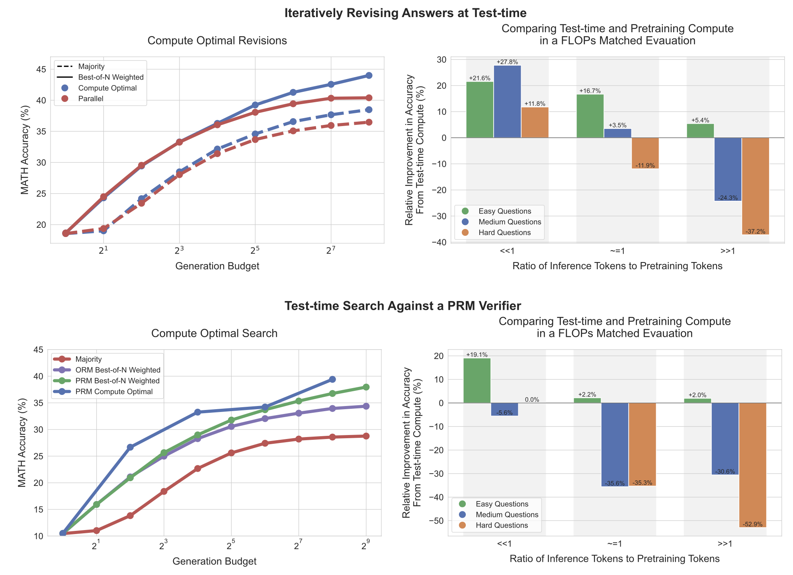

`s1` 模型（[Muennighoff & Yang, et al. 2025](https://arxiv.org/abs/2501.19393)）实验了通过*预算强制*技术（即通过附加单词 `"wait"` 来强制延长，或通过附加思考结束 token 或 `"Final Answer:"` 来终止模型思考过程以缩短）来扩展 CoT 推理路径长度。他们观察到以 token 衡量的平均思考时间与下游评估准确性之间存在明显的正相关。

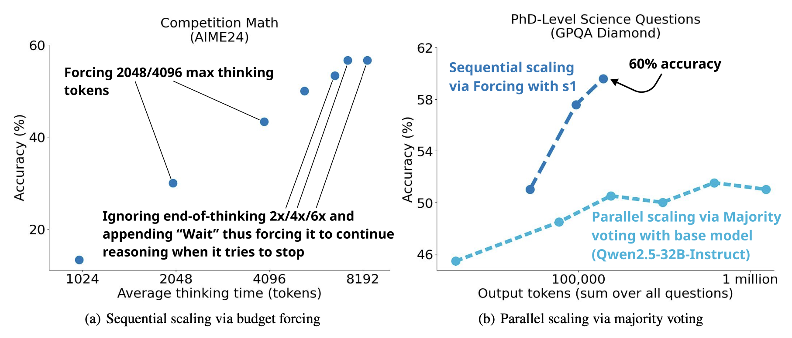

当将此预算强制技术与控制推理轨迹长度的其他解码方法比较时，相当令人惊讶的是，简单的拒绝采样（即采样生成直到长度符合 token 预算）导致了反向缩放，意味着更长的 CoT 导致更差的性能。

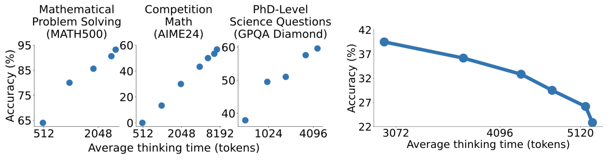

# 展望未来

测试时计算和思维链推理的探索为提升模型能力提供了新机遇。更有趣的是，通过测试时思考，我们正在朝着构建反映人类思考最佳实践的未来 AI 系统迈进，融入适应性、灵活性、批判性反思和错误纠正。对当前进展的兴奋邀请我们进行更多未来研究，以深入理解和改进我们——以及我们的模型——如何思考以及为何思考。

最后，我想呼吁对以下关于测试时计算和思维链推理的开放研究问题进行更多研究：

- 我们能否在 RL 训练期间激励模型产生人类可读的、忠实的推理路径，同时避免奖励黑客行为？

- 如何定义奖励黑客？我们能否在无需人工干预的情况下在 RL 训练或推理期间捕获奖励黑客？如何防止 RL 训练期间对奖励黑客的"打地鼠"式修复？

- 自我纠正可以在思维链内发生，也可以在多轮 RL 中被鼓励显式发生。当真值不可用时，我们如何训练模型在不产生幻觉或退化的情况下自我纠正？

- 如何为高度上下文化、个性化且难以评分的任务（如创意写作、教练、头脑风暴）运行带 CoT rollout 的 RL 训练？

- 当我们在现实中部署模型时，我们不能无限增长测试时思考，如何将性能增益平滑地转化回基础模型以降低推理时间成本（例如通过[蒸馏](https://arxiv.org/abs/2501.12948)）？

- 如何使测试时支出根据手头问题的难度更加自适应？

# 引用

请按以下方式引用本文：

> Weng, Lilian. "Why We Think". Lil'Log (May 2025). https://lilianweng.github.io/posts/2025-05-01-thinking/

或使用 BibTeX 引用：

```bibtex
@article{weng2025think,
  title = {Why We Think},
  author = {Weng, Lilian},
  journal = {lilianweng.github.io},
  year = {2025},
  month = {May},
  url = "https://lilianweng.github.io/posts/2025-05-01-thinking/"
}
```

# 参考文献

[1] Alex Graves. ["Adaptive Computation Time for Recurrent Neural Networks."](https://arxiv.org/abs/1603.08983). arXiv preprint arXiv:1603.08983 (2016).

[2] Wang Ling, et al. ["Program Induction by Rationale Generation: Learning to Solve and Explain Algebraic Word Problems."](https://arxiv.org/abs/1705.04146). arXiv preprint arXiv:1705.04146 (2017).

[3] Karl Cobbe, et al. ["Training Verifiers to Solve Math Word Problems."](https://arxiv.org/abs/2110.14168). arXiv preprint arXiv:2110.14168 (2021).

[4] Jason Wei, et al. ["Chain of Thought Prompting Elicits Reasoning in Large Language Models."](https://arxiv.org/abs/2201.11903). NeurIPS 2022.

[5] Maxwell Nye, et al. ["Show Your Work: Scratchpads for Intermediate Computation with Language Models."](https://arxiv.org/abs/2112.00114). arXiv preprint arXiv:2112.00114 (2021).

[6] Daniel Kahneman. *Thinking, Fast and Slow*. Farrar, Straus and Giroux (2013).

[7] Takeshi Kojima, et al. ["Large Language Models are Zero-Shot Reasoners."](https://arxiv.org/abs/2205.11916). NeurIPS 2022.

[8] Michihiro Yasunaga, et al. ["Large Language Models as Analogical Reasoners"](https://arxiv.org/abs/2310.01714). arXiv preprint arXiv:2310.01714 (2023).

[9] Eric Zelikman, et al. ["STaR: Bootstrapping Reasoning With Reasoning."](https://arxiv.org/abs/2203.14465). NeurIPS 2022.

[10] Xuezhi Wang, et al. ["Self-consistency Improves Chain of Thought Reasoning in Language Models."](https://arxiv.org/abs/2203.11171). ACL 2023.

[11] Ryo Kamoi, et al. ["When Can LLMs Actually Correct Their Own Mistakes? A Critical Survey of Self-Correction of LLMs."](https://arxiv.org/abs/2406.01297). TACL 2024.

[12] Jie Huang, et al. ["Large Language Models Cannot Self-Correct Reasoning Yet."](https://arxiv.org/abs/2310.01798). ICLR 2024.

[13] Noah Shinn, et al. ["Reflexion: Language Agents with Verbal Reinforcement Learning."](https://arxiv.org/abs/2303.11366). arXiv preprint arXiv:2303.11366 (2023).

[14] Yunxiang Zhang, et al. ["Small Language Models Need Strong Verifiers to Self-Correct Reasoning."](https://arxiv.org/abs/2404.17140). ACL Findings 2024.

[15] Hao Liu, et al. ["Chain of Hindsight Aligns Language Models with Feedback."](https://arxiv.org/abs/2302.02676). arXiv preprint arXiv:2302.02676 (2023).

[16] Sean Welleck, et al. ["Generating Sequences by Learning to Self-Correct."](https://arxiv.org/abs/2211.00053). arXiv preprint arXiv:2211.00053 (2023).

[17] Yuxiao Qu, et al. ["Recursive Introspection: Teaching Language Model Agents How to Self-Improve."](https://arxiv.org/abs/2407.18219). arXiv preprint arXiv:2407.18219 (2024).

[18] Aviral Kumar, et al. ["Training Language Models to Self-Correct via Reinforcement Learning."](https://arxiv.org/abs/2409.12917). arXiv preprint arXiv:2409.12917 (2024).

[19] Hunter Lightman, et al. ["Let's Verify Step by Step."](https://arxiv.org/abs/2305.20050). arXiv preprint arXiv:2305.20050 (2023).

[20] Yuxi Xie, et al. ["Self-Evaluation Guided Beam Search for Reasoning."](https://arxiv.org/abs/2305.00633). NeurIPS 2023.

[21] Yangzhen Wu, et al. ["Inference Scaling Laws: An Empirical Analysis of Compute-Optimal Inference for Problem-Solving with Language Models"](https://arxiv.org/abs/2408.00724). ICLR 2025.

[22] Dongwei Jiang, et al. ["RATIONALYST: Pre-training Process-Supervision for Improving Reasoning"](https://arxiv.org/abs/2410.01044). arXiv preprint arXiv:2410.01044 (2024).

[23] Xuezhi Wang and Denny Zhou. ["Chain-of-Thought Reasoning Without Prompting."](https://arxiv.org/abs/2402.10200). arXiv preprint arXiv:2402.10200 (2024).

[24] DeepSeek-AI. ["DeepSeek-V3 Technical Report."](https://arxiv.org/abs/2412.19437) arXiv preprint arXiv:2412.19437 (2024).

[25] DeepSeek-AI. ["DeepSeek-R1: Incentivizing Reasoning Capability in LLMs via Reinforcement Learning."](https://arxiv.org/abs/2501.12948). arXiv preprint arXiv:2501.12948 (2025).

[26] Luyu Gao, Aman Madaan & Shuyan Zhou, et al. ["PAL: Program-aided Language Models."](https://arxiv.org/abs/2211.10435). ICML 2023.

[27] Shunyu Yao, et al. ["ReAct: Synergizing Reasoning and Acting in Language Models."](https://arxiv.org/abs/2210.03629). ICLR 2023.

[29] Bowen Baker, et al. ["Monitoring Reasoning Models for Misbehavior and the Risks of Promoting Obfuscation."](https://arxiv.org/abs/2503.11926). arXiv preprint arXiv:2503.11926 (2025).

[30] Wojciech Zaremba, et al. ["Trading Inference-Time Compute for Adversarial Robustness."](https://arxiv.org/abs/2501.18841). arXiv preprint arXiv:2501.18841 (2025).

[31] Tamera Lanham, et al. ["Measuring Faithfulness in Chain-of-Thought Reasoning"](https://arxiv.org/abs/2307.13702). arXiv preprint arXiv:2307.13702 (2023).

[32] Boshi Wang, et al. ["Towards Understanding Chain-of-Thought Prompting: An Empirical Study of What Matters."](https://arxiv.org/abs/2212.10001). ACL 2023.

[33] Miles Turpin, et al. ["Language Models Don't Always Say What They Think: Unfaithful Explanations in Chain-of-Thought Prompting."](https://arxiv.org/abs/2305.04388). NeurIPS 2023.

[34] James Chua & Owain Evans. ["Are DeepSeek R1 And Other Reasoning Models More Faithful?"](https://arxiv.org/abs/2501.08156). arXiv preprint arXiv:2501.08156 (2025).

[35] Yanda Chen et al. ["Reasoning Models Don't Always Say What They Think"](https://arxiv.org/abs/2505.05410). arXiv preprint arXiv:2505.05410 (2025).

[36] Edward Yeo, et al. ["Demystifying Long Chain-of-Thought Reasoning in LLMs."](https://arxiv.org/abs/2502.03373). arXiv preprint arXiv:2502.03373 (2025).

[37] Mostafa Dehghani, et al. ["Universal Transformers."](https://arxiv.org/abs/1807.03819). ICLR 2019.

[38] DeLesley Hutchins, et al. ["Block-Recurrent Transformers."](https://arxiv.org/abs/2203.07852). NeurIPS 2022.

[39] Aydar Bulatov, et al. ["Recurrent Memory Transformers."](https://arxiv.org/abs/2207.06881). NeurIPS 2022.

[40] Jonas Geiping, et al. ["Scaling up Test-Time Compute with Latent Reasoning: A Recurrent Depth Approach."](https://arxiv.org/abs/2502.05171). arXiv preprint arXiv:2502.05171 (2025).

[41] Herel & Mikolov. ["Thinking Tokens for Language Modeling."](https://arxiv.org/abs/2405.08644). AITP 2023.

[42] Sachin Goyal et al. ["Think before you speak: Training Language Models With Pause Tokens."](https://arxiv.org/abs/2310.02226). ICLR 2024.

[43] Eric Zelikman, et al. ["Quiet-STaR: Language Models Can Teach Themselves to Think Before Speaking."](https://arxiv.org/abs/2403.09629). arXiv preprint arXiv:2403.09629 (2025).

[44] Wangchunshu Zhou et al. ["Towards Interpretable Natural Language Understanding with Explanations as Latent Variables."](https://arxiv.org/abs/2011.05268). NeurIPS 2020.

[45] Du Phan et al. ["Training Chain-of-Thought via Latent-Variable Inference."](https://arxiv.org/abs/2312.02179). NeurIPS 2023.

[46] Yangjun Ruan et al. ["Reasoning to Learn from Latent Thoughts."](https://arxiv.org/abs/2503.18866). arXiv preprint arXiv:2503.18866 (2025).

[47] Xuezhi Wang et al. ["Rationale-Augmented Ensembles in Language Models."](https://arxiv.org/abs/2207.00747). arXiv preprint arXiv:2207.00747 (2022).

[48] Jared Kaplan, et al. ["Scaling Laws for Neural Language Models."](https://arxiv.org/abs/2001.08361). arXiv preprint arXiv:2001.08361 (2020).

[49] Niklas Muennighoff & Zitong Yang, et al. ["s1: Simple test-time scaling."](https://arxiv.org/abs/2501.19393). arXiv preprint arXiv:2501.19393 (2025).

[50] Peiyi Wang, et al. ["Math-Shepherd: Verify and Reinforce LLMs Step-by-step without Human Annotations"](https://arxiv.org/abs/2312.08935) arXiv preprint arXiv:2312.08935 (2023).

[51] Yixin Liu, et al. ["Improving Large Language Model Fine-tuning for Solving Math Problems."](https://arxiv.org/abs/2310.10047) arXiv preprint arXiv:2310.10047 (2023).

[52] Charlie Snell, et al. ["Scaling LLM Test-Time Compute Optimally can be More Effective than Scaling Model Parameters."](https://arxiv.org/abs/2408.03314). arXiv preprint arXiv:2408.03314 (2024).

[53] OpenAI. o1-preview: ["Learning to reason with LLMs."](https://openai.com/index/learning-to-reason-with-llms/) Sep 12, 2024.

[54] OpenAI. o3: ["Introducing OpenAI o3 and o4-mini."](https://openai.com/index/introducing-o3-and-o4-mini/) Apr 16, 2025.